# Porto Seguro 的安全驾驶员预测:综合方法

> 原文：<https://medium.com/analytics-vidhya/porto-seguros-safe-driver-prediction-an-ensemble-approach-cec32eaad218?source=collection_archive---------17----------------------->

图一个演奏小提琴的音乐合奏

> 没有人能吹奏交响乐。演奏它需要整个管弦乐队。
> 
> **—勒科克阁下**

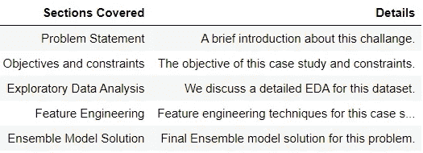

雾。本博客包含的目录

# 1 -问题陈述:

✦[***p***](https://www.portoseguro.com.br/)***or to seguro***是巴西最大的汽车和房主保险公司之一。在这场比赛中，挑战是建立一个模型，预测司机在接下来的一年中发起汽车保险索赔的概率。

✦的完整项目可以在这里找到*。*

*✦你也可以在[***LinkedIn***](https://www.linkedin.com/in/hardik-vagadia/)上和我联系。*

> *汽车保险公司索赔预测的不准确性提高了好司机的保险成本，降低了坏司机的保险价格*

***数据来源:**训练和测试数据集可以从这个 [***Kaggle 链接*** 下载。](https://www.kaggle.com/c/porto-seguro-safe-driver-prediction/data)*

# *2 -目标和限制:*

1.  ****基尼系数*** 递增。是主办方在 Kaggle 上指定的评价指标。基尼系数的范围从随机猜测的大约 0 到满分的大约 0.5。有关基尼系数的更多信息，请参考此[链接](https://towardsdatascience.com/using-the-gini-coefficient-to-evaluate-the-performance-of-credit-score-models-59fe13ef420)。*
2.  *在这个案例研究中，时间不是一个限制因素。*

# *3 -探索性数据分析:*

> ***一幅画的最大价值在于它迫使我们注意到我们从未预料到会看到的东西。***
> 
> *约翰·图基*

*✦我们有两个。csv 文件。train.csv 有 595212 个数据点及其实际的类标签。test.csv 有 892816 个数据点。每个数据点都是 57 维的。*

*✦功能分为 3 类。名称中带有***【ind】***的特征为个性特征。这些是包含个人数据的特征。带有 ***【汽车】*** 和***【reg】***的特征分别是与汽车和地区相关的特征。*

*✦这些特征是经过预处理的*，所以我们无法分辨出这些特征。**

**✦进一步指出，二元特征的名称中有 ***【宾】*** ，分类特征的名称中有 ***【猫】*** 。其余特征是连续的。**

**✦还有一组以***【calc】***命名的特征。这些特征是根据现有特征计算的。**

****检查类别不平衡:****

**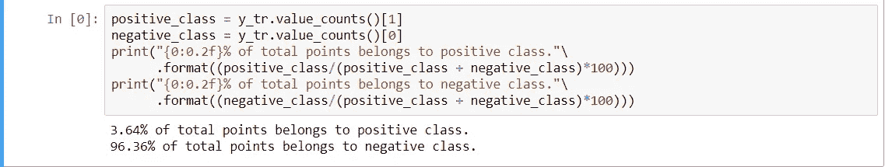**

**图+ve 和-ve 点的数量**

**✦的情况非常不均衡，很明显只有很少一部分人真正提出索赔。**

****1 -可视化单个二元特征:****

**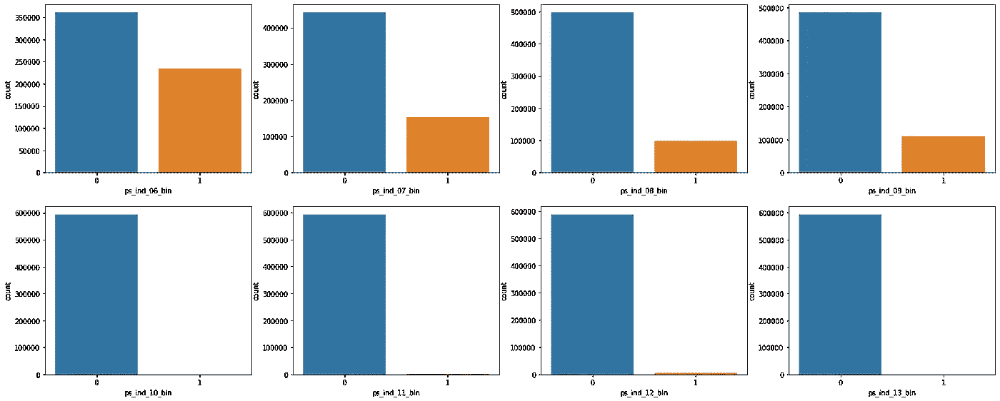**

****第二行中的特征具有非常高的不平衡性，并且几乎所有数据点都包含相同的值。这样的功能用处不大。第一排的功能比第二排更平衡，因此更有用。****

**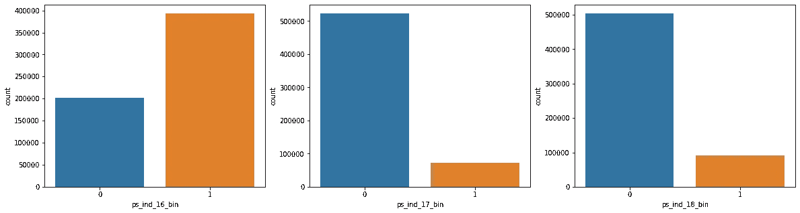**

****“PS _ ind _ 16 _ bin”比其他两个显示出更多的平衡性。****

****2 -可视化个体分类特征:****

**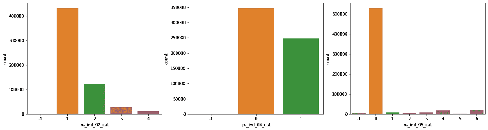**

****个体范畴特征中的层次数非常低。在前两个中，几个特征占主导地位，而在第三个中，只有一个特征占主导地位。这使得它用处不大。****

****3 -可视化个体连续/顺序特征:****

**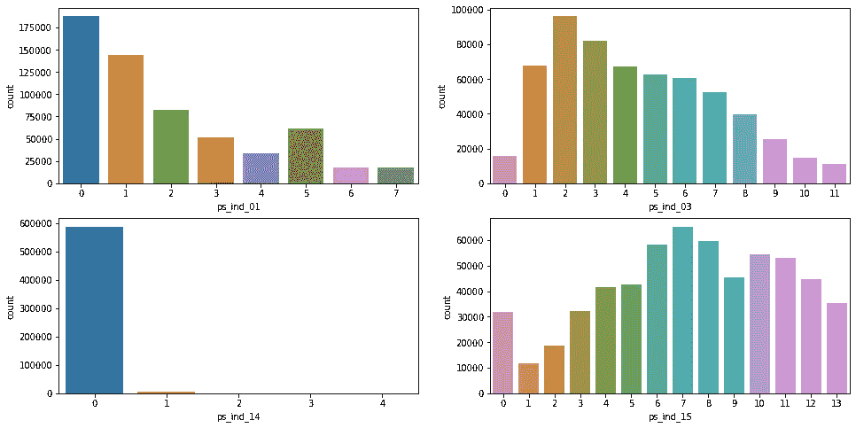**

****连续特征的表现或多或少类似于分类特征。除了“ps_ind_14”之外，其他都相当均衡。****

****4 -可视化个体区域特征:****

**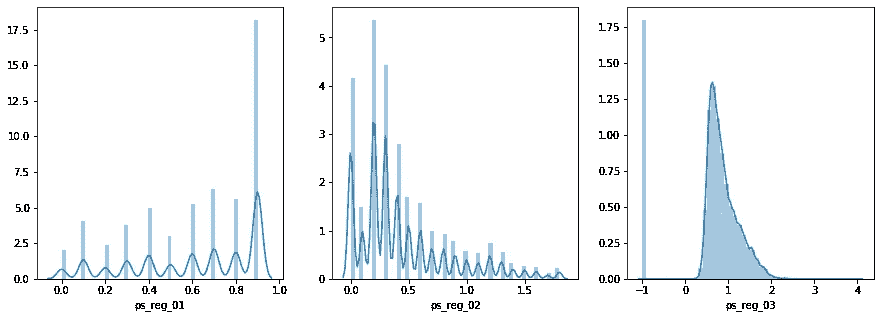**

**“ps_reg_01”表现为具有 10 个类别的分类特征，而其他两个表现得更像连续特征。**

****5 -可视化分类汽车特征:****

**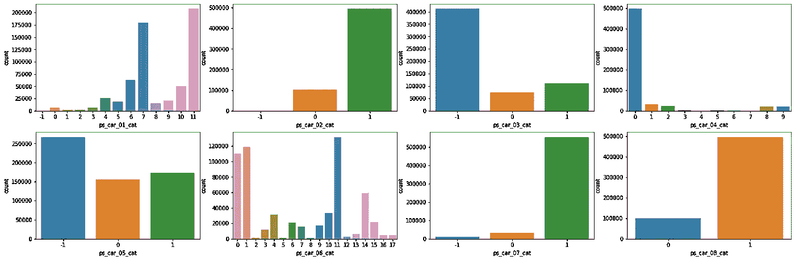**

****有些功能表现出严重的不平衡。****

**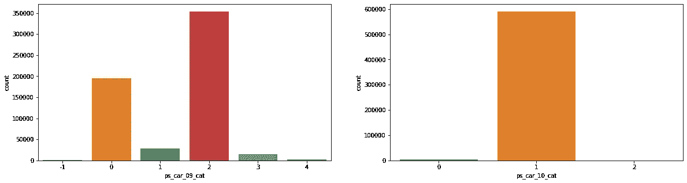**

****‘PS _ car _ 10 _ cat’显示高度不平衡。****

**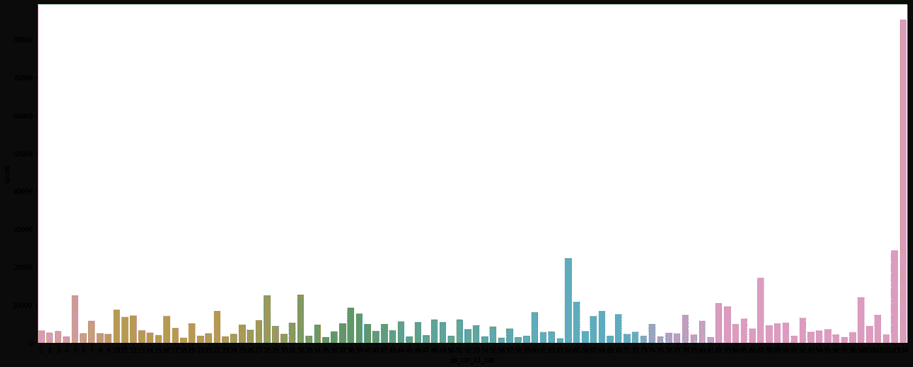**

****‘PS _ car _ 11 _ cat’是等级数最多的汽车分类特征(104)。除了“ps_car_10_cat”严重失衡之外，大多数功能都表现出一定的平衡。****

****6 -可视化连续汽车特征:****

**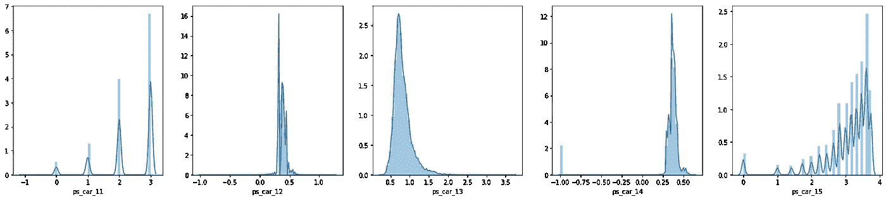**

**“ps_car_11”更像是一个分类特征。其余的是连续的。**

****7 -可视化计算出的连续特征:****

**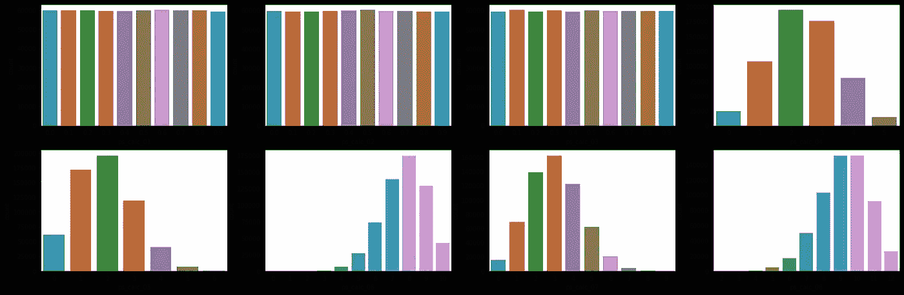**

****前 3 个特征用处不大，因为它们在每个类别中的值几乎相同。其余特征遵循正态分布。****

**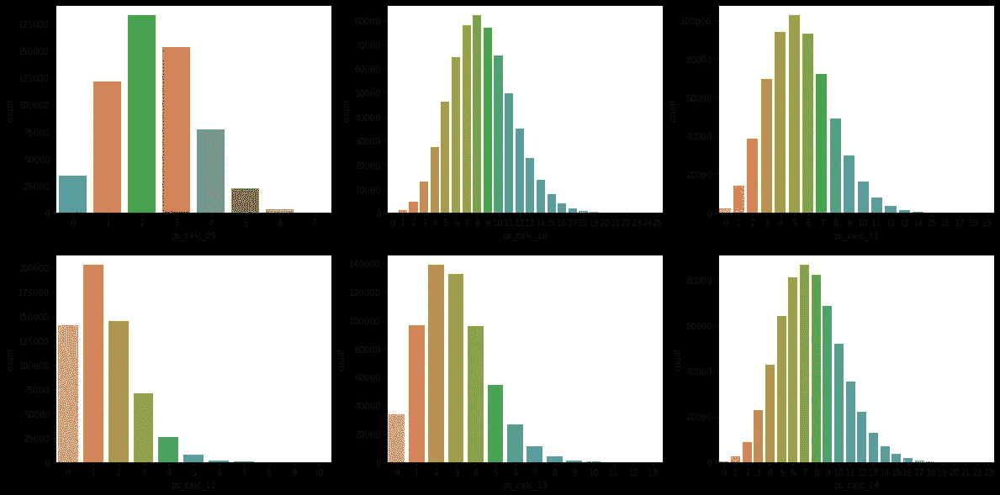**

****所计算的连续/有序特征本质上都不是连续/有序的。“ps_calc_01”、“ps_calc_02”和“ps_calc_03”显示平衡的行为。其余呈正态分布。****

****8 -可视化计算的二元特征:****

**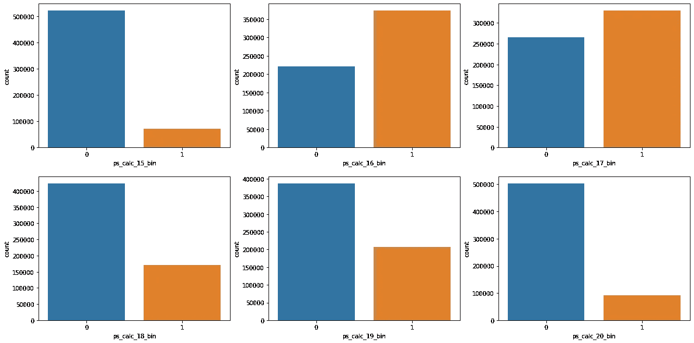**

****上述特征无严重失衡。****

****9 -多特征比较:****

**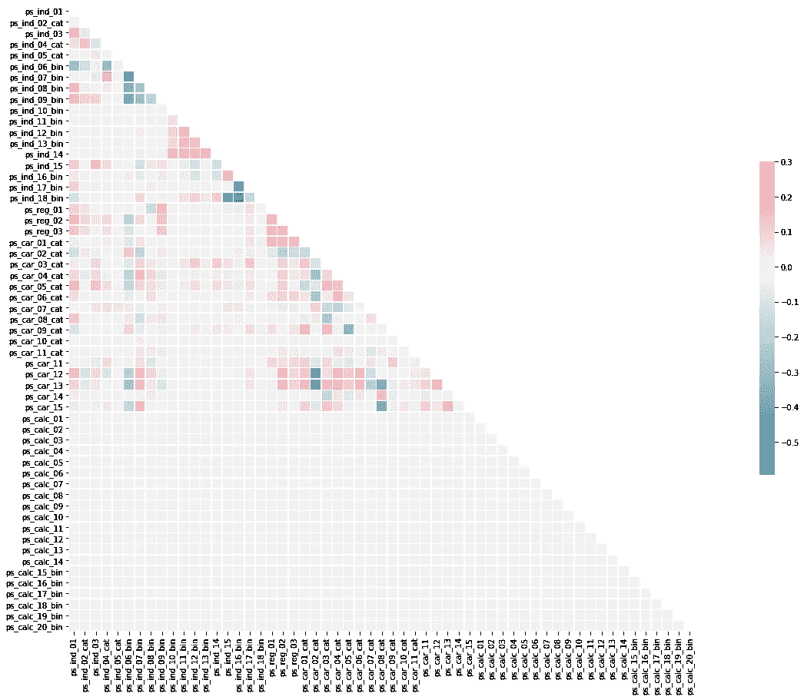**

****大多数特征没有表现出任何显著的相关性。我们可以有把握地得出结论，我们的特征是独立的。****

***EDA 到此为止。现在，让我们讨论本案例研究中最关键的部分，即特征工程。***

# **4 -特征工程:数据科学家的秘方！**

> **“最终，一些机器学习项目会成功，一些会失败。有什么区别？最重要的因素无疑是所使用的功能。”**
> 
> **佩德罗·多明戈斯教授**

****1 -每行缺失值的数量:**该特征代表每一数据点的*行缺失值的数量。下面是计算这个特性的函数的代码片段。***

***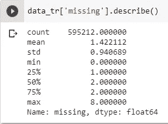***

***图“缺失值”特征概述。***

***✦此功能将采用 0 到 8 之间的离散值。***

***✦不需要在编码上对这个特征进行任何排序。***

*****2 -乘除特征:**我们将两个已有的特征相互乘除，作为新的特征相加。下面是代码片段。我们使用连续特征来获得这个特定特征。***

***✦这些特征是连续值，因此可以被视为数字特征。***

***✦:最好在这个特征上应用[***standard scaler***](https://scikit-learn.org/stable/modules/generated/sklearn.preprocessing.StandardScaler.html)，然后再输入到我们的模型中。***

****三串特征:**我们将数据点中的所有分类特征用下划线 ***'_'*** 连接起来，并创建一串离散值作为特征。**

**✦我们将需要在这个字符串特征上应用 [***普通编码***](https://scikit-learn.org/stable/modules/generated/sklearn.preprocessing.OrdinalEncoder.html) ，然后将它们输入到模型中。**

****4 -分类计数特征:**该特征统计每个分类值在每个特征的数据集中出现的次数。**

**✦此功能将占用数值。我们将在它上面应用 [***标准缩放器***](https://scikit-learn.org/stable/modules/generated/sklearn.preprocessing.StandardScaler.html) 。**

****5 -二进制和特征:**该特征是该行中所有二进制特征的和。**

**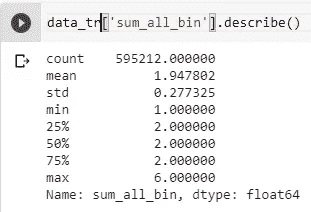**

**图“sum_all_bin”功能概述。**

**✦此特征包含 0 到 6 之间的离散值。**

**✦不需要任何形式的编码。**

****6 -绝对二进制差特征:**在这个特征中，我们创建一个参考行，它类似于所有行的中值。然后，我们计算每一行与参考行的绝对差的和。**

**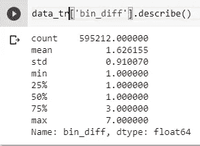**

**图“bin_diff”功能概述。**

**✦离散值特征。值介于 1 和 7 之间。**

**✦不需要任何形式的编码。**

****7 组统计特征:**我们通过对一些特征上的数据点进行分组来获得一些统计数据，如最大值、最小值、中值、平均值和标准差。**

**✦这些也是离散的数值。不需要应用任何类型的编码。**

****8 -基于模型的功能:****

**即使在谷歌的云平台[***Google colab***](https://colab.research.google.com/)或 [***上，✦生成这些功能也需要 30 多个小时。***](https://cloud.google.com/)**

**✦:我在谷歌的云平台上使用了 Python 中的多处理技术，在大约六个小时内获得了这些功能。诀窍是将所有的特性分成三类，即***【ind】******【car】***和***【reg】***，然后将它们分别馈送给函数，并行运行 3 个进程。下面是修改后的函数的代码:**

**✦和现在运行并行进程的代码:**

**✦你还可以进一步划分这些功能，并根据需要修改功能。如果您使用 GCP，至少有 8 个 CPU 可供您使用。所以你可以进一步加快速度。**

**✦除了上面讨论的特征，还有一些包含'-1 '值的分类特征。**

**✦我们将对它们应用 [***普通编码***](https://scikit-learn.org/stable/modules/generated/sklearn.preprocessing.OrdinalEncoder.html) 。我们还将在连续特征上应用*。***

****这就是特性工程的全部内容。现在我们来讨论这个问题的系综模型解。****

# **5 -系综模型解:**

**✦现在，既然我们有了我们需要的功能，我们也执行了 EDA，让我们现在继续这个博客的最后一部分:最终解决方案的集合模型。**

> **合奏很难做。就像三维象棋。**
> 
> **—埃里克·博高西安**

**✦上面的代码片段是针对将基础模型对象作为输入的***create _ ensemble***类的。还有一种 ***预测*** 的方法，即 ***根据训练数据训练*** 模型， ***预测*** 输出测试数据。**

**我们可以在这个[K**aggle 页面**](https://www.kaggle.com/c/porto-seguro-safe-driver-prediction/submit) 上传 Submission.csv 文件，得到分数。**

********

**图 1 .司机驾驶汽车**

**✦未来作品:**

**为了进一步提高分数，可以尝试一些深度学习模型。我们可以尝试从简单的多层神经网络到深度卷积神经网络。我们可以将从集成解决方案获得的结果与深度学习解决方案相结合，并提高最终的 kaggle 分数。**

**✦参考:**

1.  **[命运的方向盘:波尔图 Seguro EDA](https://www.kaggle.com/headsortails/steering-wheel-of-fortune-porto-seguro-eda)**
2.  **[Dmitry Altukhov 获得第三名。](https://www.youtube.com/watch?v=mbxZ_zqHV9c)**
3.  **[塞古罗港特征的噪声分析。](https://www.kaggle.com/ogrellier/noise-analysis-of-porto-seguro-s-features)**
4.  **[https://github . com/PK lauke/ka ggle-PortoSeguroSafeDriverPrediction](https://github.com/pklauke/Kaggle-PortoSeguroSafeDriverPrediction)**