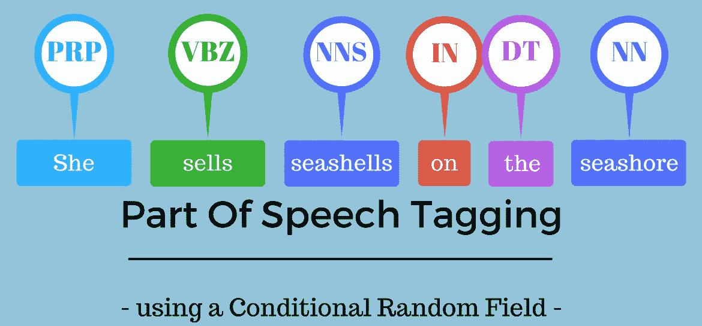
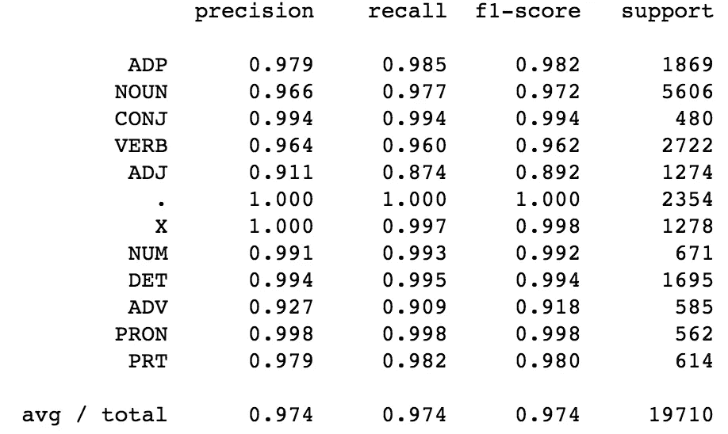
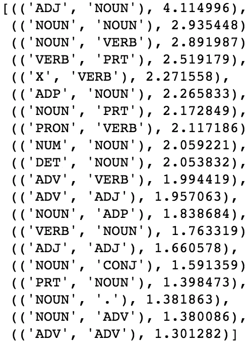
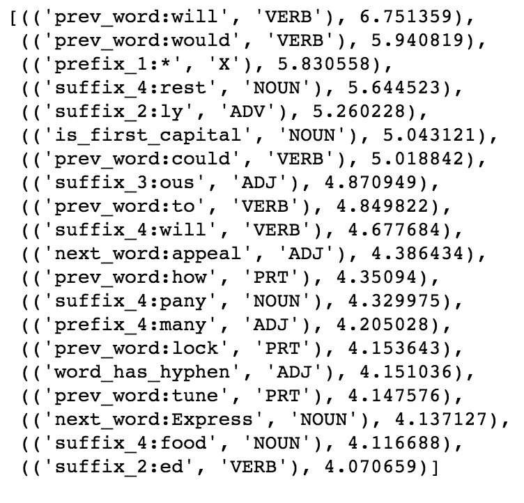

# NLP 指南:使用条件随机字段识别词性标签

> 原文：<https://medium.com/analytics-vidhya/pos-tagging-using-conditional-random-fields-92077e5eaa31?source=collection_archive---------0----------------------->

在自然语言处理(NLP)领域，最基本的模型是基于单词包的。但是这种模型无法捕捉单词之间的句法关系。

例如，假设我们建立了一个仅基于一袋单词的情感分析器。这样的模型将无法捕捉“我喜欢你”和“我喜欢你”之间的差异，前者“喜欢”是具有积极情绪的动词，后者“喜欢”是具有中性情绪的介词。

所以这给我们留下了一个问题——我们如何改进这个单词袋技术？

词性(以下称为 POS)标签对于构建解析树是有用的，解析树用于构建 ner(大多数命名实体是名词)和提取单词之间的关系。词性标注对于构建词条分类器也是必不可少的，词条分类器用于将单词简化为其词根形式。

词性标注是根据上下文和定义将语料库中的单词标记到语音标签的相应部分的过程。这项任务并不简单，因为一个特定的单词根据其使用的上下文可能有不同的词性。

**比如:**在“给我你的答案”这句话里，*答案*是名词，但在“回答问题”这句话里，*答案*是动词。

要理解任何一句话的意思，或者提取关系，构建知识图，词性标注是非常重要的一步。

# 不同的词性标注技术

词性标注有不同的技术:

1.  **基于词汇的方法—**指定在训练语料库中最常出现的词类标签。
2.  **基于规则的方法—** 基于规则分配 POS 标签。例如，我们可以有一个规则说，以“ed”或“ing”结尾的单词必须分配给一个动词。基于规则的技术可以与基于词汇的方法一起使用，以允许对不存在于训练语料库中但存在于测试数据中的单词进行词性标注。
3.  **概率方法—** 该方法根据特定标签序列出现的概率分配位置标签。条件随机场(CRF)和隐马尔可夫模型(hmm)是分配 POS 标签的概率方法。
4.  **深度学习方法** —递归神经网络也可以用于词性标注。

在本文中，我们将研究如何在 Penn Treebank 语料库(NLTK 库中有)上使用条件随机字段。

# 条件随机场

一个 CRF 是一个**判别概率分类器**。判别模型和生成模型的区别在于**判别模型试图模拟条件概率分布，即 P(y|x)，而生成模型试图模拟联合概率分布，即 P(x，y)** 。

*Logistic 回归、SVM、CRF 是判别分类器。朴素贝叶斯，hmm 是生成分类器。* CRF 也可用于序列标记任务，如命名实体识别器和位置标记器。

在 CRFs 中，输入是使用特征函数、与特征(被学习的)和先前标签相关联的权重从输入序列中导出的一组特征(实数),并且任务是预测当前标签。将确定不同特征函数的权重，使得训练数据中标签的可能性最大化。

在 CRF 中，定义了一组特征函数来提取句子中每个单词的特征。特征函数的一些例子是:单词的第一个字母是大写的吗，单词的后缀和前缀是什么，前面的单词是什么，它是句子的第一个还是最后一个单词，它是一个数字吗等等。这些特征集合被称为**状态特征。**在 CRF 中，我们也通过前一个词的标签和当前词的标签来学习权重。CRF 将尝试确定不同特征函数的权重，以最大化训练数据中标签的可能性。依赖于前一个单词的标签的特征函数是**过渡特征**

现在让我们跳到如何使用 CRF 来识别 Python 中的 POS 标签。代码可以在[这里](https://github.com/AiswaryaSrinivas/DataScienceWithPython/blob/master/CRF%20POS%20Tagging.ipynb)找到。

# 数据集

我们将使用 NLTK 树库数据集和通用标签集。NLTK 的[通用标签集由 12 个标签类组成:动词、名词、代词、形容词、副词、形容词、限定词、基数、助词、其他/外来词、标点符号。这个数据集有 3914 个标记句子和 12408 个单词的词汇量。](https://www.nltk.org/_modules/nltk/tag/mapping.html)

接下来，我们将按照 80:20 的比例将数据分为训练和测试数据，训练集中有 3，131 个句子，测试集中有 783 个句子。

**创建特征功能**

为了识别 POS 标签，我们将创建一个函数，该函数为句子中的每个单词返回一个具有以下特征的字典:

*   单词的首字母大写吗(一般专有名词首字母大写)？
*   这是句子的第一个单词吗？
*   这是这个句子的最后一个词吗
*   这个单词包含数字和字母吗？
*   它有连字符吗(一般来说，形容词都有连字符——例如，像快速增长，缓慢移动这样的词)
*   完整的单词是大写的吗？
*   是数字吗？
*   前四个后缀和前缀是什么？(以“ed”结尾的词一般是动词，以“ous”结尾的词像 disastrous 是形容词)

特征函数定义如下，并提取训练和测试数据的特征。

**拟合通用报告格式模型**

下一步是使用 *sklearn_crfsuite* 来拟合 CRF 模型。该模型通过梯度下降进行优化，使用 LBGS 方法和 L1 和 L2 正则化。我们将设置 CRF 来生成所有可能的标签转换，甚至那些没有在训练数据中出现的标签转换。

**评估 CRF 模型**

我们使用 F-score 来评估 CRF 模型。F-score 传达了精确度和召回率之间的平衡，并被定义为:

**2*(精度*召回)/(精度+召回)**

**精度**定义为真阳性的数量除以阳性预测的总数。它也被称为阳性预测值(PPV):

**精度=TP/(TP+FP)**

**召回**定义为真阳性总数除以数据中阳性类值总数。它也被称为敏感度或真阳性率:

**召回=TP/(TP+FN)**

CRF 模型在训练数据和测试数据上分别给出了 0.996 和 0.97 的 F 值。

从 CRF(下图)的类别评分中，我们观察到，对于预测形容词，精确度、召回率和 F 评分较低，这表明必须将更多与形容词相关的特征添加到 CRF 特征函数中。

下一步是查看前 20 个最有可能的过渡特征。

最可能的过渡特征

正如我们所看到的，形容词最有可能跟在名词后面。动词后面最有可能是助词(如 to)，像“The”这样的决定因素后面也更有可能是名词。

同样，我们可以看看最常见的状态特征。

最可能的状态特征

如果前面的词是“will”或者“would”，那么最有可能是动词，或者一个词以“ed”结尾，那么肯定是动词。正如我们在定义特征时讨论的，如果单词有连字符，根据 CRF 模型，成为形容词的概率更高。同样，如果一个单词的第一个字母大写，它更可能是一个名词。自然语言是如此复杂而美丽的东西！

# **结束注释**

在这篇文章中，我们学习了如何使用 CRF 来构建一个 POS Tagger。类似的方法可用于使用通用报告格式建立净注册率。为了提高我们的 CRF 模型的准确性，我们可以在模型中包括更多的特征——像句子中的最后两个词而不仅仅是前一个词，或者句子中的后两个词，等等。整个分析的代码可以在[这里](https://github.com/AiswaryaSrinivas/DataScienceWithPython/blob/master/CRF%20POS%20Tagging.ipynb)找到。

***希望这篇文章对你有用。一如既往，非常感谢您的任何反馈。请在下面分享你的评论。***