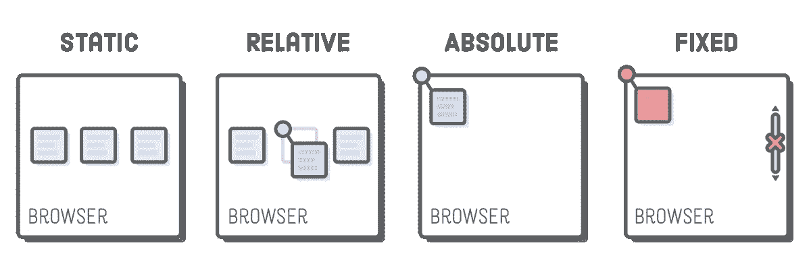
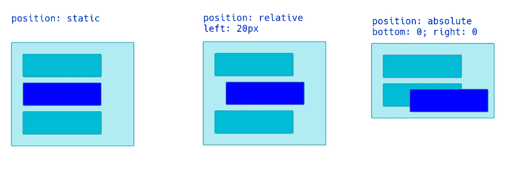
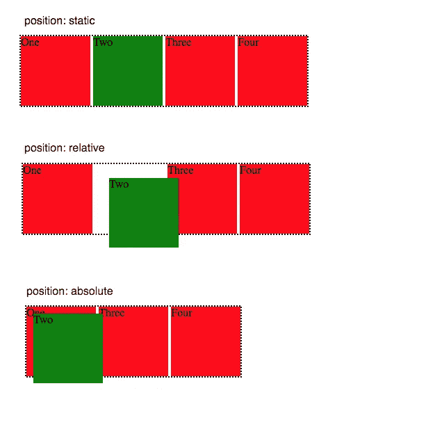
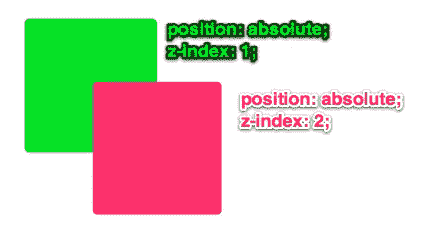

# 使用 CSS 定位

> 原文：<https://medium.com/analytics-vidhya/positioning-with-css-baede745e1d9?source=collection_archive---------12----------------------->

继续我们关于 CSS 的课程，作为一个初学开发的人，一个重要的技能是在你的站点上定位和放置你的内容的能力。当你开始构建更复杂的网站和应用程序时，你将拥有多个层，这些层需要能够在不干扰流程的情况下相互交互。在这篇简短的文章中，我们将介绍在页面上放置项目的四种主要方式，以及第五条非常有用的信息。

请记住，这一切都可以在用 CSS 编写时完成，并且不需要您更改 HTML 中发生的事情。虽然有时确实与 HTML 中的

或其他分组有关，但这是一个简单的介绍，只需要非常简单的代码输入就可以改变 CSS 文件中某些元素的位置。

如上图所示，在站点上定位内容的四种主要方式是**静态**、**相对**、**绝对**和**固定**。我们将快速浏览每一项，以了解如何有效地使用它们！

# 静态

在你的网站或应用程序中添加新的内容块或内容片段时，你将从页面的左上角向下添加项目。这是默认的位置，这样每个项目就不会互相重叠。这可以简单地通过在“位置:静态；在 CSS 元素中，或者不表示(因为这是默认设置)。这些静态元素可以与宽度和高度配对，但除此之外，它们只是简单地放置在站点中，没有重叠。

# 亲戚

在你的应用程序中有一个相对定位的元素允许你把你的内容放在与静态定位相关的页面上。注意上图中图；该项目稍微向右移动。当放入代码中时，你通过放入“位置:相对；然后你想把它放在顶部、左侧、右侧或底部。这是通过像素(px)来完成的，它告诉你你想把项目推到哪里。

例如，如果您输入“top: 40px ”,该项目将向下移动 40 个像素(就像在元素顶部添加一个 40 像素的缓冲)。现在你可以将它添加到一个或所有四个方向，使项目得到相对放置。

# 绝对的

现在请注意第三张图片，它是网站内容的绝对位置。这与静态或相对位置有何不同？项目在页面上的绝对位置的主要区别在于，网站或应用程序上的所有其他内容将*忽略*该特定内容发生了什么。最近的父元素将决定绝对对象的相对位置。

你放入绝对位置，就像你放入相对元素一样；通过键入“位置:绝对；”以及将像素数量的顶部、底部、左侧和/或右侧添加到定位中。这里的区别在于，由于内容被忽略，作为默认的放置，项目将被直接放置在静态放置的其他内容之上(使其成为两层)。

# 固定的；不变的

虽然绝对定位会使内容被页面上的其他内容忽略，但项目*仍会与页面上的其余内容一起滚动*。防止项目和其他东西一起滚动的方法是，我们必须表明这个项目是固定的。我们可以通过在“位置:固定当你向下滚动页面时，内容会随着你一起滚动，固定在它的位置上。定位还可以具有附加的像素定位，如相对和绝对定位；具有顶部、底部、左侧和/或右侧。

# z 指数

CSS 中的 z-index 允许我们让页面上的元素有层次。当我们表示元素是否有 z-index 时，我们可以给它一个数值来表示它的位置。在上面的例子中，我们可以看到粉色方块在绿色方块的上面；这是通过给这两个项目一个 z-index 属性来实现的，给粉红色框一个较大的数字会使它在层中更靠前。这使我们能够更容易地控制内容，并在相对或绝对定位的基础上选择在图层中首先看到的内容。

继续玩定位，网上有很多游戏可以变得更好！知道如何在你的应用或网站上放置物品对任何开发者来说都是非常重要的工具，你练习得越多，它就会变得越自然。尝试一些不同的元素定位游戏，成为一个自然！