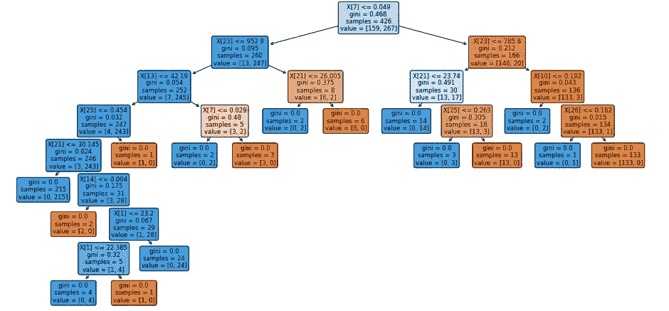
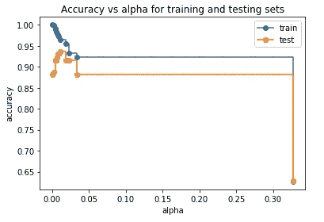
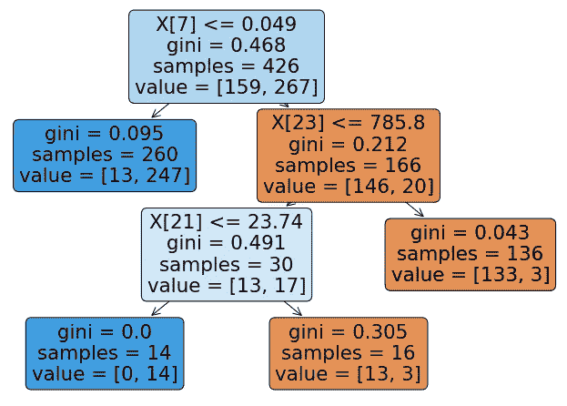
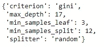
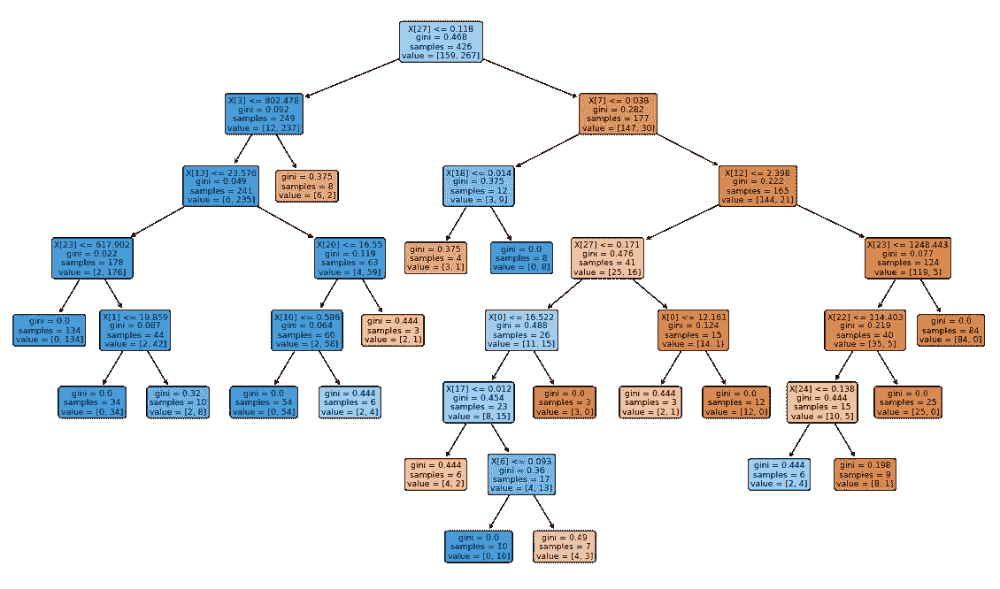

# 决策树中的后剪枝和前剪枝

> 原文：<https://medium.com/analytics-vidhya/post-pruning-and-pre-pruning-in-decision-tree-561f3df73e65?source=collection_archive---------0----------------------->


[来源](https://www.google.com/search?q=pruning&sxsrf=ALeKk01gkiJdwLm7HOctIpaDXbfCX3lHCg:1607592000248&source=lnms&tbm=isch&sa=X&ved=2ahUKEwit_PjwisPtAhVIbSsKHdb2AusQ_AUoAXoECBwQAw&biw=1366&bih=625#imgrc=O4YcCZE4HmKp1M)

> **什么是修剪？**

一般来说，修剪是去除植物的选定部分如芽、枝和根的过程。在决策树剪枝做同样的任务，它删除决策树的分支，以克服决策树的过度拟合条件。这可以通过两种方式实现，我们将详细讨论这两种技术。让我们开始吧……

# 1.后期修剪:

*   这种技术在构造决策树之后使用。
*   当决策树具有非常大的深度并且将显示模型的过度拟合时，使用这种技术。
*   这也称为反向修剪。
*   当我们拥有无限增长的决策树时，就会用到这种技术。
*   这里我们将使用`**cost_complexity_pruning**`来控制决策树的分支`max_depth`和`min_samples_split`

我已经使用了 sklearn 库中已经可用的**乳腺癌**数据集。

**一、导入库**

```
import numpy as np
import pandas as pd
import matplotlib.pyplot as plt
import seaborn as sns
from sklearn import tree
from sklearn.metrics import accuracy_score
from sklearn.datasets import load_breast_cancer
from sklearn.model_selection import train_test_split
from sklearn.tree import DecisionTreeClassifier
```

**二。没有后期修剪的建模**

```
X,y=load_breast_cancer(return_X_y=True)
X_train,X_test,y_train,y_test=train_test_split(X,y,random_state=0)
clf=DecisionTreeClassifier(random_state=0)
clf.fit(X_train,y_train)
y_train_predicted=clf.predict(X_train)
y_test_predicted=clf.predict(X_test)
accuracy_score(y_train,y_train_predicted)
accuracy_score(y_test,y_test_predicted)[out] >> **1.0  #Accuracy score of training dataset**
         **0.8811188811188811 #accuracy score of test dataset**
```

正如我们所看到的，训练和测试的准确度分数之间的差异太高意味着模型过度拟合(因为它对于训练集是准确的，但是当我们向模型提供测试集时会产生较大的误差)

**可视化决策树**

```
plt.figure(figsize=(16,8))
tree.plot_tree(clf)
plt.show()
```



决策树可视化

**三。后期修剪操作:**

这里我们使用`cost_complexity_pruning`技术来修剪决策树的分支。

```
path=clf.cost_complexity_pruning_path(X_train,y_train)
#path variable gives two things ccp_alphas and impurities
ccp_alphas,impurities=path.ccp_alphas,path.impurities
print("ccp alpha wil give list of values :",ccp_alphas)
print("***********************************************************")
print("Impurities in Decision Tree :",impurities)
--------------------------------------------------------------------**[out]>>** ccp alpha wil give list of values : [0\.    0.00226647 0.00464743 0.0046598  0.0056338  0.00704225 0.00784194 0.00911402 0.01144366 0.018988   0.02314163 0.03422475 0.32729844]
********************************************************************
Impurities in Decision Tree : [0\.    0.00453294 0.01847522 0.02313502 0.02876883 0.03581108 0.04365302 0.05276704 0.0642107  0.0831987  0.10634033 0.14056508  0.46786352]
```

`**ccp_alphas**` 给出决策树的最小叶子值，每个`**ccp_aphas**` 会创建不同的分类器并从中选择最佳。`ccp_alphas`将作为参数添加到`DecisionTreeClassifier()`中。

```
clfs=[]   #will store all the models here
for ccp_alpha in ccp_alphas:
    clf=DecisionTreeClassifier(random_state=0,ccp_alpha=ccp_alpha)
    clf.fit(X_train,y_train)
    clfs.append(clf)
print("Last node in Decision tree is {} and ccp_alpha for last node is {}".format(clfs[-1].tree_.node_count,ccp_alphas[-1]))[out] >> **Last node in Decision tree is 1 and ccp_alpha for last node
         is 0.3272984419327777**
```

可视化训练和测试集的准确度分数。

```
train_scores = [clf.score(X_train, y_train) for clf in clfs]
test_scores = [clf.score(X_test, y_test) for clf in clfs]
fig, ax = plt.subplots()
ax.set_xlabel("alpha")
ax.set_ylabel("accuracy")
ax.set_title("Accuracy vs alpha for training and testing sets")
ax.plot(ccp_alphas, train_scores, marker='o', label="train",drawstyle="steps-post")
ax.plot(ccp_alphas, test_scores, marker='o', label="test",drawstyle="steps-post")
ax.legend()
plt.show()
```



训练和测试集的准确性

如果我们遵循偏差和方差权衡，我们将选择具有低偏差(低训练误差)和低方差(低测试误差)点。这里我们得到的点的值是α= 0.02。

```
clf=DecisionTreeClassifier(random_state=0,ccp_alpha=0.02)
clf.fit(X_train,y_train)
plt.figure(figsize=(12,8))
tree.plot_tree(clf,rounded=True,filled=True)
plt.show()
```



剪枝后可视化

这里我们能够修剪无限生长的树。让我们再次检查准确性分数。

```
accuracy_score(y_test,clf.predict(X_test))[out]>> **0.916083916083916**
```

因此，我们能够使用剪枝来提高决策树模型的准确性。

# 2.预修剪:

*   这种技术在构造决策树之前使用。
*   可以使用**超参数调整完成预修剪。**
*   克服过度拟合问题。
*   在这篇博客中，我将使用 GridSearchCV 进行**超参数**调优。

> **什么是超参数调谐？**

让我们举一个决策树的例子。当我们构建 DT 模型时，我们不知道哪个`criterion` (“基尼”或“熵”)、哪个`min_depth`、哪个`min_samples_split`等会给出更好的模型，因此为了打破这种模糊性，我们使用超参数调整，其中我们为每个参数取一系列值，无论哪个参数值最好，我们都会将该特定值输入到`DecisionTreeClassifier()`。

```
grid_param={"criterion":["gini","entropy"],
             "splitter":["best","random"],
             "max_depth":range(2,50,1),
             "min_samples_leaf":range(1,15,1),
             "min_samples_split":range(2,20,1) 
            }
grid_search=GridSearchCV(estimator=clf,param_grid=grid_param,cv=5,n_jobs=-1)
grid_search.fit(X_train,y_train)
```

**估计器- >您使用的分类模型，cv=5 - >我们已将数据集分成五个块，n_jobs=-1 - >我们已采用默认迭代**

现在我们从中提取最佳参数，然后将该参数输入`DecisionTreeClassifier()`以获得最佳精确模型。

```
print(grid_search.best_params_)
```



输入 DT 的最佳参数

**预修剪操作:**

```
clf=DecisionTreeClassifier(criterion= 'gini',max_depth= 17,min_samples_leaf= 3,min_samples_split= 12,splitter= 'random')
clf.fit(X_train,y_train)
plt.figure(figsize=(20,12))
tree.plot_tree(clf,rounded=True,filled=True)
plt.show()
```



预修剪

检查剪枝后测试数据集的准确度分数。

```
y_predicted=clf.predict(X_test)
accuracy_score(y_test,y_predicted)[out]>> **0.9370629370629371**
```

## 结论:

这些都是我的观点，如果你对这个博客有任何建议，请在下面评论。**不断学习不断探索……**