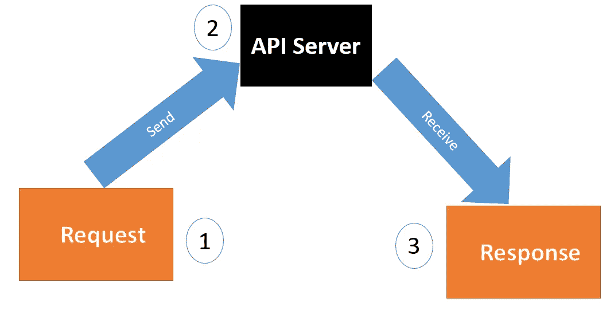
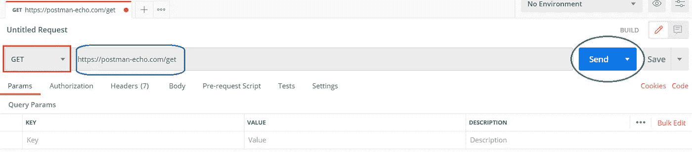
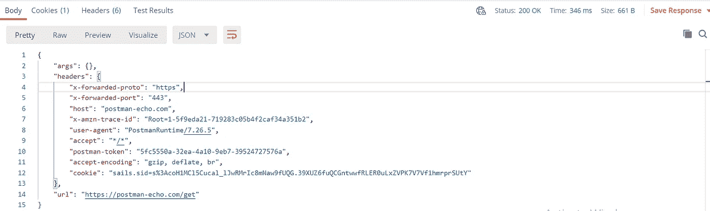
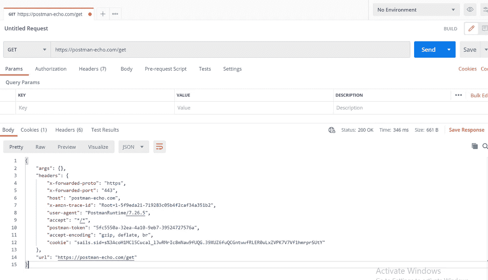

# 邮递员:发送第一个请求

> 原文：<https://medium.com/analytics-vidhya/postman-sending-the-first-request-c1ddc90d5551?source=collection_archive---------32----------------------->

**Postman** 是一款用于 API 测试的软件测试工具。API(应用程序编程接口)使软件应用程序能够相互交互。

我们可以在 Postman 中创建与 API 交互的请求。我们可以使用 postman 中创建的 API 请求来**从数据源获取**数据或者**发送/发送**数据。

API 运行在 web 服务器上，并公开端点以支持客户端应用程序用来提供其功能的操作。

任何 API 请求都应该使用以下常见的 HTTP 方法之一，

1.  得到
2.  邮政
3.  上传/修补
4.  删除

**GET** 方法用于从 API 中检索/获取数据。

**POST** 方法用于向 API 发布/发送新数据

**PUT** 和 **PATCH** 方法用于更新现有数据。

**DELETE** 方法从现有资源中删除数据。

使用 **postman，**我们可以创建 API 请求并验证响应，而无需编写任何代码或使用终端。

# **发送请求**

1.  在 postman 中输入请求详情，并点击**发送**按钮

请求

如上图所示，方法是**获取**，网址是[https://postman-echo.com/get](https://postman-echo.com/get)。

2.API 服务器接收请求并返回响应。在这个例子中，API 服务器是**postman-echo.com。**

3.Postman 接收响应并在界面中显示。

反应

# **在 postman 中创建请求的步骤:**

1.  开放邮递员
2.  确保在右下角选择了**构建**。
3.  点击 **+** 按钮，打开新标签页
4.  在 URL 字段中输入“[**https://postman-echo.com/get**](https://postman-echo.com/get)”
5.  默认情况下，该方法将为 GET。我们可以根据发送到 API 服务器的请求类型进行更改。

6.点击**发送。**

来自服务器的 JSON 响应将显示在下方的窗格中。

请求和响应