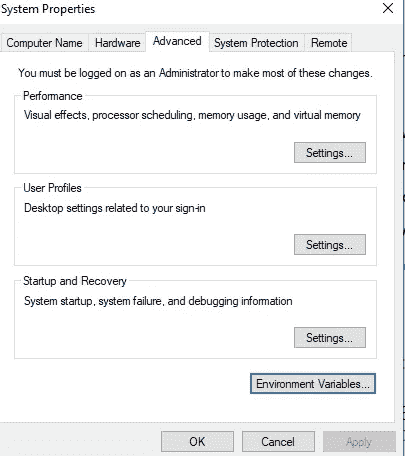
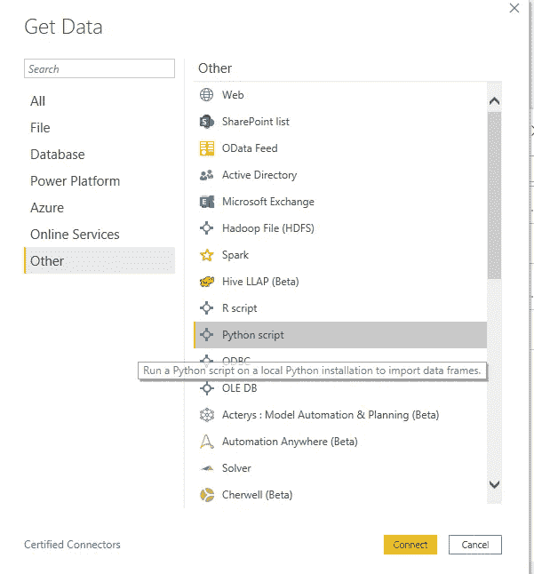
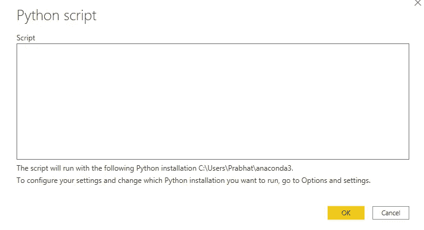
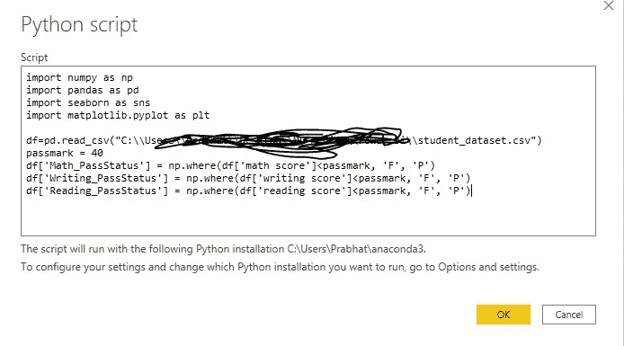
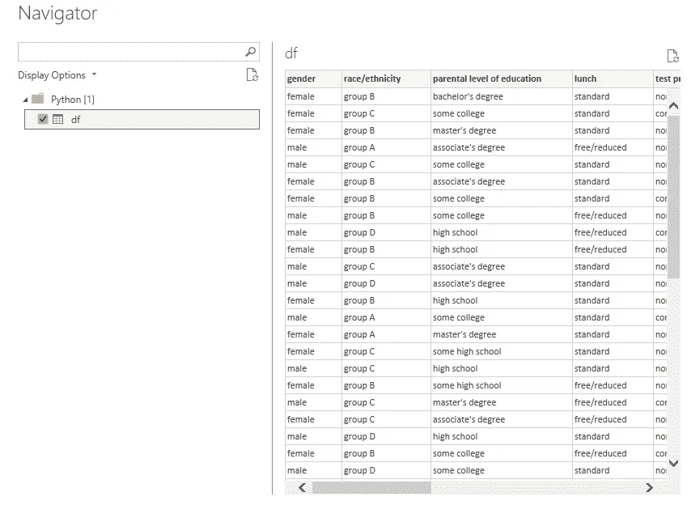
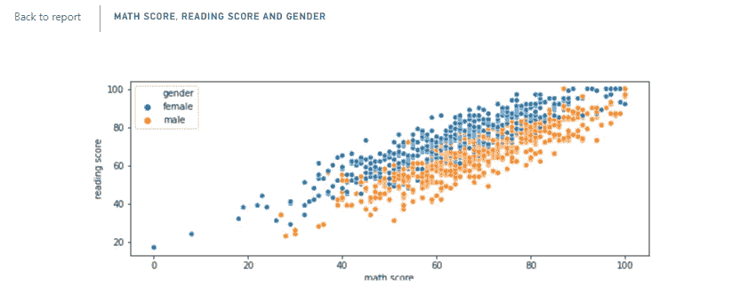

# Power BI 桌面和 Python 惊人的能力

> 原文：<https://medium.com/analytics-vidhya/power-bi-desktop-and-python-amazing-capabilities-9e66f645b4e?source=collection_archive---------0----------------------->


克里斯·利维拉尼在 [Unsplash](https://unsplash.com?utm_source=medium&utm_medium=referral) 上的照片

Power BI Desktop 借助内置和定制的可视化功能，帮助可视化复杂的数据。它允许集成来自各种数据源的数据，并从中准备可视化。

在 Power BI 中集成 Python 编程语言之后，power BI desktop 的功能大大增加了。我们可以进行 ETL 处理，使用 Python 脚本创建机器学习模型。

## 可以用 Python 代替 DAX 吗？

DAX 代表数据分析表达式，它帮助你创建大量的测量，在 DAX 中有大量的数据操作。对于任何不需要动态生成的东西，有很多选择。例如，使用 Python 可以很容易地向仪表板添加一些新的额外列。

## Power BI 为什么要用 Python？

在 power BI 中使用 Python，您可以自动化和优化累人的过程，创建令人惊叹的定制可视化，可以创建机器学习模块，并创建基于预测结果的可视化。

# 入门指南..

在 Power BI 中使用 python 脚本之前，首先在您的系统中安装 anaconda。

安装 anaconda 之后，我们需要在环境变量中添加 Python 文件夹路径。右键单击计算机并查看属性。在属性中，进入高级系统设置，点击“环境变量”



一旦完成路径配置，我们就可以使用 python 脚本了。在本教程中，我将把[**csv**](https://github.com/techpathak/Power-BI-datasets/upload) 文件加载到 power bi 桌面并做一些功能工程。在下一篇博客中，我将展示我们如何创建机器学习模型。

'获取数据->Python 脚本'



Python 脚本

这是我正在写的剧本:



导入重要的库:

```
import numpy as np
import pandas as pd
import seaborn as sns
import matplotlib.pyplot as plt
```

将数据集加载到 Power BI desktop:

```
df=pd.read_csv("C:\\Users\\Prabhat\\Desktop\\ML_Medium\\Power bi\\student_dataset.csv")
```

使用 Python 创建新列:

```
passmark = 40
df['Math_PassStatus'] = np.where(df['math score']<passmark, 'F', 'P')
df['Writing_PassStatus'] = np.where(df['writing score']<passmark, 'F', 'P')
df['Reading_PassStatus'] = np.where(df['reading score']<passmark, 'F', 'P')
```



现在我们已经将数据加载到 Power BI desktop 中，让我们使用 Python 脚本创建一些自定义可视化。

```
# The following code to create a dataframe and remove duplicated rows is always executed and acts as a preamble for your script:# dataset = pandas.DataFrame(math score)# dataset = dataset.drop_duplicates()# Paste or type your script code here:import matplotlib.pyplot as pltimport seaborn as snssns.scatterplot(x='math score', y='reading score',hue='gender',sizes=(20, 900),data=dataset)plt.show()
```



形象化

## 结论

既然您已经知道如何在 Power BI 中使用 Python 集成，那么做事情的可能性是无穷的。从创建令人惊叹的仪表盘到创建机器学习模型。我将在下一个教程中讨论 ML 模型。

我希望这篇文章能帮助你并节省大量的时间。

**快乐编码。**

***Prabhat Pathak****(*[*Linkedin 简介*](https://www.linkedin.com/in/prabhat-pathak-029b6466/) *)高级分析师。*


照片由[元素 5 数码](https://unsplash.com/@element5digital?utm_source=medium&utm_medium=referral)在 [Unsplash](https://unsplash.com?utm_source=medium&utm_medium=referral) 上拍摄