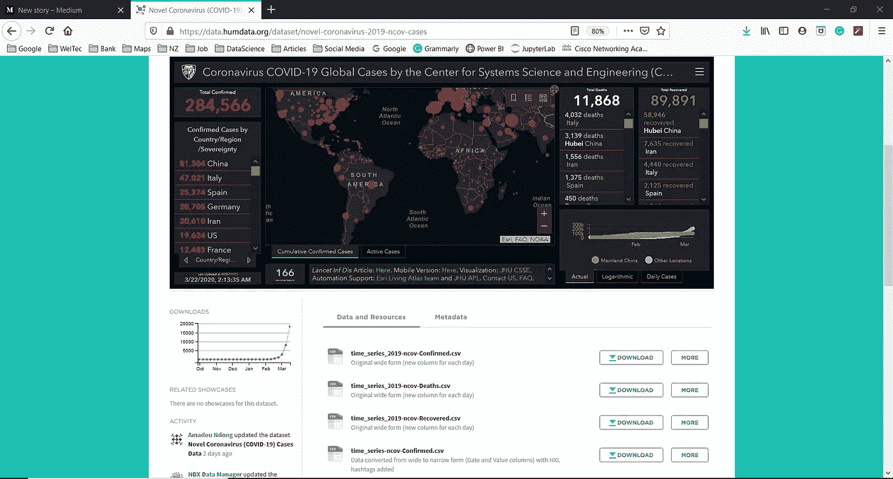
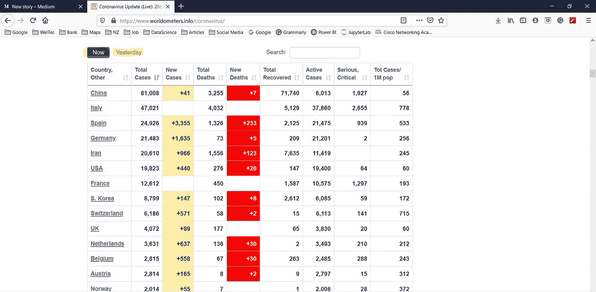
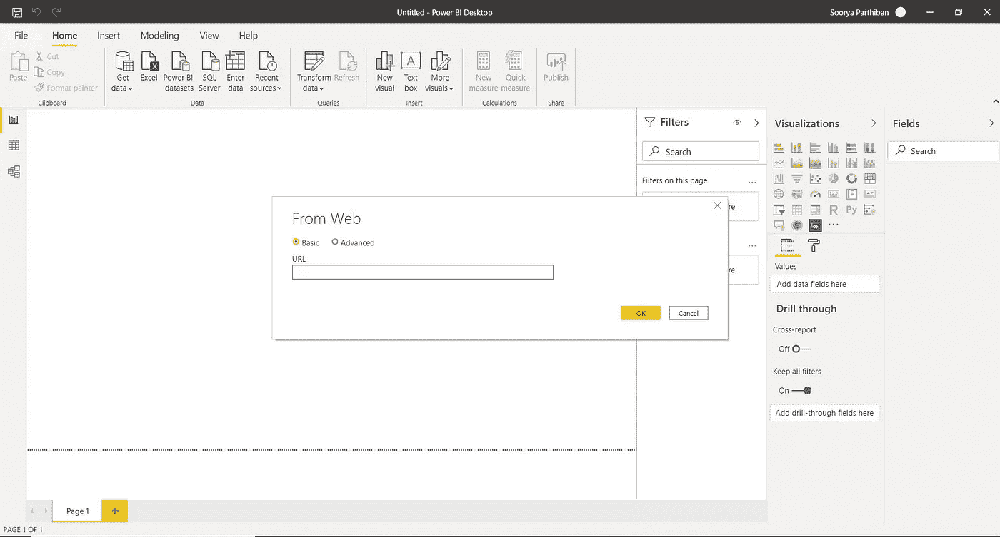
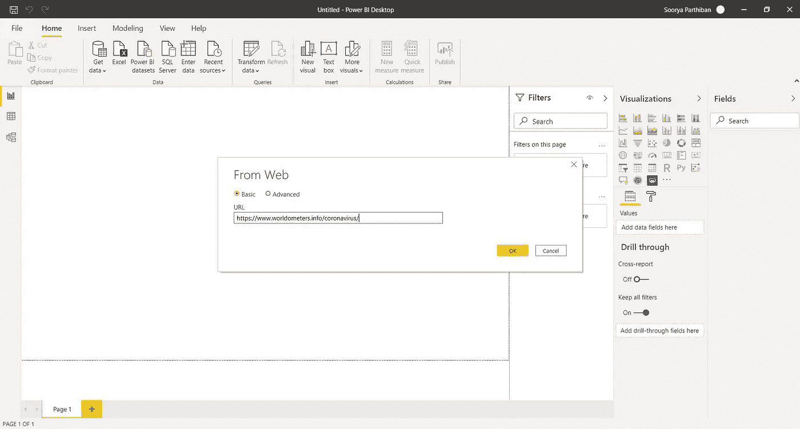
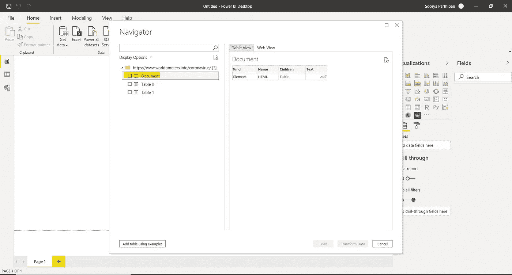
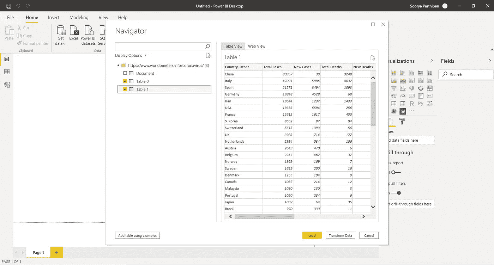

# #DataBlogSpp5: Power BI —从 Web 导入数据。很简单。

> 原文：<https://medium.com/analytics-vidhya/power-bi-import-data-from-the-web-its-easy-79c69b335f4f?source=collection_archive---------21----------------------->

数据科学博主& Power BI dev。

# **简介**

很高兴你们中的一些人知道，在 MS Power BI 中可以从任何网站获取数据表，这个过程不需要用户有任何 MS Power BI 方面的知识或经验，即使是新手也可以做到，*如果他/她找到了正确的网站** 。

# 开始

今天，让我们以#covid19 病毒为例，因为这是一个在全世界引起轰动的问题。我们将了解如何使用 MS POWER BI，利用来自任何网站的数据创建有意义的报告。所以，这将是我们的最终目标。

互联网上有许多网站可以找到关于新冠肺炎的数据，但作为一名 POWER BI 开发人员，我们需要数据集或数据表，而不是这些网站上现成的报告。让我们去寻找这样的网站吧！

**场景 1:网站具有报表/数据可视化和数据的形式。csv 文件**

网址链接:[https://data . hum data . org/dataset/novel-coronavirus-2019-ncov-cases](https://data.humdata.org/dataset/novel-coronavirus-2019-ncov-cases)

在这种情况下，我们找到了一个网站，其中有关于新冠肺炎的数据。csv 格式和基于数据集报告。我们可以利用这些数据，但它*偏离了我们的目标或目的*。请记住，我们的目标是使用来自 web 的数据，而不是使用。csv 或. txt。

# 场景 2:以表格形式提供数据的网站(最推荐的一种)

网址链接:[https://www.worldometers.info/coronavirus/](https://www.worldometers.info/coronavirus/)

像这样的网站对我们这样的数据分析师来说是个福音！无论何时你想处理来自网络的数据。尽量找和情景二类似的网站，不要像情景一。

# 如何从 web 导入数据到 MS Power BI？

# 步骤 1:选择正确的数据源

打开 **MS Power BI >获取数据>搜索【Web】(不是 WebTrends) >点击确定。**

现在你的屏幕应该是这样的，

# 步骤 2:粘贴 URL

粘贴你选择的网站链接，点击确定。在这个博客中，链接将[https://www.worldometers.info/coronavirus/](https://www.worldometers.info/coronavirus/)

等到 MS POWER BI 为您分析网站并获得表格形式的数据。

# 步骤 3:选择表并开始创建报告

MS Power BI 正在展示来自用户输入网站的所有干净的和现成可用的数据表。通常，第一个被命名为“文档”的表对我们没有用。总是在“文档”表之后开始寻找数据。

如果您向上滚动到场景 2 的屏幕截图，我会突出显示“现在”和“昨天”，这样做的原因在这里解释。我们可以清楚地看到，这里有两个表，名为表 0 和表 1。

表 0 和表 1 分别指现在和昨天的数据。

在选择了这两个表之后，我们可以点击 load 或者点击 transform data，并使用查询编辑器来重命名这些表，这样我们就不会与它们混淆，并开始创建我们的报告。

# 结论

使用 web 作为您创建报告的数据源将对您有很大帮助，因为网站会定期更新，所以我们每天都可以使用新数据！从一个网站获取数据比搜索一个类似的网站要容易得多。csv 文件。