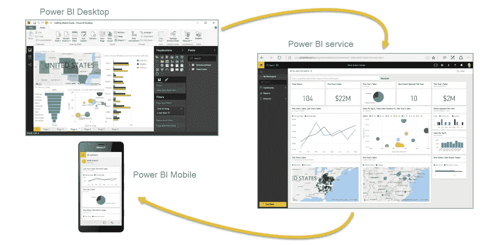
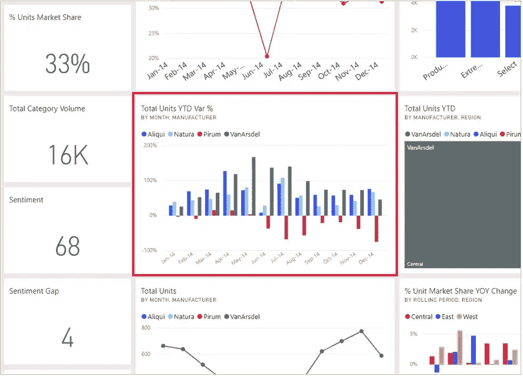

# power BI——学习新技能

> 原文：<https://medium.com/analytics-vidhya/power-bi-learning-new-skill-914d06959097?source=collection_archive---------40----------------------->

最近，我获得了微软 Power BI 的大量在线学习资源。在我的专业文凭课程中，我学会了使用 BI 电源的基本原理。现在，是时候回顾一下我所学到的东西了。

那么，什么是 Power BI 呢？这是微软的产品。这是一项业务分析服务，可提供见解，帮助做出快速、明智的决策。该软件有免费版和付费版，专业版和高级版(订阅费用和功能不同)。下面简单介绍一下什么是 Power BI 及其版本。

# 什么是 Power BI 桌面？

Power BI Free/Desktop 使您能够**连接到 70 多个数据源，分析数据，发布到 web，导出到 excel** 等等。免费版为您提供 Power BI 的基本功能。

# 什么是 Power BI Pro？

Power BI Pro 是 Power BI 的完整版本，这意味着它完全能够使用 Power BI 进行**构建仪表板、报告以及无限制查看、共享和使用您创建的报告** **(以及其他人共享的报告)**，这是 Power BI Desktop 所无法实现的。

# 有什么区别？

*   Power BI Pro 能够与拥有 Power BI Pro 许可证的大量其他用户共享数据、报告和仪表板。
*   Power BI Pro 能够创建基于应用的工作空间。
*   Power BI Pro 的每位专业用户数据存储限制为 10 GB。

也许，如果你只是为了休闲而不是为了商业用途而学习 Power BI，这些差异就有点无关紧要了。对于个人学习，我不需要使用高达 10gb 的数据。只要我的电子邮件帐户有效，我就可以开始使用 Power BI。

# 什么是 Power BI App？

所有 Power BI 版本都可以通过移动应用程序连接。此外，Power BI 移动应用可用于多种平台，包括 Android、iOS 和 Windows 设备。

# 什么是 Power BI 报表服务器？

Power BI Report Server 是一个本地(在您自己的位置)服务器，通过您组织的防火墙(基础架构)内的网站发布和共享这两个 Power BI 报告。Power BI Premium 或 Report Server 是 Power BI Premium 附带的一个选项，如果您希望在内部建立报告基础架构，并让它在您自己的策略和规则下运行，它是您的企业的理想选择。如果您愿意，该服务器允许您无缝扩展并迁移到云。

以上是一个有助于理解以上所有内容的视觉。这三个元素——桌面、服务和移动应用。Power BI 桌面访问数据并创建仪表板和报告。然后，发布到 Power BI 服务，并与用户共享 Power BI 报告，用户也可以通过 Power BI Mobile 访问这些报告。

现在，您可能开始熟悉 Power BI 中使用的一些术语。这些是其中的一些:

*   **仪表盘或可视化或平铺**。单幅图块是仪表板或报表上的单个可视化内容。可视化是数据的可视化表示，就像图表一样。仪表板是来自单个页面的视觉效果的集合。
*   **报道**。报告是一起出现在一个或多个页面上的可视化效果的集合。
*   **数据集**。数据集是 Power BI 用来创建可视化效果的数据集合。

上面的示例显示了包含条形图、折线图和卡片的仪表板。这些是 Power BI 中可用的不同可视化方式，红框指的是一个图块。

# 限制:Power BI Free/台式机

由于我们大多数人在学习阶段将使用 Power BI 免费版，Power BI Desktop 有一些功能限制。

*   无法与非高级 BI Pro 用户共享创建的报告
*   没有应用工作区
*   无 API 嵌入
*   没有电子邮件订阅
*   没有点对点共享
*   Power BI Desktop 不支持在 Excel 中进行分析

但是，对于 Power BI Free/Desktop 用户来说，还有一些有用的功能。

# 优势:Power BI 免费/桌面

*   您可以从 70 多个基于云的内部数据源连接和导入数据
*   Power BI Pro 同样丰富的可视化和过滤器
*   自动检测发现并创建表格和格式之间的数据关系
*   将您的报告导出为 CSV、Microsoft Excel、Microsoft PowerPoint 和 PDF 格式
*   Python 支持
*   将您的报告保存、上传并发布到 Web 和全功能 BI 服务
*   每个用户 10 GB 的存储限制

我将不时分享更多关于 Power BI Desktop 的信息，作为我学习目标的一部分，并提高我的技术写作水平。希望不时听到我的读者的一些反馈。请帮我填写[调查表](https://docs.google.com/forms/d/e/1FAIpQLSe80zs9-QuNvqfMpCu36n2HT9xb4pLMSB1mutln6mM6XBQWTQ/viewform)，以便我在下一篇博客中有所改进。

参考资料:
[https://dynamics . folio 3 . com/blog/difference-between-power-bi-pro-vs-free-vs-premium/](https://dynamics.folio3.com/blog/difference-between-power-bi-pro-vs-free-vs-premium/)
[https://docs . Microsoft . com/en-GB/learn/modules/get-started-with-power-bi/1-简介](https://docs.microsoft.com/en-gb/learn/modules/get-started-with-power-bi/1-introduction)

*原载于 2020 年 5 月 3 日 http://liyenz.wordpress.com***。**