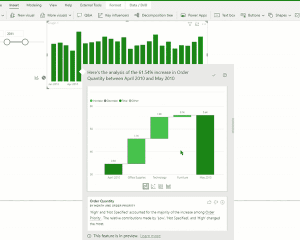

# Power BI QuickBytes:用洞察力解释变化

> 原文：<https://medium.com/analytics-vidhya/power-bi-quickbytes-explaining-change-with-insights-b258f4705818?source=collection_archive---------17----------------------->

[*【QuickBytes】*](https://www.vivran.in/my-blog/categories/quickbytes)*是一个系列文章，介绍具有指数收益的简单且易于实现的技术*

Power BI desktop 能够共享对任何重大数据波动的快速分析。

让我们考虑下面的例子:

从 2011 年 4 月到 5 月，该值显著增加。我们可以使用洞察力快速分析可能的因素。

它以多种视觉和维度的形式展示了这种差异，并总结了研究结果。

请注意，此输出仅考虑与上一点(柱形或条形)的差异，而不是视觉中的整个周期。

# 运用洞察力

右击 2011 年 5 月>分析>解释增加

Power BI 在数据表上运行机器学习算法，并呈现对增加或减少有显著贡献的各种因素。

拇指向上和拇指向下按钮为视觉和功能提供反馈。它提供关于特性的反馈；然而，*它并不训练算法为下一次运行*更新结果。

加号将选定的视觉效果添加到报告中。然后，我们可以按照要求格式化视觉效果。

每种洞察力有四种视觉类型:瀑布图、散点图、100%堆积柱形图和带状图。

默认图表是瀑布图。

# 洞察力中的视觉效果

## 1.瀑布图

瀑布图提供了从前期到下一期变化的综合视图。

## 2.散点图

散点图展示了另一个令人兴奋的方面。x 轴代表第一个周期，而 y 轴代表第二个周期。

绿色区域中的数据点正移动，红色区域中的数据点表示数值减少。

虚线是最佳拟合线。涨幅高于整体趋势的数据点在这条线以上，反之亦然。

## 3.带状图表

带状图有助于显示阶段前和阶段后:

## 4.堆积条形图

堆积条形图有助于显示 100%的比例，并允许并排比较:

有关计算逻辑和限制，请参考以下文章:

[https://docs . Microsoft . com/en-us/power-bi/create-reports/desktop-insights](https://docs.microsoft.com/en-us/power-bi/create-reports/desktop-insights)

# 讲述一个故事:用书签洞察

我们可以利用洞察力来收集要点，并创建有关带来重大变化的因素的视觉效果。然后使用书签和选择窗格，我们可以讲一个故事:

在此下载 [pbix 文件](https://vivranin-my.sharepoint.com/:u:/g/personal/vivek_ranjan_vivran_in/ETfujvS-KeZMr1_PrjDfWVsBEuKl7CGUfAHoMRsHn5AHSA?e=lvIp0g)

以下文章解释了如何使用书签和选择窗格，以及如何使用 Power BI desktop 来展示故事:

[异能匕书签](https://www.vivran.in/post/power-bi-bookmarks)

[用书签切换视觉](https://www.vivran.in/post/switching-visuals-using-bookmarks-power-bi-desktop)

[赠送电源 BI 书签](https://www.vivran.in/post/presenting-with-bookmarks-power-bi)

> *PS: Finding insights 最适用于平面文件(没有相关或规范化的表)和计算列，而不是度量。*

*我写一下*[*MS Excel*](https://www.vivran.in/my-blog/categories/excel)*，* [*权力查询*](https://www.vivran.in/my-blog/categories/powerquery) *，* [*权力毕*](https://www.vivran.in/my-blog/categories/powerbi) *，* [*权力中枢*](https://www.vivran.in/my-blog/categories/power-pivot) *，**DAX**，*

[@imVivRan](https://twitter.com/imvivran)