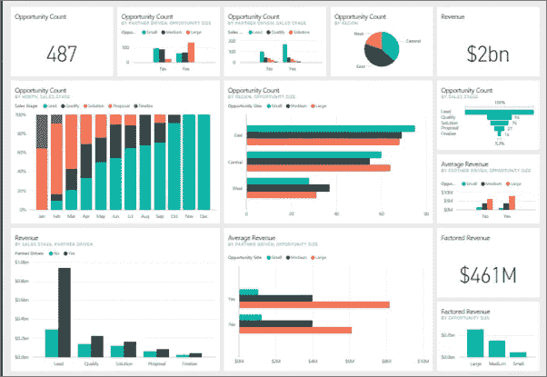
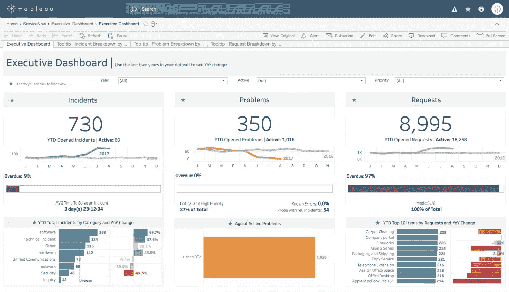

# 电源 BI 与 TABLEAU

> 原文：<https://medium.com/analytics-vidhya/power-bi-vs-tableau-81c010b553aa?source=collection_archive---------10----------------------->

Power BI 是微软的一项商业分析服务。它旨在提供交互式可视化和商业智能功能，其界面足够简单，最终用户可以创建自己的报告和仪表板。

Tableau 是一个数据可视化软件，用于数据科学和商业智能。Tableau 可以创建各种不同的可视化，以交互方式呈现数据和展示见解。

## 1)仪表板

Power BI 使用现有的微软系统，如 Azure、SQL 和 Excel 来构建数据可视化。它非常适合需要数据可视化但没有大量额外资本的初创公司。

Power BI 具有实时数据访问和一些非常方便的拖放功能。整个工具是为了加速可视化而构建的，但是考虑到实时数据访问是大多数仪表板产品的发展方向，Power BI 无疑在这方面有优势。

Tableau 擅长制作漂亮的可视化效果，但更侧重于预算较大的企业环境。基于过去行为的预测，基于您需求的计算。使用的界面是拖放。Tableau 为您提供实时查询功能和摘录。

## 2)定价

Power BI 有免费版和付费版。它还有一个月订阅和一个价格更高的可扩展的高级版本。

Tableau 有这个工具的公开(免费)版本，但是功能有限。你支付的越多，你就可以用 Tableau 访问越多的数据，包括来自第三方的基准数据。它也有一个非盈利的工具和学术设置的版本。

## 3)类型

功率 BI

*   Power BI Free:这个免费版本功能惊人。它允许您连接到数百个数据源(除了您获取的数据量之外没有任何限制)，清理和准备您的数据，并构建可视化(没有任何限制)。Power BI Pro 中所有类型的可视化选项都可以在 Power BI free 中获得。
*   Power BI Pro : Power BI Pro 是额外的 9.99 美元/用户/月(12.20 加元)。它也包含在 Office 365 Enterprise E5 中。它增加了一系列新功能:本地数据网关、更多数据存储、更好的数据更新、共享和协作
*   Power BI Premium:拥有 Power BI Premium 的组织拥有一台运行 Power BI 环境的超级服务器；这让他们超越了一些极限。它相当昂贵(5000-20000 美元/月)，所以只有最大的公司才会使用它。一些新功能是独立的资源，更多的存储，更大的数据集和免费的用户共享访问。

（舞台上由人扮的）静态画面

*   Tableau Desktop: Tableau Desktop 拥有丰富的特性集，允许您编码和定制报告。从创建图表、报告，到将它们混合在一起形成仪表板，所有必要的工作都在 Tableau Desktop 中创建。对于实时数据分析，Tableau Desktop 提供了到数据仓库的连接，以及其他各种类型的文件。这里创建的工作簿和仪表板既可以在本地共享，也可以公开共享。
*   Tableau Public:这是专为高性价比用户打造的 Tableau 版本。单词“Public”意味着创建的工作簿不能保存在本地，而应该保存到 Tableau 的公共云中，任何人都可以查看和访问。保存到云中的文件没有隐私，因为任何人都可以下载和访问这些文件。这个版本对于想学习 Tableau 的人和想与公众分享数据的人来说是最好的。
*   Tableau 服务器:该软件专门用于在整个组织内共享在 Tableau 桌面应用程序中创建的工作簿和可视化。要在 Tableau 服务器中共享仪表板，您必须首先在 Tableau 桌面中发布您的工作。作品上传到服务器后，只有授权用户才能访问。
*   Tableau Online:顾名思义，是 Tableau 的在线分享工具。其功能类似于 Tableau Server，但数据存储在由 Tableau group 维护的云中托管的服务器上。可以在 Tableau Online 中发布的数据没有存储限制。

总的来说，这个权力 BI vs Tableau 是一个平局，根据我的看法。Power BI 在易用性方面胜出，Tableau 在速度和功能方面胜出。财力和人力资源有限的小型企业应该从 Power BI 开始。然而，优先考虑数据分析的中型和企业公司应该使用 Tableau。

> Power BI 或 Tableau 的选择完全取决于公司的资本和要求。

参考资料:[https://technologyadvice.com](https://technologyadvice.com)

https://www.encorebusiness.com

【https://www.guru99.com 

图片:[https://docs.microsoft.com](https://docs.microsoft.com/en-us/power-bi/create-reports/service-dashboards)

[https://public.tableau.com](https://public.tableau.com)

[https://www.edureka.co](https://www.edureka.co)