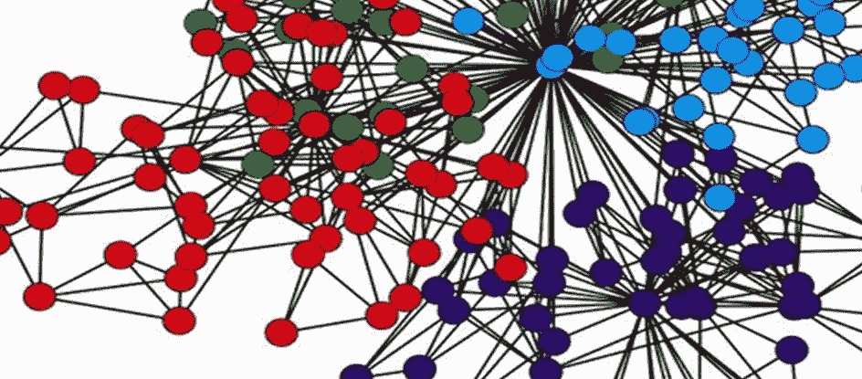
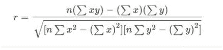
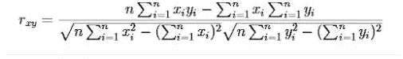
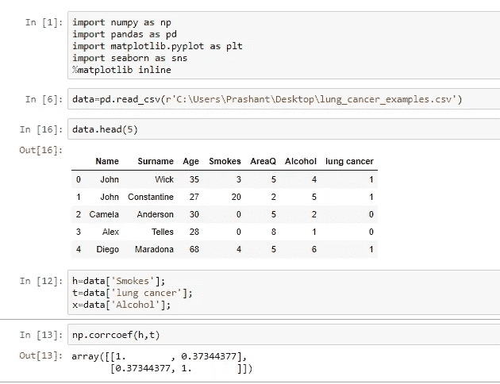
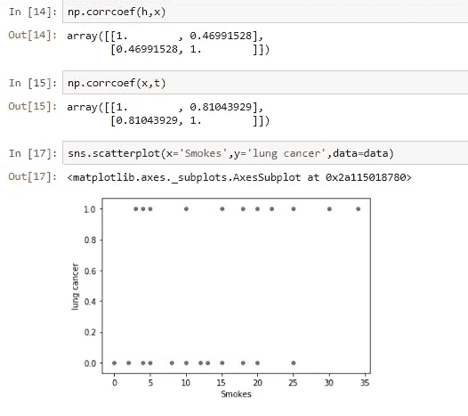
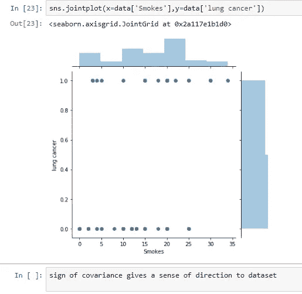

# 数据科学时代相关性和因果性的力量

> 原文：<https://medium.com/analytics-vidhya/power-of-correlation-causation-in-the-age-of-data-science-989da2d812b3?source=collection_archive---------25----------------------->

“我不能说我比其他 65 个人都聪明——但肯定是其他 65 个人的平均值！”—理查德·p·费曼

## 什么是相关性？

Cor relationship 被定义为二元系统中的一种关系，其中两个变量之间都有一个方向和一定程度的关联。

在统计学中，它被定义为两个变量线性相关的程度。

相关性描述了两个数据集之间的关系，可以使用散点图来可视化，散点图中可以绘制出两个变量。

为了在更深的数学层次上理解相关性，我们需要首先理解协方差。

**协方差的符号给数据一种方向感**，即散点图上的数据点是否有任何方向，或者它们只是在空间上随机分布。

这里，1) x，y 是数据集

2) *x_bar* ， *y_bar* 是它们各自数据集的平均值

3) N 是样本大小

协方差可以有(+)ve 或(-)ve 符号，其中正号表示数据集的正斜率，负号表示图表上数据集的负斜率。

**协方差在[(x-x _ bar)>0&(y-y _ bar)>0]或[(x-x _ bar)<0&(y-y _ bar)<0]时显示(+)ve 符号。**

**协方差在[(x-x _ bar)>0&(y-y _ bar)<0]或[(x-x _ bar)<0&(y-y _ bar)>0]时显示一个(-)ve 符号。**

协方差的问题在于，它显示关联强度的幅度位于**{∞*到* + ∞ }** 之间，这使得理解关联的程度变得非常困难，因此相关性开始发挥作用。

**相关性是协方差的一个版本，其中协方差值被归一化**，即相关性的域范围是 **{-1 到+1}** ，它使相关性成为数据统计分析的一个真正强大的工具。

## 怎么用？

相关性是一种用于量化不同数据集的工具。它是一个数学公式，可以使用不同的编程语言来实现，如 python 和 C++。

## 皮尔逊相关系数公式:

其中，n =信息量

σx =第一个变量值之和

σy =第二个变量值的总和

xy =第一个值和第二个值的乘积之和

x2 =第一个值的平方和

y2 =第二个值的平方和

系数的值介于-1 到+1 之间。当系数值为 0 时，则数据被认为是不相关的或彼此完全独立的，否则就是相关的。

## 线性相关系数公式:

## **相关性与因果关系**

在很多情况下，相关性和因果关系看似相似，但实际上它们是不同的。

**相关性并不意味着因果关系**虽然一对变量之间的相关性比因果关系更容易发现，因为当一个数据集发生变化时，很容易发现另一个数据集的波动，但很难说两个数据集之间是否存在因果关系。

因果关系明确适用于变量 H 导致结果变量 T 的情况，但在相关变量 H 与变量 T 相关的情况下。

## 如何解读？常见错误

一般来说，人们误解了相关性和因果关系，但两者是具有不同含义的不同术语。

例如:假设我们有 3 个变量 ***h，t，x***

这里，h-吸烟率

t-肺癌发病率增加

x-酒精中毒

这里，变量 h 是结果变量 t 的原因，因此 h & t 之间存在因果关系，但另一方面，变量 h & x 之间存在相关性，因为观察到过去吸烟的人也非常喜欢酒精，但吸烟不是酒精中毒的原因。

**一个找出肺癌数据集不同参数之间相关性的小例子，其中 0 代表“无肺癌”& 1 代表“存在肺癌”。**

使用 python 进行参数之间的相关性估计

使用 python 进行参数之间的相关性估计

使用 python 进行参数之间的相关性估计

**相关类型**

相关性用相关系数表示，相关系数表示两个数据集关联的方向和强度。

相关性大致分为 3 种主要类型:

1)正相关

2)负相关

3)零(无)相关性

当一个数据集相对于另一个数据集以相同方向增加时，则两个数据集的相关性称为正相关性。用正相关系数值表示。

当相关系数值正好是'+1 '时，那么该相关被称为是一个**完全正相关**。

当一个数据集的值减少而另一个数据集的值增加时，两个数据集之间的相关性称为负相关性。用负相关系数值表示。

当相关系数值为“-1”时，该相关性被称为是一个**完全负相关**。

当两个数据集完全相互独立时，则数据集之间没有相关性，因此相关系数值为零。

## 用什么？

相关系数是一个对数据集的**方向和两个数据集**之间的**关联度有很大影响的因素。寻找二元系统的函数依赖在数学上几乎是不可能的，这就是为什么相关性对于寻找数据之间的关联非常重要。**

相关性随着一些其他数学参数而变化，如**标准差、熵&试图满足图上所有数据点的线**的斜率。它与标准偏差成反比，即标准偏差(数据点和数据集平均值之间的差异)越大，相关性的大小就越小。随着数据集熵的增加，相关性也下降到零。随着数据集变得越来越随机，相关系数开始下降，接近零。

它与试图满足数据集所有数据点的直线斜率成正比。斜率和相关系数的符号也相同。

***数据集之间的因果关系比函数依赖更多。***

**关于作者:**

**Prashant Singh** :数据科学爱好者，擅长分析数据以创建可识别的图表并记录商业和研究目的的见解。

## 参考

1)[https://en.wikipedia.org/wiki/Correlation_and_dependence](https://en.wikipedia.org/wiki/Correlation_and_dependence)

2)[https://www . statistics solutions . com/correlation-Pearson-Kendall-spearman/](https://www.statisticssolutions.com/correlation-pearson-kendall-spearman/)

3)[https://byjus.com/maths/correlation/](https://byjus.com/maths/correlation/)

4)[https://amplitude.com/blog/2017/01/19/causation-correlation](https://amplitude.com/blog/2017/01/19/causation-correlation)

***标签:#相关性#因果性#协方差#数据 _ 科学#数据# jupyter _ 笔记本#熵#皮尔森 _ 相关性 _ 系数# python #预测性 _ 分析***