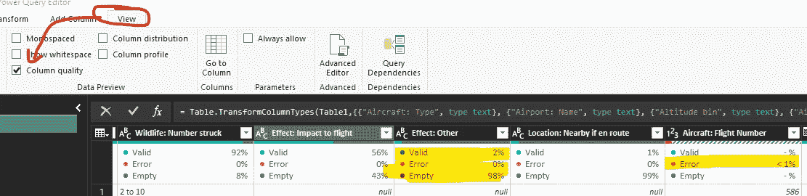
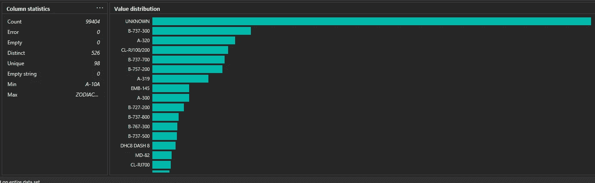

# Power Query Quickbytes# 2:使用数据预览汇总统计数据

> 原文：<https://medium.com/analytics-vidhya/power-query-quickbytes-2-summary-statistics-using-data-preview-4657df6fbde?source=collection_archive---------20----------------------->

[*【QuickBytes】*](https://www.vivran.in/my-blog/categories/quickbytes)*是一个系列文章，介绍具有指数收益的简单且易于实现的技术*

我喜欢 Power Query 中的数据预览功能。作为一名分析师，我更希望获得数据的总体汇总。数据预览是实现这一点的好方法。

# 好处# 1:色谱柱整体健康状况的可视化表示

标题名称下方的蓝绿色条直观地表示列的运行状况:

*   蓝绿色实线代表非空白值
*   灰黑色填充表示空
*   红色填充表示存在错误(主要是由于无效的数据转换)

当鼠标悬停在该栏上时，它会显示更多详细信息:

选中“查看”下的“色谱柱质量”选项以显示详细信息:

# 好处# 2:列基数

基数表示列中唯一值的存在。唯一值的数量越多，基数就越大。

对于高效的数据模型，Power BI 专家建议删除不必要的列，尤其是基数较高的列。具有较少基数列的表有助于更好的表压缩，从而加快数据加载和查询执行。

使用列分布功能快速显示分布和基数详细信息:

# 好处#3:使用色谱柱配置文件汇总统计数据

获取列的汇总统计信息是任何数据分析中首先要执行的步骤之一。它有助于了解数据分布的概况。

启用列配置文件:

视图>列配置文件

在 Power Query 中启用 Column Profile 提供了分布的可视化表示以及汇总统计信息。

对于数字列:

对于文本列:

悬停时，它会提供更多详细信息(计数、贡献百分比):

我们可以复制粘贴汇总统计数据:

我们可以使用列配置文件中的可用选项来过滤数据表

# 定义数据预览的范围

默认情况下，超级查询仅显示前 1000 条记录进行预览。我们可以在电源查询窗口的左下角查看状态:

但是，我们可以将范围扩大到整个数据集，方法是单击数据集并选择更改选择:

提醒一句:显示数据预览的处理时间将根据数据集中的记录数量和机器的处理能力而变化。所以，明智地使用它。

*我写关于*[*MS Excel*](https://www.vivran.in/my-blog/categories/excel)*[*权力查询*](https://www.vivran.in/my-blog/categories/powerquery)*[*权力毕*](https://www.vivran.in/my-blog/categories/powerbi)*[*权力中枢*](https://www.vivran.in/my-blog/categories/power-pivot)*[*DAX*](https://www.vivran.in/my-blog/categories/dax)*[*数据分析【数据*](https://www.vivran.in/my-blog/categories/data-analytics)*****

**[@imVivRan](https://twitter.com/imvivran)**