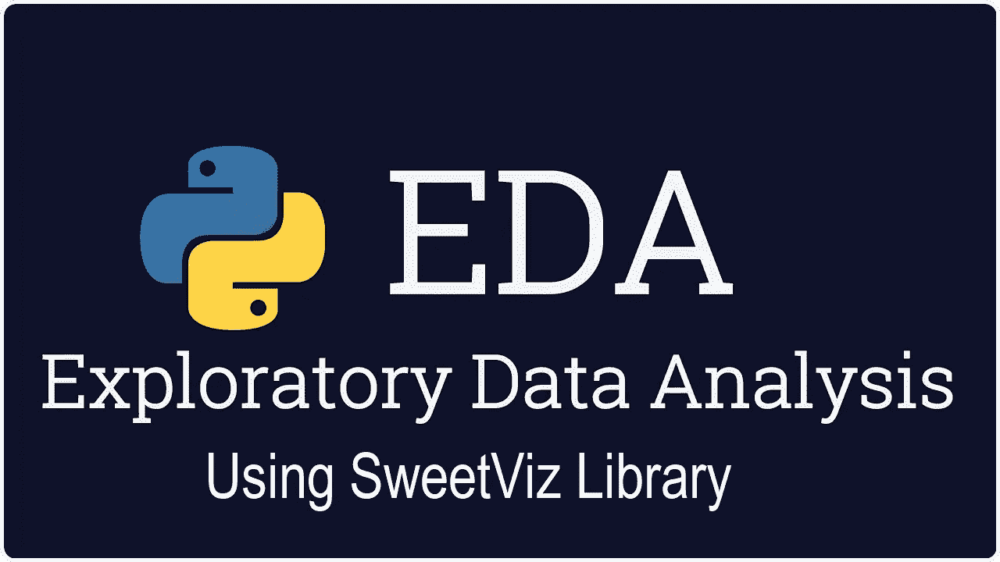
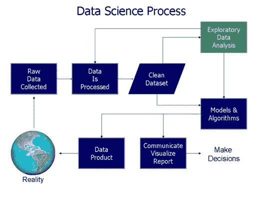
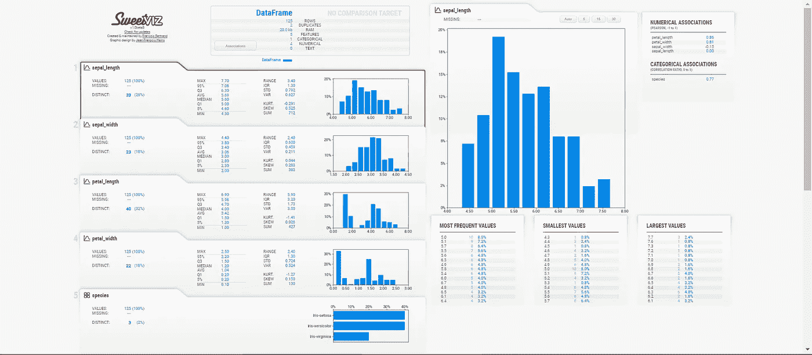
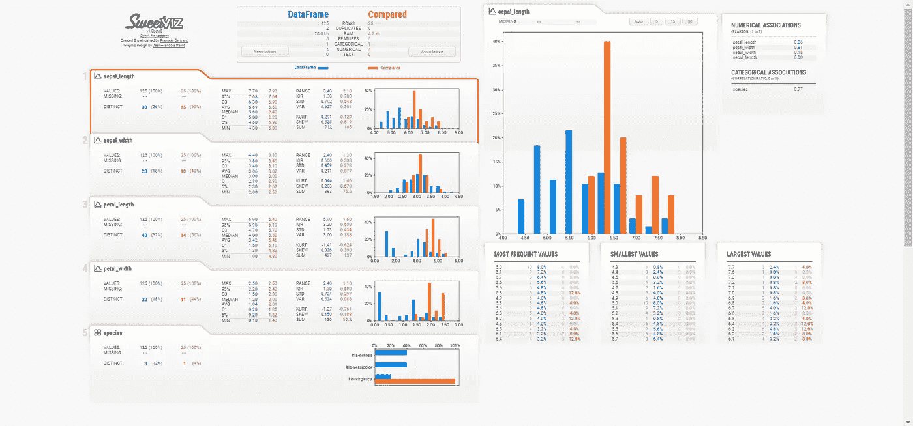
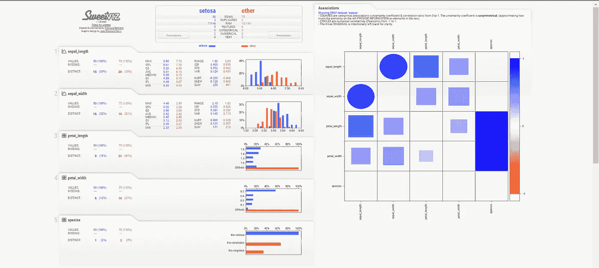

# 使用 Python 中的 SweetViz 库的强大 EDA

> 原文：<https://medium.com/analytics-vidhya/powerful-eda-using-sweetviz-library-in-python-3b595edccf44?source=collection_archive---------5----------------------->



使用 SweetViz 库进行探索性数据分析

# 简介:-

探索性数据分析是指对数据进行初步调查的关键过程，以发现模式、发现异常、测试假设，并借助汇总统计和图形表示来检查假设。当你想在机器学习中建立任何模型时，你首先需要理解数据集。在动手之前，你需要对数据有所了解。



数据科学过程图解

数据科学家 60%的时间花在探索性数据分析(EDA)上。

执行 EDA 的原因如下

1.它有助于我们可视化数据，并可以识别数据中的哪个特征影响了所需的输出。

2.它有助于找到给定数据集中缺失的值。

3.它有助于找到列的数据类型并完成数据集的分析。

为了减少执行 EDA 的时间，有一个强大的库叫做 **SweetViz** 。

**Sweetviz** 是一个开源 Python 库，只需一行代码就能为 kickstart EDA(探索性数据分析)生成漂亮的高密度可视化效果。输出是一个完全独立的 HTML 应用程序。该系统围绕快速可视化目标值和比较数据集而构建。它的目标是帮助快速分析目标特征、训练与测试数据以及其他类似的数据表征任务。这是一个来自熊猫轮廓的灵感。

创建报告有 3 个主要功能:

1.分析(…)

2.比较(…)

3.比较 _ 内部(…)

# 用数据集实现 SweetViz 库:-

1.)我们需要通过在命令提示符下键入以下代码来安装 SweetViz 库。

```
pip install sweetviz
```

2.)让我们考虑来自 Kaggle 的虹膜数据集。你可以从这里下载 CSV 文件(【https://www.kaggle.com/arshid/iris-flower-dataset】T4)

3.)现在我们需要导入所有必要的库，如 sweetviz 和 pandas 等

4.)现在使用 pandas.read_csv()函数读取数据集，并将数据帧拆分为训练和测试数据集。

5.)现在，在 sweetviz 库的帮助下，如果您想要分析数据帧，例如:-训练数据帧，您需要使用函数分析()并生成报告。

6.)现在你可以用 show_html()方法把分析的数据帧显示到 html 文件中。

7.)现在，如果您打开生成的文件，它将如下所示；-



列车数据帧的 HTML 报告

8.)现在，如果您想要比较两个数据帧(即 train，test)之间的分析，您可以使用 sweetviz 库中的 compare()函数。

比较两个不同的数据帧

9.)重复步骤 6 和 7 以显示分析 HTML 报告。两个数据帧之间的比较分析如下



用于比较训练和测试数据帧的 HTML 报告

10.)现在，如果您想要比较两个子群体之间的分析，那么您可以使用 sweetviz 库中的 compare_intra()函数。该函数采用一个布尔序列作为参数之一，并采用一个显式的“name”元组来命名(true，false)结果数据集。请注意，在内部，这将创建 2 个单独的数据框来表示每个结果组。

11.)重复步骤 6 和 7 以显示分析 HTML 报告。两个数据帧之间的比较分析如下



单个数据框中 Setosa 和其他物种之间的 HTML 报告

# 从生成的报告中获得的见解:-

这份报告提供了什么信息？

生成的报告将提供以下信息，如:-

*   它显示了数据框中的总行数和重复行数。
*   它给出了数据集中数值特征的数量和分类特征的数量。
*   它告诉我们处理这个数据集需要多少内存。
*   它给出了数据框中每一列中缺失值和不同值的数量。
*   它给我们每一列的信息，如最大值，范围，标准偏差，方差，平均值，中位数，总和等。
*   它让我们了解分类关联，即数据框架中特征之间的相关性。

# 结论:-

通过这种方式，我们可以使用 SweetViz 库，仅用两行代码对数据集执行探索性数据分析。

# 参考资料:-

[](https://pypi.org/project/sweetviz/) [## sweetviz

### Sweetviz 是一个开源 Python 库，可以为 kickstart EDA 生成漂亮的高密度可视化效果…

pypi.org](https://pypi.org/project/sweetviz/) 

一定要看看我关于[对不平衡数据进行重采样并应用 ML 技术的文章](/analytics-vidhya/resampling-imbalanced-data-and-applying-ml-techniques-91ebce40ff4d)。

如果你喜欢这篇文章呢👏这篇文章。如果你想在 Linkedin 上联系我，这里有下面的链接。

【https://www.linkedin.com/in/saidurgakameshkota/ 