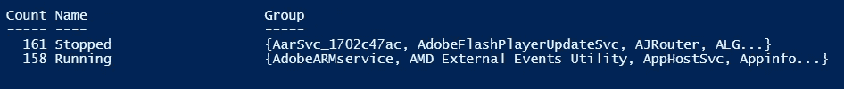

# Powershell 集合操作

> 原文：<https://medium.com/analytics-vidhya/powershell-set-operations-47b03045459a?source=collection_archive---------18----------------------->

集合操作可以对传递给它们的对象集合进行过滤、排序、分组和选择操作。

**过滤(Where-Object)**

`Get-Service` cmdlet 获取代表计算机上服务的对象。现在，我想向您展示如何过滤`Get-Service`结果集。

```
Get-Service|Where-Object name -eq “MSSQLSERVER”
```


过滤结果集

这些是同义词:

```
Get-Service|Where name -eq “MSSQLSERVER”
Get-Service|? name -eq “MSSQLSERVER”
```

要在过滤器中添加多个标准。

```
Get-Service|Where-Object {$PSItem.Name -like “*sql*” -and $PSItem.Status -eq “Running”}
```

**排序(排序对象)**

我们可以用 sort-object 对`Get-Service` cmdlet 结果集进行排序。

```
Get-Service|Sort-Object name # sort by name
Get-Service|Sort-Object Status # sort by Status
```

我们可以用降序排列。

```
Get-Service|Sort-Object -Descending Name
```

这是分类对象的同义词

```
Get-Service|Sort -Descending Name
```

**分组(组-对象)**

我们可以用 Group-Object 对 Get-Service cmdlet 进行分组。

```
Get-Service|Group-Object Status
```



分组结果集

**选择(选择对象)**

我们可以使用 Select-Object 选择 Get-Service cmdlet 的指定属性。

```
Get-Service|Select-Object Name
```

我们可以选择不止一个属性。

```
Get-Service|Select-Object Name,ServiceType,Status
```

如果希望看到前 N 条记录，应该使用-First 参数。此示例显示了前 10 条记录。

```
Get-Service|Select-Object -First 10 Name,ServiceType,Status
```

如果我们想显示所有属性，我们可以使用 select *(如 sql)。在此示例中，我们可以看到第一条记录的所有属性。

```
Get-Service|Select-Object -First 1 *
```

同义词是 Select。

```
Get-Service|select Name,ServiceType,Status
```

全部在一个样本中:

```
Get-Service|where name -like ‘M*’|sort Name|select -first 5 Name,Status,StartType|group-object Status
```

低于样本。它得到，名称以' M '服务开始，然后按名称属性排序，并选择前 5 个记录。最后，它按状态属性分组。