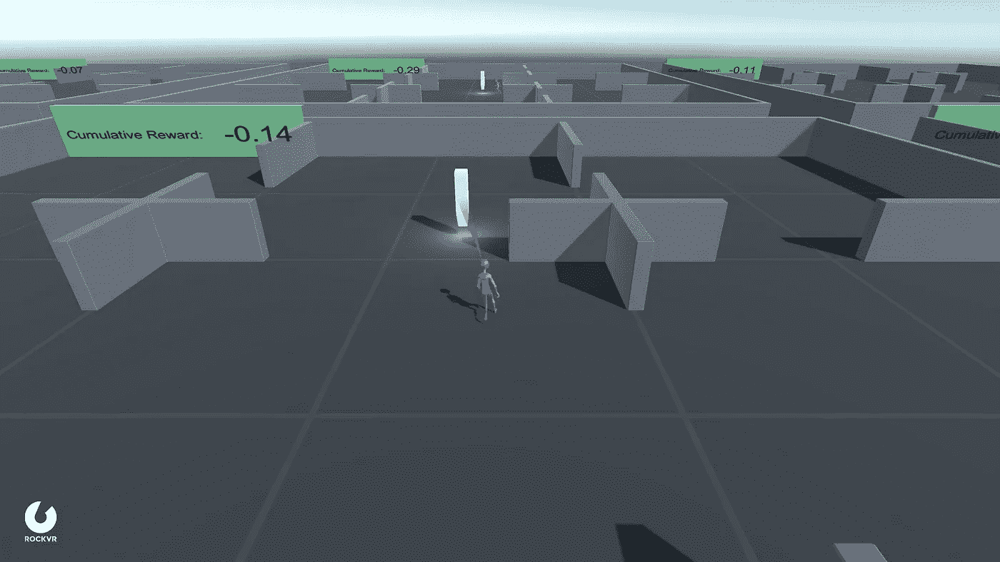

# 用 Unity 引擎定制 RL 环境的 PPO 算法

> 原文：<https://medium.com/analytics-vidhya/ppo-algorithm-with-custom-rl-environment-made-with-unity-engine-effed6d98b9d?source=collection_archive---------6----------------------->

使用 ML-Agents Python 低层 API 训练 RL 代理



[我使用 Unity 的 ML-Agents 工具包训练 RL 代理的环境](https://github.com/dhyeythumar/PPO-algo-with-custom-Unity-environment/blob/main/Environment_Details.md)

我写这篇文章是因为我发现几乎没有任何资源讨论如何将 RL 算法应用到用 Unity 引擎创建的定制环境中。因此，如果你在 Unity 中实现了一个定制环境，并使用 ML-Agents 工具包进行培训。但是现在，如果您想将 PPO(或任何其他 RL 算法)应用到您的环境中(不使用 ML-Agents inbuild trainer)，那么您就找对了地方。

ML 代理提供了两个附加功能:

*   **Python 低级 API**，它允许我们直接与学习环境交互，这样我们就可以实现新的强化学习算法，并在我们的环境中测试它们。
*   **健身房包装器**因此我们可以将学习环境模拟成标准的健身房环境，并且它可以类似地用于其他健身房环境。

在这里，我将解释如何使用 python APIs 通过 PPO 算法与您的学习环境进行交互。(但是对于其他 RL 算法可以遵循类似的步骤)

> **注意:**如果您期待实现 PPO 算法，那么请阅读这篇令人惊叹的文章 [**近端策略优化教程(第 1/2 部分:演员-评论家方法)**](https://towardsdatascience.com/proximal-policy-optimization-tutorial-part-1-actor-critic-method-d53f9afffbf6)

**步骤 0:安装**

这一步仅适用于您尚未安装 ML-Agents 工具包的情况。

```
$ git clone --branch release_1 [https://github.com/Unity-Technologies/ml-agents.git](https://github.com/Unity-Technologies/ml-agents.git)
$ python -m venv myvenv
$ myvenv\Scripts\activate
$ pip install -e ./ml-agents/ml-agents-envs
```

*你只需要从克隆的回购中安装* `*ml-agents-envs*` *。*

**第一步:加载环境**

Python 端的通信通过`**UnityEnvironment**`进行。

`**file_name**` 是环境二进制的名称(提供二进制的正确路径)。如果您想与编辑器互动，当屏幕上显示消息*“按下 Unity 编辑器中的播放按钮开始训练”*时，使用`file_name=None`并按下编辑器中的播放按钮。

`**seed**`表示在训练过程中生成随机数时使用的种子。

`**side_channels**` 提供了一种与 Unity 仿真交换数据的方式，这种方式与强化学习循环无关。例如，我们正在设置屏幕尺寸和时间刻度。

**第二步:获取环境细节**

`**reset()**` 发送信号重置环境。

`**get_behavior_names()**`返回行为名称列表。对于单代理环境，只有一种行为。您可以有多个行为，这需要不同的模型(在 PPO 算法的情况下，您需要为每个行为有一个单独的参与者-批评家模型)

`**get_behavior_spec()**`提供多个字段

*   `**action_size**`对应于您的代理期望的动作数量。(动作空间)
*   `**observation_shapes**`返回元组列表。这取决于你使用了多少种不同的方法来收集观察值，比如光线投射法或使用`VectorSensor`添加值。
*   `**is_action_continuous()**`返回一个布尔值，它取决于您在编辑环境时如何在行为参数中定义您的动作空间。
*   `**is_action_discrete()**` 与上述方法相似。如果你使用离散动作空间，那么使用`**discrete_action_branches**`来获得一个动作选择元组。(例如，如果 action_size = 2，则 discrete_action_branches 将返回(3，2，)这表示第一个分支有 3 个不同的值，第二个分支有 2 个不同的值。

**第三步:收集初始观察结果**

`**get_steps()**` 返回一组 DecisionSteps，TerminalSteps(用于代理组)。我们还可以访问特定代理的决策步骤，使用其 id 作为 step_result[0][agent_id]。并且对于终端步骤，其步骤结果[1][代理 id]。

**决策步骤**包含以下字段:

*   `**obs**` 是代理收集的 NumPy 数组观察值的列表。(将它们累积在一个向量中)
*   `**reward**`对应于代理从上一步开始收集的奖励。
*   `**agent_id**` 是对应代理的唯一标识符。
*   `**action_mask**`是一个可选的一维布尔数组列表。仅用于多离散动作空间类型。(如果为真，则在此模拟步骤中，该操作对代理不可用。)

**终端步骤**为空，直到代理遇到结束剧集触发&包含以下字段:

*   `**obs, reward, agent_id**` 类似于决策步骤字段。
*   `**max_step**`是一个布尔。如果代理在最后一个模拟步骤中达到其最大步骤数，则为 True。

**第四步:采取行动，改善环境**

`**set_actions()**`设置整个代理组的操作。它需要一个 2D NumPy 数组，其形状定义为`**(num_of_agents, n_actions, )**`。

`**set_action_for_agent(agent_group: str, agent_id: int, action: np.array)**` 设置代理组中特定代理的操作。agent_group 是代理所属的组的名称。这里的动作是一个 1D NumPy 数组，其形状被定义为`**(n_actions, )**`。

`**step()**` 向步进环境发送信号。当调用`step()`或`reset()`时，Unity 模拟将向前移动，直到模拟中的代理需要来自 Python 的输入才能动作。

**第五步:异常处理**

Unity ML-Agents 还提供了定制的异常处理程序，当运行环境产生错误时可以调用(例如，如果您想要中断训练过程，那么通过使用这些异常，您可以安全地关闭 Unity 窗口并保存已训练的模型)。

这里我们来结束这篇文章。如果你有任何疑问、建议和改进，请告诉我。

如果你想和上图中提到的环境互动，那么就来看看 [**这个链接**](https://github.com/dhyeythumar/PPO-algo-with-custom-Unity-environment/tree/main/rl_env_binary) 。你也可以使用 [**这个**](https://github.com/dhyeythumar/PPO-algo-with-custom-Unity-environment/blob/main/env_driver.py) 简单的脚本，它不使用任何算法，所以你可以更有效地探索 ML-Agents API。

> 查看这个 github repo，了解在使用 Unity 引擎定制的环境中 PPO 算法的完整实现。

[](https://github.com/Dhyeythumar/PPO-algo-with-custom-Unity-environment) [## dhyethumar/PPO-algo-with-custom-Unity-environment

### 此报告包含在自定义的上使用 Keras 库的近似策略优化算法的实现…

github.com](https://github.com/Dhyeythumar/PPO-algo-with-custom-Unity-environment)