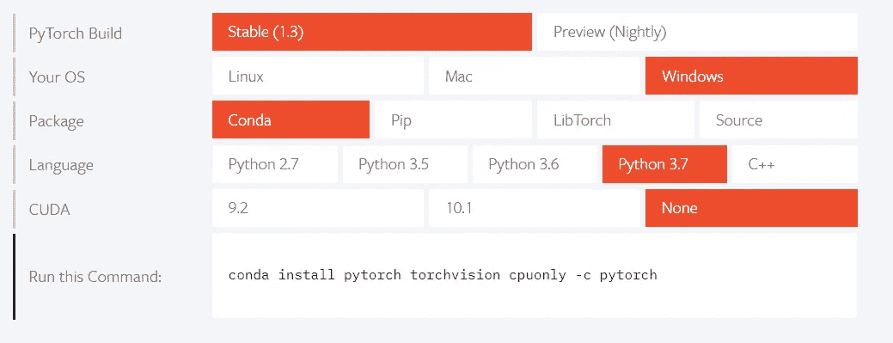
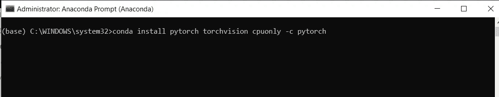
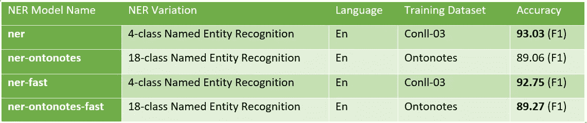

# 命名实体识别中的实用方法

> 原文：<https://medium.com/analytics-vidhya/practical-approach-of-state-of-the-art-flair-in-named-entity-recognition-46a837e25e6b?source=collection_archive---------2----------------------->


NLP 中的 NER

今天我们来讨论自然语言处理中最流行的用例，即 NER——命名实体识别。在本帖中，我们将介绍一种最先进的算法 Flair 的实际应用。

# 什么是 NER？

NER 可用于识别实体，如给定文本中的组织、位置、个人和其他实体。

# NER 有哪些使用案例？

许多商业或现实世界的问题都可以通过 NER 解决:

1.  分类将非常容易，我们可以容易地识别文档/文本与公司、地点或人等相关。
2.  基于大量文本数据中存在的实体，快速识别隐藏的见解。
3.  对于从文本中进行信息检索，实体识别非常重要。使用 NER，可以将信息提取到正确的搜索查询中。

# 我们今天的算法是:

今天，我提出了我们的 NER 任务的天赋框架。这是 NLP 任务中最先进的图书馆之一。它使用 Pytorch。NER 天赋的好处在于它是基于上下文工作的。它是由 Zalando 研究小组开发的。让我们开始看看结果。

# 天赋装置

首先我们需要安装 pytorch 框架。根据您的系统兼容性，选择 pytorch.org 网站中的选项，并运行如下所示的命令。



我在管理员模式下运行 Anaconda 命令提示符，如下所示:



安装完成后，使用以下命令安装 Flair:

```
**pip install flair**
```

# NER 天赋的实际应用

让我们编写基本脚本来查看 NER 的输出。前两行代码导入 flair 模型，如下所示。它将首次下载 NER 模型。

```
**#import commands for flair NER
from flair.data import Sentence
from flair.models import SequenceTagger**
```

接下来，加载下载的 NER 模型，如下所示:

```
**#Load NER Model
tagger = SequenceTagger.load('ner')**
```

之后，让我们给一些样本文本。接下来，我们将文本转换成句子语法。这将把文本转换成标记。

```
**#Sample text to run NER
text = 'Jackson is placed in Microsoft located in Redmond'****#passing text to sentence
sentence = Sentence(text)**
```

接下来是非常重要的一行，用来识别句子中的实体。为了查看实体，我们运行最后两行代码。

```
**# Run NER on sentence to identify Entities
tagger.predict(sentence)****# print the entities with below command
for entity in sentence.get_spans('ner'):
    print(entity)**
```

上面的打印命令将给出下面的输出。正如我们在下面看到的，它将杰克逊标记为个人(PER)，将微软标记为组织(ORG)，将雷德蒙标记为位置(LOC)。

**PER-span[1]:" Jackson "
ORG-span[5]:"微软"
LOC-span [8]: "Redmond"**

仅用 8 行简单的代码，我们就能够获得实体。让我们来看一下带有标签的句子，标签是为同一个句子标识的。

```
**print(sentence.to_tagged_string())**
```

下面是上面语句的输出。

**杰克森< S-PER >放在微软< S-ORG >位于雷德蒙<S-LOC>**

现在我们再写一个句子，看看输出。

```
**#Sample text
text1 = ‘Redmond is coming to New York city’****#passing text to sentence
sentence = Sentence(text1)****# Run NER on sentence to identify Entities
tagger.predict(sentence)****# print the entities with below command
for entity in sentence.get_spans(‘ner’):
    print(entity)**
```

输出如下所示:

**PER-span [1]:"雷德蒙"
LOC-span [5，6]:"纽约"**

有点棘手吧！现在 Flair 说 Redmond 是人，在第一个例子中 Redmond 是位置。所以在这两个地方，NER 是正确的。上下文在这里起着关键的作用。基于上下文的天赋 NER 给出输出，这在数据驱动的项目中非常重要。这也在一定程度上解决了词语歧义。例句:一个词是人还是地点？公司还是人？

# 天才模特

在 Flair NER，有各种预训练模型可供选择。在本帖中，我们将只讨论 NER 模型。ner 型号需要 GPU，但我们也有 ner-fast 型号的 CPU 版本。我在下面列出了其中的一些。Flair 也有多语言模型。你也可以在这里看到它们



# 在文章文本上使用天赋

到目前为止，我们已经看到通过一个句子和预测实体。现在让我们通过一段，看看结果。

下面这段话我是从彭博[这里](https://www.bloomberg.com/news/articles/2019-11-13/elon-musk-s-solar-deal-has-become-top-threat-to-tesla-s-future)拿过来的:

```
**text2 = “During a heated deposition this past June, Elon Musk finally seemed to admit that his harshest critics were right. Since forcing through the controversial 2016 purchase of SolarCity Corp., the struggling solar sales-and-installation business he co-founded with his cousins, Tesla Inc.’s chief executive officer has faced almost-constant criticism: The move was called a catastrophe for Tesla, a $2 billion-plus bailout of a debt-saddled company of which Musk himself was chairman and the largest shareholder. Despite plummeting sales and substantial layoffs in the solar division under Tesla after the merger, Musk has fervently defended the SolarCity acquisition, once calling it “blindingly obvious” and a “no-brainer.””**
```

一个额外的步骤，我们必须做之前，通过上述文本到 NER 的天赋，即分割成句子的段落。为了拆分句子，NER 内置了一个名为 segtok 库。它将与 NER 天赋一起安装。现在让我们写代码来分割段落。

```
**#Import segtok library to split the paragraph into sentences
from segtok.segmenter import split_single****sentences = [Sentence(sent, use_tokenizer=True) for sent in split_single(text2)]**
```

从上面的代码行，我们只是简单地传递段落，我们将得到预测实体的句子。让我们用下面的代码预测并打印输出。

```
**#predicting entities
tagger.predict(sentences)****# print the entities with below command
for sent in sentences:
    for entity in sent.get_spans('ner'):
        print(entity)**
```

以下是我们从 Flair NER 获得的上述段落的输出。看起来很正确。

**PER-span [9，10]:“埃隆·马斯克”
ORG-span [9，10]:“SolarCity corp .”
ORG-span[23，24]:“特斯拉公司”
ORG-span [42]:“特斯拉”
PER-span [55]:“马斯克”
ORG-span [12]:“特斯拉”
PER-span [17]:“马斯克”
ORG-span [22]:“**

我把示例代码文件放在这里的 [github 上](https://github.com/punna111/Flair)。

这是我在这个博客上的第一篇文章。请让我知道你是否喜欢这个帖子，以及你对这个帖子的想法。您可以将您的意见/反馈分享给我。

参考资料:

py torch—[https://pytorch.org/](https://pytorch.org/)

Github 的天才链接—[https://github.com/zalandoresearch/flair](https://github.com/zalandoresearch/flair)

Flair NER 车型—[https://github . com/zalandor research/flair/blob/master/resources/docs/TUTORIAL _ 2 _ tagging . MD](https://github.com/zalandoresearch/flair/blob/master/resources/docs/TUTORIAL_2_TAGGING.md)