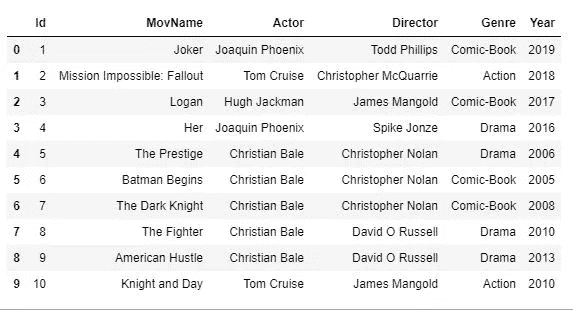

# KMeans 集群的实用方法——Python 和为什么伸缩很重要！

> 原文：<https://medium.com/analytics-vidhya/practical-approach-to-kmeans-clustering-python-and-why-scaling-is-important-44ac0b0fea47?source=collection_archive---------2----------------------->

> 学习 K 意味着聚类，现在你想在现实生活中应用？
> 应用了聚类算法但对结果不满意？
> 从您见过的最简单的数据集开始，了解扩展如何影响聚类，以及数据的微小变化如何导致完全不同的聚类！


图片来自 [Pixabay](https://pixabay.com/?utm_source=link-attribution&utm_medium=referral&utm_campaign=image&utm_content=1509707) 的 [arielrobin](https://pixabay.com/users/arielrobin-2483349/?utm_source=link-attribution&utm_medium=referral&utm_campaign=image&utm_content=1509707)

# 先决条件

1.  *你应该知道什么是聚类。*
2.  *你应该知道 KMeans 算法。*
3.  *Python 基础知识*

# 让我们开始编码吧

## 步骤 1:导入所需的库

```
import pandas as pd
import numpy as np
import matplotlib.pyplot as plt
```

## 步骤 2:读取数据集

```
movies = pd.read_csv('movies.csv')
```

## 步骤 3:理解数据集

```
**# View the first five rows of the dataset**
movies.head()**# If you want to view first n rows of the dataset:**
# movies.head(n=number)
```


数据集的前五行

```
**#View summary of the data**
movies.info()
```


电影信息

我们看到总共有 10 行和 6 个特征(列)。
其中两个特征为*整数类型*，四个特征为*对象类型*。
我们可以看到，它显示了 10 个非空，这意味着总共有 10 个非空条目，总共有 10 行，这意味着数据中没有空值。

我们可以删除“Id”功能，因为它不会为我们提供任何相关信息。

```
del movies['Id']
```

让我们查看完整的数据，因为只有 10 行。

```
**#View the complete data**
display(movies)
```



完整的电影数据

这是一个小数据集，我们看到，有许多电影都是由相同的演员或导演出演的，但我们可以使用 *groupby* 来了解更多的数据。

```
**#Grouping the movies by actors and displaying them**
actors = movies.groupby('Actor')
for actor,rows in actors:
    display(actor,rows)
```


按结果的演员分组


按结果的演员分组

我们看到总共有四位演员:克里斯蒂安·贝尔、休·杰克曼、乔阿金·菲尼克斯和汤姆·克鲁斯。克里斯蒂安·贝尔在数据集中拥有最高数量的电影，即 5 部，乔阿金·菲尼克斯和汤姆·克鲁斯各有两部电影，休·杰克曼只有一部电影。

现在让我们按导演分组

```
**#Grouping the movies by directors and displaying them** directors = movies.groupby('Director')
for director,rows in directors:
    display(director,rows)
```


按结果划分的控制器组


按结果划分的控制器组

共有六位导演，克里斯托弗·诺兰和大卫·罗素只和克里斯蒂安·贝尔合作过，而詹姆斯·曼高德只和休·杰克曼和汤姆·克鲁斯合作过。

现在让我们按流派分组

```
**#Grouping the movies by genre and displaying them**
genres = movies.groupby('Genre')
for genre,rows in genres:
    display(genre,rows)
```


流派分组依据结果

有 3 种独特的类型。只有汤姆·克鲁斯演过动作片，克里斯蒂安·贝尔和乔阿金·菲尼克斯演过漫画和剧情片。

## 步骤 4:预处理

在建模之前，我们必须将数据转换为数字格式，因为 KMeans 不能处理分类变量。
因此我们必须为演员、导演和流派创造虚拟变量。
我们没有为电影名称创建虚拟变量，因为它也是一个标识符，在聚类中没有用，因此我们也删除了它。

> 注意:建议制作原始数据集的副本，并对副本而不是原始数据集进行修改。

```
**#Creating dummy variables** actor_dummy = pd.get_dummies(movies['Actor'])
director_dummy = pd.get_dummies(movies['Director'])
genre_dummy = pd.get_dummies(movies['Genre'])**#Concatenating the dummy variables to the original dataset** movie_dummy_set=pd.concat([movies,actor_dummy,
director_dummy,genre_dummy],axis=1)**#Deleting categorical variable from the dummy set**
del movie_dummy_set['MovName']
del movie_dummy_set['Actor']
del movie_dummy_set['Director']
del movie_dummy_set['Genre'].
```


预处理后的数据

## 第五步:建模

让我们从导入建模所需的库开始

```
**#Importing KMeans** from sklearn.cluster import KMeans
```

让 k 等于 2，即我们想要两个数据集群。

```
**#Modeling** kmeans = KMeans(2)
kfit = kmeans.fit(movie_dummy_set)
identified_clusters = kfit.predict(movie_dummy_set)
```

我们已经将识别出的聚类存储在一个新的变量中，并将它添加到原始数据集中。

```
**#Appending the identified clusters to the original data** clustered_data = movies.copy()
clustered_data['Cluster'] = identified_clusters**#Viewing the data with clusters** display(clustered_data.sort_values(by='Cluster'))
```


具有两个分类的数据

> 在继续之前，分析该表并尝试找出聚类是基于哪个(些)特征发生的。

如果你想通了，太好了！，让我们继续绘制集群

```
**#Plotting the graph**
plt.xlabel('Year')
plt.ylabel('Cluster')
plt.scatter(clustered_data['Year'],clustered_data['Cluster'],c=clustered_data['Cluster'])
```


年份与聚类图

我们看到聚类是基于年份的。聚类 0 包含 2012 年之前发行的电影，聚类 1 包含 2012 年之后发行的电影。

> 但为什么它是基于年份，而不是其他特征演员，导演和流派。我们忘了什么吗？我想是的，我们忘了缩放数据。

请记住，所有的数据都是数值型的，并且年份中的数据在数量级上非常大。它在 2000s 的范围内，而其他特征中的数据是 0 或 1，因为它们是虚拟的。

这可能是聚类基于年份的原因，因为年份中的值要大得多，从而使其值最大化。

让我们缩放数据，然后应用 KMeans。

```
**#Importing the library**
from sklearn import preprocessing**#Passing the values of the dataset to Min-Max-Scaler**
movies_values = movie_dummy_set.values
min_max_scaler = preprocessing.MinMaxScaler()
x_scaled = min_max_scaler.fit_transform(movies_values)
movies_scaled = pd.DataFrame(x_scaled,
columns=movie_dummy_set.columns)
```

我们对数据进行了缩放，并存储在“movies_scaled”变量中。让我们应用 k = 2 的 KMeans，看看我们得到的结果是不同的还是相同的。

```
**#Modeling**
kmeans = KMeans(2)
kfit = kmeans.fit(movies_scaled)
identified_clusters_scaled = kfit.predict(movies_scaled)**#Appending the identified clusters to the dataframe**
clustered_data_scaled = movies.copy()
clustered_data_scaled['Cluster'] = identified_clusters_scaled
display(clustered_data_scaled.sort_values(by='Cluster'))
```


缩放后具有两个聚类的数据

结果令人惊讶不是吗！现在，聚类是基于演员的，聚类 0 包含克里斯蒂安·贝尔主演的电影，而聚类 1 包含所有其他电影。

**让我们看看当聚类数为 3 时会发生什么，即 k =3。**


具有三个聚类的数据

同样，聚类是基于演员的，聚类 0 包含汤姆克鲁斯主演的电影，聚类 1 包含克里斯蒂安·贝尔主演的电影，聚类 2 包含其他电影。

**让我们看看当聚类数为 4 时会发生什么，即 k =4。**


具有四个簇的数据

这些分类现在基于两个特征，演员和导演。
群集 0 包含汤姆·克鲁斯主演的电影。集群 1 包含由大卫·罗素执导的克里斯蒂安·贝尔主演的电影。聚类 3 包含乔阿金·菲尼克斯和休·杰克曼主演的电影，聚类 4 还包含克里斯蒂安·贝尔主演的但由克里斯托弗·诺兰导演的电影。

## 第六步:结论

我们看到了扩展如何影响集群。在缩放之前，两个分类是基于年份的，但是在缩放之后，分类是基于行动者的。
我们还看到了改变聚类数如何改变数据分组，这完全取决于数据科学家决定聚类数。

> Y 你可能有几个问题，比如什么是正确的集群数量，或者如何决定“k”值。确定“k”值的方法之一是**弯头法**。
> 
> 你可能会有另一个问题，为什么大多数时候聚类是基于演员特征，而不是类型。数据集中有 3 种类型，所以当 k 为 3 时，基于类型而不是演员进行聚类更有意义。答案是，这也取决于数据。

> 让我们看一个例子，看看聚类是如何依赖于数据的。

**我只在数据集中做了一个改动，我把《蝙蝠侠诞生》的年份从 2005 年改成了 2014 年(是的，这是错的，但结果令人惊讶！)**


2014 年《蝙蝠侠诞生》上映时

我们看到现在聚类是基于流派的！，仅仅更改数据集中的单个值就会导致分类发生重大变化。

想象一个现实生活中的数据集，它有大量的行和列以及大量缺失值。缺失值可以用各种技术来填充。
不同的技术会导致不同的集群！

尝试不同数量的集群和不同的算法，看看它如何改变集群的形成方式。

> **资源库链接**:[https://github.com/njain9104/Movies-Clustering](https://github.com/njain9104/Movies-Clustering)

## 最后一步:结束