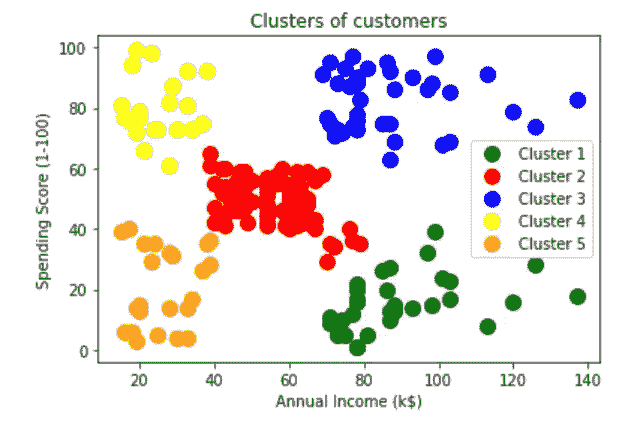

# 基于超参数优化的 K-means 聚类、层次聚类和 DBSCAN 聚类的实际实现

> 原文：<https://medium.com/analytics-vidhya/practical-implementation-of-k-means-hierarchical-and-dbscan-clustering-on-dataset-with-bd7f3d13ef7f?source=collection_archive---------4----------------------->

超参数优化的聚类算法

目录:

㈠文章议程

㈡数据处理

(iii)具有超参数优化的 K 均值聚类

㈣等级聚类

(v)具有超参数优化的 DBSCAN 聚类

㈥结论

㈦参考资料


图片来源:Scikit learn

# ㈠文章议程:

这篇文章纯粹是关于在任何数据集上实现聚类算法的。我们也做超参数优化。

先决条件:对 K-means、层次结构和 DBSCAN 聚类有基本的了解

在本文中，我一直遵循 https://www . ka ggle . com/vjchoudhary 7/customer-segmentation-tutorial-in-pythonMall _ customers . CSV 数据集

请从以上链接下载数据集

# ㈡数据处理:

我们使用熊猫读取 CSV 文件

```
import numpy as np
import pandas as pd
import matplotlib.pyplot as plt# Reading csv filedf=pd.read_csv('Customers.csv')df.head()
```


df 的前 5 行

数据集包含 5 个特征

## 问题陈述:我们需要根据人们的年收入(k$)和花费(花费分数(1-100))对他们进行分类

因此，我们的聚类特征是年收入(k$)和支出分数(1-100)

消费分数只不过是给出他们消费多少的基础的分数

f1:年收入(千美元)

f2:支出得分(1-100)

现在我们需要用数据帧 d f 中的 f1(x)和 f2 (y)创建一个数组

```
# converting features f1 and f2 into an array 
X=df.iloc[:,[3,4]].values
```

我们有了数组形式的特性，现在我们可以开始实现步骤

# ㈢K 均值聚类:

K-means 聚类是基于质心的算法

K =否。聚类=超参数

我们用肘法求 K 值

K-means 目标函数是 **argmin (sum(||x-c||)**

其中 x =聚类中的数据点

c=群集的质心

目的:我们需要最小化数据点和质心之间的平方距离

如果我们有 K-簇，那么我们就有 K-质心

簇内距离:同一簇中数据点之间的距离

簇间距离:不同簇之间的距离

我们的主要目标是选择具有小的簇内距离和大的簇间距离的簇

我们使用 K-means++初始化(概率方法)

```
from sklearn.cluster import KMeans# objective function is nothing but argmin of c (sum of (|x-c|)^2 )  c: centroid ,x=point in data setobjective_function=[] 
for i in range(1,11):
    clustering=KMeans(n_clusters=i, init='k-means++')
    clustering.fit(X)
    objective_function.append(clustering.inertia_)#inertia is calculaing min intra cluster distance
# objective function contains min intra cluster distances objective_function
```

目标函数:最小簇内距离

```
[269981.28000000014,
 183116.4295463669,
 106348.37306211119,
 73679.78903948837,
 44448.45544793369,
 37233.81451071002,
 31599.13139461115,
 25012.917069885472,
 21850.16528258562,
 19701.35225128174]
```

我们尝试了 1 到 10 之间的 K 值，我们不知道哪个是最好的 K 值

为了知道最佳 K 值，我们进行超参数优化

**弯头法:超参数优化**

```
# for finding optimal no of clusters we use elbow technique 
# Elbow technique is plot between no of clusters and objective_function 
# we take k at a point where the objective function value have elbow shape 
plt.plot(range(1,11),objective_function)
plt.title(‘The Elbow Method’)
plt.xlabel(‘Number of Clusters K’)
plt.ylabel(‘objective_function’)
plt.show()
```


超参数优化

在上图中，K=5 时，我们得到了我们认为最佳的 K=5 的肘关节

现在我们用最佳 K 值训练一个模型

#用最佳聚类数训练模型

```
# Training the model with optimal no of clusterstuned_clustering=KMeans(n_clusters=5,init=’kmeans++’,random_state=0)
labels=tuned_clustering.fit_predict(X)# x and y  coordinates of all clusters
# Centroids of clusters
tuned_clustering.cluster_centers_[:]
```

标签返回:预测分类

```
array([3, 1, 3, 1, 3, 1, 3, 1, 3, 1, 3, 1, 3, 1, 3, 1, 3, 1, 3, 1, 3, 1,
       3, 1, 3, 1, 3, 1, 3, 1, 3, 1, 3, 1, 3, 1, 3, 1, 3, 1, 3, 1, 3, 0,
       3, 1, 0, 0, 0, 0, 0, 0, 0, 0, 0, 0, 0, 0, 0, 0, 0, 0, 0, 0, 0, 0,
       0, 0, 0, 0, 0, 0, 0, 0, 0, 0, 0, 0, 0, 0, 0, 0, 0, 0, 0, 0, 0, 0,
       0, 0, 0, 0, 0, 0, 0, 0, 0, 0, 0, 0, 0, 0, 0, 0, 0, 0, 0, 0, 0, 0,
       0, 0, 0, 0, 0, 0, 0, 0, 0, 0, 0, 0, 0, 2, 4, 2, 0, 2, 4, 2, 4, 2,
       0, 2, 4, 2, 4, 2, 4, 2, 4, 2, 0, 2, 4, 2, 4, 2, 4, 2, 4, 2, 4, 2,
       4, 2, 4, 2, 4, 2, 4, 2, 4, 2, 4, 2, 4, 2, 4, 2, 4, 2, 4, 2, 4, 2,
       4, 2, 4, 2, 4, 2, 4, 2, 4, 2, 4, 2, 4, 2, 4, 2, 4, 2, 4, 2, 4, 2,
       4, 2])
```

tuned _ clustering . cluster _ centers _[:]return:每个分类的质心坐标

```
array([[55.2962963 , 49.51851852],
       [25.72727273, 79.36363636],
       [86.53846154, 82.12820513],
       [26.30434783, 20.91304348],
       [88.2       , 17.11428571]])
```

可视化集群

```
# visualizing the clustersplt.scatter(X[labels==0,0],X[labels==0,1],c=’green’,label=’cluster1')
plt.scatter(X[labels==1,0],X[labels==1,1],c=’yellow’,label=’cluster2')
plt.scatter(X[labels==2,0],X[labels==2,1],c=’red’,label=’cluster3')
plt.scatter(X[labels==3,0],X[labels==3,1],c=’orange’,label=’cluster4')
plt.scatter(X[labels==4,0],X[labels==4,1],c=’blue’,label=’cluster5')plt.scatter(tuned_clustering.cluster_centers_[:,0],tuned_clustering.cluster_centers_[:,1],s=300,c=’black’,label=’centroid’)plt.title(‘Clusters of customers’)
plt.xlabel(‘Annual Income(K$)’)
plt.ylabel(‘Spending Score(1–100)’)
plt.legend()
plt.show()
```


根据年收入和支出对人群进行聚类

评估:我们的聚类有多好

为了检查我们的聚类有多好，我们使用了轮廓系数


轮廓系数

在上图中，我们有两个集群 C1 和 C2

a=簇内距离

b =簇间距离

轮廓系数= b-a/max(b，a)

如果我们的聚类是好的，那么我们具有小的聚类内距离，那么轮廓系数值是正的

如果我们的聚类不好，那么我们具有大的聚类内距离，那么轮廓系数值是负的

轮廓系数介于-1 和 1 之间

如果该值向 1 移动，那么聚类是好的

如果对于 n_clusters = 3，该值向<0 then clustering is bad

```
from sklearn import metrics
metrics.silhouette_score(X, tuned_clustering.labels_,
metric='euclidean')
```

We got the Silhouette coefficient value is 0.553931997444648

It’s moving towards 1 so our clustering is good

If you want to visualize the Silhouette coefficient

```
# visualizing Silhouette coefficientfor n_clusters in range(2,10):
 # Create a subplot with 1 row and 2 columns
 fig, (ax1, ax2) = plt.subplots(1, 2)
 fig.set_size_inches(18, 7)# The 1st subplot is the silhouette plot
 # The silhouette coefficient can range from -1, 1 but in this example all
 # lie within [-0.1, 1]
 ax1.set_xlim([-0.1, 1])
 # The (n_clusters+1)*10 is for inserting blank space between silhouette
 # plots of individual clusters, to demarcate them clearly.
 ax1.set_ylim([0, len(X) + (n_clusters + 1) * 10])# Initialize the clusterer with n_clusters value and a random generator
 # seed of 10 for reproducibility.
 clusterer = KMeans(n_clusters=n_clusters, random_state=10)
 cluster_labels = clusterer.fit_predict(X)# The silhouette_score gives the average value for all the samples.
 # This gives a perspective into the density and separation of the formed
 # clusters
 silhouette_avg = silhouette_score(X, cluster_labels)
 print(“For n_clusters =”, n_clusters,
 “The average silhouette_score is :”, silhouette_avg)# Compute the silhouette scores for each sample
 sample_silhouette_values = silhouette_samples(X, cluster_labels)y_lower = 10
 for i in range(n_clusters):
 # Aggregate the silhouette scores for samples belonging to
 # cluster i, and sort them
 ith_cluster_silhouette_values = \
 sample_silhouette_values[cluster_labels == i]ith_cluster_silhouette_values.sort()size_cluster_i = ith_cluster_silhouette_values.shape[0]
 y_upper = y_lower + size_cluster_icolor = cm.nipy_spectral(float(i) / n_clusters)
 ax1.fill_betweenx(np.arange(y_lower, y_upper),
 0, ith_cluster_silhouette_values,
 facecolor=color, edgecolor=color, alpha=0.7)# Label the silhouette plots with their cluster numbers at the middle
 ax1.text(-0.05, y_lower + 0.5 * size_cluster_i, str(i))# Compute the new y_lower for next plot
 y_lower = y_upper + 10 # 10 for the 0 samplesax1.set_title(“The silhouette plot for the various clusters.”)
 ax1.set_xlabel(“The silhouette coefficient values”)
 ax1.set_ylabel(“Cluster label”)# The vertical line for average silhouette score of all the values
 ax1.axvline(x=silhouette_avg, color=”red”, linestyle=” — “)ax1.set_yticks([]) # Clear the yaxis labels / ticks
 ax1.set_xticks([-0.1, 0, 0.2, 0.4, 0.6, 0.8, 1])# 2nd Plot showing the actual clusters formed
 colors = cm.nipy_spectral(cluster_labels.astype(float) / n_clusters)
 ax2.scatter(X[:, 0], X[:, 1], marker=’.’, s=30, lw=0, alpha=0.7,
 c=colors, edgecolor=’k’)# Labeling the clusters
 centers = clusterer.cluster_centers_
 # Draw white circles at cluster centers
 ax2.scatter(centers[:, 0], centers[:, 1], marker=’o’,
 c=”white”, alpha=1, s=200, edgecolor=’k’)for i, c in enumerate(centers):
 ax2.scatter(c[0], c[1], marker=’$%d$’ % i, alpha=1,
 s=50, edgecolor=’k’)ax2.set_title(“The visualization of the clustered data.”)
 ax2.set_xlabel(“Feature space for the 1st feature”)
 ax2.set_ylabel(“Feature space for the 2nd feature”)plt.suptitle((“Silhouette analysis for KMeans clustering on sample data “
 “with n_clusters = %d” % n_clusters),
 fontsize=14, fontweight=’bold’)plt.show()
```

For n_clusters = 2 The average silhouette_score is : 0.3273163942500746
移动，则平均剪影分数为:0.46761358158775435
对于 n_clusters = 4，平均剪影分数为:0.4931963109249047
对于 n_clusters = 5，平均剪影分数为:0.553931997444648
对于 n_clusters = 6，平均剪影分数为:0.55


K=5 轮廓系数

如果我们观察 k=5 的上述分数，我们有一个高的轮廓系数

如果我们观察上面的图，集群中没有负向移动，所有的东西都向 1 移动

所以我们可以得出结论，我们的聚类是好的

# ㈣等级聚类:

分层聚类是基于树的聚类

树状图:它是一个类似树的图表，记录了合并的顺序

在层次聚类中，我们使用凝聚聚类

步骤 1:将每个数据点视为一个集群

步骤 2:根据相似性(距离)合并聚类

如果两个聚类彼此非常接近，则将这两个聚类组合成一个聚类

重复直到只剩下一个集群

在凝聚聚类中，不需要给定作为超参数的聚类数，我们可以停止层次结构，我们想要多少个聚类

所以聚类数不是一个超参数

```
# Dendogramimport scipy.cluster.hierarchy as schcluster_visualising=sch.dendrogram(sch.linkage(df.iloc[:,[3,4]].values,method=’ward’))
plt.title(‘Dendrogram’)
plt.xlabel(‘Customers’)
plt.ylabel(‘Euclidean distances’)
plt.show()
```


系统树图

如果我们观察上面的树状图，它会根据最小欧几里德距离对客户进行分组

来自树状图的聚类数=我们选择不能被水平线切割的最大垂直线

从树状图中，我们选择 K = 5 =聚类数

对于聚类相似性，我们使用 ward 方法

沃德方法不易受噪声和异常值的影响

```
# AgglomerativeClustering Model initializationfrom sklearn.cluster import AgglomerativeClusteringclustering_model=AgglomerativeClustering(n_clusters = 5, affinity = ‘euclidean’, linkage = ‘ward’)clustering_model.fit(df.iloc[:,[3,4]].values)# Predicting clusters
clustering_prediction=clustering_model.fit_predict(df.iloc[:,[3,4]])
```

clustering_predictoin 返回:预测的分类

```
array([4, 3, 4, 3, 4, 3, 4, 3, 4, 3, 4, 3, 4, 3, 4, 3, 4, 3, 4, 3, 4, 3,
       4, 3, 4, 3, 4, 3, 4, 3, 4, 3, 4, 3, 4, 3, 4, 3, 4, 3, 4, 3, 4, 1,
       4, 1, 1, 1, 1, 1, 1, 1, 1, 1, 1, 1, 1, 1, 1, 1, 1, 1, 1, 1, 1, 1,
       1, 1, 1, 1, 1, 1, 1, 1, 1, 1, 1, 1, 1, 1, 1, 1, 1, 1, 1, 1, 1, 1,
       1, 1, 1, 1, 1, 1, 1, 1, 1, 1, 1, 1, 1, 1, 1, 1, 1, 1, 1, 1, 1, 1,
       1, 1, 1, 1, 1, 1, 1, 1, 1, 1, 1, 1, 1, 2, 1, 2, 1, 2, 0, 2, 0, 2,
       1, 2, 0, 2, 0, 2, 0, 2, 0, 2, 1, 2, 0, 2, 1, 2, 0, 2, 0, 2, 0, 2,
       0, 2, 0, 2, 0, 2, 1, 2, 0, 2, 0, 2, 0, 2, 0, 2, 0, 2, 0, 2, 0, 2,
       0, 2, 0, 2, 0, 2, 0, 2, 0, 2, 0, 2, 0, 2, 0, 2, 0, 2, 0, 2, 0, 2,
       0, 2], dtype=int64)
```

可视化集群

```
plt.scatter(df.iloc[:,[3,4]].values[clustering_prediction == 0, 0], df.iloc[:,[3,4]].values[clustering_prediction == 0, 1], s = 100, c = ‘green’, label = ‘Cluster 1’)plt.scatter(df.iloc[:,[3,4]].values[clustering_prediction == 1, 0], df.iloc[:,[3,4]].values[clustering_prediction == 1, 1], s = 100, c = ‘red’, label = ‘Cluster 2’)plt.scatter(df.iloc[:,[3,4]].values[clustering_prediction == 2, 0], df.iloc[:,[3,4]].values[clustering_prediction == 2, 1], s = 100, c = ‘blue’, label = ‘Cluster 3’)plt.scatter(df.iloc[:,[3,4]].values[clustering_prediction == 3, 0], df.iloc[:,[3,4]].values[clustering_prediction == 3, 1], s = 100, c = ‘yellow’, label = ‘Cluster 4’)plt.scatter(df.iloc[:,[3,4]].values[clustering_prediction == 4, 0], df.iloc[:,[3,4]].values[clustering_prediction == 4, 1], s = 100, c = ‘orange’, label = ‘Cluster 5’)plt.title(‘Clusters of customers’)
plt.xlabel(‘Annual Income (k$)’)
plt.ylabel(‘Spending Score (1–100)’)
plt.legend()
plt.show()
```



基于年收入和支出的人群分类

估价

```
from sklearn import metrics
metrics.silhouette_score(df.iloc[:,[3,4]].values, clustering_prediction , metric='euclidean')
```

轮廓系数:0.5529945955148897

系数向 1 移动，所以聚类很好

# ㈤数据库扫描聚类:

DBSCAN 是一种基于密度的聚类

在实施之前，我们需要了解这些条款

密集区域、稀疏区域、核心点、边界点、噪声点、密度边缘、密度连接点

请参考下面的链接来理解上述条款

[](https://en.wikipedia.org/wiki/DBSCAN) [## 基于密度的噪声应用空间聚类

### 基于密度的含噪声应用空间聚类(DBSCAN)是由 Martin…

en.wikipedia.org](https://en.wikipedia.org/wiki/DBSCAN) 

在 DBSCAN 中，最小点和ε是超参数

步骤 1:对于数据集中的每个点，我们需要标记数据点属于核心点/边界点/噪声点

第二步:去除所有噪声点

步骤 3:对于没有被分配给集群的每个核心点“p”

我们创建一个没有分配核心点的新群，并将密度连接到没有分配核心点的所有点添加到这个新群中

步骤 4:将每个边界点分配到最近的核心点簇

**超参数优化:**

在 DBSCAN 中，最小点和ε是超参数

最小点数:

经验法则== >最小点数≥维度+1

如果数据集噪声更大，那么我们使用最小点更大，因为它很容易去除噪声点

ε(半径):弯头法

步骤 1:对于每个数据点(x ),我们计算距离(d)

stpe2:按升序排列距离

然后绘制距离和点指数之间的图表

我们选择最佳距离(ε)d，在图中急剧上升的地方

```
# we use nearestneighbors for calculating distance between pointsfrom sklearn.neighbors import NearestNeighbors # calculating distancesneigh=NearestNeighbors(n_neighbors=2)
distance=neigh.fit(X) # indices and distance values
distances,indices=distance.kneighbors(X) # Now sorting the distance increasing ordersorting_distances=np.sort(distances,axis=0) # sorted distancessorted_distances=sort_distances[:,1]# plot between distance vs epsilonplt.plot(sorted_distances)
plt.xlabel(‘Distance’)
plt.ylabel(‘Epsilon’)
plt.show()
```


ε优化

如果我们观察图表，在ε等于 9 时，图表中急剧上升，所以我们选择ε(半径)为 9

用优化的超参数实现 DBSCAN

```
from sklearn.cluster import DBSCAN# intializing DBSCANclustering_model=DBSCAN(eps=9,min_samples=4)# fit the model to Xclustering_model.fit(X)# predicted labels by DBSCANpredicted_labels=clustering_model.labels_ # visualzing clustersplt.scatter(X[:,0], X[:,1],c=predicted_labels, cmap='Paired')
plt.xlabel('Annual Income')
plt.ylabel('Spending Score')
plt.title("DBSCAN")
```


评估:

```
from sklearn import metricsmetrics.silhouette_score(X, predicted_labels)
```

轮廓系数:0.4259680122384905

轮廓系数向 1 移动，所以我们的聚类很好

# ㈥结论:

我希望这篇文章对你有所帮助，请给我你对我有帮助的反馈

# **(七)参考文献:**

[](https://en.wikipedia.org/wiki/DBSCAN) [## 基于密度的噪声应用空间聚类

### 基于密度的含噪声应用空间聚类(DBSCAN)是由 Martin…

en.wikipedia.org](https://en.wikipedia.org/wiki/DBSCAN) [](https://scikit-learn.org/stable/auto_examples/cluster/plot_dbscan.html#sphx-glr-auto-examples-cluster-plot-dbscan-py) [## DBSCAN 聚类算法演示-sci kit-学习 0.23.2 文档

### sci kit-learn:Python 中的机器学习

scikit-learn.org](https://scikit-learn.org/stable/auto_examples/cluster/plot_dbscan.html#sphx-glr-auto-examples-cluster-plot-dbscan-py) [](https://scikit-learn.org/stable/auto_examples/cluster/plot_kmeans_silhouette_analysis.html#sphx-glr-auto-examples-cluster-plot-kmeans-silhouette-analysis-py) [## 在 KMeans clustering - scikit-learn 上使用剪影分析选择聚类数…

### sci kit-learn:Python 中的机器学习

scikit-learn.org](https://scikit-learn.org/stable/auto_examples/cluster/plot_kmeans_silhouette_analysis.html#sphx-glr-auto-examples-cluster-plot-kmeans-silhouette-analysis-py)