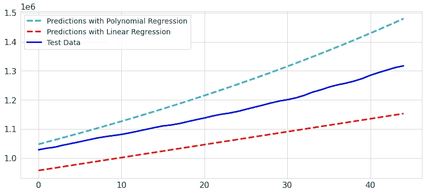

# 实用 ML 第 1 部分:巴西的新冠肺炎

> 原文：<https://medium.com/analytics-vidhya/practical-ml-part-1-covid-19-in-brazil-239977d16f95?source=collection_archive---------22----------------------->

实施机器学习模型来预测巴西的新冠肺炎死亡人数

詹姆斯·亚雷马在 [Unsplash](https://unsplash.com/s/photos/covid-brazil?utm_source=unsplash&utm_medium=referral&utm_content=creditCopyText) 上的照片

这是一系列初学者项目中实现机器学习模型的第一篇文章。动机是在参加了[斯坦福的机器学习](https://www.coursera.org/learn/machine-learning)课程后，获得一些实践经验。

新冠肺炎数据是将数据分析和机器学习概念付诸实践的良好数据源，因为我们有大量可用的数据。这有利于机器学习模型的实现。

本研究中使用的数据可从 [kaggle](https://www.kaggle.com/sudalairajkumar/novel-corona-virus-2019-dataset) 获得。我将在这篇文章中描述的解决方案的代码可以在[这里](https://www.kaggle.com/marianaalm/covid-predict-br)找到。

主数据集是文件夹上的 **covid_19_data.csv** 文件。该文件不断更新，并将在本研究的数据分析部分予以考虑。在这项研究中，数据集的数据点一直更新到 2020 年 11 月 15 日。

# **1 —读取数据并检查世界案例的状态**

了解数据集:

这是一个具有 8 列和 156，292 行的数据集:

数据集最初有 8 列:

*   Sno —序列号
*   观察日期—观察的日期，以年/月/日为单位
*   省/州—观察的省或州
*   国家/地区—观察国
*   上次更新时间—以 UTC 表示的给定省份或国家/地区的行更新时间。(未标准化，因此请在使用前清洁)
*   已确认——截至该日期的累计已确认病例数
*   死亡——截至该日期的累计死亡人数
*   已恢复—截至该日期已恢复案例的累计数量

此时另一个重要的信息是活动案例。这可以简单地通过从该日期的确诊病例中减去死亡和康复病例来计算:

可视化数据集上最后注册日期的状态:

因此，截至 2020 年 11 月 15 日，全球共有 54，370，186 例新冠肺炎病例，其中 64.3%痊愈，33.3%活跃，2.42%死亡。

# **2 —为巴西案例创建新的数据框架**

当我们保存包含此新信息的原始文件时，活动案例列已经位于此新数据框中。现在我们有一个 9 列 4964 行的数据集。

在数据集上登记的最后一天，巴西新冠肺炎病例的状态为:

与世界病例相比，新冠肺炎的死亡率略高:2.83%。

# **3 —巴西数据的 EDA**

在实现机器学习模型之前，进行探索性的数据分析来清理数据。

**变量类型**

必须将 ObservationDate 列转换为 datetime，以便我们可以直观地看到随时间的演变:

**重复值**

检查重复的行:

**空值**

“省/州”列中有 85 行的值为空。检查数据集中存在的所有状态:

这是一种不容易替换的数据，因为这与收集数据的位置有关。由于存在“未知”类别，NAN 值将被替换为“未知”:

**各月确诊病例变化**

为此，我在数据框中创建了一个新列，其中包含按月收集的信息(最初是按观察日期收集的)。

为了正确绘制信息，数据框按日期排序。该图如下所示:

**按观测日期演化**

相同的观察日期有不同的数据点，因此，为了按观察日期创建可视化，首先我们需要按观察日期对数据进行分组:

下图显示了按观察日期划分的确诊病例、死亡病例、活动病例和痊愈病例的演变情况:

# **4 —巴西新冠肺炎死亡预测模型**

为了实现机器学习模型来预测巴西的死亡病例，考虑了一个新的数据集:**time _ series _ covid _ 19 _ deaths . CSV**。对于这种情况，这是一个有用的数据集，因为它只有模型实现所需的数据。

在该文件中，死亡病例在各栏中告知，每栏对应一个观察日期。

**为模型准备数据**

对于我们的机器学习模型，从 0 到 4 的列具有不必要的数据，因此将只选择从 5 到最后一列的列:

下一步是创建矩阵 X(输入变量)和 y(我想要预测的)。在这种情况下， **y** 将是包含死亡人数的矩阵，而 **X** 将存储日期。

这些矩阵是通过将原始数据转换为 numpy 数组生成的，如下所示:

最后，创建了一个预测矩阵来预测未来 15 天的死亡病例。在这种情况下，这意味着对 11 月下半月的预测，因为该研究中考虑的数据集具有截至 2020 年 11 月 15 日的信息。

**分列模型测试**

使用 scikit-learn，15%的数据集将被分离为测试数据，其余将是用于训练模型的训练数据。

**线性回归**

对具有连续变量的模型进行回归的最简单方法是线性回归。它会将数据拟合成一条直线(下面所示的等式)。

线性回归是多项式回归的一种特殊情况，将在下一节中介绍。

实施该模型:

检查绘图上的预测:

**多项式回归**

当数据之间存在复杂关系时，多项式回归模型可能是最佳拟合。应该注意，这仍然是一个线性回归，但允许 X(因变量)和 Y(自变量)之间存在非线性关系。本研究考虑了四阶多项式，如下式所示:

实施该模型:

检查模型的结果:

**指标评估**

线性回归模型的误差:

多项式线性回归模型的错误:

MAE ( *平均绝对误差*)测量一组预测中误差的平均幅度。

在 RMSE ( *均方根误差*)误差是平方平均值。在这种情况下，更大的权重被分配给更大的误差。这意味着，例如，50 个单位的误差比 5 个单位的误差受到的惩罚更大。

多项式线性回归证明是更好的拟合，因为 MAE 和 RMSE 低于线性回归的值。我们应该注意到，线性回归低估了巴西新冠肺炎的死亡率。另一方面，多项式线性回归高估了预测。在处理重大健康问题时，应非常小心地使用此类分析。

**利用多项式回归模型绘制预测图**

由于多项式回归得到了更好的拟合，我们来看看死亡病例预测图:

在这种情况下，低估数据是不好的，因为这类研究可以用来定义遏制疫情的公共政策。另一方面，高估可能会在人群中引发恐慌。因此，除了显示带有估计值的图表之外，澄清所做的考虑和模型的可能弱点也很重要。

尤其是来自巴西的数据，应该注意到我们的通知延迟了很长时间，因为开始时没有足够的人接受检测。此外，后来的死亡报告也有所延迟。由于我们仅考虑与死亡人数和日期相关的数据，这可能会导致精度下降。

此外，可以考虑其他技术来改进预测，例如在模型中包括更多相关特征。这将增加模型的复杂性，并可能需要一些特征工程处理，例如一个热编码(如果新特征是分类变量)和缩放(如果新数据集包含数值范围相差太大的变量)。