# 实用 ML 第 2 部分:亚马逊 Alexa 评论的 NLP

> 原文：<https://medium.com/analytics-vidhya/practical-ml-part-2-nlp-on-amazon-alexa-reviews-4b0b3a15f4bf?source=collection_archive---------10----------------------->

使用 NLP 技术评估客户评论的项目


这是我将实现机器学习模型以将通过参加机器学习课程获得的知识付诸实践的系列文章的第二篇。你可以在这里找到这个系列的第一篇文章。

这篇文章中显示的研究数据集可以在这个[链接](https://www.kaggle.com/sid321axn/amazon-alexa-reviews)上找到。这份分析的完整笔记可以在[这里](https://www.kaggle.com/marianaalm/nlpfromamazonalexa)找到。

# 1 —了解数据

正在加载数据集:

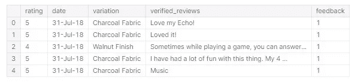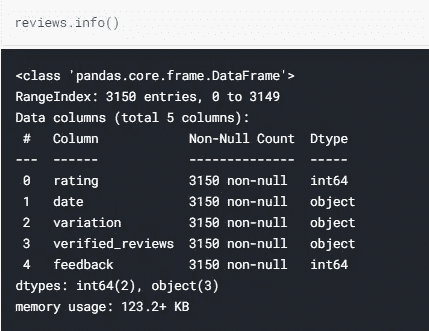

在 3150 条评论中，我们要考虑 5 个变量。

*   客户在点评上给出的**评分**，是 1 到 5 之间的整数。
*   评审的**日期**，一个将被进一步转换成 datetime 的对象。
*   **产品的变化**，这是区别产品型号的特征。
*   评论的全文(**核实评论**)。

大多数评论都是正面的，包括:

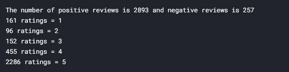

整个数据集的统计数据:

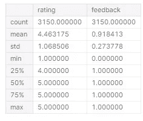

正面评价数据集的统计数据:

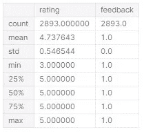

负面评论数据集的统计数据:

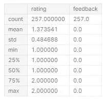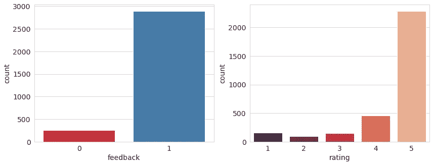

从这一初步分析中，我们可以推断:

*   从 3 到 5 的评级被分类为正面评价，从 1 到 2 的评级被分类为负面评价
*   亚马逊 Alexa 总体上有非常好的评论，被归类为积极的 91.8%(2893 条评论)。
*   评论中普遍存在等于 5 的评级。

# **2 —分析评论中的文本**

角色越多，我们就有越多的词来进行情感分析。一般来说，越长的评论越准确，因为顾客详细解释了他给出的评级。因此，检查评论在我们的数据集中有多长时间是很重要的。

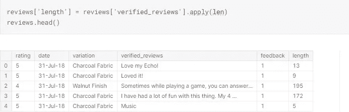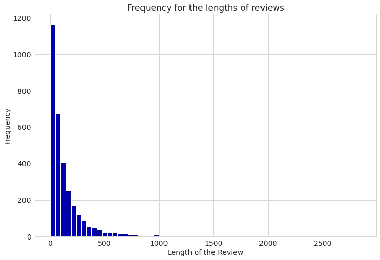

将数据集分成两部分，一部分是正面评价(反馈=1)，另一部分是负面评价(反馈= 0)，我们得到以下统计数据，现在是长度信息:

正面评价数据集的统计数据:

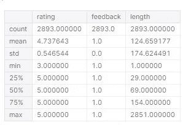

负面评论数据集的统计数据:

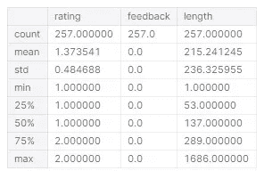

我们可以得出结论:

*   大多数评论都在 300 字左右。
*   最短的评论有 1 个字符，最长的评论有 2851 个字符。
*   平均而言，评论长度为 132 个字符。
*   如果评审是正面的或负面的，那么平均来说，评审的长度是不同的。正面评论平均长度为 124 个字符，负面评论平均长度为 215 个字符。
*   我们可以得出结论，平均来说，对产品不满意的人倾向于写更长的评论。

正面评价更容易写，因为你只能说‘这是一款很棒的产品’，并给出很高的评价。写负面评价时，这个人可能想要解释他或她对产品不满意的原因，这需要一个较长的文本。

**产品的变化会影响评论中给出的评级吗？**

该产品在该数据集中有 16 种变体:

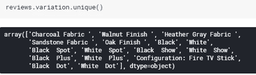

在柱状图中绘制评分的变化，我们可以检查产品的变化是否会影响评论:

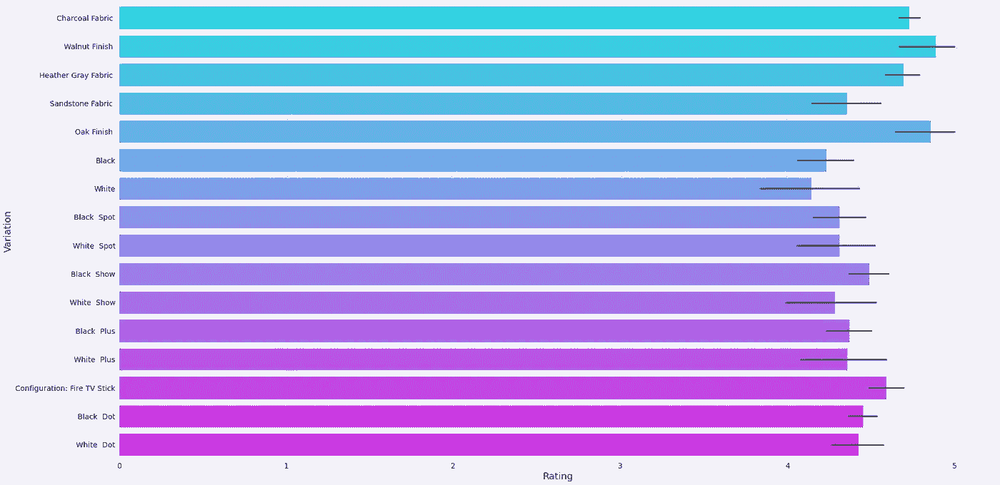

所有变化的平均评分都高于 4 分，因此我们可以得出结论，变化不会影响客户对产品的满意度。

# 3 —转换数据和清理

**检查待处理数据的大小**

将评论中的所有句子连接到一个单独的对象中，我们得到一个包含 419，105 个字符的结果对象。

从这些字符中:

*   363，531 个字符在正面评论中(86.7%)
*   55，573 个角色在负面评论中(13.3%)


清理数据前的 Wordcloud

在单词云中，数据集中最重要的单词(即出现频率较高的单词)以较大的字符表示，与它们在数据中的频率成比例。这是一种应该小心使用的快速可视化技术。单词云不应该是 NLP 研究的唯一结果，而是可视化信息的一种方式。

**清洗和转换数据集**

我们的分析将考虑评论中的词和反馈分类(正面-1 或负面-0)。其他栏将被删除(日期、评分和评论长度)。生成的数据帧如下:

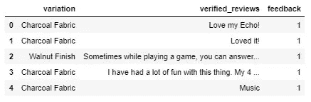

对于机器学习模型，必须处理“变化”列。使用一个热编码，我们有以下 numpy 数组:

```
X_cat = reviews[['variation']]
onehotencoder = OneHotEncoder()
X_cat = onehotencoder.fit_transform(X_cat).toarray()X_cat.shape(3150, 16)
```

因此，我们有一个包含 16 列(产品的不同变体)和 3150 行的 X 矩阵。

接下来的步骤是将 X 矩阵转换为数据框，并将其与仅包含已验证评论的原始数据集连接起来:

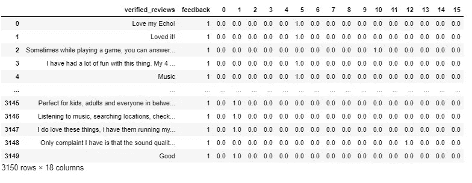

**处理已验证的评论栏**

为了清理和准备用于机器学习模型的经验证的评论数据，采取了三个步骤:

*   删除标点符号
*   去掉停止字如*是*、*是、* *什么* …
*   标记化，这意味着将文本内容分解成各个部分，这些部分可以是单词、字符或子单词。

删除标点符号是一个明确的要求，因为计算机理解字符，而标点符号不是执行情感分析的有用信息。

停用词也是不必要的信息，因为它们不表达任何情感。删除停用词也可以缩短处理时间。

标记化是 NLP 中的一个重要步骤，在这个步骤中，数据被转换以供处理。

要实现上述过程，必须导入一些库:

*   字符串，用于删除标点符号。

```
import string string.punctuation'!"#$%&\'()*+,-./:;<=>?@[\\]^_`{|}~'
```

*   Scikit-learn 的计数矢量器，用于标记数据。

```
from sklearn.feature_extraction.text import CountVectorizer
```

*   NLTK 用于删除停用词。

```
import nltk
from nltk.corpus import stopwordsprint(stopwords.words('english'))['i', 'me', 'my', 'myself', 'we', 'our', 'ours', 'ourselves', 'you', "you're", "you've", "you'll", "you'd", 'your', 'yours', 'yourself', 'yourselves', 'he', 'him', 'his', 'himself', 'she', "she's", 'her', 'hers', 'herself', 'it', "it's", 'its', 'itself', 'they', 'them', 'their', 'theirs', 'themselves', 'what', 'which', 'who', 'whom', 'this', 'that', "that'll", 'these', 'those', 'am', 'is', 'are', 'was', 'were', 'be', 'been', 'being', 'have', 'has', 'had', 'having', 'do', 'does', 'did', 'doing', 'a', 'an', 'the', 'and', 'but', 'if', 'or', 'because', 'as', 'until', 'while', 'of', 'at', 'by', 'for', 'with', 'about', 'against', 'between', 'into', 'through', 'during', 'before', 'after', 'above', 'below', 'to', 'from', 'up', 'down', 'in', 'out', 'on', 'off', 'over', 'under', 'again', 'further', 'then', 'once', 'here', 'there', 'when', 'where', 'why', 'how', 'all', 'any', 'both', 'each', 'few', 'more', 'most', 'other', 'some', 'such', 'no', 'nor', 'not', 'only', 'own', 'same', 'so', 'than', 'too', 'very', 's', 't', 'can', 'will', 'just', 'don', "don't", 'should', "should've", 'now', 'd', 'll', 'm', 'o', 're', 've', 'y', 'ain', 'aren', "aren't", 'couldn', "couldn't", 'didn', "didn't", 'doesn', "doesn't", 'hadn', "hadn't", 'hasn', "hasn't", 'haven', "haven't", 'isn', "isn't", 'ma', 'mightn', "mightn't", 'mustn', "mustn't", 'needn', "needn't", 'shan', "shan't", 'shouldn', "shouldn't", 'wasn', "wasn't", 'weren', "weren't", 'won', "won't", 'wouldn', "wouldn't"]
```

创建一个函数来实现一次删除标点符号和停用词:

```
def cleaning(message):
  text = [char for char **in** message if char **not** **in** string.punctuation]
  text = ''.join(text)
  text = [word for word **in** text.split() if word.lower() **not** **in** stopwords.words('english')]
  return textreviews_clean = reviews['verified_reviews'].apply(cleaning)
```

为了完成这部分过程，数据将被标记化:

```
vectorizer = CountVectorizer(analyzer=cleaning)reviews_countvectorizer = vectorizer.fit_transform(reviews['verified_reviews'])reviews_countvectorizer.shape(3150, 5211)
```

reviews_countvectorizer 包含标记化后的数据，具有以下维度:3150 行和 5211 列。这些列中的每一列都是从数据中提取的令牌。

# 4 —为机器学习准备模型

现在，可以删除原始数据集中的“已验证的评论”列，从而得到一个具有 3150 行和 17 列(产品的 16 个变体和反馈列)的数据框:

```
reviews.drop(['verified_reviews'], axis = 1, inplace=True)
```

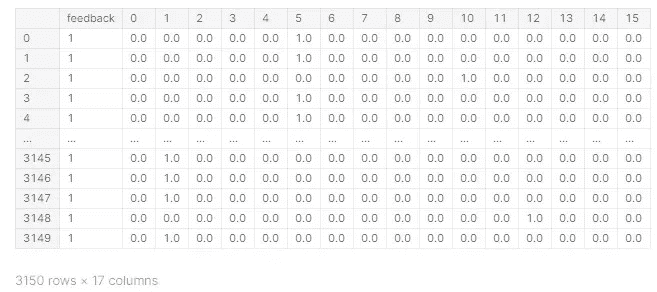

count_vectorizer 对象也被转换成一个 dataframe，有 3150 行和 5211 列

```
reviews2 = pd.DataFrame(reviews_countvectorizer.toarray())
reviews2
```

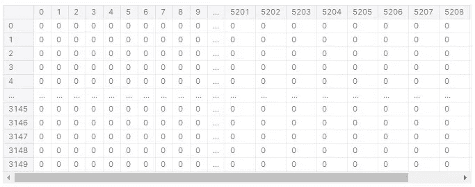

在我们的模型中，输入(X 矩阵)将是令牌(reviews2 数据集)，输出(y 矩阵，我们想要预测的内容)将是仅包含反馈列的原始数据集:

```
X = reviews2y = reviews['feedback']
```

# 5 —训练和评估模型

**训练模型**

逻辑回归将用于预测来自审查的反馈。在训练之前，我们必须将数据分成测试集和训练集:

```
X_train, X_test, y_train, y_test = train_test_split(X, y, test_size = 0.2)
```

最终尝试中考虑的测试规模为 20%。第一次尝试考虑 15%的分割，但 20%的结果更好。

现在，对训练数据实施逻辑回归:

```
logistic = LogisticRegression()
logistic.fit(X_train, y_train)
```

**评估模型**

为了进行评估，导入了一些 scikit-learn 模块:

*   分类报告，显示模型的精度、召回率、f1 值和支持度。
*   准确性分数，给出正确预测的数量占模型做出的所有预测的比率。
*   混淆矩阵，用于说明模型的准确性，显示每个标签的正确和错误预测。

```
accuracy_score(y_test, y_pred)0.946031746031746
```

该模型的准确率几乎达到 95%，这是一个很好的总体结果。现在，分析分类报告:

```
print(classification_report(y_test, y_pred))precision    recall  f1-score   support

           0       0.89      0.33      0.48        48
           1       0.95      1.00      0.97       582

    accuracy                           0.95       630
   macro avg       0.92      0.66      0.73       630
weighted avg       0.94      0.95      0.93       630
```

显示的每个信息具有以下含义:

*   **精度** —相关结果的百分比。
*   **召回** —被模型正确分类的相关结果总数的百分比。
*   **f1-得分** —准确率和召回率的加权平均值。
*   **支持度** —训练集中该类的观测值个数

该模型在识别负面评论方面有困难——我们可以从类别 0 的召回结果中看到:只有 33%的寄存器被正确估计。我们必须记住，我们正在处理一个非常不平衡的数据集——大多数评论都是积极的评论。

应考虑对此模型进行进一步分析。可以考虑一些处理不平衡数据集的技术。这将在关于这个项目的后续文章中讨论。