# 实用 ML 第 3 部分:用 Pytorch 预测乳腺癌

> 原文：<https://medium.com/analytics-vidhya/practical-ml-part-3-predicting-breast-cancer-with-pytorch-efc469242bfe?source=collection_archive---------4----------------------->

用神经网络构建分类器预测乳腺癌


在 [Unsplash](https://unsplash.com/s/photos/breast-cancer?utm_source=unsplash&utm_medium=referral&utm_content=creditCopyText) 上由[angula Harry](https://unsplash.com/@ang10ze?utm_source=unsplash&utm_medium=referral&utm_content=creditCopyText)拍摄的照片

# 1-数据集

有 30 个特征被监测以检测乳腺癌。加载数据集以了解一些关于这些变量的信息:

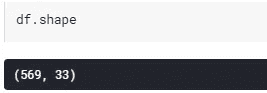

数据帧的尺寸

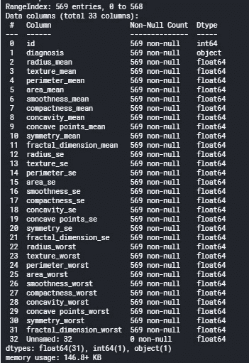

变量及其类型列表

在检查重复数据和空数据并确认数据集没有这些数据后，就该检查不必要的数据了。从数据集的 33 列中，删除了“id”和“未命名:32”:

```
df.drop(['id','Unnamed: 32'],axis=1,inplace=True)
```

为了完成第一部分，我们来了解一下统计数据。描述():

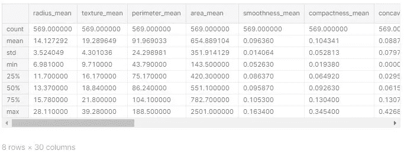

变量的统计数据

# 2 —可视化

检查恶性和良性肿瘤的计数:

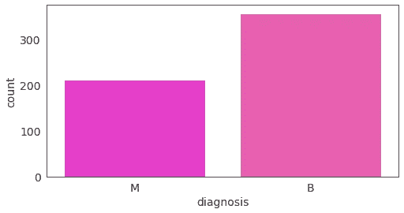

诊断良性肿瘤 357 例，恶性肿瘤 212 例。这似乎是一个相当平衡的数据集。

现在可视化其他变量的分布:

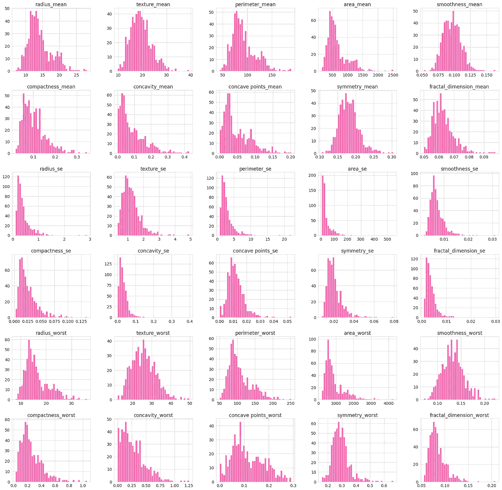

每个变量的分布

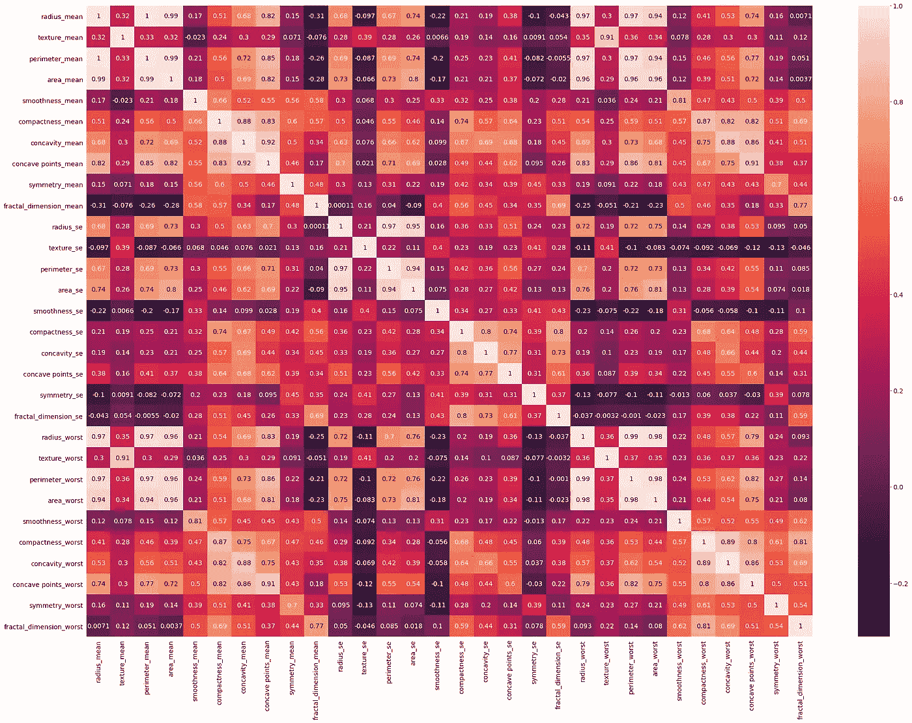

变量之间的相关性

从这个初步我们可以得到以下的见解:

*   这是一个非常复杂的模型，能够可视化的相关性。
*   肿瘤的平均半径为 14.12，最小的为 6.98，最大的为 28.11。
*   与尺寸相关的变量是正相关的(例如 area_se 和 perimeter_se)，因为一个变量依赖于另一个变量。
*   数据集中 62.7%的肿瘤是良性的，37.3%是恶性的。

# 3-为机器学习准备数据

**换标签**

我们要预测的值在“诊断”列中—这些是标签。我们想要预测肿瘤是恶性的(“M”)还是良性的(“B”)。数据框中的所有其他列都是模型的预测值:

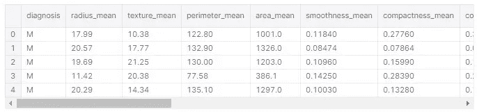

标签用字母 M(恶性)和 B(良性)表示。第一步是将该信息转换成数字类型的数据，0 表示良性，1 表示恶性:

```
lab ={'B':0,'M':1}
df = df.replace({'diagnosis':lab})
df.head()
```

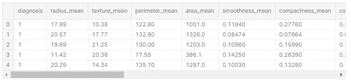

现在，数据可以分成两个子集:

*   **预测值** —我们将提供的信息作为模型的输入，以进行预测

```
predictors = df.iloc[:, 2:31]
predictors
```

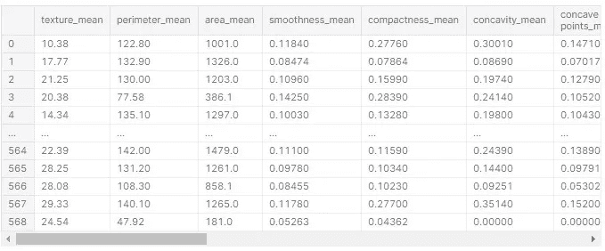

*   **标签** —我们想要预测的信息，即给定预测数据集中的信息，肿瘤是恶性的还是良性的。

```
labels = df.iloc[:, 0:1]
labels
```

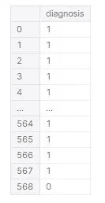

**转换为张量并将数据分成训练和测试子集**

使用 scikit learn，数据集被分成训练和测试数据，比例为 20%:

```
predictors_train, predictors_test, labels_train, labels_test = train_test_split(predictors,labels,test_size = 0.20)
```

到目前为止，数据存储在熊猫的数据框中。由于我们将使用张量流实现深度学习模型，因此必须将数据转换为张量。首先，将 pandas 数据帧转换成数组:

```
type(np.array(predictors_train))
```

Out[20]:

```
type(np.array(labels_train))
```

Out[21]:

```
numpy.ndarray
```

该模型将使用 PyTorch 实现，因此下一步是将数组转换为 Torch 元素:

```
predictors_train = torch.tensor(np.array(predictors_train), dtype=torch.float)labels_train = torch.tensor(np.array(labels_train), dtype = torch.float)df_tf = torch.utils.data.TensorDataset(predictors_train, labels_train)
type(df_tf)
```

Pytorch 小批量训练模型。有一个名为 DataLoader 的类来对数据集执行迭代。batch_size 参数给出了调整模型权重时考虑的样本数量:

```
train_loader = torch.utils.data.DataLoader(df_tf, batch_size=15, shuffle=True)
```

# 4 —实施和评估模型

在这个项目中，将实现一个具有两个隐藏层的神经网络。要实现这样的模型，我们需要以下内容:

*   模型的结构(定义层数、神经元、激活函数)；
*   选择一个训练标准；
*   选择一个优化器。

由于问题的复杂性和未知性，这种类型的实现被建模为优化问题。因此，选择优化器是这个过程的一部分。

在优化问题中，我们有目标函数(称为成本函数或损失函数)。这就是我们要优化的功能。在神经网络中，目标是最小化误差，因此最小化损失(或成本)函数。

**构建模型**

神经网络模型定义如下:

```
classifier = nn.Sequential(

    nn.Linear(in_features=29, out_features=15),
    nn.ReLU(),
    nn.Linear(15, 15),
    nn.ReLU(),
    nn.Linear(15, 1),
    nn.Sigmoid()
)
```

*   输入要素= 29(预测数据集中有 29 个要素)。
*   2 个隐藏层，每层 15 个神经元
*   具有一个神经元的输出层，具有输出标签 0(良性肿瘤)和 1(恶性肿瘤)
*   **ReLu** ，内层的非线性激活函数
*   **Sigmoid** ，输出层的非线性激活函数，返回 0 到 1 之间的概率

ReLu(整流线性单元)是一种非线性激活函数，具有不同时激活所有神经元的优点。在第一次尝试中，选择 ReLu 来建立在计算成本方面更有效的模型。

据报道，Sigmoid 在分类问题上表现良好。因为我们有一个将肿瘤分类为良性或恶性的输出层，所以选择 sigmoid 作为激活函数。

**训练标准**

现在，我们必须选择神经网络的训练标准。由于这是一个二元分类任务，因此选择了二元交叉熵标准:

```
criterion = nn.BCELoss()
```

**优化器**

第三，也是最后一步是选择优化器。Adam 优化算法是深度学习问题中非常流行的选择。这是随机梯度下降算法的扩展，但不同于 SGD 算法，Adam optimizer 在训练期间不保持相同的学习速率。

```
optimizer = torch.optim.Adam(classifier.parameters(), lr=0.001, weight_decay=0.0001)
```

要阅读关于 Adam 优化器的更多信息，请查看《走向数据科学》中的这篇文章。

**训练模型**

更新的权重运行 100 次，如下面的 for 循环所示:

```
for epoch **in** range(100):
  #To store the error:
  run_loss = 0.

  for data **in** train_loader:
    inputs, labels = data
    optimizer.zero_grad()

    outputs = classifier(inputs)     error = criterion(outputs, labels)
    error.backward()
    optimizer.step() 

    run_loss += error.item()
  print('Epoch **%3d**: loss **%.5f**' % (epoch+1, run_loss/len(train_loader)))
```

*   训练加载器分批加载训练数据(记住为该模型选择的批量大小是 15 个样本)。
*   **zero_grad()** 在反向传播过程之前将梯度设置为零。
*   **输出**计算模型的预测值。
*   **误差**计算误差，将预测值与实际数据进行比较。
*   **error.backward()** 是神经网络中更新权重的反向传播过程。
*   **optimizer.step()** 更新权重。

**评估模型**

该模型的准确率为 94.73%。在混乱矩阵中形象化这一点:

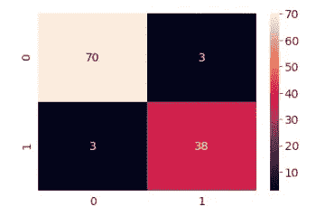

分类器总共进行了 114 次预测，其中:

*   70 个样本被正确地估计为良性肿瘤。
*   38 个样本被正确地估计为恶性肿瘤。
*   有 3 个样本被估计为假阴性，这些样本本应被分类为恶性肿瘤，但被分类为良性。
*   3 个样本被估计为假阳性。

这是深度学习的第一步。下一步是研究这个模型并使用交叉验证。