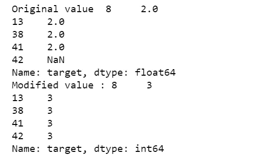

# 熊猫入门实用指南

> 原文：<https://medium.com/analytics-vidhya/practical-pandas-part-2-9ebacf682678?source=collection_archive---------6----------------------->

## 这是一个为那些开始使用这个最重要的数据分析库的人提供的学习熊猫关键技能的教程。


T 这是学习熊猫图书馆实际应用系列的第二篇文章，不要被太多的细节所淹没。这是为那些不熟悉熊猫并想学习如何快速执行最常见的数据分析任务的人准备的。因此，这一系列将涵盖启动你的熊猫学习所需的细节，而不是回顾熊猫可以做的一切。

Jupyter 笔记本可以从 GitHub 访问，也可以在本教程的末尾找到。我鼓励您下载笔记本，然后运行脚本。

本教程涵盖

1.  选择行和列
2.  更改数据帧的值
3.  追加数据帧
4.  处理重复
5.  处理缺失值
6.  更改列类型

# 快速回顾上一节课

在 [**上一期教程**](/@gangulym23/practical-pandas-50586fe90cf8) 中，我们已经介绍了基本的数据操作，如读、写、添加新列、重新编码现有列和删除列。下面是 jupyter 笔记本的 [**github 链接**](https://github.com/maddyg/Practical-Pandas-Learning/blob/master/Practical%20Pandas%20-%20Part%201.ipynb) 。还发布在下面:

# 创建数据集

首先，让我们为本教程创建数据集，这与上一教程中使用的`iris`数据集相同。

```
***# import libraries***
import pandas as pd
from sklearn import datasets***#creating the dataset for this tutorial***
iris = datasets.load_iris()
print(“Iris data shape :”, iris[‘data’].shape)
df=pd.DataFrame(iris.data,columns=iris.feature_names)
df[‘target’]=iris[‘target’]***# Use map to recode column***
species_mapping=
{
0:iris[‘target_names’][0],
1:iris[‘target_names’][1],
2:iris[‘target_names’][2]
}
print(‘Checking species mapping: ‘)
print(species_mapping)
print(‘\n’)df[‘Species’] = df[‘target’].map(species_mapping)
print(“Checking if Species is created : “)
print(df.head())
print(‘\n’)***#show few records***
print(df.head())
```

瞧啊。我们的数据集有 150 行和 4 列。


# 从数据框中选择行和列

我们执行的最常见的数据任务之一是通过选择一组行或列或两者的组合来选择数据子集。除非我们知道幕后发生了什么，否则这对熊猫来说可能有点棘手(而且令人沮丧)。让我们看看如何在熊猫身上完成这些任务。

## 。iloc 和。通信线路（LinesofCommunication）

。iloc 和。loc 是索引器，用于在 pandas 中选择行和列。 **iloc 可用于通过数字**和**选择行或列。loc 可用于选择带有行标签或布尔掩码的行**。注意，上面创建的数据帧具有作为行标签的行号，当没有列被指定为 pandas 数据帧的行标签时，这是默认的行索引。让我们用一些例子来学习。

```
**# select 1st row using .iloc** print("\n")
print("Select row 1 using iloc (returns series) :")
df.iloc[0]
```


这就是我们如何通过使用**获得数据帧的第一行。iloc** 。请注意，这将返回一个 series 对象，而不是 dataframe，这通常不是我们所需要的。让我们看看如何得到一个数据帧。

```
**# select 1st row using .iloc**
print(“\n”)
print(“Select row 1 using iloc (returns dataframe) :”)
df.iloc[[0],:]
```


现在，这将第一行作为 dataframe 返回。这同样适用于选择列，当您需要数据框架时，请使用双括号。

> **代码**

```
**#select 1st column using loc** print(“\n”)
print(“Select 1 column using .loc (returns series) :”)
df.loc[:,’sepal length (cm)’]
```

> **输出**


> **代码**

```
**#select 1st column using iloc**
print("\n")
print("Select column 1 using using iloc (returns dataframe) :")
df.iloc[:,[0]]
```

> **输出**


> **代码**

```
**#select 1st column using iloc** print("\n")
print("Select column 1 using using iloc (returns dataframe) :")
df.iloc[:,[0]]
```

> **输出**


我们还可以使用. iloc 选择多行和多列。

```
***#select multiple rows using iloc***
df.iloc[0:5] #returns a dataframe
df.iloc[0:5,:] #returns a dataframe***#select multiple columns using iloc***
df.iloc[:,0:3] #returns a dataframe***#select rows and columns with iloc***
df.iloc[0:5,0] #returns a series
df.iloc[0:5,[0]] #returns a dataframe
df.iloc[0:5,0:3] #returns a dataframe
```

现在，让我们看看如何使用**进行同样的操作。锁定**。

> **代码**

```
**#select 1st row using loc** print(“\n”)
print(“Select 1 row using loc (returns series) :”)
df.loc[0] 
df.loc[0,:]
```

> **输出**


> **代号**

```
**#select 1st row using loc** print(“\n”)
print(“Select 1 row using loc (returns dataframe) :”)
df.loc[[0],:] # returns a dataframe, not specifying colunms returns all columns
```

> **输出**


> 密码

```
**# select 1st column using loc** print(“\n”)
print(“Select 1 column using loc (returns series) :”)
df.loc[:,’sepal length (cm)’]
```

> 输出


> **代码**

```
**# select 1st column using loc** print(“\n”)
print(“Select 1 column using loc (returns dataframe) :”)
df.loc[:,[‘sepal length (cm)’]]
```

> **输出**


我们也可以用. loc 选择多个行和列。

```
***#select multiple rows using loc*** df.loc[0:5,:] # returns a dataframe***#select multiple columns using loc*** df.loc[:,[‘sepal length (cm)’,’sepal width (cm)’]] ***#select rows and columns with loc*** df.loc[0:5,[‘sepal length (cm)’]] 
df.loc[0:5,[‘sepal length (cm)’,’sepal width (cm)’]] 
```

接下来，我们最常用的选择是条件选择，对于这些我们需要使用. loc。

> **代码**

```
**#select rows with conditions using loc** bool_mask = df[‘sepal length (cm)’]>4 
df.loc[bool_mask]
```

> **输出**


请注意使用数字选择带有 iloc 和 loc 的行时的区别，iloc 的工作方式类似于常规的 python 索引，而 loc 则不同。

> **代码**

```
**#Note the difference****#loc returns all rows 0 to 5 with matching labels** *print(".loc")
print(df.loc[0:5,[‘target’]])***#iloc returns rows 0 to 4, just like regular python indexing in lists, tuples, dictionaries** *print(".iloc")
print(df.iloc[0:5,[4]])*
```

> **输出**


# 。Isin()

当您需要检查一行或多列中的特定值时,`isin()`函数非常方便。一种方法是纠正多个`==`条件，但这可能会非常繁琐。下面我们来看一个例子。

> 密码

```
**# select all rows where species is “setosa” or “versicolor”** df_new=df.loc[df[‘Species’].isin([‘setosa’,’versicolor’]),:]
print(df_new.Species.unique())
```

> 输出


我们已经成功地过滤了物种为“setosa”和“versicolor”的所有行。类似地，我们也可以对物种是**而不是**“setosa”或“versicolor”的所有行使用`isin()`。

> **代码**

```
**# select all rows where species is not “setosa” and “versicolor”** df_new=df.loc[~df[‘Species’].isin([‘setosa’,’versicolor’]),:]
print(df_new.Species.unique())
```

> **输出**

# 修改数据帧

## 视图和副本

现在我们已经很好地理解了如何使用 loc 和 iloc，让我们继续了解如何修改数据帧或通过修改现有数据帧来创建新数据帧。为了理解这一点，我们需要了解熊猫的视图和拷贝。到目前为止，我们一直在创建数据帧的视图，这只是数据帧的子集，当修改数据帧时，我们需要小心我们是在修改视图还是原始数据帧。让我们看看下面的例子。


图片由 https://www.dataquest.io/blog/settingwithcopywarning/[提供](https://www.dataquest.io/blog/settingwithcopywarning/)

让我们试着用下面的脚本修改我们的数据帧。

> **代码**

```
**#we want to modify row 5 value for column "target"** df_copy=df**# print rows where sepal length<=4.5 and column target**
print(“Original value : “,df_copy[df_copy[‘sepal length (cm)’]<=4.5][[‘target’]])**# lets modify this value**
df_copy[df_copy[‘sepal length (cm)’]<=4.5][[‘target’]]=2**# lets check if the value has changed**
print(“Modified value : “,df_copy[df_copy[‘sepal length (cm)’]<=4.5][[‘target’]])
```

> **输出**


值没有变！我们收到了熊猫的警告。


SettingWithCopyWarning

我们得到`SettingWithCopyWarning`,因为 pandas 不确定是原始数据帧被修改了还是视图被修改了。我们可以看到萼片长度< = 4.5 的目标列没有改变。这个警告是熊猫让我们知道事情可能不像预期的那样发展的一种方式。我们可以通过使用。loc 或。iloc 和不使用链接。


图片提供—[https://www.dataquest.io/blog/settingwithcopywarning/](https://www.dataquest.io/blog/settingwithcopywarning/)

接下来，让我们看看如何消除这个警告。

> **代码**

```
**#print rows where sepal length<=4.5 and column target** print("Original value : ",df_copy.loc[df_copy['sepal length (cm)']<=4.5,['target']])**#lets modify this value** df_copy.loc[df_copy['sepal length (cm)']<=4.5,['target']]=2**#lets check if the value has changed** print("Modified value : ",df_copy.loc[df_copy['sepal length (cm)']<=4.5,['target']])
```

> **输出**


瞧啊。现在值已经变了。当修改数据帧时，我们应该避免使用链接`[df_copy['sepal length (cm)']<=4.5][['target']]]`,而使用。loc 或. iloc.现在，我们试着用. loc 修改 dataframe。

> **代号**

```
df_copy = df**#create a copy of dataframe**
df_copy_sub= df_copy.loc[df_copy[‘sepal length (cm)’]<=4.5,:]**#original value**
print(“Original value “, df_copy_sub[‘target’])**#lets modify this value**
df_copy_sub[‘target’]=3**#lets check if the value has changed**
print(“Modified value :”,df_copy_sub[‘target’])
```

> **输出**



虽然我们已经使用了. loc，但是`SettingWithCopyWarning`警告再次出现。这是因为 df_copy 不是 df 的副本，所以当我们试图修改 df_copy 时，pandas 再次被混淆。为了避免这种情况，最好使用`df_copy=df.copy()`而不是`df_copy=df`。

```
df_copy=df.copy()
# save the dataframe
df_copy_sub= df_copy.loc[df_copy['sepal length (cm)']<=4.5,:].copy()***#check original value*** print(df_copy_sub['target'])***#lets modify this value*** df_copy_sub['target']=3***#lets check if the value has changed*** print(df_copy_sub['target']) #it get changed
```

最后，我们摆脱了讨厌的`SettingWithCopyWarning`。

## 追加数据帧

在处理数据时，在列或行上追加 2 个数据帧是很常见的，pandas 提供了一种简单的方法来通过`concat`函数实现这一点。

## 使用选项`axis=1`可将数据帧附加到列上

> **代码**

```
**#lets create a copy of existing data frame** df_1= df.copy()
df_2= df.copy()**#lets append by column** df_append_bycol= pd.concat([df_1,df_2],axis=1)
**#another way to append by column** df_append_bycol= pd.concat([df_1,df_2],axis=”columns”)print(“Original Dataframe — “,df.shape) 
print(“Appended Dataframe — “,df_append_bycol.shape)
```

> **输出**


所得到的附加数据帧的列数是我们简单地将数据帧附加到自身的列数的两倍。接下来，让我们看看当两个数据帧没有相同的维度时，如何在列上追加数据帧。

## 行数不相等

检查当两个数据帧的行数不相等时会发生什么。在下面的例子中，第一个数据帧只有 6 行，而第二个数据帧有 150 行。串接的数据帧在第 6 行之后的所有行中的前 5 列(来自第一个数据帧)中具有 NaN 值。

> **代码**

```
df_1= df.loc[0:5,:].copy() # df_1 has only 6 rows
df_2= df.copy()**#lets append by column** df_append_bycol= pd.concat([df_1,df_2],axis=1)
print(“Original Dataframe — “,df.shape) 
print(“Appended Dataframe — “,df_append_bycol.shape)**#notice the first 5 columns are NaN from row 7 onwards** print("Concatenated Dataframe")
print(df_append_bycol.head(20))
```

> **输出**


## 不同的行索引

检查当两个数据帧具有不同的行索引时会发生什么。在下面的示例中，第一个数据帧的行索引为 5 到 10，而第二个数据帧的行索引为 0 到 149。除了第 5 到 10 行之外，连接的数据帧在所有行的前 5 列中具有 NaN 值(来自第一个数据帧)。正在发生的是`concat`函数合并了行索引上的两个数据帧，所以当连接数据帧时，我们也需要留意行索引。如果您不关心索引，这可以通过重置 dataframe 的索引来更改。

> **代码**

```
df_1= df.loc[5:10,:].copy() # df_1 has only 6 to 10 from original dataframe
df_2= df.copy()**#lets append by column** df_append_bycol= pd.concat([df_1,df_2],axis=1)
print(“Original Dataframe — “,df.shape) 
print(“Appended Dataframe — “,df_append_bycol.shape)**#notice the first 5 columns are not NaN only for rows 5 to 10** print("Concatenated Dataframe")
print(df_append_bycol.head(20))
```

> **输出**


> **代码**

```
**#reset index** df_1= df.loc[5:10,:].copy().reset_index(drop=True) 
df_2= df.copy()**#lets append by column** df_append_bycol= pd.concat([df_1,df_2],axis=1)print(“Original Dataframe — “,df.shape)
print(“Appended Dataframe — “,df_append_bycol.shape)
print(“\n”)**#notice the first 5 columns are not NaN for rows 5 to 10** print(“Concatenated Dataframe with reset index”)
print(df_append_bycol.head(20))
```

> **输出**


## 使用选项`axis=0`可将数据帧附加到行上

当按行追加数据帧时，行索引也会被追加并需要重置。此外，2 个数据帧中的列名应该相同，否则熊猫将被视为不同的列。

> **代码**

```
**#lets create a copy of existing data frame “df”** df_1= df.loc[0:5,:].copy()
df_2= df.loc[0:5,:].copy()**#lets append by row** df_append_byrow= pd.concat([df_1,df_2],axis=0) # check the row index
print(“\n”)
print(“Original Dataframe — “,df.shape)
print(“Appended Dataframe — “,df_append_bycol.shape)
print(“\n”)
print(“Concatenated Dataframe without reset index”)
print(df_append_byrow.head(10))
```

> **输出**


> **代码**

```
**#lets append by row and reset index** df_append_byrow= pd.concat([df_1,df_2],axis=0).reset_index(drop=True)print(“\n”)
print(“Original Dataframe — “,df_1.shape)
print(“Appended Dataframe — “,df_append_byrow.shape)
print(“\n”)**#check the row index** print(“Concatenated Dataframe with reset index”)
print(df_append_byrow.head(10))
```

> **输出**


## 列数不相等

检查当两个数据帧的列数不相等时会发生什么。在下面的示例中，第一个数据帧只有 3 列，而第二个数据帧有 5 列。串联数据帧的前 10 行(来自第一个数据帧)的列中有它所缺少的 NaN 值。

有趣的事实！注意，在连接的数据帧中，列的顺序已经改变，`concat`按字母顺序对列重新排序，使用`sort= False`将其关闭。

> **代码**

```
**#lets take a smaller subset to be able to inspect the results** df_1= df.iloc[0:10,0:1].copy() # df_1 has only 6 rows
df_2= df.iloc[0:10,:].copy()print(df_1.head())
print(df_2.head())**#lets append by row** df_append_byrow= pd.concat([df_1,df_2],axis=0,sort=False)print("\n")
print(“Original Dataframe1 — “,df_1.shape)
print(“Original Dataframe2 — “,df_2.shape)print("Appended Dataframe - ",df_append_byrow.shape)
print("\n")
print("Concatenated Dataframe")
print(df_append_byrow.head(20))
```

> **输出**


## 处理重复

在开始对数据进行任何分析之前，寻找重复的行和列并适当地处理它们是基本的数据健全性检查之一。你猜对了，熊猫有一个很棒的功能来做到这一点——T2。使用此功能，我们可以**删除所有重复项**或**保留第一个/最后一个重复项**(按其他列排序后)。当使用`subset`选项搜索重复项时，我们也可以只考虑列的子集。让我们看看这是如何工作的。

```
***#lets first add some duplicate rows to our dataframe*** df_1= df.loc[0:5,:].copy()
df_2= df.loc[0:5,:].copy()
df_hasduplicates=pd.concat(
                [df_1,df_2],axis=0).reset_index(drop=True) 
```

我们有重复记录的数据集已经准备好，这个数据帧应该有每个记录的一个副本。现在，让我们首先删除所有重复的内容。

> **代号**

```
**#drop them all** df_noduplicates= df_hasduplicates.drop_duplicates()
print(“Dataframe without duplicates “,df_noduplicates.shape)
print(df_noduplicates.head(5))
```

> **输出**


我们可以看到数据帧恢复到原始形状，这意味着所有重复数据都已被删除。接下来，我们尝试只删除那些在**目标**列中有重复值的记录。

> **代码**

```
**#let’s check how many duplicate values are there in target column
#we can check using group by function (will be covered in a later article)**
print(“Dataframe with duplicates”)
print(df_hasduplicates[‘target’].value_counts())
print(“\n”)**#drop the rows with duplicate target column**
df_noduplicates= df_hasduplicates.drop_duplicates(subset=[‘target’])
**# let’s check if target column has duplicates now** print(“Dataframe without duplicates “)
print(df_noduplicates[‘target’].value_counts())
print(“\n”)
```

> **输出**


我们可以看到，具有重复值的数据帧有 8 个值为 0 的记录、2 个值为 1 的记录和 2 个值为 2 的记录，没有重复值的数据帧每种类型有 1 个值。

注意，这里 pandas 为目标列的每个值保留第一条记录。接下来，让我们尝试使用选项`keep`来记录最短的萼片长度。

> **代码**

```
**#drop the rows with duplicate target column while keeping the row with lowest sepal length
#first sort by target and petal length** df_hasduplicates.sort_values([‘target’,’sepal length (cm)’],ascending=False,inplace=True)**#drop duplicates** df_noduplicates_2= df_hasduplicates.drop_duplicates(subset=[‘target’],keep=’last’)**#let’s check if target column has duplicates now** print(“Dataframe without duplicates “)
print(df_noduplicates_2[‘target’].value_counts())
print(“\n”)
```

> **输出**


同样，所有重复的值都消失了，如果你这次检查数据框，萼片长度的最小值被保留。对于目标列的第一个和第二个值，最低值碰巧在第一列，因此这两个记录的输出不会改变。


## 处理缺失值

知道如何找到和替换丢失的值是数据分析的关键。在 pandas 中，我们可以用`dropna()`函数过滤掉任何或所有缺失值的行和列。让我们看看熊猫让我们管理缺失的价值观的不同方式。

首先，让我们在数据集中引入一些缺失值。

```
***#import numpy library*** import numpy as np***#lets first introduce some missing values into our dataframe*** df_copy = df.copy()
print(df_copy.shape)***#lets randomly pick some rows and column positions and assign them to NaN*** np.random.seed(200)
row=np.random.randint(0,df_copy.shape[0]-1,10)
col=np.random.randint(0,df_copy.shape[1]-1,1)
print(row,col)
df_copy.iloc[row,col]=np.nan
```

现在我们的数据集有缺失值。让我们看看如何检查数据帧中的缺失值。

> **代号**

```
**# Check how many missing values in total** print(“No. of missing values :”,df_copy.isnull().sum().sum())
print(“\n”)**# Check how many missing values by columns** print(“No. of missing values :”)
print(df_copy.isnull().sum())
```

> **输出**


好了，我们的数据集中有 5 个缺失值，它们都在目标列中。接下来，假设您想要删除所有带有**缺失值的记录。**这就是我们如何使用 **dropna** 函数来实现的。

> ***代码***

```
**#Drop rows with any missing values** df_nonull=df_copy.dropna(how=’any’)
print(df_nonull.isnull().sum())
```

> ***输出***


正如我们所看到的，不再有丢失的值，所有丢失值的行都被删除了。我们也可以删除特定列有缺失值的记录。让我们看看我们如何能做到这一点。

```
**# Drop rows with missing values in sepal length column** df_nonull=df_copy.dropna(subset=[‘sepal length (cm)’],how=’any’)
print(df_nonull.isnull().sum())
```


由于列**萼片长度**开始时没有任何缺失值，因此没有记录从数据帧中删除。对列**目标**进行同样的尝试！

现在，让我们看看如何使用**来过滤数据帧中没有丢失值的列。**函数的全部()。假设您只想保留没有缺失值的列。

> **代码**

```
**#get all columns with no null values** df_nonull=df_copy.loc[:,df_copy.notnull().all()]
print(df_nonull.isnull().sum()) 
print(“Columns with no null values:”, df_nonull.columns.values)
```

> **输出**


我们可以看到这些列没有缺失值。接下来，按照类似的思路，让我们看看如何过滤所有包含非空值的列。

> **代码**

```
**#get all columns with any non-null values** *df_nonull=df_copy.loc[:,df_copy.notnull().any()]
print(df_nonull.isnull().sum()) 
print(“Columns with any non-null values:”, df_nonull.columns.values)*
```

> **输出**


我们可以看到，在这个数据帧中，所有列都有一些非空值。接下来，让我们看看如何获取所有缺少值的列。

**代码**

```
**# get all columns with any non-null values**
df_nonull=df_copy.loc[:,df_copy.isnull().any()]
print(df_nonull.isnull().sum()) 
print(“Columns with any null values:”, df_nonull.columns.values)
```

**输出**


正如所料，“target”是唯一一个包含空值的列。因此，我们在这里看到了一些处理缺失值的方法，但是请注意，这些方法仅涉及如何识别缺失值，估算缺失值的方法将在后面的文章中介绍。

## 更改数据类型

在 pandas 中，最常用的数据类型是整数、浮点、对象、类别和日期时间。我们可以通过使用`.dtypes`函数获得任何数据帧中所有列的数据类型。以不适合分析的格式读取数据(尤其是从 sql 数据库读取时)是很常见的，需要在分析前将其更改为合适的数据类型。为了转换成数字，我们可以使用`astype()`函数或`to_numeric()`函数，这很方便，尤其是当你缺少数值的时候。有些情况下，我们只需要选择某个数据类型的列来执行分析，pandas 有一个非常有用的函数`select_dtypes()`来完成这个任务。让我们用例子来学习。

1.  检查数据帧中的数据类型。

**代号**

```
***#check datatypes in our dataframe*** print(df.dtypes)
```

**输出**


2.选择特定类型的所有列。

**代码**

```
**#lets select all float columns** df_float = df.select_dtypes(include=’float64')
print(df_float.dtypes)
```

**输出**


3.更改列类型，注意转换后“目标”列的数据类型。

**代码**

```
**#lets convert target column to float type** df[‘target’]=df[‘target’].astype(‘float64’)
print(df.dtypes)
```

**输出**


4.存在缺失值时转换数据类型。

Pandas 不允许在转换为整数类型时缺少值，并会抛出错误，所以如果一列有缺少值，那么我们可以转换为浮点型，或者先估算缺少的值，然后再转换为整数。

```
**#lets introduce some missing values in target column** row=np.random.randint(0,df.shape[0],5)
df_copy=df.copy()
df_copy.loc[row,’target’]=np.nan**#check for missing values** print(“Missing values :”,df_copy[‘target’].isnull().sum())**#lets convert target column to int type using astype()** df_copy[‘target’]=df_copy[‘target’].astype(int)**#you get an ERROR !!****#now try this** df_copy[‘target’]=pd.to_numeric(df_copy[‘target’],errors=’coerce’)
print(df_copy.dtypes)**#or this** df_copy[‘target’]=df_copy[‘target’].astype(float)**#no ERROR !!**
```

本教程到此为止。希望你觉得有用，感谢阅读！这是笔记本。