# 实用时间序列——从 ARIMA 到深度学习(上)

> 原文：<https://medium.com/analytics-vidhya/practical-time-series-from-arima-to-deep-learning-part-1-b292b07ec6c3?source=collection_archive---------16----------------------->

今天我们要讲的是时间序列和预测！预测是使用预测模型，根据以前观察到的值和时间序列数据的有意义特征来预测未来值。它可应用于各种行业和使用案例，例如金融、零售、营销，甚至是针对系统故障的异常检测。


这一系列关于时间序列的帖子也将作为我的实用笔记，因为我可以在未来快速地将代码改造成任何特定的用例，我希望它也能以同样的方式帮助你。这篇文章中的代码也将在 [my Github](https://github.com/wyseow/timeseries) 中提供。

# 1.导入库和数据集

我们将在后面讨论单个的库，因为目前还不清楚它们有什么帮助。

```
import pandas as pd 
import matplotlib.pyplot as plt 
import statsmodels.api as sm 
import itertools 
import numpy as np from pmdarima 
import auto_arima from pylab 
import rcParams from statsmodels.tsa.stattools 
import adfuller from random 
import seed, random from statsmodels.graphics 
import tsaplots plt.style.use('fivethirtyeight')
```

我们将使用一个小型数据集，即可以从[这里](https://community.tableau.com/docs/DOC-1236)下载的超市销售数据。

```
df = pd.read_excel('Sample - Superstore.xls')
```

每一行代表一笔销售交易，其中包含非常丰富的信息，如客户人口统计数据和利润。如果我们采用机器学习方法，这些将有助于特征工程。

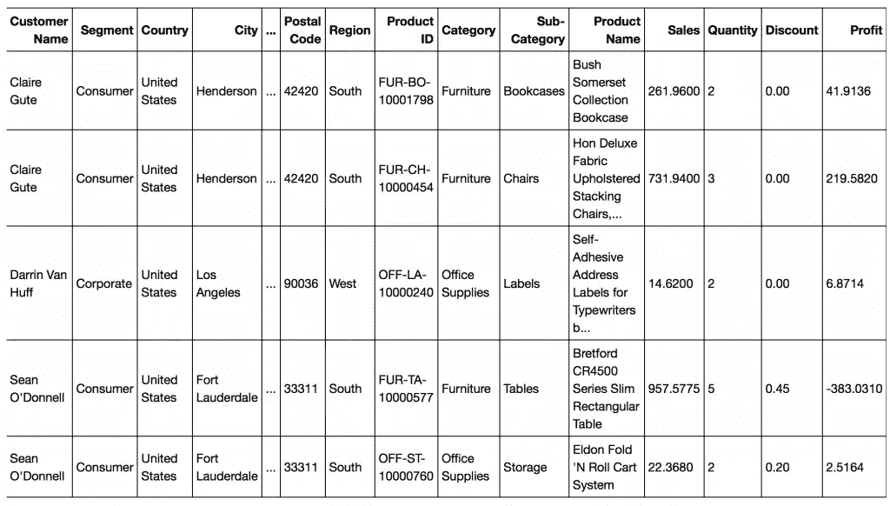

这里有大量不同类别的产品。现在，我们只看“家具”。

```
sales_df = df.loc[df['Category'] == 'Furniture'] sales_df['Order Date'].min(), sales_df['Order Date'].max()
```

(时间戳(' 2014–01–06 00:00:00 ')，时间戳(' 2017–12–30 00:00:00 ')

快速浏览一下时间序列的可用时间段，就会发现我们有 4 年的数据可以使用！

# 2.数据预处理

让我们只使用我们最感兴趣的主要变量:销售，将数据转换为单变量时间序列数据。当我们对单变量时间序列进行建模时，我们是在对单个变量随时间的变化进行建模。

附带的好处是，我们不需要检查和清理所有特性的数据。所以让我们检查这个特定变量的空值。

```
sales_df = sales_df[['Order Date','Sales']] sales_df = sales_df.sort_values('Order Date') sales_df.head()
```

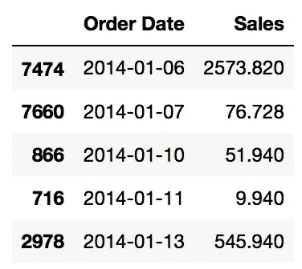

```
sales_df.isnull().sum()Order Date 0 
Sales 0 
dtype: int64
```

我们非常幸运，这是一个干净的数据集；没有空值😂

回想一下，数据集的每一行都是一笔销售交易，因此每一天都会有多笔销售。我们希望将数据汇总成“每日销售额”格式。我们用求和来总结，你也可以用其他的统计数据。

```
#the reset_index is here is to regenerate the index on the grouped panda series sales_df = sales_df.groupby('Order Date')['Sales'].sum().reset_index()
```

# 3.数据争论

我们将把订单日期作为索引，这样向前发展，数据操作会更容易。

```
sales_df = sales_df.set_index('Order Date') sales_df.head()
```

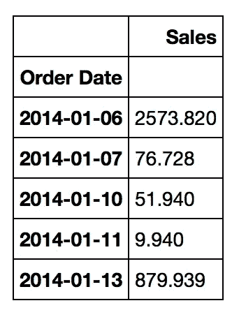

# 3.1 不均匀空间时间序列

请注意，时间序列数据中的第 8、第 9 和第 12 个值缺失。

我们已经遇到了我们的第一个问题，臭名昭著的“不均匀空间时间序列”问题，这是一个在这个领域得到充分研究的问题。

1)如果您的最终输出允许您在月级别进行预测，那么您很幸运:您可以在更高的级别进行重新采样(将天数累计到月数并汇总值)。有一个简单的函数可以快速做到这一点:DataFrame.resample

2)插值数据

**天真的方法:向下采样到月频率**
让我们采用第一种方法，因为我们要预测月销售额。我们后面会讲到时间序列的插值…

```
monthly_sales_df = sales_df.resample('MS').mean() monthly_sales_df.head()
```

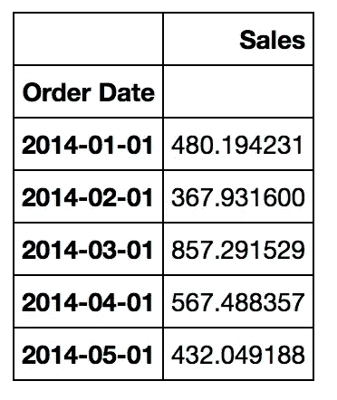

# 4.可视化时间序列

就像我们通常的数据分析工作一样，我们首先在任何建模工作(如果有的话)之前绘制数据，试图识别一些可区分的模式。

```
monthly_sales_df.plot(figsize=(13, 5)) plt.show()
```

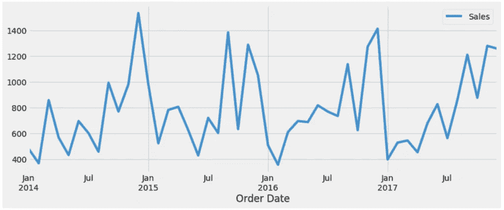

# 4.1 描述模式—季节性

我们在图中观察到的第一个明显的模式是年度季节性(12 个月=一个周期)。销售额在年初相对较低，在年底较高，这种模式每年都在重复。这些年来，销售额也有小幅下降的趋势。

时间序列过程可以分解成几个部分:级别:序列中的平均值。趋势:系列中增加或减少的值。季节性:系列中重复的短期周期。噪声:序列中的随机变化。

我们可以使用 scipy 的 seasonal_decompose 函数自动分解一个时间序列并绘制出来，以便更好地检查每个组件，而不是猜测组件。

请注意，这里有一个模型参数，这意味着时间序列是否是一个加法和乘法模型。区别在于成分是如何组合在一起的。

加法模型= y(t) =水平+趋势+季节性+噪声

乘法模型= y(t) =水平*趋势*季节性*噪声

一个简单的经验法则是:如果你观察到方差随着时间的推移而增加，它很可能是倍增的。

```
rcParams['figure.figsize'] = 18, 8 # note that the freq defaults to freq of dataframe's decomposition = sm.tsa.seasonal_decompose(monthly_sales_df, model='additive') fig = decomposition.plot() 
plt.show()
```

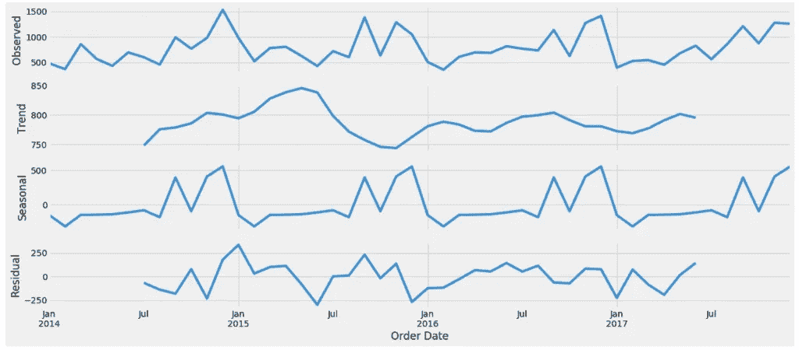

我们可以在季节性成分中更明显地看到年度季节性，趋势正在下降，就像我们观察到的那样。

# 4.2 描述模式—静态

我们也可以将时间序列描述为平稳或非平稳过程。这是时间序列中的一个重要概念，植根于几个时间序列模型的假设中，所以让我们快速看一下。

这个定义可能有点吓人，平稳性有两种形式:弱形式和严格平稳性。

**4.2.1“弱形式”或“协方差”平稳性:**

1)常数μ

2)常数σ

3) Cov(x_n，x_{n+k}) = Cov(x_m，x_{m+k})(相同长度的周期之间的协方差相同。)

**4.2.2“严格的”平稳性:**

严格平稳性更具限制性，因为它要求相同长度的两个周期之间具有相同的分布。实际上，我们经常称弱形式平稳性为严格形式平稳性，因为严格形式平稳性很少被观察到。

**4.2.3 其他可观察到的静止性状:**

1)平稳时间序列中的观测值不依赖于时间。

2)它们没有趋势或季节效应。

**4.2.4 静止的视觉示例**

平稳性的概念可能有点滑，有时候直观地看剧情是有帮助的。为了确定这一点，一个平稳的时间序列可能如下图所示:

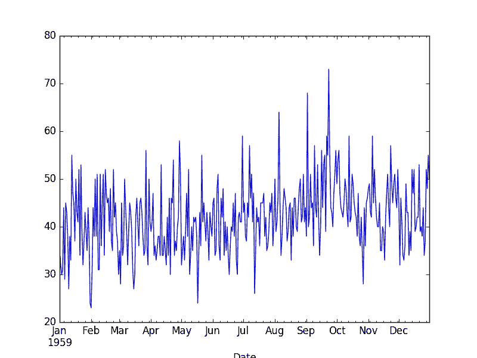

请注意，幅度和平均值不随时间变化。价值不会随着时间的推移而增加(趋势)，价值与时间无关，也没有像我们的商店销售那样的季节性模式。

**4.2.5 我们为什么关心文具？**

1)稳定性；平稳时间序列在一段时间内具有稳定的统计特性。

2)统计建模方法，如 ARIMA(我们将在后面谈到)假设或要求时间序列是平稳的才有效。

3)我们感兴趣的是模拟时间步长之间的相对差异，而不是绝对值。例如:我们希望模型按照一种模式学习上涨或下跌的百分比，而不是在某个时间学习 1，200 的值。

**4.2.6 我们如何使我们的时间序列平稳？**

1.  对数变换或平方根变换是两种流行的选择，特别是在方差随时间变化的情况下。
2.  当我们有时间序列数据显示趋势时，最流行的选择是差分。我们可以用减法求差(积分)

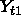

1.  从

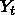

1.  让它保持平稳。回忆一下上面的时间序列图:

```
monthly_sales_df.plot(figsize=(10, 3)) plt.show()
```

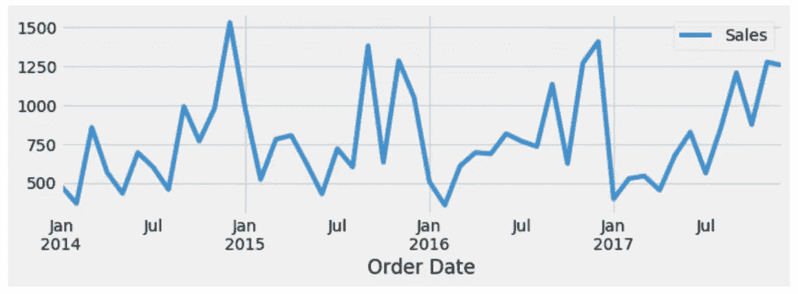

我们可以使用 Panda 的 diff()来快速执行差分。在[20]中:

```
diff_monthly_sales_df = monthly_sales_df.diff() diff_monthly_sales_df.plot(figsize=(10, 3)) plt.show()
```

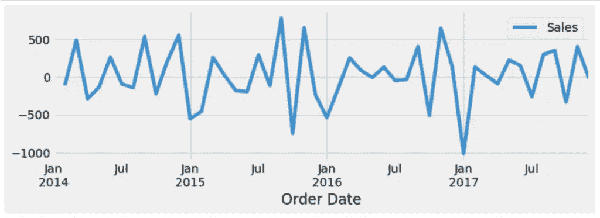

**4.2.7 平稳性测试**

为了检验平稳性，我们可以使用统计检验，即扩展的 Dickey-Fuller(ADF)检验，其中检验的零假设是时间序列不是平稳的(具有一些依赖于时间的结构)。另一个假设是时间序列是平稳的。换句话说，如果你的时间序列确实是平稳的，你应该得到一个 p 值<=0.05 (95% confidence interval, significance level(α) of 0.05) which suggets us to reject the null hypothesis.

Here’s an example using the statsmodels library.

```
adfuller(monthly_sales_df.Sales.values)(-5.19107018733927,
9.168756655665654e-06,
10,
37,
{'1%': -3.6209175221605827,
'5%': -2.9435394610388332,
'10%': -2.6104002410518627},
521.9616303121272)
```

The first line is the test statistic which we could use to compare against certain critical value in the Dicker-Fuller table to determine statistical significant.

Conveniently, it also provide us the critical values of several common levels of significance(1, 5 and 10%), from the DF table.

In this case, we could see that the test statistic is smaller than not just 5% but also all levels of significant. Therefore, we can confidently reject the null hypothesis and **假设这个时间序列是平稳的。**

或者，我们可以在第二行简单地使用与检验统计量相关的 p 值。这非常方便，因为您可以快速与 1%(0.01)、5%(0.05)或 10%(0.10)的置信水平进行比较，以确定统计显著性。

第三行(10)指的是滞后的数量，我们可以说有一些自相关可以追溯到 10 个周期。

最后，第四行(37)简单地表达了观察的数量。

# 4.3 描述模式—白噪声

平稳性的一个相关主题是“白噪声”，这是一种数据不遵循某种模式的时间序列。如果我们不能利用过去的模式来推断未来的模式，那么它是不可预测的！因此，在我们考虑建模之前，最好先检查一下白噪声模式。

我们如何识别白噪音？**这些是定义:**

1)常数μ为 0

2)常数σ

3)无(零)自相关(过去和现在的值之间没有关系)

我们很快会谈到自相关，但它基本上是时间序列和过去版本之间的相关量。

**4.3.1 白噪声的视觉示例**

同样，为了确定这一点，白噪音在图中是这样的。

```
rcParams['figure.figsize'] = 15, 5 random_white_noise = np.random.normal(loc=3, scale=2, size=1000) plt.plot(random_white_noise) plt.title('White noise time series') plt.show()
```

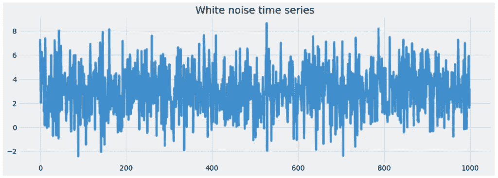

我们可以看到，这些值通常分布在平均值 3 附近(大多数值形成在 3 附近),并且震级大多保持在 2 个单位以内。

最重要的是，它表现得很零散；过去和未来的价值之间没有相关性，所以我们不可能用过去的模式来预测未来的价值。

**4.3.2 我们为什么关心白噪声？**

1)如果你的时间序列是白噪声，**无法建模。**

2)时间序列模型的残差应该是白噪声。这意味着时间序列中的所有信号都被模型利用来进行预测。剩下的只是无法建模的随机波动。

**4.3.3 白噪声与静态噪声**

如果你认为白噪音听起来像刚刚通过的平稳，你是对的！请注意，虽然白噪声时间序列是平稳的，但并不是每个平稳的时间序列都是白噪声。

**4.3.4 建模白噪声**

当我开始学习这些概念时，令我困惑的一件事是平稳性是对特定时间序列建模的先决条件，但如果白噪声也是平稳的，为什么我们不能对白噪声建模？

准确地说，我在想:白噪声=平稳=可以建模？

这是一种思考方式:记住，我们对原始时间序列进行差分，使其平稳。这种差异行为有效地消除/减少了趋势和季节性，试图稳定时间序列的平均值。我们可以多次(顺序)对其进行差分，直到所有的时间相关性都被移除。

如果没有信号留下，订单的数量实际上可以用于建模具有线性趋势和季节性的时间序列。

如果有一些信号留下，它可能仍然基本上是稳定的，剩余的信号可能有一些自相关。然后我们可以继续对这个自相关信号进行建模。

稍后我们将通过一个端到端的例子看到一个更清晰的画面。

# 4.4 描述模式—随机漫步

我们要讨论的最后一个重要的时间序列模式是“随机游走”，这是一种特殊类型的时间序列，其中值往往会随着时间的推移而存在，周期之间的差异只是白噪声(随机)。换句话说，今天的价格等于昨天的价格和一些白噪声的残差

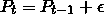

在哪里

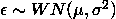

**4.4.1 随机行走的视觉示例**

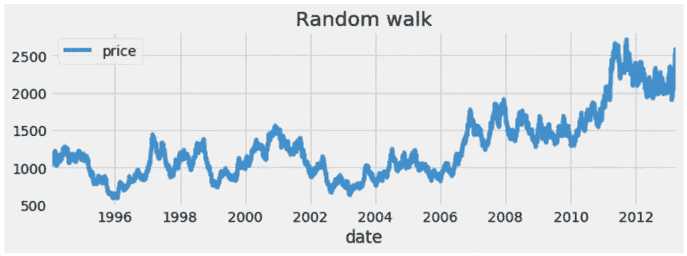

我们可以看到，它与我们刚刚谈到的白噪声非常不同。事实上，它看起来像一系列的股票或指数价格，其中它展示了一些模式。这是因为序列本身不是随机的，尽管差异是随机的。

随机游走源于金融，基于金融理论，即股票市场价格是随机游走，无法预测。然而值得一提的是，这个[的说法是有争议的。](https://en.wikipedia.org/wiki/Random_walk_hypothesis)

回到定义上来:我们肯定可以看到连续时间段之间的微小变化，或者换句话说，P_t 值依赖于 P_t-1

为了避免我在开始学习我们所学的概念时产生的一些困惑，这里有一些不同之处。

**4.4.2 随机行走 vs 静止**

随机游走是一个非平稳过程，因为我们可以看到它极大地违反了平稳的假设。平稳时间序列的值不是时间的函数。另一方面，随机漫步中的观察依赖于时间。

**4.4.3 随机游走 vs 白噪声**

不一样；白噪声就像一个随机数序列。虽然随机游走值可以表现为随机的，但是序列中的下一个值(P_t+1)总是前一个值(P_t)的修改。有一个潜在的过程，从一步到一步产生一些一致性，而不是吐出随机数。这就是为什么随机漫步也被称为“醉鬼漫步”。

**4.4.4 我们为什么关心随机漫步？**

如果你有一个随机游走的时间序列，**那么它就不能被熟练地预测。**这仅仅是因为下一个时间步长是前一个时间步长的函数，并且这种模型提供了简单的预测。我们把这样的模型称为“持久性模型”。

让我们做一个小实验，生成一个随机行走的时间序列，并将数据集分成训练集和测试集。

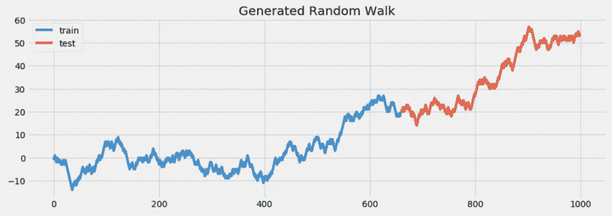

我们使用持久性模型，使用滚动预测方法来预测结果，并计算从测试集中收集的所有预测的 MSE。

```
Persistence MSE: 1.000
```

显然，由于观测值是通过生成-1 或+1 的先前值构建的，因此计算“预测”的 MSE 也将是 1。

但是，如果我们说我们知道过程的方差，然后我们可以在生成值时加入一点方差，会发生什么呢？

```
Persistence MSE: 1.976
```

结果表现更差。如果你不相信的话，我们可以以后用更复杂的模型进行更多的实验。那么，它将走向何方？有两个要点:

1)随机行走的最佳模型/预测器至多是持久性模型。

2)在您使用复杂的时间序列建模技术之前，持久性模型可以是一个基线模型。如果你的最终模型的性能(技能)不能打败一个持久性模型，这也意味着我们最好只把以前的值作为预测。哎哟！

如何处理一个可疑的随机游走时间序列？

假设大部分时间序列都是随机游走的，我们可以**尝试**来模拟一阶差分，而不是原始值。还记得我们在开始建模之前，在平稳部分讨论差分时间序列使其平稳。然而，如果使其稳定仍然显示数据中没有明显的可学习的结构，那么它就不能被预测。

# 5.建模— ARIMA 模型

最后，随着一些重要的概念的方式，我们可以开始看看建模时间序列！

ARIMA 及其变体(ARMA，ARMAX，SARIMA)是几乎所有时间序列文献的经典模型。ARIMA 是一种传统的时间序列模型，用于模拟时间序列的自回归(AR)和移动平均(MA)特性。对于具有季节性的时间序列，就像我们上面讨论的，我们可以使用季节性 ARIMA (SARIMA)来模拟这种过程。让我们看看最简单的 ARMA 模型的构建模块和假设。

# 5.1 自回归(AR)

在时间序列中，过去的值和现在的值之间通常有关系。例如，我们可以根据昨天的销售额，或者 7 天前的销售额，对今天的销售额进行合理的猜测。因此，我们使用**自相关**，它是一个序列本身之间的相关性。


例如，上图说明了当前系列与其滞后版本(t-1，滞后 1)之间的相关性。滞后值的频率可以是几天、几周或几个月。

ARIMA 利用了时间序列的这种 AR 性质并对其建模。我们可以将此描述为一个线性模型，它依赖于过去周期值的总和乘以一个常数(系数)来预测当前周期值。

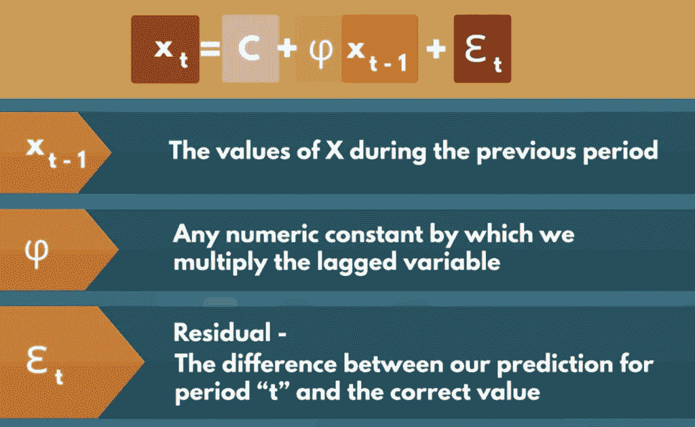

很可能我们在 ARIMA 模型中使用的滞后值越多，它就能模拟更复杂的关系和相互作用。因此，我们不仅经常使用滞后值 1: AR(1)，而且还使用更进一步的滞后值:AR(2)，AR(3)，等等。

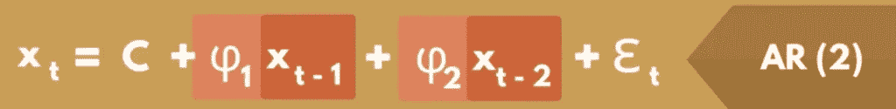

然而，当我们包括更多的系数时，它们中的一些更有可能是不重要的(不同于零)，就像任何机器学习或神经网络模型一样，更多的参数可能会导致过度拟合。

**自相关函数**

我们可以想象，同时计算不同滞后的自相关非常有用:

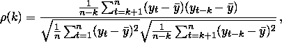

顶部实质上是原始数据和 k 单位滞后数据之间的协方差。底部是原始数据集偏差的平方和。

这是 ACF 背后的主要思想。我们可以手动计算，也可以简单地使用 statsmodels 库中的 plot_acf()函数。

```
rcParams['figure.figsize'] = 8, 3 tsaplots.plot_acf(monthly_sales_df.Sales.values, zero=True) plt.plot()
```

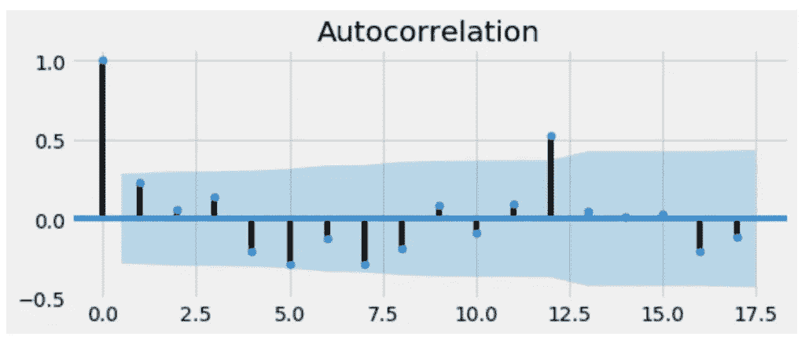

显然，我们可以看到时间序列与其滞后值 0(滞后=0，基本上是其本身)具有最高的相关性。更有趣的是，我们可以在滞后 12 秒时看到显著的相关性。这很有道理，也很好地表明了季节性；这个月的销售额与 12 个月前高度相关。

ACF 和密切相关的 PACF 图是传统时间序列分析中根深蒂固的概念，它们可以在正式课堂上教授半天，所以我们现在跳过这个…

# 5.2 移动平均线(MA)

AR 模型有一个问题:因为现值依赖于过去的值，所以无法可靠地预测价值的不可预测的突然增加(冲击)。一个想法是引入一个额外的分量(MA ),它考虑了过去的残差，以自动校正并对预测进行调整。数学上，它看起来像这样:

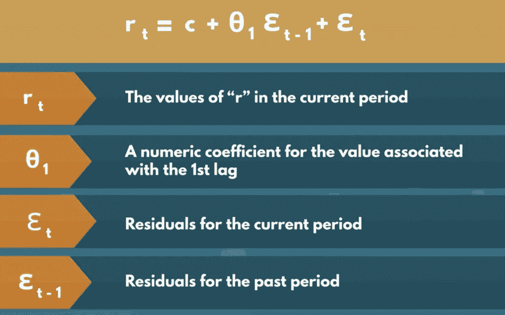

同样的一组成分(AR 和 MA)也可以应用于季节性，只是增加了一项。

# 5.3 整合(一)

这是指我们需要积分(差分)时间序列的次数，以确保 ARIMA 假设的平稳性。

回想一下，如果您手头有一个非平稳的时间序列，我们可以通过差分将时间序列转换为平稳的过程，以便它符合假设。

在金融学中，一种常见的方法是简单地使用回报率，即两个连续时期的价值之间的变化百分比，而不是价格。在 pandas 中，我们可以简单地使用“pct_change()”函数来完成。

**符号**

我们经常用 p、d、q 参数来表示 ARIMA 模型，这些参数分别指 AR、I 和 MA 的阶数。接下来，我们将使用这种符号。

所有这些概念听起来可能很抽象，但在我们开始将时间序列与 ARIMA 模型相适应后，这些概念就变得有意义了。在我们开始建模之前，我们必须触及的最后一件事是，我们应该如何着手评估模型。

# 6.模型选择和数据泄漏

虽然模型选择策略类似于一般建模，即您将数据集分为训练和验证/测试，并在训练中拟合模型，同时根据其验证分割的性能选择模型，但时间序列则更为复杂。

这是因为我们需要确保我们没有把未来的信息泄露给过去。这可能在普通的预处理技术(如指数平滑)中悄悄发生。在处理时间序列时，使用通常的方法(来自 Scikit-Learn 的 train_test_split)将数据随机分成训练集和测试集是错误的。例如，这将导致利用 2015 年的数据对 2014 年进行预测。

一个简单的解决方案是将时间序列数据分成 2 个日期范围窗口。例如，我们可以使用 2014 年 1 月到 2016 年 12 月的时间序列进行训练，使用 2017 年的时间序列进行验证。

如果您非常喜欢交叉验证(CV)方法，您可以向前滚动培训、验证和测试窗口，一次利用所有数据:

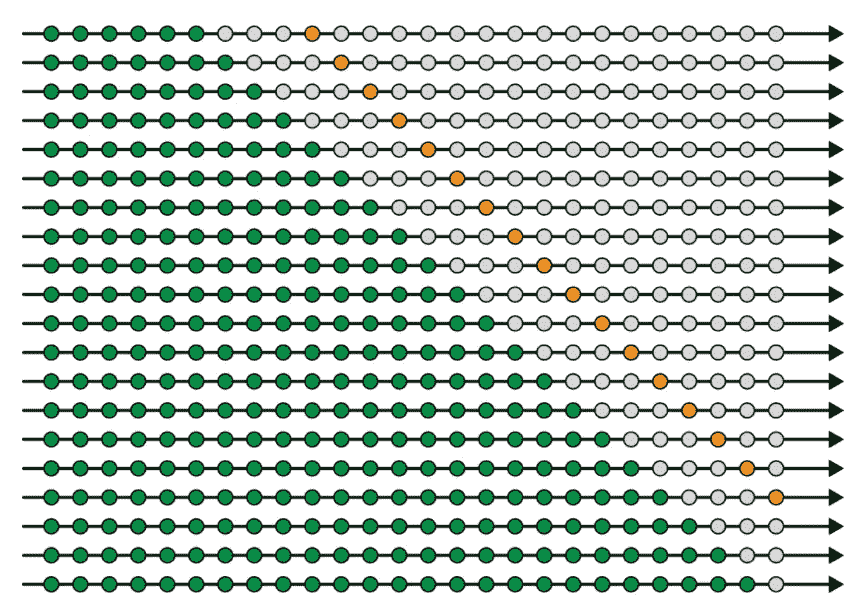

或者，您也可以移动培训窗口，而不是将其展开，如下所示:

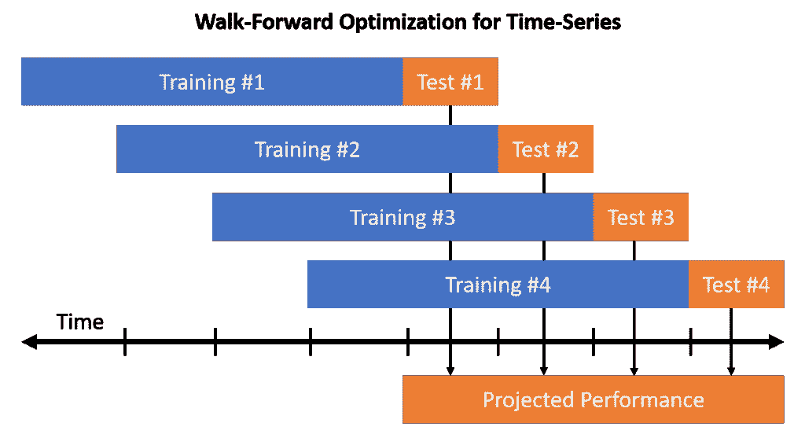

为简单起见，我们将使用本笔记本中的简单解决方案来拆分数据。

# 7.高效拟合 ARIMA 模型

传统的方法是依次增加系数，查看系数的统计显著性，比较对数似然，当模型未能改善时停止增加。一种更有效的方法是使用 **AutoARIMA** 或几个嵌套循环(**网格搜索**)来找到最佳的参数集，为我们的模型产生最佳的 Akaike 信息标准(AIC)。

模型的 AIC 等于 AIC = 2k-2lnL 其中 k 是模型的参数个数，L 是该函数的最大似然值。通常，我们希望降低模型的复杂性(即降低 k ),同时增加模型的似然性/拟合优度(即 L)。因此，我们更喜欢 AIC 值较小的模型，而不是 AIC 值较大的模型。

```
p = d = q = range(0, 3) pdq = list(itertools.product(p, d, q)) seasonal_pdq = [(x[0], x[1], x[2], 12) for x in list(itertools.product(p, d, q))]
```

还记得我们拥有 4 年的数据吗？我们可以将其中的前 3 年作为“训练数据”，后 1 年作为“验证集”。

```
train_monthly_sales_df = monthly_sales_df[:-12] valid_monthly_sales_df = monthly_sales_df[-12:] #Just to make sure there's no data leakage... train_monthly_sales_df.tail(3) valid_monthly_sales_df.head(3)
```

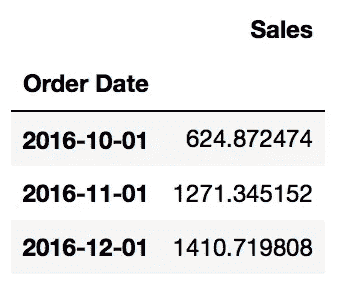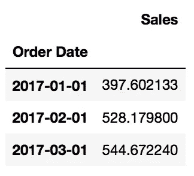

# 7.1 网格搜索

使用良好的循环运行 GridSearch。

```
bestAIC = np.inf
bestModel = None
for param in pdq:
    print('param:',param)
    try:
        mod = sm.tsa.statespace.SARIMAX(train_monthly_sales_df,
                                        order=param,
                                        enforce_stationarity=False,
                                        enforce_invertibility=False,
                                       trend='c')
        results = mod.fit()
        print('ARIMA{} - AIC:{}'.format(param, results.aic))
        if results.aic < bestAIC:
            bestAIC = results.aic
            bestModel = results
            print('****BEST****')
    except:
        continue…
param: (0, 2, 0)
ARIMA(0, 2, 0) — AIC:524.1351010222072
param: (0, 2, 1)
ARIMA(0, 2, 1) — AIC:478.17920833300695
param: (0, 2, 2)
ARIMA(0, 2, 2) — AIC:457.24955345064654
****BEST****
…bestModel.summary()
```

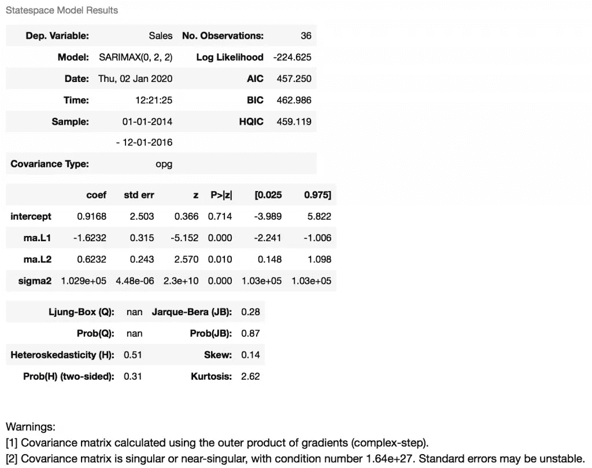

GridSearch 方法揭示了 **ARIMA(0，2，2)** 具有最低的 AIC，因此是最好的模型！

# 7.2 自动 ARIMA

AutoARIMA 是一种逐步搜索 p、d、q 参数的多种组合并选择具有最小 AIC 的最佳模型的方法。最初的包是 R 版本，但幸运的是，现在可以在 pmdarima 库中用 Python 获得它。

auto.arima()函数将在估计前进行差分，以确保估计值的一致性。回归系数和 ARIMA 模型的估计是使用最大似然法同时完成的。

回想一下，ARIMA 假设是平稳的，所以我们将使用这个时间序列，我们已经把我们的时间序列差了 1 阶。第一个值是 NA，所以我们应该从第二个索引开始。

```
auto_model = auto_arima(train_monthly_sales_df,start_p=1, start_q=1,
                      test='adf',       # use adftest to find optimal 'd'
                      max_p=3, max_q=3, # maximum p and q
                      m=1,              # frequency of series
                      d=None,           # let model determine 'd'
                      seasonal=False,   # No Seasonality
                      start_P=0, 
                      D=0, 
                      trace=True,
                      error_action='ignore',  
                      suppress_warnings=True, 
                      stepwise=True)...
Fit ARIMA: order=(2, 2, 0) seasonal_order=(0, 0, 0, 0); AIC=512.450, BIC=518.556, Fit time=0.012 seconds
Fit ARIMA: order=(2, 2, 2) seasonal_order=(0, 0, 0, 0); AIC=505.208, BIC=514.366, Fit time=0.110 seconds
Near non-invertible roots for order (2, 2, 2)(0, 0, 0, 0); setting score to inf (at least one inverse root too close to the border of the unit circle: 1.000)
Total fit time: 0.490 seconds
```

AutoARIMA 确定 ARIMA(0，2，2)模型具有最佳结果，这与我们的网格搜索方法相一致！请注意，系数非常接近，尽管并不精确。

```
auto_model.summary()
```

# 8.验证模型

我们应该绘制模型诊断图，以检查模型是否有效。

```
auto_model.plot_diagnostics(figsize=(14, 8)) plt.show()
```

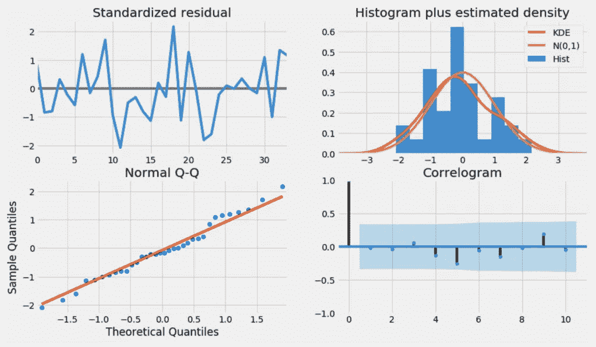

残差接近正态分布(左下角)是一个好迹象。虽然不完美；标准化残差显示，还有一些信号尚未建模。相关图看起来很好；自相关在界限内。

# 9.用 ARIMA 预测

使用最佳模型，让我们尝试预测 1 年期间的值，看看它有多准确。

一些技术提示:我们可以使用 get_prediction()和 get_forecast()函数进行预测。最初让我困惑的一件事是它们之间的区别。注意 get_prediction()和 get_forecast()其实是一样的。后者旨在根据最近可用的数据进行一步样本外预测，或执行多步样本外预测，该预测由“步骤”参数进行参数化。

例如:ts_model.forecast(步骤=12)

predict()更加灵活，您只需提供开始和结束日期，可以跨越样本内和样本外。如果你不提供结束日期，它只会做一个样本内预测。

例如:ts _ model . get _ prediction(start = PD . to _ datetime(' 2014–01–01 ')，end = PD . to _ datetime(' 2017–12–01 ')，dynamic=False)

# 9.1 生成预测

```
#autoarima
auto_oos_forecasts, auto_oos_forecasts_ci = auto_model.predict(n_periods = 12, return_conf_int=True)
#turn it into series so that we could plot easily...
auto_oos_forecasts = pd.Series(auto_oos_forecasts, index=valid_monthly_sales_df.index)#gridsearch
#in-sample forecasts
is_forecasts = bestModel.get_prediction(start=pd.to_datetime('2014-01-01'),dynamic=False)
#out-of-sample forecasts
oos_forecasts = bestModel.get_prediction(start=pd.to_datetime('2017-01-01'), end=pd.to_datetime('2017-12-01'),dynamic=False)#forecasted values stored in is_forecasts.predicted_mean
#conf_int contains the confidence intervals
is_forecasts_ci = is_forecasts.conf_int()
oos_forecasts_ci = oos_forecasts.conf_int()
```

# 9.2 可视化预测

最后，我们可以看到模型的预测值与实际观察值之间的差异。由于模型也提供了 95%的预测区间，我们也将它们包含在图中，以便更好地了解上限值和下限值。为了严谨起见，我们将显示通过 GridSearch 方法和 AutoARIMA 选择的两个模型的预测。

```
ax = monthly_sales_df.plot(label='observed')
is_forecasts.predicted_mean.plot(ax=ax, label='In-sample forecast(GridSearch)', alpha=.7, figsize=(14, 7))
oos_forecasts.predicted_mean.plot(ax=ax, label='Out-of-sample forecast(GridSearch)', alpha=.7, figsize=(14, 7))
auto_oos_forecasts.plot(ax=ax, label='Out-of-sample forecast(AutoARIMA)', alpha=.7, figsize=(14, 7))
ax.fill_between(is_forecasts_ci.index,
               is_forecasts_ci.iloc[:, 0],
               is_forecasts_ci.iloc[:, 1], color='k', alpha=.2)
ax.fill_between(oos_forecasts_ci.index,
               oos_forecasts_ci.iloc[:, 0],
               oos_forecasts_ci.iloc[:, 1], color='k', alpha=.2)
ax.set_xlabel('Date')
ax.set_ylabel('Sales')
plt.title('Sales Predictions vs Actual')
plt.legend()
plt.show()
```

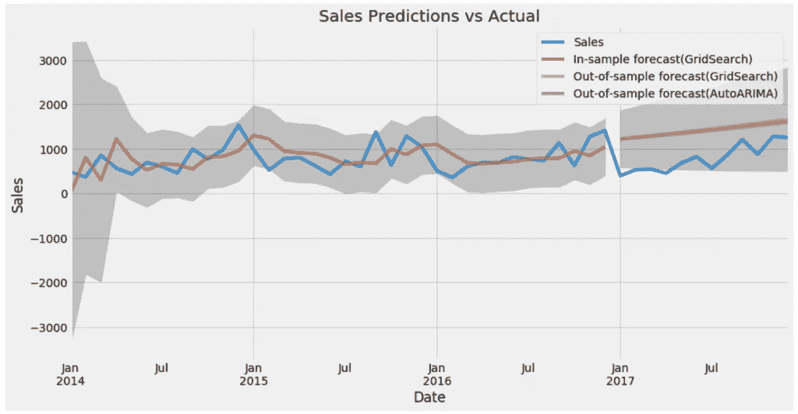

我们有一些观察结果:

1)模型产生了相当不错的样本内预测(显然),但样本外预测看起来像一条恒定的线，尽管它大体上在正确的方向上。

2)随着预测的深入，预测区间增大，表现出不确定性。每个时间步的预测都有一些变化，这些变化是作为步数的函数累积的。

# 9.3 定量评估

评估准确性和比较模型的定量方法是使用 RMSE 和 MSE 等度量，这些度量基本上衡量实际值和预测值之间的差异。

```
y_forecasted = oos_forecasts.predicted_mean
y_truth = monthly_sales_df['2017-01-01':]
mse = ((y_forecasted - y_truth.iloc[:,0]) ** 2).mean()
print('The Mean Squared Error of our forecasts is {}'.format(round(mse, 2)))
print('The Root Mean Squared Error of our forecasts is {}'.format(round(np.sqrt(mse), 2)))The Mean Squared Error of our forecasts is 454280.48
The Root Mean Squared Error of our forecasts is 674.0
```

它告诉我们，我们的模型能够在实际销售额的 674.0 范围内预测测试集中的平均日销售额。由于我们每天的销售额从大约 400 英镑到超过 1200 英镑不等，误差的方差相当高，如果没有模型，我们甚至可以做得更好。

# 10.季节性——萨里玛

请注意，我们上面的图没有利用我们之前发现的季节模式。事实证明，我们可以在 ARIMA 模型中加入季节(S)成分，通过对季节周期重复相同的 AR、MA、I 成分，我们称之为 **SARIMA** 。

例如，我们想要捕获前一个节日期间(12 个月前)，我们可以包括添加一个 phi(ϕ参数和一个保存该值的季节术语，或者甚至是前两个期间(24)。这实际上非常类似于一个月前的原始 ar 术语。

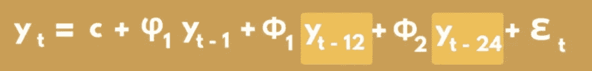

同时，我们还添加了一个额外的括号，其中包含了用符号表示的季节性订单:SARIMA(p，D，q)(P，D，Q，s)

季节性 AR、I、MA 顺序用大写字母表示,“s”表示周期的长度。如果 s=1，意味着没有季节性。假设时间序列的频率是每月一次，我们可以用 s=12 来表示每年的季节性。

例如，如果我们有:萨里玛(1，0，2)(2，0，1，12)

含义:忽略第一个括号，第二个括号中的前三个订单只是 ARIMA 订单的季节性变化。我们包括 12 和 24 个周期之前的滞后值。直觉上，我们对每个“s”值都感兴趣。

从形式上看，它是这样的:

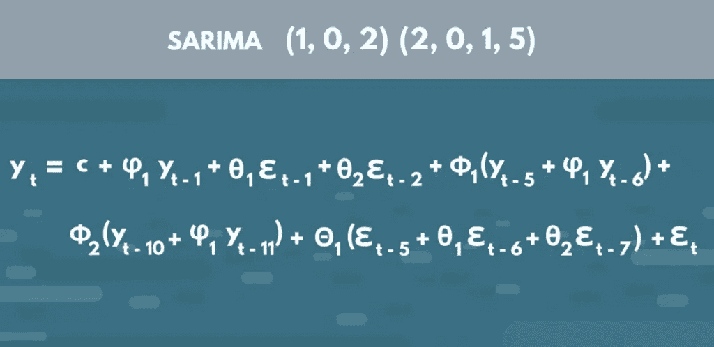

# 10.1 自动季节性

我们使用与上面相同的方法，除了一些参数变化来激活季节性参数空间中的搜索。

```
auto_sea_model = auto_arima(train_monthly_sales_df, start_p=1, start_q=1,
                      test='adf',       # use adftest to find optimal 'd'
                      max_p=3, max_q=3, # maximum p and q
                      m=12,              # frequency of series
                      d=None,           # let model determine 'd'
                      seasonal=True,   # No Seasonality
                      start_P=0, 
                      D=None, 
                      trace=True,
                      error_action='ignore',  
                      suppress_warnings=True, 
                      stepwise=True)auto_sea_model.summary()
```

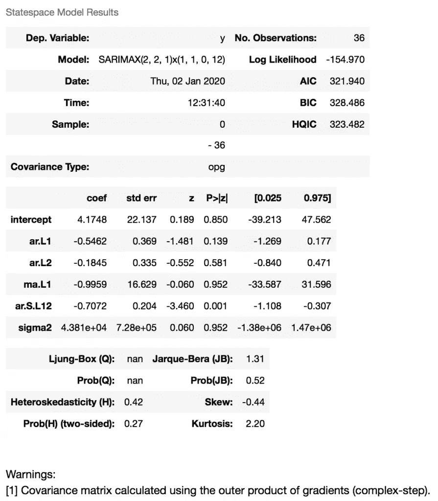

```
#autoarima
#technical note: the predict() for autoarima lib is different from statsmodel's arima
auto_sea_is_forecasts, auto_sea_is_forecasts_ci = auto_sea_model.predict_in_sample(return_conf_int=True)
auto_sea_is_forecasts = pd.Series(auto_sea_is_forecasts, index=train_monthly_sales_df.index)
auto_sea_is_forecasts_ci = pd.DataFrame(auto_sea_is_forecasts_ci,index=train_monthly_sales_df.index)auto_sea_oos_forecasts, auto_sea_oos_forecasts_ci = auto_sea_model.predict(n_periods = 12, return_conf_int=True)
#turn it into series so that we could plot easily...
auto_sea_oos_forecasts = pd.Series(auto_sea_oos_forecasts, index=valid_monthly_sales_df.index)
auto_sea_oos_forecasts_ci = pd.DataFrame(auto_sea_oos_forecasts_ci,index=valid_monthly_sales_df.index)
```

# 10.2 可视化预测

```
ax = monthly_sales_df.plot(label='observed')
auto_sea_is_forecasts.plot(ax=ax, label='In-sample forecast(AutoARIMA-Seasonal)', alpha=.7, figsize=(14, 7))
auto_sea_oos_forecasts.plot(ax=ax, label='Out-of-sample forecast(AutoARIMA-Seasonal)', alpha=.7, figsize=(14, 7))
ax.fill_between(auto_sea_is_forecasts_ci.index,
               auto_sea_is_forecasts_ci.iloc[:, 0],
               auto_sea_is_forecasts_ci.iloc[:, 1], color='k', alpha=.2)
ax.fill_between(auto_sea_oos_forecasts_ci.index,
               auto_sea_oos_forecasts_ci.iloc[:, 0],
               auto_sea_oos_forecasts_ci.iloc[:, 1], color='k', alpha=.2)
ax.set_xlabel('Date')
ax.set_ylabel('Sales')
plt.title('Sales Predictions vs Actual')
plt.legend()
plt.show()
```

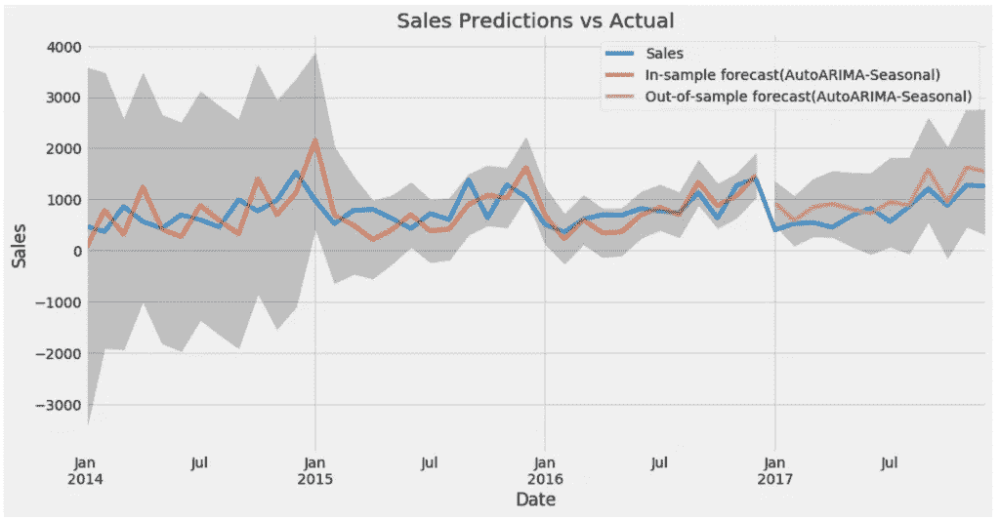

与之前的尝试相比，季节模型很好地捕捉了季节性，包括样本内和样本外预测。

# 10.3 定量评估

```
y_forecasted = auto_sea_oos_forecasts.values
y_truth = monthly_sales_df['2017-01-01':]
mse = ((y_forecasted - y_truth.iloc[:,0]) ** 2).mean()
print('The Mean Squared Error of our forecasts is {}'.format(round(mse, 2)))
print('The Root Mean Squared Error of our forecasts is {}'.format(round(np.sqrt(mse), 2)))The Mean Squared Error of our forecasts is 89577.16 
The Root Mean Squared Error of our forecasts is 299.29
```

RMSE 从 674.0 降到了 299.29！

我们经历了一个分析和拟合 SARIMA 模型的端到端过程。在下一篇文章中，我们将着眼于使用机器学习模型进行时间序列预测，看看我们是否能得到更好的结果。此外，我们还将讨论一些实际挑战，例如更高频率的预测(每天一次或每天一次)。

我已经删除了一些代码和乳胶由于格式化；看完整代码[这里@ Github](https://github.com/wyseow/timeseries) 或者[我的博客 post@DataGeeko.com](http://datageeko.com/time-series-from-arima-to-deep-learning-part-1/)。感谢您的阅读。

*原载于*[*http://datageeko.com*](http://datageeko.com/time-series-from-arima-to-deep-learning-part-1/)*。*