# [实践]数据预处理到救援

> 原文：<https://medium.com/analytics-vidhya/practice-data-preprocessing-to-the-rescue-13b57b86f868?source=collection_archive---------27----------------------->


泰坦尼克号([https://i.ytimg.com/vi/XN4zWR2-7g8/maxresdefault.jpg](https://i.ytimg.com/vi/XN4zWR2-7g8/maxresdefault.jpg))

W 我们在上一章已经知道了数据预处理的重要性。如果你忘记了，你可以在这里看书。众所周知，数据预处理有四个阶段，即数据清洗、数据转换、数据集成和数据简化。在本章中，我们将了解如何在 Google Colab 上使用 Python 编程语言来使用这种“数据预处理”。

这里的主要问题是预测有多少幸存者能够从过去的泰坦尼克号悲剧中幸存下来。你可以在[这里](https://drive.google.com/drive/folders/1xVVAtUD94CEdZkSRXWeANaHp2wRRNDqi?usp=sharing)下载数据集。好了，我们开始吧。

首先，如果你想使用 Google Colab，你应该访问这个[链接](https://colab.research.google.com/)并将数据集加载到你的 Google Drive 中。之后，我们可以开始我们的旅程。作为第一步，我们导入一些我们需要的库，并探索数据分析。

```
import pandas as pd
import numpy as np
import matplotlib.pyplot as plt
from matplotlib import styletitanic = pd.read_csv('/content/drive/My Drive/Datasets/titanic/train.csv', dtype={'Age':np.float64})titanic.head(3)
```

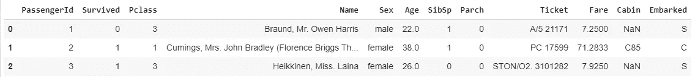

数据集中的三行数据

# **执行数据清理和分析**

1.  理解每列的含义:数据字典:变量描述

存活—存活(1)或死亡(0)

Pclass —乘客级别(1 =第一级，2 =第二级，3 =第三级)

姓名——乘客的姓名

性别—乘客的性别

年龄——乘客的年龄

SibSp——船上兄弟姐妹/配偶的数量

Parch —船上父母/孩子的数量(有些孩子只和保姆一起旅行，因此 parch=0。)

机票——机票号码

车费——车费

小屋——小屋

装船港(C =瑟堡，Q =皇后镇，S =南安普顿)

2.分析哪些列在预测存活率时完全无用，并删除它们

不要因为觉得没用就把栏目删了。或者焦点不在删除列上。我们的重点是分析每一列如何影响结果或预测，并据此决定是保留该列还是删除该列，或者用一些值填充该列的空值，如果是，则用什么值。

```
titanic.describe()
```

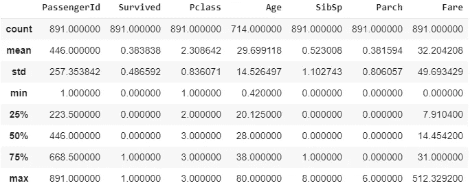

既然姓名、机票、舱位和票价不能决定人的生死存亡，那么我们可以删除这些栏目。

```
del titanic['Name']
del titanic['Ticket']
del titanic['Cabin']
del titanic['Fare']titanic.head(3)
```

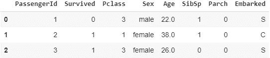

# **执行数据转换**

我们可以使用**一个热编码**将“性别”列的分类值转换成数值

```
def getNumber(abc):
   if abc == 'male':
     return 1
   else :
     return 2titanic['Gender'] = titanic['Sex'].apply(getNumber)
del titanic['Sex']
titanic.head(3)
```

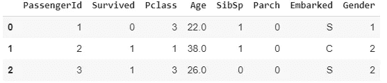

之后。我们可以使用这个来检查有多少数据包含空值。

```
titanic.isnull().sum()
```

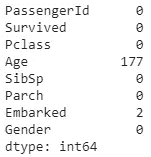

数据集中缺失值的信息

我们得到信息,“年龄”列有 177 个空值。这一次，我们将使用幸存者的平均年龄来填补这个缺失值

```
age_mean = titanic[titanic.Survived == 1].Age.mean()
titanic['age'] = np.where(pd.isnull(titanic.Age) & titanic["Survived"] == 1,age_mean, titanic["Age"])age_mean
titanic.head(3)
```

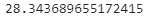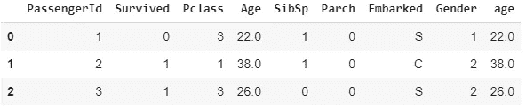

```
titanic.isnull().sum()
```

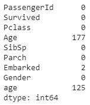

“年龄”列包含人员无法生存的缺失值

既然我们得到了 125 行数据，其中包含泰坦尼克号悲剧中无法生还的人的缺失值，我们以后应该填充这些缺失值。

```
age_mean_not_survived = titanic[titanic.Survived == 0].Age.mean()
titanic.age.fillna(age_mean_not_survived, inplace = True)
titanic.isnull().sum()
```

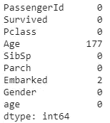

瞧，我们成功填补了年龄中缺失的价值。我们现在的任务是删除“年龄”一栏。

```
del titanic['Age']
titanic.rename(columns = {'age' : 'Age'}, inplace = True)
titanic.rename(columns={'Gender' : 'Sex'}, inplace = True)
```

干得好！现在，我们要检查“已上船”列对于分析是否**重要**，也就是说，人的生存是否取决于已上船列的值。

```
survivedQ = titanic[titanic.Embarked == 'Q'][titanic.Survived == 1].shape[0]
survivedC = titanic[titanic.Embarked == 'C'][titanic.Survived == 1].shape[0]
survivedS = titanic[titanic.Embarked == 'S'][titanic.Survived == 1].shape[0]print('The number of survived Embarked Q is: ', survivedQ)
print('The number of survived Embarked C is: ', survivedC)
print('The number of survived Embarked S is: ', survivedS)
```

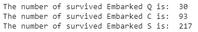

```
not_survivedQ = titanic[titanic.Embarked == 'Q'][titanic.Survived == 1].shape[0]
not_survivedC = titanic[titanic.Embarked == 'C'][titanic.Survived == 1].shape[0]
not_survivedS = titanic[titanic.Embarked == 'S'][titanic.Survived == 1].shape[0]print('The number of not survived Embarked Q is: ', not_survivedQ)
print('The number of not survived Embarked C is: ', not_survivedC)
print('The number of not survived Embarked S is: ', not_survivedS)
```

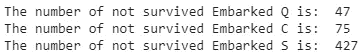

因为根据乘客上船的港口，存活率有很大的变化。我们不能删除整个已装船列(它是有用的)。现在，apollowed 列中有一些空值，因此我们可以有把握地说，从总行数中删除一些行不会影响结果。所以与其试图用一些值来填充这些空值。我们可以简单地删除它们。

```
titanic.dropna(inplace = True)
titanic.isnull().sum()
```

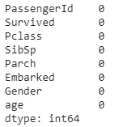

至于现在，我们终于有了明确的数据。下一步是将输入列作为分类值转换成数值。

```
def getEmb(str):
   if str == "S":
     return 1
   elif str == "C":
     return 2
   else:
     return 3titanic['Embark'] = titanic['Embarked'].apply(getEmb)
titanic.head()
```

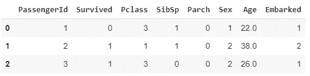

```
import matplotlib.pyplot as plt
from matplotlib import stylemales = (titanic['Sex'] == 1).sum()
females = (titanic['Sex'] == 2).sum()print(males)
print(females)p = [males, females]plt.pie(p, labels = ['Male', 'Female'], colors = ['green', 'yellow'], explode = (0.15, 0), startangle = 0)
plt.axis('equal')
plt.show()
```

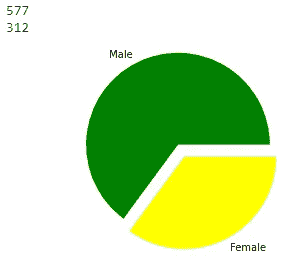

男性和女性的饼图

```
MaleS = titanic[titanic.Sex == 1][titanic.Survived == 1].shape[0]
print(MaleS)
MaleN = titanic[titanic.Sex == 1][titanic.Survived == 0].shape[0]
print(MaleN)
FemaleS = titanic[titanic.Sex == 2][titanic.Survived == 1].shape[0]
print(FemaleS)
Femalen = titanic[titanic.Sex == 2][titanic.Survived == 0].shape[0]
print(FemaleN)chart = [MaleS, MaleN, FemaleS, FemaleN]
colors = ['lightskyblue', 'yellowgreen', 'Yellow', 'Orange']
labels = ['Survived Male', 'Not Survived Male', 'Survived Female', 'Not Survived Female']
explode = [0, 0.05, 0, 0.1]plt.pie(chart, labels = labels, colors = colors, explode = explode, startangle = 100, counterclock = False, autopct = "%.2f%%")
plt.axis("equal")
plt.show()
```

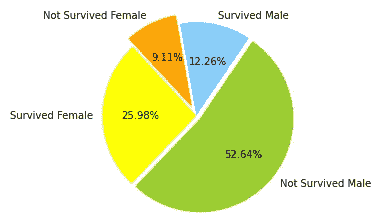

我们工作的最终结果

如果你想访问这个项目的全部代码，你可以访问我的 Github [这里](https://github.com/riskiip/data_preprocessing)

# 下一步是什么？

我们将发现机器学习中的“模型”。在这里你可以更多地了解模特。如果你掌握了所有的模型，你就可以建造任何你想要的东西

谢谢大家，别忘了给我留言或评论，祝大家有美好的一天:)