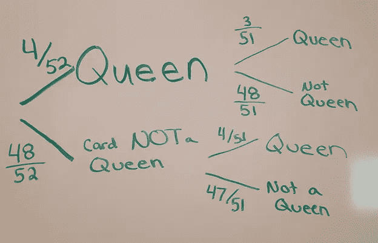
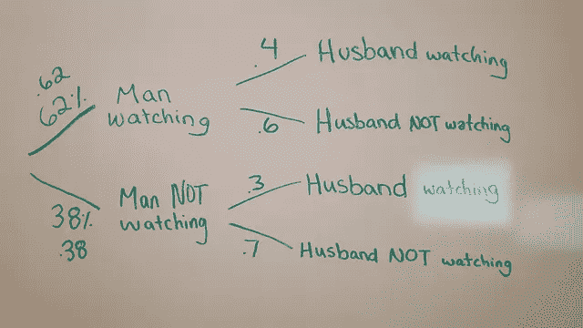
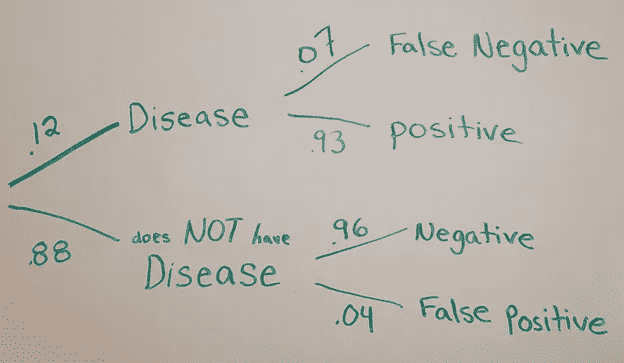
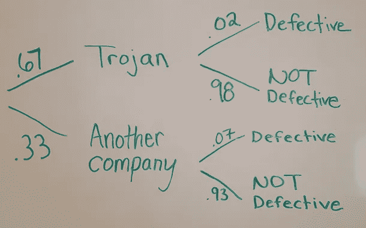
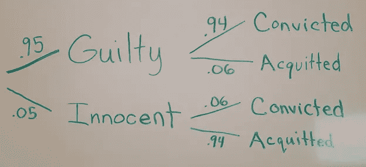
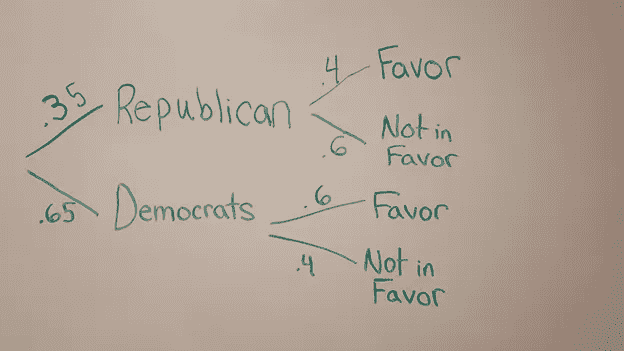
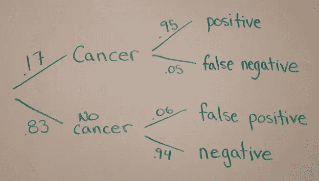

# 使用贝叶斯进行练习

> 原文：<https://medium.com/analytics-vidhya/practice-with-bayes-a09c4bec704b?source=collection_archive---------15----------------------->

*如何用树解决贝叶斯问题*

# 示例 1:

一副标准扑克被洗牌，最上面的牌被移走。第二张牌是皇后的概率是多少？

一副 52 张牌中有 4 张皇后。其中 48 张牌不是皇后(52–4)。如果第一张牌在第二次抽牌时被留在牌堆之外，第二次抽牌将从 51 张牌中抽取。在第二次抽牌中，你拿到皇后的机会是 3/51。也就是说 51 张牌中有 48 张不会成为女王。如果第一次没有抽出王后，你将有 51 分之 4 的机会抽到王后，有 47 分之 51 的机会抽到王后以外的牌。第二张牌是皇后的概率:

(4/52) x (3/51) + (48/52) x (4/51)

# 示例 2:

一家广告公司正在研究已婚夫妇看电视的情况。据确定，男人 62%的时间都在看电视。人们还发现，当男人看电视时，他们的丈夫 40%的时间也在看电视。当男人不看电视时，30%的时间丈夫在看电视。找出如果丈夫在看电视，他们的伴侣也在看电视的概率。

(.62)(.4) / ((.62)(.4) + (.38)(.3))

# 示例 3:

医学测试用于诊断疾病。该测试的假阳性率为 4% (4%未患病的人得到阳性结果)。这项测试有 7%的假阴性。12%的人口患有这种疾病。1 —一个人收到阳性检测结果的概率？2 —如果结果呈阳性，一个人患病的概率？

1 — (.12)(.93) + (.88)(.04) 2 — (.12)(.93) / (.12)(.93) + (.88)(.04)

# 示例 4:

避孕套由 2 家公司生产，特洛伊和非特洛伊。特洛伊生产 67%的避孕套，次品率为 2%。而公司，不是木马，有 7%的次品率。如果随机选择一个避孕套，发现有缺陷，它是木马的概率是多少？

(.67)(.02) / ((.67)(.02) + (.33)(.07))

# 示例 5:

在听了关于阿德南和谋杀李海敏的系列播客后，你决定学习更多关于审判的知识。假设被告被判有罪的概率是 94%,而被判无罪的概率是 94%。此外，95%的被告确实有罪。假设被告被判有罪，求被告无罪的概率。

(.05)(.06) / ((.05)(.06) + (.95)(.94))

# 示例 6:

选民中 35%是共和党人，65%是民主党人。据报道，40%的共和党人和 60%的民主党人赞成选举问题。从这个群体中随机选择的一个人被发现支持这个问题。找出这个人是民主党人的条件概率。

(.65)(.6) / ((.65)(.6) + (.35)(.4))

# 示例 7:

伊丽莎白·霍姆斯发现 17%的人会在某个时候患上癌症。患有癌症的人有 95%的机会检测出阳性结果。没有癌症的人有 6%的机会得到假阳性检测结果。一个人得癌症的概率是多少？

你可能做了(. 17)(.95) / ((.17)(.95) + (83)(.06))，但你错了，因为伊丽莎白·霍姆斯是一个骗子，他创造了有毒的工作环境 Theranos。不要相信来自伊丽莎白·霍姆斯的测试。