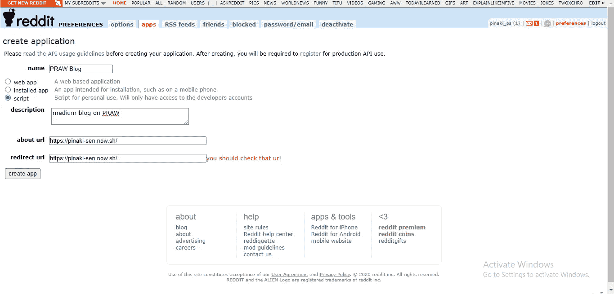
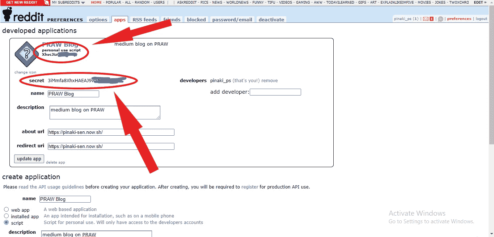

# PRAW——一个抓取 Reddit 帖子数据的 python 包

> 原文：<https://medium.com/analytics-vidhya/praw-a-python-package-to-scrape-reddit-post-data-b759a339ed9a?source=collection_archive---------7----------------------->


# **简介**

RRAW 代表“Python Reddit API Wrapper ”,是一个 Python 包，允许简单访问 Reddit 的 API。它有一个有据可查的[官方网站](https://praw.readthedocs.io/en/latest/)，代码片段可以参考。在这里，我将讨论安装、配置和编写一些 python 脚本来抓取 Reddit 帖子的步骤。

# 安装和升级

```
pip install prawpip install --upgrade praw
```

# **要求**

熊猫应该事先安装，这将有助于管理和存储在 CSV 文件更容易抓取的数据。如果没有安装，请使用下面的命令进行安装。

```
conda install pandas
```

# **报名与注册**

如果你已经有一个 Reddit 的个人资料，去登录。如果没有，请转到[这里](https://www.reddit.com/)并点击如下所示的“注册”按钮。


注册后，你将被重定向到 Reddit 主页。点击个人资料图片旁边的下拉按钮(如下图红色箭头所示)。


点击“访问老 Reddit”。


现在转到页面右上角的首选项。


导航到导航栏上的**应用**部分，点击按钮**“你是开发者吗？创建一个应用…"**[如下图所示，使用红色箭头]


填写所有细节，不要忘记选择**脚本**【默认选择 **web app** 】。最后，点击**“创建应用程序”**按钮。这里的所有字段都是必填的，忽略任何一个都不会允许您继续。



您将被重定向到一个页面，在该页面上将给出**个人使用脚本**和**安全令牌**【如图所示】。将它们复制到剪贴板中，这在编写 Python 脚本时肯定是需要的。



# **编写 Python 脚本**


在这里我将使用 Jupyter 笔记本来演示整个过程。您可以使用自己选择的任何笔记本或代码编辑器。

我们将创建一个数据集，由来自不同子编辑的 Reddit 帖子的特征组成。PRAW 提供了近 20 个属性来抓取 Reddit 帖子的各种功能，如 Id、作者、天赋、标题、Upvote 等。在这里，我们将存储每个 Reddit 帖子的 7 个特征来创建数据集。

## **导入库**

```
import praw
import pandas as pd
```

## **使用秘密令牌访问 API**

```
reddit = praw.Reddit(client_id = "CLIENT_ID", #peronal use script
                    client_secret = "CLIENT_SECRET", #secret token
                    usernme = "USERNAME", #profile username
                    password = "PASSWORD", #profile password
                    user_agent = "USERAGENT")
```

## **初始化每个特征的空列表**

```
author_list = []
id_list = []
link_flair_text_list = []
num_comments_list = []
score_list = []
title_list = []
upvote_ratio_list = []
```

## **提及所有将被清除的子条目**

我们将从十个受欢迎的子网站中收集热门帖子。因此，所有这些子编辑名称将被存储在一个列表中，我们将遍历列表中的每个元素。

```
subreddit_list=  ['india',
                  'worldnews',
                  'announcements',
                  'funny',
                  'AskReddit',
                  'gaming',
                  'pics',
                  'science',
                  'movies',
                  'todayilearned'
                 ]
```

## **子编辑和各种属性**

*subreddit( )* 函数采用单个参数，即 subreddit 名称。每个子区域都有一个名为**热**的分区。我们使用函数 *hot()，*访问热门的 Reddit 帖子，该函数带有一个“限制”属性，使用该属性我们可以指定想要从该子编辑中访问的帖子的数量。

```
subreddit = reddit.subreddit(subred)
hot_post = subreddit.hot(limit = 10000)
```

现在我们可以迭代 hot_post，对于每个实例，我们可以调用诸如作者、id、分数、标题等属性。然后，可以将每个属性相应地附加到先前初始化的列中。例如，从 subreddit(这里是印度)中抓取 1000 篇热帖的单个属性(这里是作者姓名)的脚本如下所示。

```
subreddit = reddit.subreddit('india')
hot_post = subreddit.hot(limit = 1000)for sub in hot_post:
  author_list.append(sub.author)
```

你可以从 PRAW 官网[这里](https://praw.readthedocs.io/en/latest/)了解更多属性。

## 最终剧本

下面给出了遍历 10 个子编辑名称列表、抓取和存储每个帖子的特定属性的脚本。

```
for subred in subreddit_list:

  subreddit = reddit.subreddit(subred)
  hot_post = subreddit.hot(limit = 10000) for sub in hot_post: author_list.append(sub.author)
    id_list.append(sub.id)
    link_flair_text_list.append(sub.link_flair_text)
    num_comments_list.append(sub.num_comments)
    score_list.append(sub.score)
    title_list.append(sub.title)
    upvote_ratio_list.append(sub.upvote_ratio) print(subred, 'completed; ', end='')
  print('total', len(author_list), 'posts has been scraped')
```

最后两条打印语句将帮助我们直观地看到每个子记录的终止以及到那时为止丢弃的数据总数。

## 将数据集存储在 CSV 文件中

为了存储所有抓取的数据，我们将使用 pandas 库，首先将数据列表转换为 pandas dataframe，然后转换为 CSV 文件。每个列表将被视为数据集中的一列，数据集中的每一行都将描述一个独特的 Reddit 帖子。

```
df = pd.DataFrame({'ID':id_list, 
                   'Author':author_list, 
                   'Title':title_list,
                   'Count_of_Comments':num_comments_list,
                   'Upvote_Count':score_list,
                   'Upvote_Ratio':upvote_ratio_list,
                   'Flair':link_flair_text_list
                  })
df.to_csv('reddit_dataset.csv', index = False)
```

# 结论

这是完整的 Python 脚本。你也可以从这个 [Github repo](https://github.com/senpinaki222/PRAW-blog) 中克隆脚本和 CSV 文件。

这里有一个 [Reddit 数据集](https://www.kaggle.com/senpinaki222/reddit-post-dataset)上传到 Kaggle 上，你可以用于你的机器学习项目。如果你觉得有帮助，就给它投个赞成票。

非常感谢你的阅读。如果有任何更正/建议，请告诉我。请吧👏如果你喜欢邮报。提前感谢…