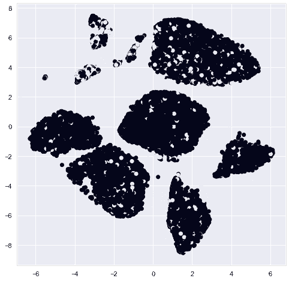

# 使用 Python 进行预处理和模型训练

> 原文：<https://medium.com/analytics-vidhya/pre-processing-and-model-training-using-python-174ed43dd8bb?source=collection_archive---------34----------------------->

## 了解数据预处理及其在模型训练中的重要性


马库斯·温克勒在 [Unsplash](https://unsplash.com?utm_source=medium&utm_medium=referral) 上的照片

在机器学习中，预处理和模型训练密切相关，这意味着二者缺一不可。问题是，我们人类与我们能够理解的数据进行交互，这些数据是用自然语言编写的，我们希望我们的机器学习模型能够接受相同的数据，并给我们一些见解。嗯，机器只能理解二进制语言(0 和 1 ),必须有一种方法让机器理解同样的数据。这就是预处理的用武之地。预处理基本上是将自然语言中的数据转换成机器可以理解的形式。这个过程也称为编码。

那么我们如何做预处理和模型训练，从数据中获得洞察呢？有多种方法可以预处理数据和训练机器学习模型，当然我不知道所有的方法。在这篇文章中，我们将看看一些预处理方法，并探索三种我们可以用来训练模型的机器学习算法。因此，我们将研究:

**预处理**

*   数据清理
*   使用 OneHotEncoder 的分类特征编码
*   使用标准缩放器缩放数字特征
*   使用主成分分析、T-SNE 和自动编码器进行降维
*   通过过采样平衡类
*   特征抽出

**模特培训**

*   逻辑回归
*   随机森林
*   决策树

在这篇文章中，我们将使用银行活动数据，这些数据可以在[这里](http://archive.ics.uci.edu/ml/datasets/Bank+Marketing)找到。除了数据之外，源还对数据中的要素进行了全面描述。简而言之，我们的数据由描述客户的 20 个特征、10 个分类特征和 10 个数字特征以及目标变量组成。我们的目标变量是客户是否订阅定期存款的表示。这个项目的目标是预测哪些未来的客户将订阅定期存款。要对我们的数据集进行全面的探索性数据分析，您可以查看 [my Tableau Dashboard](https://dub01.online.tableau.com/t/multipleviews/views/Kiiru-Anastasia_Bank_Data_EDA/EDAforTermDepositSubscriptionsY?:showAppBanner=false&:display_count=n&:showVizHome=n&:origin=viz_share_link) 或在[这个 GitHub 存储库](https://github.com/Kiiru-Anastasia/10acadWeeklyChallenges/blob/master/Week6/notebooks/Term_Deposit.Predictive_Model.ipynb)上进行同样的操作。这篇文章将只关注预处理和模型训练。

# 预处理

## 数据清理

数据清理包括检查数据集中的缺失值，根据缺失值的数量及其在数据中的重要性，删除空行或输入缺失值。数据清理还包括在我们的数据中寻找重复数据并删除它们，因为它们可能会显著影响模型的有效性。数据清理还包括检查数据中的异常值，并根据异常值出现的频率用中值或平均值替换数据。这只是我们将在本帖中探讨的几种数据清理方法中的一部分。

**缺失值**

我们可以通过调用`dataset.info()`并检查数据集中的所有特性来检查数据中的缺失值，或者简单地运行`dataset.isnull().values.any()`，如果数据集中有任何空值，它将返回 True，如果没有，则返回 False。然后，我们可以决定删除包含唯一数据的值，或者用模式数据估算分类特征，用均值数据估算数值特征。我们的银行数据集没有缺失值，因此我们继续下一步。

**重复数据**

使用`dataset[dataset.duplicated()]`检查数据中的重复行。我们的银行数据有 12 个重复的行，因此，我们可以使用`dataset = dataset.drop_duplicates()`删除这些行，并将结果数据作为新数据集分配给我们的数据集变量。

**异常值检测**

通过简单地绘制特征的方框图，很容易检测数值特征中的异常值。我已经定义了一个函数，可以帮助你绘制所有的数字特征的箱线图，你只需要把你的数据集和特征的名称传递给这个函数。该功能是:

```
def plot_outliers(data, features):
    fig, ax = plt.subplots(len(features), figsize = (8, 40))

    for i, feature in enumerate(features):
        sns.boxplot(y = data[feature], ax = ax[i])
        ax[i].set_title('Box plot - {}'.format(feature), fontsize = 10)
        ax[i].set_xlabel(feature, fontsize = 8)

    plt.show()
```

然后，如果离群值很多，我们可以用中值替换离群值，如果离群值不多，我们可以用平均值替换离群值。下面的函数将为您自动完成这个过程。您只需传入您的数据、要替换的带有异常值的要素，并指明您是用平均值还是中值进行替换。

```
def replace_outlier(data, features, with_median=False, with_mean=False):
    for feature in features:
        Q1 = data[feature].quantile(0.25)
        Q3 = data[feature].quantile(0.75)

        median = data[feature].quantile(0.50)
        mean = data[feature].mean()

        IQR = Q3 - Q1

        upper_whisker = Q3 + (1.5 * IQR)
        lower_whisker = Q1 - (1.5 * IQR)

        if with_median:
            data[feature] = np.where(data[feature] > upper_whisker, median, data[feature])
            data[feature] = np.where(data[feature] < lower_whisker, median, data[feature])

        if with_mean:
            data[feature] = np.where(data[feature] > upper_whisker, mean, data[feature])
            data[feature] = np.where(data[feature] < lower_whisker, mean, data[feature])
```

## 使用 OneHotEncoder 的分类特征编码

分类特征的编码是通过将分类值转换成二进制值来完成的。OneHotEncoder 通过为特性中的每个类别创建一个单独的二进制值列来实现这一点。在新列中，值 1 表示目录存在，0 表示目录不存在。例如，在我们的银行数据中，一个分类特征是婚姻，它有四个可能的类别；已婚的，单身的，离婚的，未知的。对于这些类别中的每一个，OneHotEncoder 都创建一个新列，并在该类别出现时使用 1，否则使用 0。

OneHotEncoding 可以通过多种方式实现，比如在熊猫身上使用 get_dummies。然而，这篇文章将使用 CountVectorizer，这是一种比 get_dummies 更好的方法，因为 get_dummies 返回不同维度的数据。

同样，使用下面的函数，你可以很容易地对你的分类特征进行一次性编码，你只需要传入你的分类特征的名称，X_train 集合和 X_test 集合。

```
from sklearn.feature_extraction.text import CountVectorizerdef add_onehot_to_dataframe(sparse, df, vectorizer, name):
  '''
  This function will add the one hot encoded to the dataframe.
  '''
  for i, col in enumerate(vectorizer.get_feature_names()):
    colname = name+"_"+col
    # df[colname] = pd.SparseSeries(sparse[:, i].toarray().flatten(), fill_value=0)
    df[colname] = sparse[:, i].toarray().ravel().tolist()

  return dfdef OneHotEncoder(categorical_cols, X_train, X_test):
  '''
    This function takes categorical column names as inputs. The objective of this function is to take the column names iteratively and encode the features using One hot Encoding mechanism and also adding the encoded feature to the respective dataframe.
  '''for i in categorical_cols:
    Vectorizer = CountVectorizer(token_pattern="[A-Za-z0-9-.]+")
    print("Encoding for feature: ", i)
    # Encoding training dataset 
    temp_cols = Vectorizer.fit_transform(X_train[i])
    X_train = add_onehot_to_dataframe(temp_cols, X_train, Vectorizer, i)
```

#编码测试数据集
temp _ cols = Vectorizer . transform(X_test[I])
X _ Test = add _ onehot _ to _ data frame(temp _ cols，X _ Test，Vectorizer，I)

## 使用 StandardScaler()缩放数字特征

数据集中的每个数值特征通常在不同的尺度上进行测量，这可能会在训练模型时导致一些偏差。因此，建议总是通过使用`MinMaxScaler()`或`StandardScaler()`来规范化您的数据。在本文中，我们将使用`StandardScaler()`和下面的代码片段来实现我们的数字特征的规范化。

```
from sklearn.preprocessing import StandardScaler

scaler = StandardScaler()numerical_cols = ['age', 'duration', 'campaign', 'pdays', 'previous', 'emp.var.rate', 'cons.price.idx', 'cons.conf.idx', 'euribor3m', 'nr.employed']

#normalizing train set
X_train = X_train.reset_index()
temp_df = X_train.filter(numerical_cols, axis = 1)
X_train = X_train.drop(numerical_cols, axis = 1)

cols = temp_df.values

temp_cols = scaler.fit_transform(cols)
temp_df = pd.DataFrame(temp_cols, columns = numerical_cols)
X_train = X_train.merge(temp_df, left_index=True, right_index=True)
X_train = X_train.drop(['index'], axis=1)

#normalizing test set
X_test = X_test.reset_index()
temp_df = X_test.filter(numerical_cols, axis = 1)
X_test = X_test.drop(numerical_cols, axis = 1)

cols = temp_df.values

temp_cols = scaler.fit_transform(cols)
temp_df = pd.DataFrame(temp_cols, columns = numerical_cols)
X_test = X_test.merge(temp_df, left_index=True, right_index=True)
X_test = X_test.drop(['index'], axis=1)
```

## 降维

这种预处理技术包括将高维数据转换为低维数据，同时仍然保持整个数据集的良好表示。有几种降维技术，但这篇文章将只通过 PCA(主成分分析)，t-SNE(t-分布式随机邻居嵌入)和自动编码器。

**PCA(主成分分析)**

下面的代码将我们的数据降维为 2D。`n_components`属性是用于指定数据应该减少到的组件数量的部分。

```
from sklearn.decomposition import PCApca = PCA(n_components=2)
X_pca_2train = pca.fit_transform(X_train)
PCA_df_2train = pd.DataFrame(data = X_pca_2train, columns = ['PC1', 'PC2'])
PCA_df_2train = pd.concat([PCA_df_2train, y_train], axis = 1)
```

PCA 还提供了一种检查由所选组件保留的方差比率的方法，这可以通过:`pca.explained_variance_ratio_`对于上面的代码，该方差的输出是`out[]: [0.29620347 0.09104375]`，表示我们的数据的 29.62%由组件 1 表示，只有 9.10%由组件 2 表示。

我们还可以使用以下代码绘制 PCA 的结果分布图:

```
plt.figure(figsize=(8, 8))classes = [1, 0]
colors = ['r', 'b']
for clas, color in zip(classes, colors):
    plt.scatter(PCA_df_2train.loc[PCA_df_2train['y'] == clas, 'PC1'], 
                PCA_df_2train.loc[PCA_df_2train['y'] == clas, 'PC2'], 
                c = color)

plt.xlabel('Principal Component 1', fontsize = 12)
plt.ylabel('Principal Component 2', fontsize = 12)
plt.title('2D PCA', fontsize = 15)
plt.legend(['Subscription', 'No Subscription'])
plt.grid()
```

上面的代码给了我们以下情节:


作者图片

从上图可以看出，两个输出之间的区别并不明显，因此使用两个元件可能不是最佳选择。

要获得用于降维的理想分量数，您可以使用 PCA，而无需为 n_components 赋值，并绘制数据的解释方差比，如以下代码片段所示:

```
pca = PCA()
pca_data = pca.fit_transform(X_train)
plt.plot(np.cumsum(pca.explained_variance_ratio_))
plt.xlabel('number of components')
plt.ylabel('cumulative explained variance')
```

这段代码导致了以下情节:


作者图片

从上面的图中我们可以看到，使用接近 30 个组件将会给我们 100%的数据表示。10 种成分也有很好的代表性，接近 80%。分析该图后，您可以再次运行 PCA，这一次将 n_components 分配给理想数量的组件，以获得更好的数据表示。

**t-SNE(t-分布式随机邻居嵌入)**

与 PCA 不同，t-SNE 是一种非线性降维技术。要对数据应用 t-SNE 降维，请使用下面的代码片段，并使用 n_components 指定组件的数量。

```
tsne = TSNE(n_components=2, verbose=1, perplexity=40, n_iter=300)
X_tsne_2train = tsne.fit_transform(X_train)
```

要使用可视化来检查 SNE 霸王龙的分布，请使用以下代码:

```
plt.figure(figsize=(8,8))
plt.scatter(X_tsne_2train[:, 0], X_tsne_2train[:, 1], c=y_train.values)
plt.show()
```

上面的代码给了我们一个如下图所示的情节:



作者图片

正如 PCA 所示，这两类之间的区别也不明显，因此使用更多的组分可能会更好。

**自动编码器**

自动编码器是机器学习算法，可用于降维。他们使用非线性变换将数据从高维映射到低维。有不同类型的自动编码器，例如:变分自动编码器、卷积自动编码器、去噪自动编码器和稀疏自动编码器。在这篇文章中，我们将构建一个基本的自动编码器，它包含两个主要组件:编码器和解码器。

自动编码器使用 python 中的 Keras API，因此，在运行以下代码之前，请确保您的环境中安装了 Keras 和 tensorflow。通过在 python 3.7 和 anaconda3 环境下运行`!pip install keras`和`!pip install tensorflow`，可以很容易地在 Jupyter 笔记本上安装这两个软件。

```
from keras.layers import Input, Dense
from keras.models import ModelX = pd.concat([X_train, X_test], ignore_index=True)input_layer = Input(shape=(X.shape[1],))
encoded = Dense(3, activation='relu')(input_layer)
decoded = Dense(X.shape[1], activation='softmax')(encoded)
autoencoder = Model(input_layer, decoded)
autoencoder.compile(optimizer='adam', loss='binary_crossentropy')X1, X2, Y1, Y2 = train_test_split(X, X, test_size=0.3, random_state=101)autoencoder.fit(X1, Y1,
                epochs=100,
                batch_size=300,
                shuffle=True,
                verbose = 30,
                validation_data=(X2, Y2))encoder = Model(input_layer, encoded)
X_ae3 = encoder.predict(X)
```

请注意，我连接了我的训练集和测试集，因为自动编码器将输入特征(X)作为特征和标签。我们还为编码器使用了 ReLu activation 函数，为解码器使用了 Softmax 来实现非线性转换。

## 通过过采样平衡类

从我们的数据探索中，我们注意到我们的目标变量是不平衡的，无订阅与订阅的比例为 89:11。类别不平衡也会影响模型训练，因此我们必须平衡我们的目标变量。一些最大似然算法，如逻辑回归算法，带有平衡类的属性；也就是说`LogisticRegression(class_weight='balanced')`,我们可以将此选项用于此类模型，否则，我们必须通过欠采样和过采样等其他方法来平衡我们的 clas。在这种情况下，将使用 SMOTE 对我们的类进行过采样，如下面的代码所示:

```
from imblearn.over_sampling import SMOTEos = SMOTE(random_state = 0)columns = X_train.columns
os_data_X, os_data_y = os.fit_sample(X_train, y_train)
os_data_X = pd.DataFrame(data=os_data_X, columns=columns)
os_data_y = pd.DataFrame(data=os_data_y, columns=['y'])
```

## 特征抽出

特征提取包括从整个数据集中选择一些特征用于模型训练。基于这些特征在预测目标变量中的重要性来选择这些特征。这篇文章将探讨特征提取的 RFE 方法。下面的代码通过重复拟合训练数据来选择前 20 个重要的特性，选择最重要的特性，然后在下一轮中放弃它，直到选择了 20 个特性。

```
from sklearn.feature_selection import RFErfe = RFE(logreg, n_features_to_select=20)
rfe = rfe.fit(X_train, y_train)
rank = rfe.ranking_
```

# 模特培训

接下来，我们继续进行模型训练，我们将探索前面列出的三种机器学习算法。

## 逻辑回归

首先，需要注意的是，对于我们的数据集,“duration”列不应用于模型训练，因此，我们通过使用以下代码将其从训练数据中删除:

```
#Removing duration feature from dataset#From train
X_train = X_train.drop('duration', axis=1)#From test
X_test = X_test.drop('duration', axis=1)
```

然后，我们对数据应用逻辑回归算法。记住，这个模型有一个处理不平衡数据的内置方法，因此，我们将使用它。

```
from sklearn.linear_model import LinearRegressionlogreg = LogisticRegression(class_weight='balanced')
logreg.fit(X_train, y_train)
y_pred_logreg = logreg.predict_proba(X_test)
```

我们可以通过使用 ROC(受试者操作特征)分数来测试我们模型的准确性

```
from sklearn.metrics import roc_auc_scoreprint('AUC score without duration columns : ', roc_auc_score(y_test, y_pred_logreg[:, 1]))
```

我们还可以使用下面的代码绘制 ROC 曲线，从模型中获得更多信息。

```
from sklearn.metrics import roc_curvelogit_roc_auc = roc_auc_score(y_test, logreg.predict(X_test))
fpr, tpr, thresholds = roc_curve(y_test, logreg.predict_proba(X_test)[:,1])
plt.figure()
plt.plot(fpr, tpr, label='Logistic Regression (area = %0.2f)' % logit_roc_auc)
plt.plot([0, 1], [0, 1],'r--')
plt.xlim([0.0, 1.0])
plt.ylim([0.0, 1.05])
plt.xlabel('False Positive Rate')
plt.ylabel('True Positive Rate')
plt.title('Receiver operating characteristic')
plt.legend(loc="lower right")
plt.savefig('Log_ROC')
plt.show()
```

上述代码生成了以下图形:


作者图片

虚线是纯随机分类器的 ROC 曲线的表示。好的分类器应该远离这条线。

## 随机森林

随机森林是 scikit-learn 库附带的分类器之一，因此，要运行此模型，我们只需调用库中的分类器，如下所示:

```
from sklearn.ensemble import RandomForestClassifierrfclf = RandomForestClassifier(class_weight='balanced', max_depth=2, random_state=0)
rf_model = rfclf.fit(X_train, y_train)y_pred_rf=rfclf.predict(X_test)
```

我们可以通过生成混淆矩阵以及计算准确度、精确度、召回率、Fmeasure 和支持度来测试模型的准确性，如下所示:

```
target = np.array(y_test)
rf_prediction = np.array(y_pred_rf)print('Confusion matrix : ', confusion_matrix(target, rf_prediction))
print(classification_report(y_test, y_pred_rf))
```

## 决策树

决策树还附带了 scikit-library，因此，实现决策树模型就像导入库并拟合您的训练数据一样简单，如下所示:

```
from sklearn.tree import DecisionTreeClassifierdt = DecisionTreeClassifier(class_weight='balanced')dt_model = dt.fit(X_train, y_train)y_pred_dt = dt.predict(X_test)
```

就像随机森林一样，我们也可以通过生成混淆矩阵并计算准确性、召回率、精确度、Fmeasure 和支持度来测试我们的决策树模型的准确性。

这篇文章概述了机器学习中的数据预处理和模型训练。它提供了许多对数据进行预处理的方法，并解释了如何以及何时使用它们。这篇文章还谈到了三种可用于模型训练的机器学习算法，使用这些算法运行模型的基础知识，以及获得模型准确性的不同方法。要了解代码，您可以下载提供的链接中使用的数据，或者访问提供的 GitHub 链接中的完整代码。

# 参考

[1]: L. Susan，*用 python 构建逻辑回归，一步一步* (2017)，[https://towardsdatascience . com/Building-a-logistic-regression-in-python-step-by-step-becd 4d 56 c 9 c 8](https://towardsdatascience.com/building-a-logistic-regression-in-python-step-by-step-becd4d56c9c8)

[2]: R.Sukanta，*机器学习案例研究:预测银行电话营销成功的数据驱动方法* (2019)，[https://towards data science . com/Machine-Learning-case-study-A-data-driven-approach-to-predict-the-success-of-bank-tele marketing-20 e 37d 46 c 31 c](https://towardsdatascience.com/machine-learning-case-study-a-data-driven-approach-to-predict-the-success-of-bank-telemarketing-20e37d46c31c)