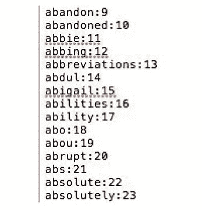
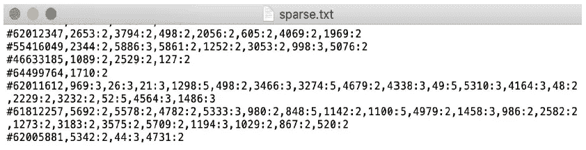
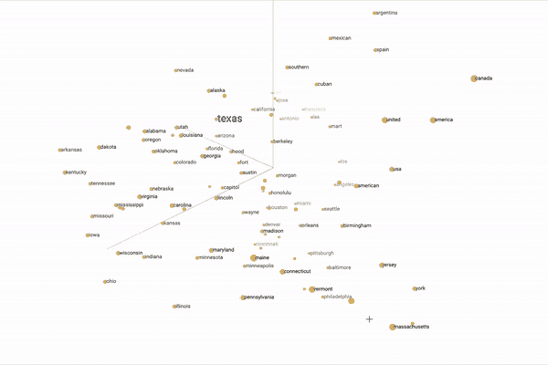
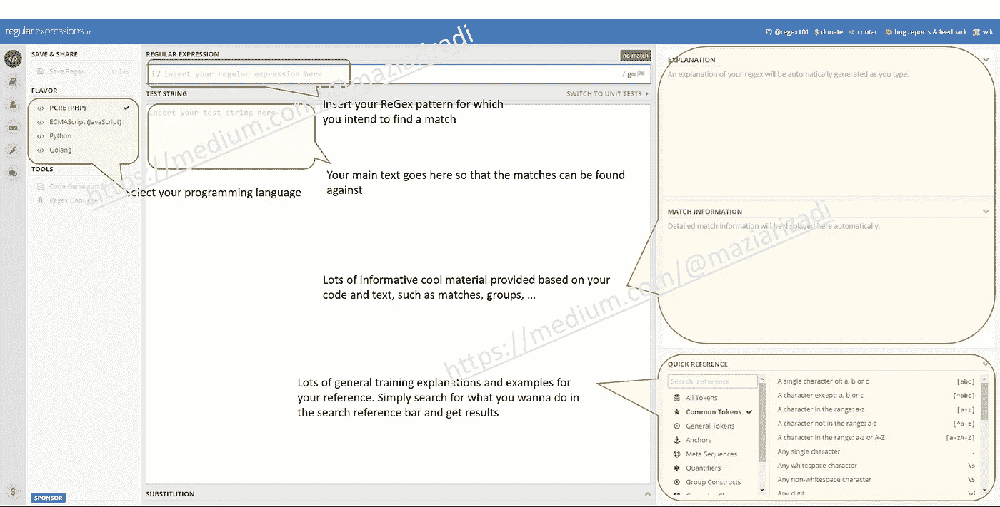
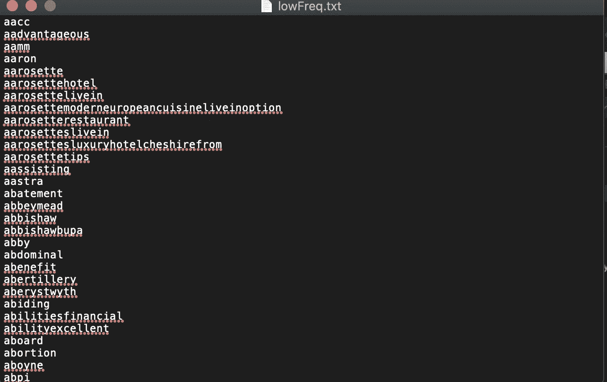
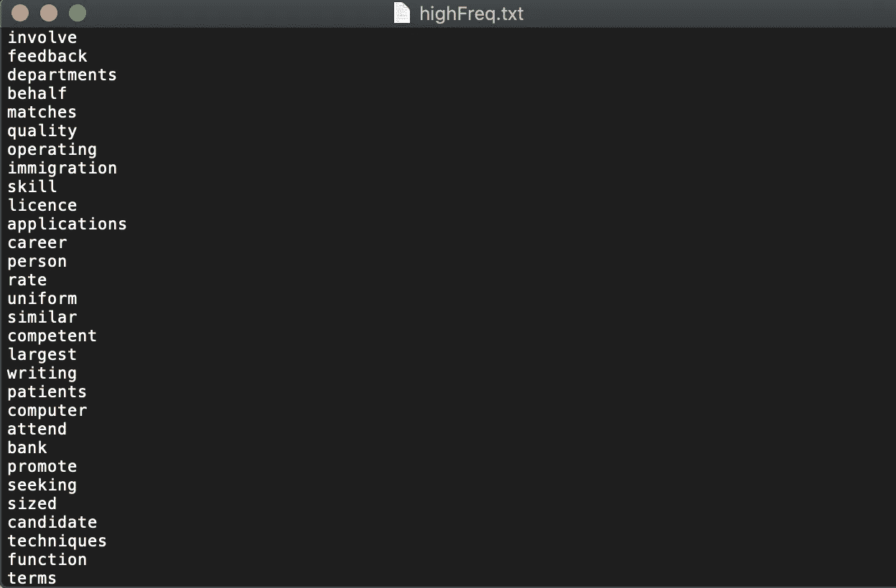
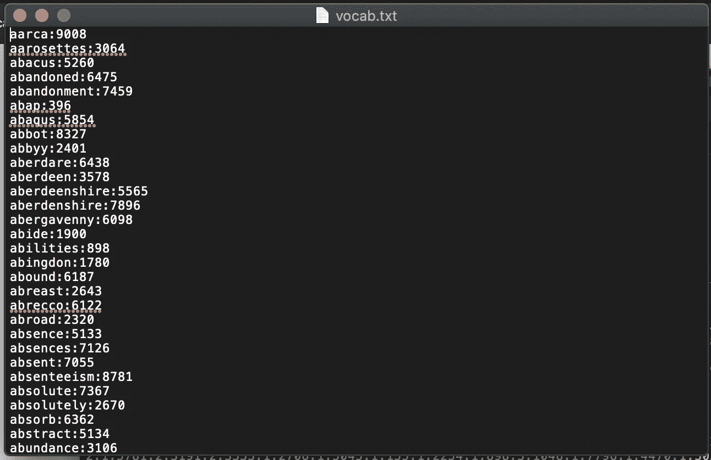
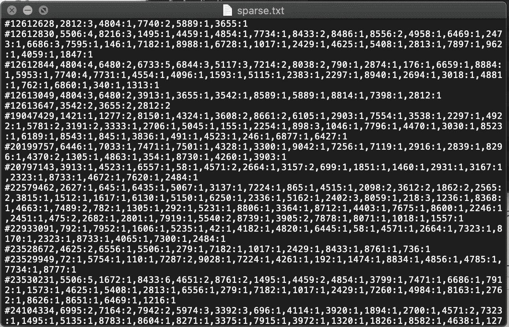

# Python 中主题连贯文本段的预处理💬

> 原文：<https://medium.com/analytics-vidhya/pre-processing-of-topically-coherent-text-segments-in-python-58f9b258596c?source=collection_archive---------4----------------------->

## 如何使用自然语言工具包预处理一组抄本并将其转换成数字表示

完整的 **Jupyter 笔记本**和文件可在我的 [**GitHub 页面**](https://github.com/maziarizadi/TextPreProcessingPy) 获得。

## 介绍

文本文档，如长录音和会议记录，通常由主题连贯的文本片段组成，每个片段包含一定数量的文本段落。在每一个主题连贯的片段中，人们会期望单词的使用比跨片段的使用表现出更一致的词汇分布。**自然语言处理(NLP)** ，更具体地说，将文本线性划分成主题片段可用于文本分析任务，例如信息检索中的段落检索、文档摘要和话语分析。在当前的练习中，我们将回顾如何编写 Python 代码来**预处理**一组抄本并且**将它们转换成适合输入到**主题分割算法**中的数值表示**。


[图像的来源](https://s3.amazonaws.com/codecademy-content/courses/NLP/Natural_Language_Processing_Overview.gif)

这篇文章的来源来自我在莫纳什大学完成的**数据科学研究生文凭的一部分作业。我也做了一些改动，让原来的任务更有趣。**

## 什么是使用案例，NLP 如何提供帮助？

现在有很多求职网站，包括 seek.com.au 和 au.indeed.com。这些求职网站都管理着一个求职系统，求职者可以根据关键词、薪水和类别来搜索相关的工作。通常，广告工作的类别由广告商(例如，雇主)手动输入。类别分配可能会出错。**因此，错误类别的工作将无法获得相关候选群体的足够曝光度**。

随着文本分析的进步，自动工作分类将变得可行，并且可以向潜在的广告客户提供合理的工作类别建议。这有助于减少人工数据输入错误，增加相关候选人的职位曝光率，还可以改善求职网站的用户体验。为了做到这一点，我们需要一个**自动招聘广告分类**系统，它在现有的招聘广告数据集上进行训练，具有标准化的工作类别，**预测新输入的招聘广告的类别标签**。

> 当前示例涉及处理工作广告文本数据的第一步，即，将工作广告文本解析成更合适的格式。

我们提供的招聘广告数据包含大量以简单 txt 格式表示的冗余信息。我们应该对招聘广告文本数据进行适当的预处理，以提高分类算法的性能。

# 问题陈述💡

我们需要编写 Python 代码来提取一组表示每个招聘广告内容的单词(例如，unigrams ),然后**将每个广告描述转换为数字表示** : count vector，它可以直接用作许多分类算法的输入。

## 我们将采取什么步骤？

*   提取
    数据文件`data.txt`中所有招聘广告的 id 和描述(约 500 条招聘广告)。
*   将这些招聘广告文本作为稀疏计数向量进行处理和存储。

为了实现上述目标，我们将:

*   排除长度小于 4 的单词
*   使用提供的停用词列表(即停用词 _en.txt)删除停用词
*   删除在一个招聘广告描述中只出现一次的单词，将其保存(无重复)为一个`txt`文件(参考所需的输出)
*   从生成的词汇表中排除这些单词
*   找到 100 多个广告
    描述中出现的常用词，保存为`txt`文件(参考所需输出)
*   在生成的词汇表中排除它们

我们不会:

*   生成多词短语(即搭配，名词短语)

在本练习结束时，我们将获得以下几项输出，包括它们的要求:

1。 `vocab.txt`:包含以下格式的单字词汇:`word_string:integer_index`

*   词汇表中的单词必须按字母顺序排列。这个文件是解释稀疏编码的关键。例如，在下面的例子中，单词 abbie 是词汇表中的第 12 个单词(对应的 integer_index = 11)(注意，下面的数字和单词不是指示性的)。



vocab.txt 文件输出格式

2。 `highFreq.txt`该文件包含在 100 多个广告描述中出现的常用词。在输出`txt`文件中，每行应该只包含一个单词。单字的顺序基于它们的频率，即包含该词的广告的数量，从高到低。

3。 `lowFreq.txt`该文件包含按字母顺序在一个招聘广告描述中只出现一次的单词。在输出的`txt`文件中，每行应该包含一个单词。

4。 `sparse.txt`该文件的每一行对应一个广告。所以，他们从`advertisement ID`开始。每行的其余部分是以逗号分隔的`word_index:word_freq`形式的相应描述的稀疏表示。行的顺序必须与输入文件中广告的顺序相匹配。

**注:** `word_freq`这里指的是 unigram 在相应描述中的出现频率，而不是整个文档。例如，在广告 12612628 的描述中，单词编号 11(根据上面的例子是‘abbie ’)恰好出现一次(编号不是指示性的) :



sparse.txt 文件输出格式

# ⛳️解决方案

所以我们总是从导入所需的库开始。鉴于这项工作的性质，需要做到以下几点:

## 导入库

*   **正则表达式**

第一个是正则表达式，简称为 ReGex。如果你还没有用过它们，我强烈建议你拿起它，做一些很酷的事情。再往下，我已经提供了一些开始的细节。

```
# Regular Expressions (ReGeX)import re
```

*   **自然语言工具包**

NLTK 是构建 Python 程序来处理人类语言数据的领先平台。它提供了易于使用的界面，如 WordNet，以及一套用于分类、标记化、词干化、标记、解析和语义推理的文本处理库，以及工业级 NLP 库的包装器。

`nltk.probability`提供了表示和处理概率信息的类，比如`FreqDist`，我们稍后会用到。

```
# Natural Language Toolkitimport nltkfrom nltk.probability import *from nltk.corpus import stopwords
```

*   **Itertools**

Python `itertools`模块是处理迭代器的工具集合。简单地说，迭代器是可以在`for`循环中使用的数据类型。Python 中最常见的迭代器是 list。

```
# Functions creating iterators for efficient loopingimport itertoolsfrom itertools import chainfrom itertools import groupby
```

## 让我们写一些代码🔥

我们先导入数据。GitHub 上有一个名为`data.txt`的文件供你参考。我把它保存在本地电脑上，和我的 Jupyter 笔记本文件放在同一个文件夹里。

在读取文件之前，为了方便起见，我们定义了一个空列表，并将其命名为`data`。

```
data = []
```

然后我们简单的读取`data.txt`并保存在列表`data`中。确保你定义了**编码格式** `utf8`，否则你可能会得到一个错误。

*   样本误差:

```
UnicodeDecodeError: 'charmap' codec can't decode byte 0x9d in position 260893: character maps to <undefined>
```

另一个**考虑事项**是，我们使用`.lower()`函数直接将文本转换成 lower 以保持一致性。

```
with open('data.txt', encoding="utf8") as f:
    data = f.read().lower()
```

## 格式化和清理✂️🔨 📌

现在，我们需要开始标记文本的过程。将一个字符序列分成几个部分的任务称为标记化。

首先，我们必须移除文本中的所有噪音，比如/-*#@或任何其他非单词字符或多余的空格，我们使用强大的`ReGex`工具来完成。


为了使用 ReGex 运行格式化，需要采取两个步骤；

(1)创建模式，

(2)使用 Python 代码运行模式并找到匹配。

```
# (1) create a pattern for REGEX to find and keep matching words onlypattern = re.compile(r"[a-zA-Z]+(?:[-'][a-zA-Z]+)?")# (2)tokenise the words: match the pattern to file's content 
# and tokenize the contenttokenised = pattern.findall(data)
```



图像[来源](https://www.google.com/url?sa=i&source=images&cd=&cad=rja&uact=8&ved=2ahUKEwjf4MHO4YTnAhWLyDgGHW9YDI0QjRx6BAgBEAQ&url=http%3A%2F%2Fnlp.cs.tamu.edu%2F&psig=AOvVaw0kkE5JmXeahMHoc6Uvi0S9&ust=1579148397647336)

Regex 上有很多在线资源，但我发现最有趣的是 https://regex101.com/。它不仅可以帮助您将文本与模式相匹配，还可以提供简短而有价值的内容。在图 1 中，我在他们的页面上提供了一个简单的功能列表。



图 1，`[regex101](https://regex101.com/).com`提供的功能

**对 Python 有用的正则表达式资源:**

*   [Python 正则表达式数据科学教程](https://www.dataquest.io/blog/regular-expressions-data-scientists/)
*   [Python 3 re 模块文档](https://docs.python.org/3/library/re.html)
*   [在线正则表达式测试器和调试器](https://regex101.com/)

## **索引标记化列表📇**

现在，我已经根据每个招聘广告中的`id`和`title`对令牌进行了索引:

```
# pass the length of the 'tokenised' series into a variabletokenised_len = len(tokenised) # indexing the tokens based on the position of "id" and "title"indexes = [i for i, v in enumerate(tokenised) if v=='id' and i+1 < tokenised_len and tokenised[i+1]=='title']
```

接下来，我们从`**itertools**` [recipes](https://docs.python.org/3/library/itertools.html) 创建一个函数，该函数遍历令牌列表，并且**创建一个子列表，以包括仅与一个作业广告相关的令牌**。输出将是一个数据字典。

```
# from itertools recipes
def pairwise(iterable, fillvalue=None):
    """
       This function iterates through the list of tokens and 
       creates sub list to include tokens related to one job ad only
    """
    a, b = iter(iterable), iter(iterable)
    next(b, None)
    return itertools.zip_longest(a, b, fillvalue=fillvalue) # pairwise based on indexes in the last block and store in the 'tokenised' as a listtokenised = [tokenised[i:j] for i,j in pairwise(indexes)]
```

为了创建数据字典，我使用了 Python `**itertools**`。 **Jason Rigdel** 对 Python 中的`**itertools**` 这一话题做了很好的解释，并提供了一组例子。

*   [Python ITER tools 指南](/@jasonrigden/a-guide-to-python-itertools-82e5a306cdf8)

但是，这个列表包含了很多功能词，比如“to”、“in”、“the”、“is”等等。

> 这些功能词通常*对文本的语义没有太大贡献*，除了在文本分析中增加数据的维度。
> 
> 另外，请注意，我们的目标通常是建立一个预测分类模型。因此，我们对报告的含义比对语法更感兴趣。因此，我们可以选择删除那些单词，这是你的下一个任务。

我将通过保留那些包含 3 个以上字符的标记来排除所有少于 4 个字符的标记，并将其余的标记添加到一个名为`to_remove`的列表中。这个列表将被添加到通用英语`stopwords`列表中。

```
tokenised = [[word if len(word) > 3 else "to_remove" for word in job] for job in tokenised]
```

## 删除停用词✂️

停用词携带*少量词汇内容*。

> 它们经常是英语中的功能词，例如，冠词、代词、助词等等。在 NLP 和 IR 中，我们通常从词汇表中排除停用词。否则，我们将面临[维度诅咒](https://towardsdatascience.com/the-curse-of-dimensionality-f07c66128fe1)。

也有一些例外，比如句法分析像解析，我们选择保留那些功能词。但是，您将通过使用 **NLTK** 中的停用词列表来删除上面列表中的所有停用词，它是:

```
nltk.download('stopwords')stopwords_list = stopwords.words('english')
```

对于这个例子，我已经在我的 GitHub 上提供了`stopwords_en.txt`文件，您可以从那里下载。我们首先将上面创建的`to_remove`列表添加到`stopwords_en.txt`文件中，读取该文件，然后将它们保存为`set()`。

```
# adding'to_removed' string to the list of stopwordsstopwords = []with open('stopwords_en.txt',"a") as f:
    f.write("\nto_remove") #\n to shift to next line with open('stopwords_en.txt') as f:
    stopwords = f.read().splitlines() #reading stopwords line and create stopwords as a list# convert stopwords into setstopwordsset = set(stopwords)
```

你可能想知道为什么我们把`stopwords`保存为`set`。这是个好问题……Python`set`比`list`更好，因为`set`在搜索大量 ***可散列*** 项目方面比列表运行得快得多。

接下来，我创建了一个名为`purifier()`的函数，它通过移除`stopwords`来净化令牌，然后运行`tokenised`列表。

```
def purifier(tokenList,remove_token):
    """
        This function takes two input (list of current tokens 
        and list of tokens to be removed)
        The function converts the list into set to improve the 
        performance
        and return a list of sets each of which include purified 
        tokens and remove_token lists are removed
    """
    return [set(word for word in job if word not in remove_token) for job in tokenList]# running the 'purifier' functiontokenised = purifier(tokenised,stopwordsset)
```


照片来自 shutterstock 图书馆

接下来是删除在一个招聘广告描述中只出现一次的`words`，将它们(无重复)保存为 txt 文件(参考所需输出)。为此，您需要从生成的词汇表中排除这些单词。

为了做到这一点，我们首先使用`**chain()**`功能将所有招聘广告中的所有单词列成一个列表。在“[Python ITER tools](/@jasonrigden/a-guide-to-python-itertools-82e5a306cdf8)指南”中，有一个关于`chain()`函数如何工作的很好的解释。

```
stop_wrds_removed_words = list(chain.from_iterable([word for word in job] for job in tokenised))
```

将单词列表转换为集合以删除重复项并创建词汇集合

```
stop_wrds_removed_vocab = set(stop_wrds_removed_words)
```

接下来是通过`**FreqDisrt()**`函数中的单词来统计令牌的数量。

> FreqDist 类用于对“频率分布”进行编码，它计算实验的每个结果出现的次数。它是`nltk.probability`模块下的一个类。
> 
> 根据 [developedia](https://devopedia.org/text-corpus-for-nlp) 的说法，通常，每个文本语料库都是文本源的集合。对于各种 NLP 任务，有几十个这样的语料库。本文忽略语音语料库，只考虑文本形式的语料库。在我们的例子中，文本语料库指的是所有工作广告的组合(…而不是每个工作单独)。

下面的 line 函数计算一个单词在整个`corpus`中出现的次数，而不管它在哪个 ad 中。

```
fd = FreqDist(stop_wrds_removed_words)
```

## 低频令牌

为了找到不太频繁的令牌，我创建了一个只出现过一次的令牌列表，并将该列表转换为`set`以提高性能。

```
once_only = set([k for k, v in fd.items() if v == 1])# sort the set into alphabetical orderonce_only = sorted(once_only) set(once_only)
```

为了创建`lowFreq.txt`文件，我已经将在一个招聘广告描述中出现“仅一次”的单词的排序`set`保存到一个同名文件中。

```
out_file = open("lowFreq.txt", 'w')
for d in once_only:
    out_file.write(''.join(d) + '\n')
out_file.close()
```



## 高频令牌

在这个阶段，我重复上面相同的步骤，但是，这一次的目的是找到高频词并把它们保存在名为`highFreq.txt`的文件中。
我首先通过运行我们之前定义的`purifier()`函数，从令牌的`list`中移除`lowFreq`令牌。

```
tokenised = purifier(tokenised,once_only)
```

下一步是在移除了`once_only`个单词之后创建一个新的`list`个单词。

```
LowFreqRemoved_Words = list(chain.from_iterable([word for word in job] for job in tokenised)) LowFreqRemoved_vocab = set(LowFreqRemoved_Words) LowFreqRemoved_fd = FreqDist(LowFreqRemoved_Words)
```

对于高频词，我选择了 100 个阈值。你可以根据你的工作环境选择任何门槛。

```
highFreq = set([k for k, v in LowFreqRemoved_fd.items() if v > 100])
```

现在，将在 100 多个招聘广告描述中出现的高频词的排序列表保存到一个文件中。

```
out_file = open("highFreq.txt", 'w')
for d in highFreq:
    out_file.write(''.join(d) + '\n')
out_file.close()
```



我们再次运行`purifier()`函数来删除`highFreq`数据集并创建一个新的`list`。

```
tokenised = purifier(tokenised,highFreq) HighFreqRemoved_words = list(chain.from_iterable([word for word in job] for job in tokenised))HighFreqRemoved_vocab = set(HighFreqRemoved_words)
```

## 注意

你可能想知道在我的代码中`words`和`vocab`列表有什么不同，为什么每次我创建一个`words`列表，然后一个`vocab`也被创建。原因还要追溯到 Python 中`list`和`set`的区别。然而底线是在`vocab`中每个单词只被列出一次，而`words`可能有重复。

接下来是一个简单的检查点，用于查看令牌的提纯进度:

```
print(f"Length of words: {len(stop_wrds_removed_words)}")print(f"Length of vocab: {len(stop_wrds_removed_vocab)}")print(f"Length of LowFreqRemoved_Words: {len(LowFreqRemoved_Words)}")print(f"Length of LowFreqRemoved_vocab: {len(LowFreqRemoved_vocab)}")print(f"Length of HighFreqRemoved_words: {len(HighFreqRemoved_words)}")print(f"Length of HighFreqRemoved_vocab: {len(HighFreqRemoved_vocab)}")
```

…这为我们提供了以下输出:

```
Length of words: 474345
Length of vocab: 18619
Length of LowFreqRemoved_Words: 465779
Length of LowFreqRemoved_vocab: 10053
Length of HighFreqRemoved_words: 126491
Length of HighFreqRemoved_vocab: 9103
```

接下来是创建一个名为`vocab.txt`的所有词汇的文件。

```
HighFreqRemoved_vocab = list(HighFreqRemoved_vocab) # list of final vocabsvocab = {HighFreqRemoved_vocab[i]:i for i in range(0,len(HighFreqRemoved_vocab))}
```

构建一个函数来创建`vocab.txt`文件，最后通过调用以下函数来构建和排序该文件:

```
def vaocab_output(file):
    with open (file, "a") as f:
        for key in sorted(vocab.keys()):
            f.write("%s:%s\n" % (key, vocab[key]))# calling the function to build the filevaocab_output("vocab.txt")
```

`vocab.txt`输出:



到目前为止，出于练习的目的，我尽量保持代码简单。然而，对于这一步，我创建了一段更复杂但更有效的代码。请在评论中留下任何问题，我保证他们会得到回答。

最后的活动是以逗号分隔的`word_index:word_freq`的形式稀疏表示相应的描述并创建文件`sparse.txt`。

```
data = {}
id = None
with open('data.txt', 'r',encoding="utf8") as f:
    for i, line in enumerate(f): # create the iteration in the range of imported file's length
        line = line.lower() 
        line = line.strip()
        if not line:
            continue
        section = line.split(':')[0] # define 'section' as a method to manupilate each line based on how the line begins
        content = ':'.join(line.split(':')[1:]).strip() # define 'content' a method to capture tokens
        if section == 'id': # id section:
            if id: # Error handle if theres some bad formatting: multiple ids
                raise ValueError('unable to parse file at line %d, multiple ids' % i)
            id = content[1:] # capture the job id
            if id in data.keys():# Error handle if theres some bad formatting: duplicates
                raise ValueError('unable to parse file at line %d, duplicate id' % i)
        elif section == 'description': #capture job description per each job ad
            if not id:# Error handle if theres some bad formatting: missing id
                raise ValueError('unable to parse file at line %d, missing id' % i)
            content = pattern.findall(line)
            content = [value for value in content if len(value) > 3] # remove short character token
            content = [value for value in content if value not in stopwordsset] # remove stopwords
            content = [value for value in content if value not in once_only] # remove lowFreq token
            content = [value for value in content if value not in highFreq] # remove highFreq tokens
            data[id] = content # creates data dictionary
            id = None
        elif section == 'title': # if the line start with 'title' do nothing
            continue
        else:
            raise ValueError('unable to parse file at line %d, unexpected section name' % i)
```

最后构建`sparse.txt`文件。

```
with open('sparse.txt',"w") as f:
    for jobID,content in data.items(): # go through data dictionary created in the last block
        fd_parse = FreqDist(content) # count number of times each token occured in the same job ad
        tmp = "" # create a placeholder for word_index:word_freq
        for (x,y) in fd_parse.items(): # iterate through each frequencies
            tmp += f"{vocab[x]}:{y}," # build the dictionary of word_index:word_freq in the placeholder
        f.write(f"#{jobID},{tmp[:-1]}\n") # write in the file line by line
```

`sparse.txt`的输出:



进一步了解

*   [计数矢量器，tfidf 矢量器，预测 Kaggle 上的评论教程](https://www.kaggle.com/adamschroeder/countvectorizer-tfidfvectorizer-predict-comments)
*   [将一组文本文档转换成一个令牌计数矩阵](https://scikit-learn.org/stable/modules/generated/sklearn.feature_extraction.text.CountVectorizer.html#sklearn.feature_extraction.text.CountVectorizer)

——结束—