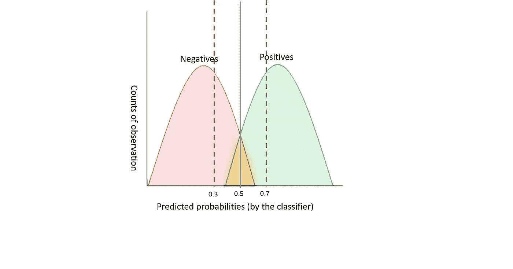
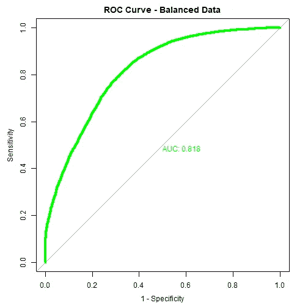

# 机器学习中的精度和召回率

> 原文：<https://medium.com/analytics-vidhya/precision-and-recall-in-machine-learning-c8a1b9638eeb?source=collection_archive---------6----------------------->

精确召回曲线及其在不平衡数据集上的性能


威廉·沃比在 [Unsplash](https://unsplash.com?utm_source=medium&utm_medium=referral) 上的照片

机器学习中的查准率和查全率是评价分类器的重要指标。这两种度量不仅在机器学习中，而且在信息检索、模式识别等方面都有重要的用途。

虽然有很多关于精确召回的博客和教程，但是关于精确召回曲线和曲线下面积的资料很少。

在这篇博客中，我试图从机器学习的角度，使用一个示例数据集和 r 代码来解释精确度、召回率及其相关的 F₁分数。
我也解释了相对于 ROC 曲线，在平衡和不平衡的数据上精度和召回是如何表现的。(关于 ROC 曲线及其在 R 中的 AUC，你可以参考我之前的一篇[博客](http://ruchideshpande.com/2020/06/roc-curve-and-auc-detailed-understanding-and-r-proc-package/))。

为了建立我们对精确度和召回率的理解，让我们从混淆矩阵开始。

# 混淆矩阵

让我们先用混淆矩阵来定义这些术语。


作者图片

精度= TP/TP+FP

召回= TP/TP+FN

简而言之，Precision 回答了这样一个问题:在积极预测的值中，有多少值被分类器预测为积极的？

回忆回答了这个问题——在实际的正值中，有多少值被分类器预测为正值？

现在，让我们理解精确度和召回率如何随着分类器的阈值而变化。



作者图片

这里，假设我的阈值最初为 0.5，因此当我的分类器预测高于 0.5 的概率时，我将其分配给肯定类，对于低于 0.5 的概率，我将其分配给否定类。现在，我把阈值提高到 0.7。精度会更高，因为我的 FP(实际为负，预测为正)会更低。另一方面，回忆会更低，因为现在 FN(实际上为正，但预测为负)会更高。

现在，让我们将阈值移动到一个较低的值，比如 0.3。这里精度会低一些，召回率会高一些。

从上面的讨论中，很明显我们需要一个度量来解释精确度和召回率。然后，可以在该指标表现良好的地方设置阈值。这个指标被称为 F₁分数，它是精确度和召回率的调和平均值。
数学上，F₁分数由下式给出:

F₁分数= 2 (P*R)/(P+R)

这里需要注意的重要一点是，F₁分数对于不平衡数据集也非常有效。

让我们深入研究，并通过一个示例数据集来实现上面的讨论。在这个过程中，我们还将查看精确召回曲线。

# 使用示例数据集的精确度和召回率

我使用了一个来自 Analytics vid hya hackathons-[“HR Analytics”](https://datahack.analyticsvidhya.com/contest/wns-analytics-hackathon-2018-1/)的数据集。我特意选择了这个数据集，因为它是不平衡数据集的一个很好的例子。这里的问题陈述是根据许多变量，如他们的服务记录、培训分数、上一年的评级等，来预测将被提升的员工。
在这里，我只使用了训练数据集，并进行了最少的数据预处理，以保持分析简单明了。

```
train <- read.csv("train.csv") 
summary(train) dim(train)
```

让我们使用 freq 函数来检查因变量以及它的不平衡程度。

```
library(summarytools)freq(train$is_promoted)## Frequencies  
## train$is_promoted  
## Type: Numeric  
## 
##                Freq   % Valid   % Valid Cum.   % Total   
## ----------- ------- --------- -------------- --------- 
##           0   50140     91.48       91.48       91.48          
##           1    4668      8.52       100.00      8.52         
##        <NA>       0                             0.00         
##       Total   54808    100.00       100.00     100.00 
```

此处的因变量“is_promoted”高度不平衡，8.5%的员工获得晋升，91.5%的员工未获得晋升。

让我们快速检查丢失的值。

```
train[train == ""] <- NA sapply(train,function(x) sum(is.na(x)))library(DataExplorer)plot_missing(train)
```


绘图输出(plot_missing)

变量“教育”和“前一年评级”都缺少值。我使用模式替代法进行缺失值插补。

```
mode_calc <- names(which.max(table(train$education))) 
mode_calc1 <- names(which.max(table(train$previous_year_rating))) train$education <- ifelse(is.na(train$education),mode_calc,train$education) train$previous_year_rating <- ifelse(is.na(train$previous_year_rating),mode_calc1,train$previous_year_rating)
```

将数据拆分为训练数据集和验证数据集。

```
# Training and validation 
data set.seed(123) 
partition <- sample(2, nrow(train), replace=TRUE, prob=c(0.7, 0.3)) tdata <- train[partition==1,] 
vdata <- train[partition==2,] 
vdata_X <- vdata[,-14] 
vdata_Y <- vdata[,14] 
dim(tdata)
dim(vdata)## [1] 38553 14## [1] 16255 14
```

现在，让我们拟合一个逻辑回归并检查 ROC 和精确回忆曲线。

```
# Logistic regression 
LR_fit <- glm(is_promoted~.,data=tdata,family = binomial()) summary(LR_fit) LR_predict <- predict(LR_fit,newdata = vdata_X ,type="response") LR_predict_bin <- ifelse(LR_predict > 0.5,1,0)
```

现在，让我们检查所有评估指标。

```
# Confusion matrix 
cm_lr <- table(vdata_Y,LR_predict_bin) 
# Accuracy 
accuracy <- (sum(diag(cm_lr))/sum(cm_lr)) 
# Precision 
precision <- cm_lr[2,2]/(cm_lr[2,2]+cm_lr[1,2]) 
# Recall 
recall <- cm_lr[2,2]/(cm_lr[2,2]+cm_lr[2,1]) 
# F₁ score 
f_score <- 2*(precision*recall)/(precision+recall)
```

准确率— 93%
精度— 0.79
召回率— 0.27
F₁评分— 0.4

这里模型的精度很高，虽然我没有在模型的微调上做任何努力。如此高的准确性可能是因为所用的数据集高度不平衡，即使我将所有员工分配到 0 类，准确性仍然很高。但是 F₁分数看起来并不乐观。让我们也检查一下 ROC 曲线。

```
library(pROC)par(pty="s") 
curve_roc <- roc(vdata_Y ~ LR_predict,plot=TRUE,print.auc=TRUE,col="blue",lwd =4,legacy.axes=TRUE,main="ROC Curve - Imbalanced Data")
```


roc()输出

观察到 AUC 很高，为 0.871。因此，很明显，在这种不平衡的数据集中，ROC 曲线通常不是一个很好的选择。

现在，让我们绘制精确回忆曲线或 PR 曲线，它的 AUC。
与 ROC 曲线一样，PR 曲线也是针对所有阈值绘制的。
我已经为此使用了 PRROC 包。

```
library(PRROC)curve_pr <- pr.curve(LR_predict,weights.class0 = vdata_Y,curve=TRUE) plot(curve_pr,main="PR Curve - Imbalanced Data")
```


参数曲线()输出

这里，PR 曲线 AUC = 0.53 似乎是合理的。

让我们更进一步，尝试平衡数据集，然后检查相同的评估指标。

SMOTE(合成少数过采样技术)是一种非常好的技术，它使用过采样方法来平衡数据集，以产生类平衡的数据。R 中的 ROSE 包使用了 SMOTE 技术，但是它只处理连续的和分类的数据，所以我们必须首先转换这里的几个变量的数据类型。

```
library(ROSE) 
set.seed(123456) 
train$is_promoted <- as.numeric(train$is_promoted) 
train$education <- as.numeric(train$education) train$previous_year_rating <- as.numeric(train$previous_year_rating) train_rose <- ROSE(is_promoted ~ .,data=train,seed=1)$datafreq(train_rose$is_promoted)## Frequencies  
## train_rose$is_promoted  
## Type: Numeric  
## 
##                Freq   % Valid   % Valid Cum.   % Total   
## ----------- ------- --------- -------------- --------- 
##           0   26181     49.96          49.96     49.96          
##           1   26218     50.04         100.00     50.04         
##        <NA>       0                               0.00         
##       Total   52399    100.00         100.00    100.00 
```

现在，数据与类 0 和类 1 都是 50%平衡。

再次将此数据集拆分为训练数据集和验证数据集。

```
set.seed(123) 
partition <- sample(2, nrow(train_rose), replace=TRUE, prob=c(0.7, 0.3)) 
trdata <- train_rose[partition==1,] 
vrdata <- train_rose[partition==2,] 
vrdata_X <- vrdata[,-14] 
vrdata_Y <- vrdata[,14] 
dim(trdata)
dim(vrdata)## [1] 36873 14## [1] 15526 14# Fitting logistic regression again on balanced dataset 
LR_fit1 <- glm(is_promoted ~.,data=trdata,family = binomial()) LR_predict1 <- predict(LR_fit1,newdata = vrdata_X ,type="response") LR_predict_bin1 <- ifelse(LR_predict1 > 0.5,1,0)# Confusion matrix 
cm_lr1 <- table(vrdata_Y,LR_predict_bin1) 
# Accuracy 
accuracy1 <- (sum(diag(cm_lr1))/sum(cm_lr1)) 
# Precision 
precision1 <- cm_lr1[2,2]/(cm_lr1[2,2]+cm_lr1[1,2]) 
# Recall 
recall1 <- cm_lr1[2,2]/(cm_lr1[2,2]+cm_lr1[2,1]) 
# F₁ score 
f_score1 <- 2*(precision1*recall1)/(precision1+recall1)
```

对于平衡数据集，下面是评估指标。这里需要注意的重要一点是，尽管准确性比早期的不平衡数据集有所降低，但 F₁评分已经从 0.4 提高到 0.73。
准确率— 73%
精度— 0.73
召回率— 0.72
F₁评分— 0.73

现在让我们检查平衡数据的 ROC 曲线。

```
par(pty="s") 
curve_roc1 <- roc(vrdata_Y ~ LR_predict1,plot=TRUE,print.auc=TRUE,col="green",lwd =4,legacy.axes=TRUE,main="ROC Curve - Balanced Data")
```



roc()输出

ROC AUC 从 0.871 略微下降到 0.818。让我们检查一下 PR 曲线的 AUC。

```
curve_pr1 <- pr.curve(LR_predict1,weights.class0 = vrdata_Y,curve=TRUE) plot(curve_pr1,main="PR Curve - Balanced Data")
```


参数曲线()输出

PR 曲线的 AUC 从 0.53 显著提高到 0.807。

# 结论

精确度、召回率和 F₁评分是测试模型的好方法，F₁评分同时考虑了精确度和召回率。理想情况下，我们希望精确度和召回率都很高，从而最小化 FP 和 FN。然而，在现实生活中，精确度和召回率之间的权衡是可取的，这通常取决于我们正在处理的领域。
在上面的数据集例子中，我们看到在不平衡数据集的情况下，PR 曲线比 ROC 曲线更可靠。

我希望本教程有助于更好地理解 PR 曲线及其在平衡和不平衡数据集中的表现。

感谢阅读。我很高兴收到关于内容的反馈、评论和任何问题。

## 参考

[1].Jan Grau 等人，PRROC:在 R 中计算和可视化精度-召回和接收器操作特性曲线

[2].不平衡数据:如何处理分类不平衡问题，AnalyticsVidhya[https://www . AnalyticsVidhya . com/blog/2017/03/unbalanced-Data-Classification/](https://www.analyticsvidhya.com/blog/2017/03/imbalanced-data-classification/)

开心连线 [LinkedIn](https://www.linkedin.com/in/ruchideshpande/) ！！