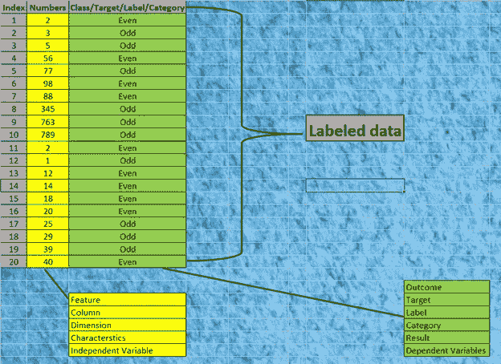
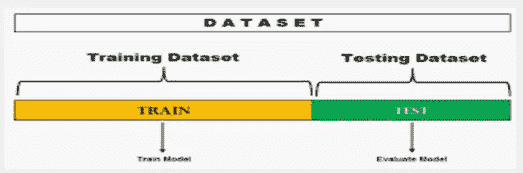
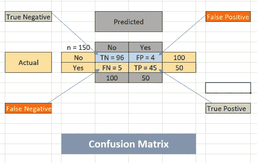
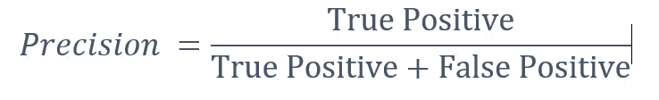
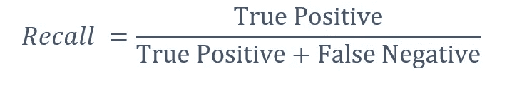
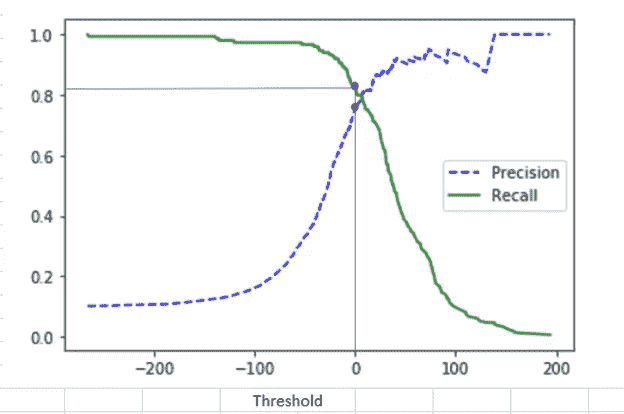
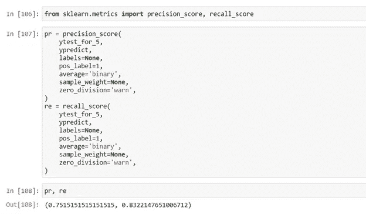
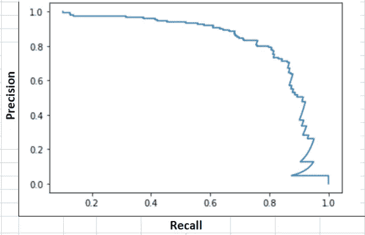
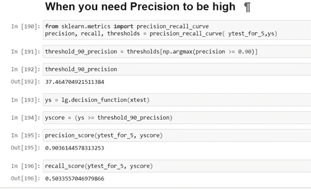
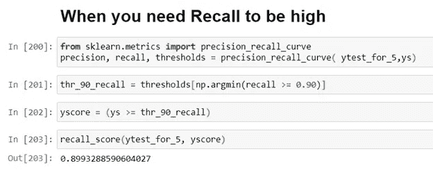

# 精确度/召回率的权衡

> 原文：<https://medium.com/analytics-vidhya/precision-recall-tradeoff-79e892d43134?source=collection_archive---------0----------------------->

# 精确度/召回率的权衡

在理解精度/召回率权衡的概念之前，让我们先理解精度和召回率。要理解精度和召回率，我们先来理解混淆矩阵。

# **混淆矩阵**

这是机器学习中分类的最重要的性能测量工具。正如我们所知，分类是机器学习中的监督任务之一，其中您向模型或算法提供标记的数据(标记的数据-其中您有针对特征或输入的输出或目标或类，例如下表所示)。

**标注数据**

在实时场景中，数据不会是这样的。我们必须收集数据，对数据进行数据预处理，使数据适合分类器。一旦数据经过预处理。我们将数据分为两部分，训练数据集用于训练模型，测试数据集用于测试数据的性能。将为 X 和 Y 创建两个集合，其中 X 是要素，Y 是目标或类。我们将使用 Xtrain 和 Ytrain(训练数据集)来训练分类器。一旦用标记的数据训练了模型。我们将使用 Xtest 上的分类器来计算 Ypredicted。作为 Ytest，我们已经有了 Xtest 上的实际 Y 值。因此，我们需要使用实际的 Y 来检查模型的性能，Y 是 Ytest，并使用分类器在 Xtest 上进行预测。

**全数据集**

评估分类器性能的一个更好的方法是查看混淆矩阵。我们使用混淆矩阵来衡量模型或分类器的性能。下面是混淆矩阵的例子。它是在 Iris 数据集上使用逻辑回归分类器创建的。让我们来理解混淆矩阵。

每一行代表实际的值或类或目标。

每列代表预测值或类别或目标。

混淆矩阵的形状是 N × N，其中 N 是不同的类别或目标，在这种情况下，它是二进制分类器，因此它具有用于肯定识别(Iris-Virginica)的 1 和用于否定识别的 0。

实际值或类别的数量等于预测值或类别的数量。

**真阳性:**当模型预测实例 A 被分类为鸢尾-海滨锦葵，并且它实际上是鸢尾-海滨锦葵花时。

**真否定:**当模型预测实例 A 被分类为非鸢尾-海滨花，并且它实际上不是鸢尾-海滨花时。

**假阳性:**当模型预测实例 A 被分类为鸢尾-海滨花，而它实际上不是鸢尾-海滨花时。

**假阴性:**当模型预测实例 A 被分类为不是鸢尾-海滨锦鸡儿，并且它实际上是鸢尾-海滨锦鸡儿花时。

**混淆矩阵**

**精度:**就是正面预测的精度。

**回忆:**正确检测到的阳性实例的比率。它也被称为**灵敏度**。

# 精确度/召回率的权衡:

有些情况下，你最关心的是精确度，而在其他情况下，你最关心的是召回率。

1.  高精度的例子à正如我们所知，我们有多个视频流平台，如著名的 YouTube，你有限制模式，以限制儿童的暴力和成人视频。因此模型通过减少假阳性来关注高精度{TP/(TP+FP)}。意思是，如果模型已经分类，视频对儿童有益，那么儿童观看它一定是安全的。因此，这可以通过减少假阳性来实现。这将使精度更高。

让我们以另一个模型为例，该模型检测商场中的商店扒手，同样，您的模型的目的是将客户分类为商店扒手，当他实际上是商店扒手时，意味着高精度{TP/(TP+FP)}并且假阳性低。

2)高召回率示例举个例子，您正在创建一个模型来检测患者是否患有疾病。在这种情况下，该模型的目标是具有高召回率{TP/(TP+FN)}意味着较少数量的假阴性。假如模型预测病人没有病，那么他一定没有病。想想反过来，如果它预测你没有疾病，你享受你的生活，后来你知道你在最后阶段生病了。

另一个例子是检测贷款申请人不是违约者的模型。同样，该模型的目标是高召回率{TP/(TP+FN)}。如果模型检测到申请人不是违约者，则申请人不得是违约者。所以，模型应该减少假阴性，这样会增加召回率。

可惜精度和召回率不能兼得。如果提高精度，就会降低召回率，反之亦然。这被称为**精度/召回权衡**。

在 Scikit-Learn 中，您不能直接设置阈值，但是它可以让您访问它用来进行预测的决策分数。分类器计算每个实例的决策得分，如果决策得分等于或高于阈值，则它预测肯定类，意味着实例属于该类或目标或输出。如果决策得分小于阈值，则实例属于负类或目标或输出。

您可以不调用分类器的 predict()方法，而是调用它的 decision_function()方法，该方法为每个实例返回一个分数，然后根据这些分数使用您想要的任何阈值进行预测:

大多数分类器使用等于 0 的阈值。如果您只是按如下方式计算 Ypredicted，结果将与通过 predict()方法计算的结果相同。因此，问题出现了，我们应该采取什么样的阈值。让我们看一些图表。

**精度和召回率对比阈值图**

如图所示，X 轴表示阈值，Y 轴表示精度和召回值。如您所见，如果增加阈值，精度会增加，但召回会减少；如果减少阈值，召回会增加，但精度会减少。在默认阈值(零)下，精确度低于 80%，召回率高于 80%。下面的截图取自我们用来绘制该图的相同代码。

**默认阈值(零)下的精度和召回率**

现在我们知道，如果我们需要更高的精度，threshold 需要从默认阈值(零)设置得更高，如果我们需要更高的召回，Threshold 需要从默认阈值(零)设置得更低。

另一种选择良好的精度/召回权衡的方法是直接根据召回来绘制精度，如下所示。

**精度对比召回图**

你可以看到，在 80%的召回率左右，准确率开始急剧下降。您可能希望在下降之前选择一个精度/召回率的折衷方案，例如，在大约 60%的召回率时。但是当然，选择取决于你的项目。

举个例子，你需要高精度，精度要等于或高于 90%。正如我们所知，默认阈值为 0，我们已经看到默认阈值精度为 75%，因此，为了实现更高的精度，我们需要提高酒吧。我们将使用 numpy.argmax()函数来搜索最低阈值，使您获得至少 90%的精度。

**为高精度设置更高的阈值**

举个例子，你需要更高的回忆。正如我们所知，在默认阈值(零)下，召回率约为 83%，我们知道要实现更高的召回率，我们需要降低门槛或阈值。我们将使用 numpy.argmin()函数来搜索最高阈值，以获得至少 90%的召回率。

**为高召回率设置较低的阈值**

感谢您阅读这个故事。你可以访问我的 YouTube 频道了解文章的执行情况。

请在媒体上关注我，并订阅我的 YouTube 频道，以便将来上传。

YouTube 解释链接:

*   YouTube 机器学习频道链接:[https://www.youtube.com/channel/UCeBUYcRJ2LDIhKxZvdqWG5g?view _ as =订户](https://www.youtube.com/channel/UCeBUYcRJ2LDIhKxZvdqWG5g?view_as=subscriber)
*   YouTube for precision/Recall 权衡英文:[https://www.youtube.com/watch?v=7kZl6xgD5UU&list = plbbnl 6 egubnhjqmlfwx 2 en 7 xmuqs 8 RV 8&index = 22](https://www.youtube.com/watch?v=7kZl6xgD5UU&list=PLbbnl6egUbNhJqmLfwX2eN7XmuqRS8rv8&index=22)
*   印度语的精准/召回权衡 YouTube:[https://www.youtube.com/watch?v=HK925dGGm30&list = plbbnl 6 egubnhjqmlfwx 2e n 7 xmuqs 8 RV 8&index = 21](https://www.youtube.com/watch?v=HK925dGGm30&list=PLbbnl6egUbNhJqmLfwX2eN7XmuqRS8rv8&index=21)
*   GitHub 代码链接:[https://GitHub . com/amitupadhyay 6/My-Python/blob/Classification/class ification/Precision % 20 recall % 20 trade off % 20 binary % 20 classifier . ipynb](https://github.com/amitupadhyay6/My-Python/blob/Classification/Classification/Precision%20Recall%20Tradeoff%20Binary%20Classifier.ipynb)