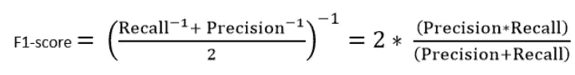

# 精确与回忆——每个机器学习者的直观指南

> 原文：<https://medium.com/analytics-vidhya/precision-vs-recall-an-intuitive-guide-for-every-machine-learning-person-796a6caa3842?source=collection_archive---------15----------------------->

# 概观

*   精确度和召回率是机器学习中两个关键但被误解的主题
*   我们将讨论什么是精确度和召回率，它们如何工作，以及它们在评估机器学习模型中的作用
*   我们还将了解曲线下面积(AUC)和精确度术语

# 介绍

向任何机器学习专业人士或数据科学家询问他们学习旅程中最容易混淆的概念。答案总是倾向于精确和回忆。

精确和回忆之间的区别实际上很容易记住——但只有当你真正理解了每个术语的含义之后。但是很多时候，我可以证明这一点，专家们倾向于提供不成熟的解释，这让新来者更加困惑。

所以让我们在这篇文章中澄清一下。


对于任何机器学习模型，我们知道实现模型的“良好拟合”是极其重要的。这包括实现欠拟合和过拟合之间的平衡，或者换句话说，偏差和方差之间的权衡。

然而，当涉及到分类时，有另一个权衡常常被忽视，而偏向于[偏差-方差权衡。](https://www.analyticsvidhya.com/blog/2020/08/bias-and-variance-tradeoff-machine-learning/?utm_source=blog&utm_medium=precision_and_recall)这是精度-召回的权衡。不平衡的类通常出现在数据集中，当涉及到特定的用例时，我们实际上希望更加重视精度和召回指标，以及如何实现它们之间的平衡。

但是，怎么做呢？在本文中，我们将通过关注精确度和召回率来探索分类评估指标。我们还将学习如何通过一个数据集和一个简单的分类算法在 Python 中计算这些指标。所以，让我们开始吧！

*你可以在这里深入了解评测指标-* [*机器学习模型评测指标*](https://courses.analyticsvidhya.com/courses/evaluation-metrics-for-machine-learning-models?utm_source=blog&utm_medium=precision_and_recall) *。*

# 目录

1.  理解问题陈述
2.  什么是精准？
3.  什么是回忆？
4.  最简单的评估指标——准确性
5.  F1 分数的作用
6.  著名的精确召回权衡
7.  了解曲线下面积(AUC)

# 理解问题陈述

我坚信边做边学。因此，在整篇文章中，我们将用实际术语来讨论——通过使用数据集。

让我们来看看 UCI 资料库中流行的心脏病数据集。这里，我们必须预测患者是否患有心脏病，或者是否没有使用给定的特征集。你可以从[这里](https://www.kaggle.com/ronitf/heart-disease-uci)下载干净的数据集。

由于本文只关注模型评估指标，我们将使用最简单的分类器 kNN 分类模型来进行预测。

和往常一样，我们将从导入必要的库和包开始:

```
import numpy as np
import pandas as pd
from sklearn.model_selection import train_test_split
from sklearn.preprocessing import StandardScaler
from sklearn.neighbors import KNeighborsClassifier
from sklearn.metrics import confusion_matrix
from sklearn.metrics import classification_report
from sklearn.metrics import roc_curve
from sklearn.metrics import roc_auc_score
from sklearn.metrics import precision_recall_curve
from sklearn.metrics import auc
import matplotlib.pyplot as plt
import seaborn as sns
%matplotlib inline
```

然后，让我们来看看我们正在处理的数据和目标变量:

```
data_file_path = '../input/heart-disease-uci/heart.csv'
data_df = pd.read_csv(data_file_path)

#To get information on the number of entries and the datatypes of the features
data_df.head()
```


让我们检查一下是否有遗漏的值:

```
data_df.isnull().sum()
```


没有丢失的值。现在我们可以看看有多少患者实际上患有心脏病(1)，有多少没有(0):

```
#2\. distribution of target variable.
sns.countplot(data_df['target'])

# Add labels
plt.title('Countplot of Target')
plt.xlabel('target')
plt.ylabel('Patients')
plt.show()
```

这是下面的计数图:


让我们从分割我们的训练和测试数据以及我们的输入和目标变量开始。由于我们使用的是 [KNN](https://www.analyticsvidhya.com/blog/2018/03/introduction-k-neighbours-algorithm-clustering/) ，因此也必须扩展我们的数据集:

```
y = data_df["target"].values
x = data_df.drop(["target"], axis = 1)

#Scaling - mandatory for knn
from sklearn.preprocessing import StandardScaler
ss = StandardScaler()
x = ss.fit_transform(x)

#Splitting into train and test
X_train, X_test, y_train, y_test = train_test_split(x, y, test_size = 0.3) # 70% training and 30% test
```

选择 k 的最佳值背后的直觉超出了本文的范围，但是我们应该知道，当我们获得 k 的最佳值的最高测试分数时，我们可以确定 k 的最佳值。为此，我们可以评估多达 20 个最近邻的训练和测试分数:

```
train_score = []
test_score = []
k_vals = []

for k in range(1, 21):
    k_vals.append(k)
    knn = KNeighborsClassifier(n_neighbors = k)
    knn.fit(X_train, y_train)

    tr_score = knn.score(X_train, y_train)
    train_score.append(tr_score)

    te_score = knn.score(X_test, y_test)
    test_score.append(te_score)
```

要评估最大测试分数及其相关的 k 值，请运行以下命令:

```
## score that comes from the testing set only
max_test_score = max(test_score)test_scores_ind = [i for i, v in enumerate(test_score) if v == max_test_score]print('Max test score {} and k = {}'.format(max_test_score * 100, list(map(lambda x: x + 1, test_scores_ind))))
```


因此，我们获得了 k 的最佳值为 3、11 或 20，得分为 83.5。我们将最终确定其中一个值，并相应地拟合模型:

```
#Setup a knn classifier with k neighbors
knn = KNeighborsClassifier(3)

knn.fit(X_train, y_train)
knn.score(X_test, y_test)
```


现在，我们如何评价这个模型是不是一个‘好’模型？为此，我们使用一种叫做[混淆矩阵](https://www.analyticsvidhya.com/blog/2020/04/confusion-matrix-machine-learning/)的东西:

```
y_pred = knn.predict(X_test)confusion_matrix(y_test,y_pred)pd.crosstab(y_test, y_pred, rownames = ['Actual'], colnames =['Predicted'], margins = True)
```


混淆矩阵有助于我们深入了解我们的预测有多正确，以及它们与实际值的对比如何。

从我们的训练和测试数据中，我们已经知道我们的测试数据由 91 个数据点组成。这是最后第 3 行第 3 列的值。我们还注意到有一些实际值和预测值。实际值是最初归类为 0 或 1 的数据点的数量。预测值是我们的 KNN 模型预测为 0 或 1 的数据点的数量。

实际值为:

*   实际上没有心脏病的病人= 41
*   真正患有心脏病的患者= 50 人

预测值为:

*   预测没有心脏病的患者人数= 40
*   预测患有心脏病的患者人数= 51

我们上面得到的所有值都有一个项。让我们一个一个来看:

1.  患者实际上没有心脏病，我们的模型也预测没有心脏病的情况称为**真阴性。对于我们的矩阵，真阴性= 33。**
2.  患者实际上患有心脏病并且我们的模型也预测患有心脏病的病例被称为**真阳性。**对于我们的矩阵，真阳性= 43
3.  然而，有一些情况下，病人实际上没有心脏病，但我们的模型预测他们有。这种误差是 I 型误差，我们称这些值为**误报。**对于我们的矩阵，假阳性= 8
4.  类似地，在某些情况下，病人实际上有心脏病，但我们的模型预测他/她没有。这种误差是第二类误差，我们称这些值为**假阴性。对于我们的矩阵，假阴性= 7**

# 什么是精准？

好的——现在我们来看这篇文章的关键。精确到底是什么？而以上这些学习又和它有什么关系呢？

用最简单的话来说，精确度是真阳性和所有阳性之间的比率。对于我们的问题陈述，这将是我们在所有实际患有心脏病的患者中正确识别出患有心脏病的患者的度量。数学上:


我们模型的精度是多少？是的，它是 0.843，或者，当它预测病人有心脏病时，它在 84%的情况下是正确的。

精度也为我们提供了相关数据点的度量。重要的是，我们不要开始治疗实际上没有心脏病，但我们的模型预测有心脏病的病人。

# 什么是回忆？

召回是我们的模型正确识别真阳性的量度。因此，对于所有真正患有心脏病的病人，回忆告诉我们有多少人被我们正确地诊断为患有心脏病。数学上:


对于我们的模型，回忆= 0.86。回忆也给出了我们的模型能够多精确地识别相关数据的度量。我们称之为敏感度或真阳性率。如果患者患有心脏病，但由于我们的模型预测到了这一点，因此没有对他/她进行治疗，该怎么办？这是我们希望避免的情况！

# 最容易理解的指标——准确性

现在我们来看一个最简单的指标，准确性。准确度是正确预测总数与预测总数之比。你能猜出精确度的公式是什么吗？


对于我们的模型，精确度将= 0.835。

使用准确性作为我们模型的定义标准从直觉上来说是有意义的，但是通常情况下，使用精确度和召回率也是明智的。可能还有其他情况，我们的准确率非常高，但我们的精确度或召回率很低。理想情况下，对于我们的模型，我们希望完全避免患者患有心脏病的任何情况，但我们的模型将他归类为没有心脏病，即，以高回忆为目标。

另一方面，对于患者没有患有心脏病并且我们的模型预测相反的情况，我们也希望避免治疗没有心脏病的患者(当输入参数可能指示不同的疾病时这是至关重要的，但是我们最终治疗了他/她心脏病)。

虽然我们的目标是高精度和高召回值，但同时实现这两个目标是不可能的。例如，如果我们把模型改成一个给我们高回忆的模型，我们可能会发现所有实际上患有心脏病的病人，但我们可能最终会给许多没有患心脏病的病人提供治疗。

同样，如果我们的目标是高精度，以避免给予任何错误和不必要的治疗，我们最终会让许多实际上患有心脏病的患者得不到任何治疗。

# F1 分数的作用

对精确度的理解让我们意识到，我们需要在精确度和召回率之间进行权衡。我们首先需要决定哪个对我们的分类问题更重要。

例如，对于我们的数据集，我们可以认为实现高召回率比获得高精确度更重要——我们希望检测尽可能多的心脏病患者。对于其他一些模型，如对银行客户是否是贷款违约者进行分类，需要有较高的精度，因为银行不希望失去那些根据模型预测会违约而被拒绝贷款的客户。

在很多情况下，准确率和召回率同样重要。例如，对于我们的模型，如果医生告诉我们，被错误地分类为患有心脏病的患者同样重要，因为他们可能是其他疾病的指示，那么我们的目标不仅是高召回率，而且是高精确度。

在这种情况下，我们使用 F1 分数。f1-得分是精确度和召回率的调和平均值:



这更容易操作，因为现在，我们可以只瞄准一个好的 F1 分数，而不是平衡精度和召回值，这将表明一个好的精度和好的召回值。

我们也可以使用 sklearn 为我们的数据集生成上述指标:

```
print(classification_report(y_test, y_pred))
```


# 受试者工作特征曲线

除了上述各项，我们还可以从混淆矩阵中计算出更多的值:

1.  假阳性率(FPR):它是假阳性与实际阴性数的比率。在我们的模型中，这是一个衡量标准，用来衡量在所有实际上没有心脏病的患者中，模型预测有多少人患有心脏病。对于我们的数据，FPR = 0.195
2.  真阴性率(TNR)或特异性:它是真阴性和实际阴性数的比率。对于我们的模型来说，它是模型从所有实际上没有心脏病的患者中正确预测患者没有心脏病的病例的数量。上述数据的 TNR = 0.804。从这两个定义，我们也可以得出结论，特异性或 TNR = 1-FPR

我们还可以使用 ROC 曲线和 PRC 曲线可视化精度和召回率。

# 1.ROC 曲线(接收机工作特性曲线)

这是 TPR(y 轴)和 FPR(x 轴)之间的曲线。由于我们的模型基于为每一类生成的概率将患者分类为患有心脏病或不患有心脏病，因此我们也可以决定概率的阈值。

例如，我们希望将阈值设置为 0.4。这意味着如果患者患有心脏病的概率大于 0.4，则该模型会将数据点/患者分类为患有心脏病。这显然会给出高召回值并减少误报的数量。类似地，我们可以使用 ROC 曲线可视化我们的模型在不同阈值下的表现。

让我们为 k = 3 的模型生成一条 ROC 曲线。

```
y_pred_proba = knn.predict_proba(X_test)[:,1]
fpr, tpr, thresholds = roc_curve(y_test, y_pred_proba)
```


## AUC 解释-

*   在最低点，即在(0，0)-阈值设置为 1.0。这意味着我们的模型将所有患者分类为没有心脏病。
*   在最高点，即在(1，1)，阈值设置为 0.0。这意味着我们的模型将所有患者归类为患有心脏病。
*   曲线的其余部分是阈值在 0 和 1 之间的 FPR 和 TPR 的值。在某个阈值，我们观察到对于接近 0 的 FPR，我们正在实现接近 1 的 TPR。这是模型将几乎完美地预测心脏病患者的时候。
*   以曲线和轴为边界的面积称为曲线下面积(AUC)。正是这个区域被认为是一个好模型的度量。这个指标的范围从 0 到 1，我们应该以较高的 AUC 值为目标。AUC 高的车型称为**技术好的车型**。让我们计算我们的模型和上述图的 AUC 分数:

```
roc_auc_score(y_test, y_pred_proba)
```


*   我们得到的 AUC 值为 0.868，这是一个非常好的分数！用最简单的话来说，这意味着该模型将能够在 87%的情况下区分心脏病患者和非心脏病患者。我们可以提高这个分数，我建议你尝试不同的超参数值。
*   对角线是 AUC 为 0.5 的随机模型，这是一个没有技巧的模型，就像进行随机预测一样。你能猜到原因吗？

# 2.精确召回曲线

顾名思义，这条曲线是精度(y 轴)和召回率(x 轴)的直接表示。如果你观察我们上面的精确和回忆的定义和公式，你会注意到我们在任何时候都没有使用真正的否定(没有心脏病的实际人数)。

这对于我们有一个不平衡的数据集并且阴性的数量远大于阳性的情况(或者当没有心脏病的患者的数量远大于患有心脏病的患者的数量)特别有用。在这种情况下，我们更关心的是尽可能正确地检测出心脏病患者，而不需要 TNR。

像 ROC 一样，我们绘制了不同阈值的精确度和召回率:

```
precision, recall, thresholds = precision_recall_curve(y_test, y_pred_proba)

plt.figure(figsize = (10,8))
plt.plot([0, 1], [0.5, 0.5],'k--')
plt.plot(recall, precision, label = 'Knn')
plt.xlabel('recall')
plt.ylabel('precision')
plt.title('Knn(n_neighbors = 8) PRC curve')
plt.show()
```


## 中国解释:

*   在最低点，即在(0，0)-阈值设置为 1.0。这意味着我们的模型没有区分心脏病患者和非心脏病患者。
*   在最高点，即在(1，1)，阈值设置为 0.0。这意味着我们的准确率和召回率都很高，并且模型能够完美地区分。
*   曲线的其余部分是 0 和 1 之间的阈值的精度和召回值。我们的目标是使曲线尽可能接近(1，1)——这意味着良好的精确度和召回率。
*   与 ROC 类似，以曲线和轴为边界的面积是曲线下面积(AUC)。将此区域视为一个好模型的衡量标准。AUC 的范围从 0 到 1。因此，我们应该以较高的 AUC 值为目标。让我们为我们的模型和上面的图计算 AUC:

```
# calculate precision-recall AUC
auc_prc = auc(recall, precision)
print(auc_prc)
```


和以前一样，我们获得了 90%左右的良好 AUC。此外，该模型可以在召回率为 0 的情况下实现高精度，并且可以通过牺牲 50%的精度来实现高召回率。

# 结束注释

总之，在本文中，我们看到了如何评估一个分类模型，尤其是关注精度和召回率，并在它们之间找到平衡。此外，我们解释了如何使用不同的度量和混淆矩阵来表示我们的模型性能。

这里有一篇附加文章供你了解评测指标- [机器学习的 11 个重要模型评测指标大家都应该知道](https://www.analyticsvidhya.com/blog/2019/08/11-important-model-evaluation-error-metrics/?utm_source=blog&utm_medium=precision_and_recall)

*另外，如果你想开始学习机器学习，这里有一些免费的资源给你-*

我希望这篇文章能帮助你理解精确和召回之间的权衡。如果有任何疑问，请在下面的评论中告诉我。

*原载于 2020 年 9 月 3 日 https://www.analyticsvidhya.com*[](https://www.analyticsvidhya.com/blog/2020/09/precision-recall-machine-learning/)**。**