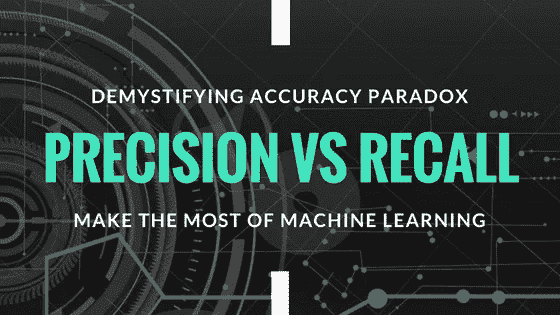

# 通过示例了解精确度和召回率

> 原文：<https://medium.com/analytics-vidhya/precision-vs-recall-with-example-60a77578d143?source=collection_archive---------8----------------------->

> 绩效衡量意味着衡量我们的成果和结果。精确度和召回率是两个极其重要的性能指标。

在这篇博客中，我将重点讨论评估我们的分类模型的性能指标。具体来说，我将通过现实生活中的例子来展示模型评估指标的意义——精确度和召回率，并解释其利弊…