# 使用深度学习从艺术中预测艺术家

> 原文：<https://medium.com/analytics-vidhya/predict-artist-from-art-using-deep-learning-9f465f8879d7?source=collection_archive---------2----------------------->

## 美术绘画的艺术家鉴定

# 问题陈述

从艺术绘画中预测艺术家是一项具有挑战性的任务，这项任务主要由受过广泛训练和专业知识的艺术史学家来完成。艺术家识别是在没有其他信息的情况下识别一幅画的艺术家的任务。这是对艺术品编目的一个重要要求(做一个同类型物品的系统清单)，尤其是在艺术品日益数字化的情况下。艺术作品的收藏越来越多，目的是让所有的艺术作品都可以很容易地在网上获得。

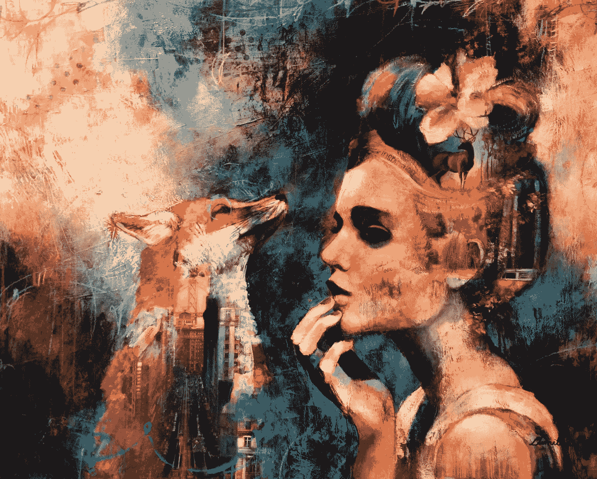

迪米特拉米兰肖像艺术链接:https://in.pinterest.com/pin/522628731742912888/?lp =真

一种可靠的鉴别艺术家的方法不仅有助于给艺术品贴标签，也有助于鉴别赝品，这是另一个艺术史问题。因此，我决定致力于此，而以前人们已经在研究论文和 Kaggle 竞赛中使用不同的神经网络技术进行了这方面的工作。我想，为什么不将像 ResNet50 神经网络这样的先进技术应用于图像分类任务呢？让我们开始实际实施本案例研究。

# 深度学习解决问题的大任务

在这里阅读一篇研究论文[时](https://www.ripublication.com/ijaer17/ijaerv12n4_17.pdf)，我开始了解这个问题，这激发了我的工作热情，因为我经常画素描和油画。深度学习的重大任务是通过给定的一种艺术来预测艺术家。我们知道计算机不理解像给定的文本和图像这样的直接交互。计算机不会解决我们的问题。我们必须将这些文本和图像转换为矢量形式，或者我们可以说二进制形式为 0，1。**如何将图像转换成计算机可以理解的矢量形式？**这里有一个简单的图像，用来理解转换成向量/矩阵形式的二进制数据为 0，1 的图像。

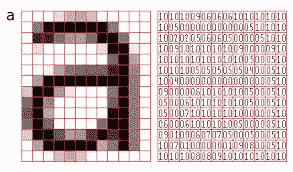

[图片](https://www.google.com/search?q=image+representation+in+matrix+form&rlz=1C1CHBD_enIN772IN772&sxsrf=ACYBGNTNdQfGQ2RojplRlVCj5XLaNT5ecw:1576783113628&source=lnms&tbm=isch&sa=X&ved=2ahUKEwjonIDrtsLmAhXA63MBHXmEACoQ_AUoAXoECA4QAw&biw=1366&bih=614#imgrc=TJVTRO-LW-GquM:)

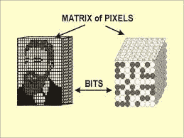

[图片](https://www.google.com/search?q=image+representation+in+matrix+form&rlz=1C1CHBD_enIN772IN772&sxsrf=ACYBGNTNdQfGQ2RojplRlVCj5XLaNT5ecw:1576783113628&source=lnms&tbm=isch&sa=X&ved=2ahUKEwjonIDrtsLmAhXA63MBHXmEACoQ_AUoAXoECA4QAw&biw=1366&bih=614#imgrc=TJVTRO-LW-GquM:)

# **导入库**

直到现在我们才意识到这个案例研究的问题所在。现在是时候导入 python 库来开始分析了。python 包的一大优势是它包含大量用于数据分析的库。

```
**import** **pandas** **as** **pd**
**import** **numpy** **as** **np**
**import** **matplotlib.pyplot** **as** **plt**
**import** **json**
**import** **os**
**from** **tqdm** **import** tqdm, tqdm_notebook
**import** **random**

**import** **tensorflow** **as** **tf**
**from** **tensorflow.keras.models** **import** Sequential, Model
**from** **tensorflow.keras.layers** **import** *
**from** **tensorflow.keras.optimizers** **import** * 
**from** **tensorflow.keras.applications** **import** *
**from** **tensorflow.keras.callbacks** **import** *
**from** **tensorflow.keras.initializers** **import** *
**from** **tensorflow.keras.preprocessing.image** **import** ImageDataGenerator

**from** **numpy.random** **import** seed
seed(1) #Seed function is used to save the state of random function
**from** **tensorflow** **import** set_random_seed
set_random_seed(1)
```

# 探索性数据分析

我们已经完成了库的导入，现在下一个任务是探索性的数据分析，在这方面，我们必须获取数据并对其应用各种统计分析。做 EDA 的目的是在数据中寻找意义或模式。EDA 告诉我们更深层次的数据视图，在那里我们可以理解问题。坦率地说，EDA 是人工智能社区中的艺术过程，你应用得越好，你对数据的理解就越好。

```
print(os.listdir("../input"))
```

**输入**是主文件夹和里面的其余文件，所以代码处理访问这个文件。

借助熊猫数据框访问 **artists.csv**

```
artists = pd.read_csv('../input/artists.csv')
artists.shape
*# we have 50 rows and 8 col total.*output: (50, 8)
```

我们已经阅读了 csv 文件，现在对下面的数据进行简单的分析，我已经做了一些简单的分析来理解文件。

```
artists.info() #info() gives information about file
*# from here we can see our features*<class 'pandas.core.frame.DataFrame'>
RangeIndex: 50 entries, 0 to 49
Data columns (total 8 columns):
id             50 non-null int64
name           50 non-null object
years          50 non-null object
genre          50 non-null object
nationality    50 non-null object
bio            50 non-null object
wikipedia      50 non-null object
paintings      50 non-null int64
dtypes: int64(2), object(6)
memory usage: 3.2+ KB 
```

我们可以看到关于我们的文件的信息，它包含 50 行和 8 列(身份证，姓名，年份..等等)。

**数据预处理**

数据预处理是一项任务，我们必须根据我们的解决策略操作数据，并将数据从原始数据引导到有意义的数据。这里我首先根据特征**绘画**对数据进行排序，这样我所有的数据都按照它们的绘画名称进行排序。我们已经为我们的分析取了 200 幅画>只是取了样本数据。

```
*#https://en.wikipedia.org/wiki/Digital_image_processing*
*#Adding some more col as part of data preprocessing*
*# Sort artists by number of paintings*
*# above code shows "painting" feature so as to group paintings to respecting painting.*
artists = artists.sort_values(by=['paintings'], ascending=**False**)*# Create a dataframe with artists having more than 200 paintings*
artists_top = artists[artists['paintings'] >= 200].reset_index()
artists_top = artists_top[['name', 'paintings']]
*#artists_top['class_weight'] = max(artists_top.paintings)/artists_top.paintings*
artists_top['class_weight'] = artists_top.paintings.sum() / (artists_top.shape[0] * artists_top.paintings)
artists_top
```

**特征工程**

我做了一个**功能设计**只是在这个名为“class_weight”的功能中增加了一个功能，这个功能增加了绘画的重量为什么我们想要 ***重量*** 实际上是简单的增加重量，它告诉我们特定事物的重要性，所以我只是通过创建新功能**来增加重量。**

```
artists_top['class_weight'] = artists_top.paintings.sum() / (artists_top.shape[0] * artists_top.paintings)
```

把重量放在这里是结果

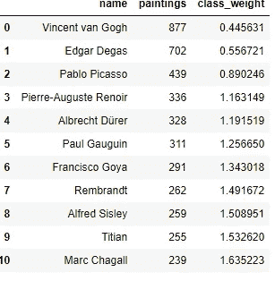

首先，我们添加了新的要素 class_weight，此处显示的是每行的权重。

**获得顶级艺术家的画作**

在这段代码中，我们获取顶级艺术家的画作，并检查我的文件和名字是否存在。

```
*# Explore images of top artists*
images_dir = '../input/images/images'  *#my files with this directory and folder you can change as u want to.*
artists_dirs = os.listdir(images_dir)
artists_top_name = artists_top['name'].str.replace(' ', '_').values

*# See if all directories exist*
**for** name **in** artists_top_name:
    **if** os.path.exists(os.path.join(images_dir, name)):
        print("Found -->", os.path.join(images_dir, name))
    **else**:
        print("Did not find -->", os.path.join(images_dir, name))
```

**展示随机绘画**

到目前为止，我们已经对工程和数据进行了预处理，并对我们的数据进行了一些操作，现在是时候展示一些随机的绘画，以便清晰地可视化/理解正在发生的事情了。

```
*#https://www.analyticsvidhya.com/blog/2019/08/3-techniques-extract-features-from-image-data-machine-learning-python/*
*# Print few random paintings*
n = 5  *# taking 5 random pic*
fig, axes = plt.subplots(1, n, figsize=(20,10))

**for** i **in** range(n):
    random_artist = random.choice(artists_top_name)
    random_image = random.choice(os.listdir(os.path.join(images_dir, random_artist)))
    random_image_file = os.path.join(images_dir, random_artist, random_image)
    image = plt.imread(random_image_file)
    axes[i].imshow(image)
    axes[i].set_title("Artist: " + random_artist.replace('_', ' '))
    axes[i].axis('off')

plt.show()
```

在名为 **matplotlib** 的 python 库的帮助下，我们可以显示图像并绘制图表，这里我们最多显示了 5 幅图像，在子图中我们有 **figsize=(20，10)** 这基本上设置了图像的宽度和高度，您也可以设置自己的宽度和高度。 **plt.imread()** 这允许我们读取图像文件。

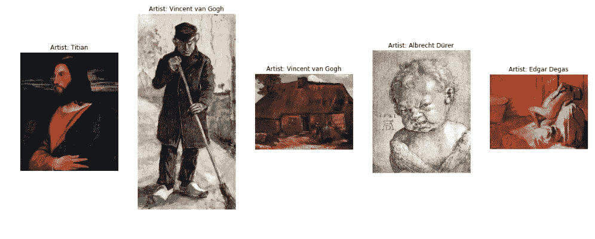

5 随机图像与艺术家的名字按照我们在代码中的设计

**数据扩充**

数据扩充是一种策略，使从业者能够显著增加可用于训练模型的**数据**的多样性，而无需实际收集新数据。这种技术像填充、裁剪、移动、翻转等。所以这里我也在图像上使用了增强技术，为了增加数据，这里我上下翻转。

**一个简单的增强例子**

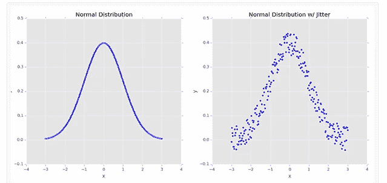

***左:***250 个数据点的样本，精确地遵循正态分布。 ***右:*** 给分布添加少量随机“抖动”。这种类型的数据扩充增加了我们网络的可推广性

```
*#https://www.kaggle.com/supratimhaldar/*
*# Augment data*
batch_size = 16
train_input_shape = (224, 224, 3)
n_classes = artists_top.shape[0]

train_datagen = ImageDataGenerator(validation_split=0.2,
                                   rescale=1./255.,
                                   *#rotation_range=45,*
                                   *#width_shift_range=0.5,*
                                   *#height_shift_range=0.5,*
                                   shear_range=5,
                                   *#zoom_range=0.7,*
                                   horizontal_flip=**True**,
                                   vertical_flip=**True**,
                                  )

train_generator = train_datagen.flow_from_directory(directory=images_dir,
                                                    class_mode='categorical',
                                                    target_size=train_input_shape[0:2],
                                                    batch_size=batch_size,
                                                    subset="training",
shuffle=**True**,
                                                    classes=artists_top_name.tolist()
                                                   )

valid_generator = train_datagen.flow_from_directory(directory=images_dir,
                                                    class_mode='categorical',
                                                    target_size=train_input_shape[0:2],
                                                    batch_size=batch_size,
                                                    subset="validation",
shuffle=**True**,
                                                    classes=artists_top_name.tolist()
                                                   )

STEP_SIZE_TRAIN = train_generator.n//train_generator.batch_size
STEP_SIZE_VALID = valid_generator.n//valid_generator.batch_size
print("Total number of batches =", STEP_SIZE_TRAIN, "and", STEP_SIZE_VALID)
```

这里 **batch_size =16** 我已经使用过，你可以使用，即使你增加 batch_size，它也会给出更准确的梯度，同时我们处理大量图像的损失。**imagedata generator()**imagedata generator 接受原始数据，*随机地*转换它，并且只返回新的、转换后的数据。

**打印增强版随机绘画**

```
*#https://www.kaggle.com/supratimhaldar/*
*# Print a random paintings and it's random augmented version*
fig, axes = plt.subplots(1, 2, figsize=(20,10))

random_artist = random.choice(artists_top_name)
random_image = random.choice(os.listdir(os.path.join(images_dir, random_artist)))
random_image_file = os.path.join(images_dir, random_artist, random_image)

*# Original image*
image = plt.imread(random_image_file)
axes[0].imshow(image)
axes[0].set_title("An original Image of " + random_artist.replace('_', ' '))
axes[0].axis('off')

*# Transformed image*
aug_image = train_datagen.random_transform(image)
axes[1].imshow(aug_image)
axes[1].set_title("A transformed Image of " + random_artist.replace('_', ' '))
axes[1].axis('off')

plt.show()
```

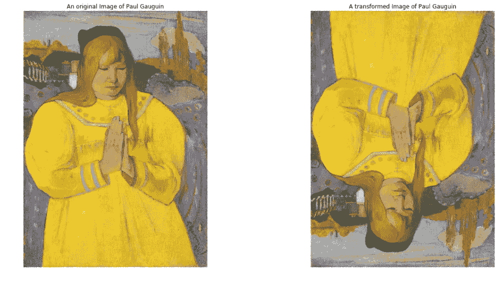

在这里我们可以看到两幅图像，一幅是原始的，另一幅是增强版的

# 建立模型

现在是时候建立模型来训练数据了，我已经结束了我的探索性数据分析部分，但仍有更多的技术要做。如果你对 EDA 有一些新的想法，最好马上实现它，以便了解理解数据和特征工程的新方法。因此，在这一部分，我们将建立一个模型来训练我们的数据，正如我之前提到的，我将使用最先进的技术，如 **ResNet50** 模型。我可以使用 CNN(卷积神经网络)，但当我阅读研究论文时，ResNet50 网络在图像数据方面做了大量工作，因此让我们开始这一部分。

**神经网络架构**

在图(a)中:告诉我们神经网络是如何工作的，圆形部分是激活函数 sum(Xi*Wi)i=1 到 n，这意味着它确切地充当神经元，当输入给定 w1，w2，…wn 是权重时该神经元触发，因此输入+权重给定函数 f(sum(XiWi))最后 Yi 作为这种称为神经网络的输出组合。在我们的例子中，我们使用 ReLu 激活。

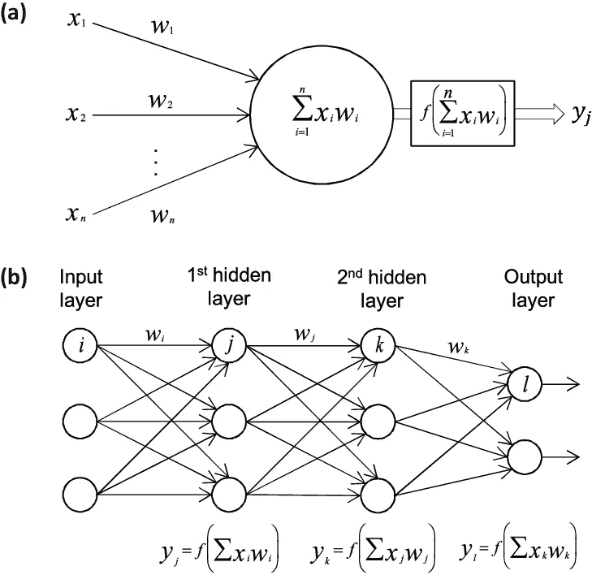

```
*#https://www.quora.com/ResNet50-tutorial*
*# Load pre-trained model*
base_model = ResNet50(weights='imagenet', include_top=**False**, input_shape=train_input_shape)
*# I am using ResNet50 neural network it performs well for image data.*
**for** layer **in** base_model.layers:
    layer.trainable = **True**
```

在这段代码中，我从 Imagenet 数据集获取图像数据。ImageNet 是一个根据 WordNet 层次结构组织的图像数据库，供研究人员和数据科学家出于研究目的免费使用。

**ResNet 模型实现**

让我们首先了解 ResNet50 模型的架构，它也称为身份层，因为身份层的唯一目的是跳过连接，这意味着在 ResNet 模型中跳过一层，这有助于减少消失梯度问题。下面的模型描述了在 ReLu 激活和最后的 x 之间的权重层 f(x ),在跳过连接之后，因此最后 f(x)+x。

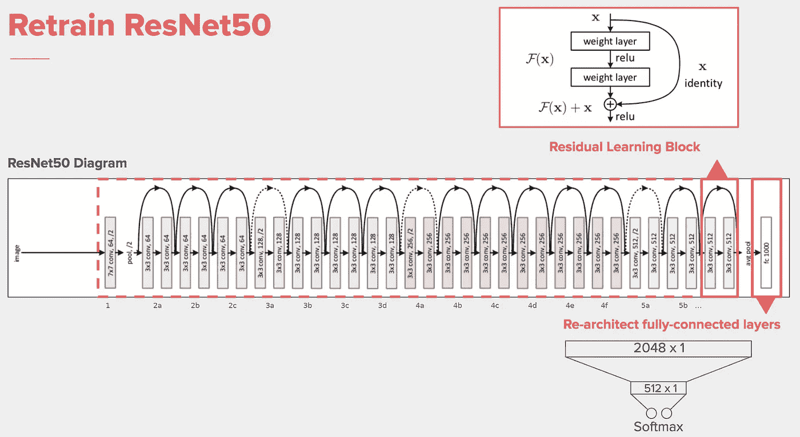

[从堆栈溢出](https://stackoverflow.com/questions/54207410/how-to-split-resnet50-model-from-top-as-well-as-from-bottom)

**当我们使用 **sigmoid** 或 **tanh** 激活函数时，会出现消失梯度**问题，因为当我们对此激活函数求导时，旧导数( *W_old* )和新导数( *W_new* )变得相等，并且在反向传播更新函数(-ndL/dw)变为< 0 后，会出现消失梯度问题。网络损耗(dL)相对于网络权重(dw)导数的η(n)倍导数

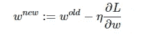

[堆叠交换](https://stats.stackexchange.com/questions/301285/what-is-vanishing-gradient)

上面的等式告诉我们，在反向传播过程中，当权重被更新时，早期层(接近输入)通过乘以后面层(接近输出)的梯度而获得，因此如果后面层的梯度小于 1，那么它们的乘积很快消失。

```
*#https://github.com/keras-team/keras-applications/blob/master/keras_applications/*
*# Add layers at the end*
*# creating layers for neural network*
X = base_model.output
X = Flatten()(X)

X = Dense(512, kernel_initializer='he_uniform')(X) *# he_uniform is a weight to neural network*
*#X = Dropout(0.5)(X)*
X = BatchNormalization()(X)
X = Activation('relu')(X)  *# activation function i am using is "relu".* 

X = Dense(16, kernel_initializer='he_uniform')(X)
*#X = Dropout(0.5)(X)*
X = BatchNormalization()(X)
X = Activation('relu')(X)

output = Dense(n_classes, activation='softmax')(X)

model = Model(inputs=base_model.input, outputs=output)
```

这是 ResNet50 模型的简单实现，它在每个神经元之间创建了 50 个网络。这里 **dense()** 用作 **dense** 层代表一个矩阵向量乘法。在矩阵中，我们有向量形式的数据，当反向传播发生时，它被更新，所以我们的矩阵变成 m *维向量，如此密集以至于用来改变向量的维数。我希望你是正确的 **dropout()** 在神经网络中，当我们过度拟合模型时，表示不好，因此 dropout 随机删除节点以进行廉价计算，因此在我的情况下，模型没有过度拟合，所以我在这里忽略。 **Batchnormalization()** 是神经网络中的概念假设我们有 5 层网络没有 batchnormalized ok 如果我们开始归一化网络然后归一化曲线开始偏移这就是所谓的**内协变偏移**问题。为了消除这一点，我使用了 BatchNormalize 和 last，在输出层之前，我添加了 softmax 层，它接受多类输入，并将输出作为 1 的和，这是概率输出，以便神经网络能够确定。我在这里使用的激活函数是 ReLU，因为它减少了消失梯度问题。所以到目前为止，我已经初始化了 resnet 神经网络，让我们训练我们的模型。

# 火车模型

```
*#For training neural network i am using Adam optimiser.*
*#SGD will be slow not perform well so Adam performs better.*
optimizer = Adam(lr=0.0001) 
model.compile(loss='categorical_crossentropy',
              optimizer=optimizer, 
              metrics=['accuracy'])
```

对于训练深度学习神经网络，有各种技术，如 Adam、Adadelta、SGD..等等。我正在使用 **Adam** optimizer 来训练 SGD 在训练深度学习方面有点慢。我使用的损失函数是**多类对数损失**，也称为**分类交叉熵**，因为它是多类分类问题，并通过使用**准确度**度量来模拟性能。

```
n_epoch = 10 *#n_epoch :number of times training vect to update weight/ one complete iteration.* 

early_stop = EarlyStopping(monitor='val_loss', patience=20, verbose=1, 
                           mode='auto', restore_best_weights=**True**)

reduce_lr = ReduceLROnPlateau(monitor='val_loss', factor=0.1, patience=5, *#I used ReduceLROnPlateau callback function when matri*
                              verbose=1, mode='auto')*# Train the model - all layers*
history1 = model.fit_generator(generator=train_generator, steps_per_epoch=STEP_SIZE_TRAIN,
                              validation_data=valid_generator, validation_steps=STEP_SIZE_VALID,
                              epochs=n_epoch,
                              shuffle=**True**,
                              verbose=1,
                              callbacks=[reduce_lr],
                              use_multiprocessing=**True**,
                              workers=16,
                              class_weight=class_weights
                             )
```

这里的历元值是 10 到 10 个历元时间，这将训练下面给出的所有层输出:

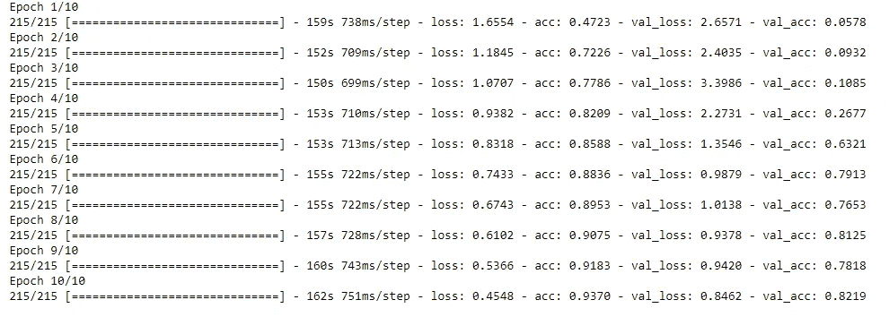

10 带精度和损耗的历元值

这是第一次训练模型后的结果，我的模型的精确度为 0.93 或(93%)，损失从 1.65 减少到 0.45 意味着模型做得很好，现在我们冻结层并再次重新训练。

```
*# Freeze core ResNet layers and train again* 
**for** layer **in** model.layers:
    layer.trainable = **False**

**for** layer **in** model.layers[:50]:
    layer.trainable = **True**

optimizer = Adam(lr=0.0001)

model.compile(loss='categorical_crossentropy',
              optimizer=optimizer, 
              metrics=['accuracy'])

n_epoch = 5
history2 = model.fit_generator(generator=train_generator, steps_per_epoch=STEP_SIZE_TRAIN,
                              validation_data=valid_generator, validation_steps=STEP_SIZE_VALID,
                              epochs=n_epoch,
                              shuffle=**True**,
                              verbose=1,
                              callbacks=[reduce_lr, early_stop],
                              use_multiprocessing=**True**,
                              workers=16,
                              class_weight=class_weights
                             )
```

在上面我提到的代码片段中，我将通过冻结 ResNet50 的层来再次训练。实际上，冻结意味着保留几层不训练，并训练接下来的几层，为此我们必须做一些更改，如下所示:

```
**for** layer **in** model.layers[:50]:
    layer.trainable = **True**
```

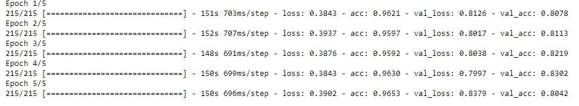

这是在冻结几层并再次重新训练后的结果，模型触摸精度比以前提高了 96%,如果你注意到错误率也降低到了 0.39，模型确实做得很好。但这里有一件事，正如我告诉 resnet50 创建 50 个神经网络，但为了训练我们肯定需要巨大的空间，当我第一次在装有英特尔酷睿 i5 的电脑上执行时，它停止了，并显示空间不足的错误，所以我建议在执行这种类型的模型时，至少需要 13+ GB 的 ram 和 gpu 来训练，否则你可以在[上运行谷歌 colab](https://colab.research.google.com/drive/1qV97RI01XGJKeysC44MGetzXqcJBkXEd#scrollTo=fslLoFs_tPQQ) 提供 13 GB 的空间。我个人只在 colab 上执行了这个。到目前为止，我们已经训练了我们的模型足够的时间来测试通过插入一个图像到模型让我们看看模型正确识别艺术家与否！。

**训练图**

```
*# Plot the training graph*
**def** plot_training(history):
    acc = history['acc']
    val_acc = history['val_acc']
    loss = history['loss']
    val_loss = history['val_loss']
    epochs = range(len(acc))

    fig, axes = plt.subplots(1, 2, figsize=(15,5))

    axes[0].plot(epochs, acc, 'r-', label='Training Accuracy')
    axes[0].plot(epochs, val_acc, 'b--', label='Validation Accuracy')
    axes[0].set_title('Training and Validation Accuracy')
    axes[0].legend(loc='best')

    axes[1].plot(epochs, loss, 'r-', label='Training Loss')
    axes[1].plot(epochs, val_loss, 'b--', label='Validation Loss')
    axes[1].set_title('Training and Validation Loss')
    axes[1].legend(loc='best')

    plt.show()

plot_training(history)
```

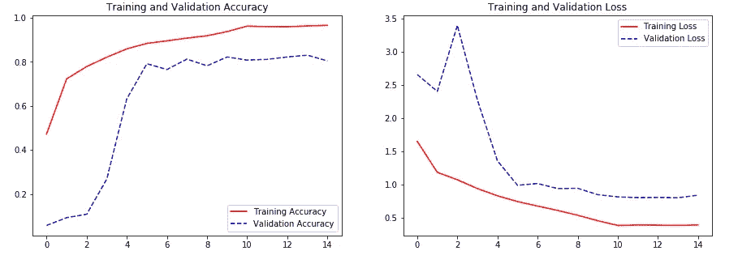

精确度和损耗之间的关系图简单地说，我们可以得出精确度高同时损耗降低的结论

这两幅图都表示精度在提高，损耗在降低。

**评估模型**

这段代码用于显示模型的性能矩阵，说明模型如何像人类一样进行预测和思考。

```
*# Classification report and confusion matrix*
**from** **sklearn.metrics** **import** *
**import** **seaborn** **as** **sns**

tick_labels = artists_top_name.tolist()

**def** showClassficationReport_Generator(model, valid_generator, STEP_SIZE_VALID):
    *# Loop on each generator batch and predict*
    y_pred, y_true = [], []
    **for** i **in** range(STEP_SIZE_VALID):
        (X,y) = next(valid_generator)
        y_pred.append(model.predict(X))
        y_true.append(y)

    *# Create a flat list for y_true and y_pred*
    y_pred = [subresult **for** result **in** y_pred **for** subresult **in** result]
    y_true = [subresult **for** result **in** y_true **for** subresult **in** result]

    *# Update Truth vector based on argmax*
    y_true = np.argmax(y_true, axis=1)
    y_true = np.asarray(y_true).ravel()

    *# Update Prediction vector based on argmax*
    y_pred = np.argmax(y_pred, axis=1)
    y_pred = np.asarray(y_pred).ravel()

    *# Confusion Matrix*
    fig, ax = plt.subplots(figsize=(10,10))
    conf_matrix = confusion_matrix(y_true, y_pred, labels=np.arange(n_classes))
    conf_matrix = conf_matrix/np.sum(conf_matrix, axis=1)
    sns.heatmap(conf_matrix, annot=**True**, fmt=".2f", square=**True**, cbar=**False**, 
cmap=plt.cm.jet, xticklabels=tick_labels, yticklabels=tick_labels,ax=ax)
    ax.set_ylabel('Actual')
    ax.set_xlabel('Predicted')
    ax.set_title('Confusion Matrix')
    plt.show()

    print('Classification Report:')
    print(classification_report(y_true, y_pred, labels=np.arange(n_classes), target_names=artists_top_name.tolist()))

showClassficationReport_Generator(model, valid_generator, STEP_SIZE_VALID)
```

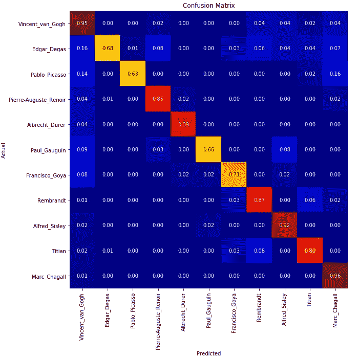

上面是性能指标，它告诉我们模型根据我们的假设预测了多少，所以从上面，如果我们对角地按类分类，我们可以说像在底部类 marc_chagall actuall 和 predicted marc_chagall 那里 0.96 或(96%)意味着模型预测得很好。

**测试模型**

这里随机选取 5 幅图像，并通过给出 5 幅属于或不属于特定艺术家的随机图像，将这些随机图像提供给模型来预测艺术家。

```
*# Prediction*
**from** **keras.preprocessing** **import** *

n = 5
fig, axes = plt.subplots(1, n, figsize=(25,10))

**for** i **in** range(n):
    random_artist = random.choice(artists_top_name)
    random_image = random.choice(os.listdir(os.path.join(images_dir, random_artist)))
    random_image_file = os.path.join(images_dir, random_artist, random_image)

    *# Original image*

    test_image = image.load_img(random_image_file, target_size=(train_input_shape[0:2]))

    *# Predict artist*
    test_image = image.img_to_array(test_image)
    test_image /= 255.
    test_image = np.expand_dims(test_image, axis=0)

    prediction = model.predict(test_image)
    prediction_probability = np.amax(prediction)
    prediction_idx = np.argmax(prediction)

    labels = train_generator.class_indices
    labels = dict((v,k) **for** k,v **in** labels.items())

    *#print("Actual artist =", random_artist.replace('_', ' '))*
    *#print("Predicted artist =", labels[prediction_idx].replace('_', ' '))*
    *#print("Prediction probability =", prediction_probability*100, "%")*

    title = "Actual artist = **{}\n**Predicted artist = **{}\n**Prediction probability = **{:.2f}** %" \
                .format(random_artist.replace('_', ' '), labels[prediction_idx].replace('_', ' '),
                        prediction_probability*100)

    *# Print image*
    axes[i].imshow(plt.imread(random_image_file))
    axes[i].set_title(title)
    axes[i].axis('off')

plt.show()
```

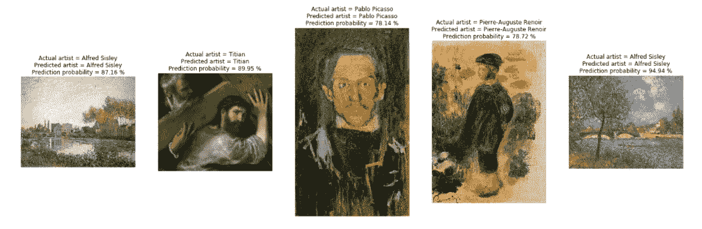

输出由模型预测艺术家的图像

因此，从上面我们可以看到，给定 5 个随机图像，我们的模型预测正确的艺术家姓名，给定图像的平均概率约为 80%及以上。博客到此结束，我们开始了解深度学习模型和训练技术。我希望你喜欢这个博客。更多关于代码的细节，你可以访问我的 [github 简介](https://github.com/homejeet)。请看看 http://github.com/homejeet[的其他项目。我将热切期待您的反馈和建议。](http://github.com/homejeet)

## 参考

1.  [https://www . pyimagesearch . com/2019/07/08/keras-imagedata generator-and-data-augmentation/](https://www.pyimagesearch.com/2019/07/08/keras-imagedatagenerator-and-data-augmentation/)
2.  [https://github.com/mk60991/ImageAI-image-Prediction](https://github.com/mk60991/ImageAI-image-Prediction)
3.  [https://www.appliedaicourse.com/](https://www.appliedaicourse.com/?gclid=Cj0KCQiArqPgBRCRARIsAPwlHoVTtRFPsX9qu_XvwJOyogwEJKZ-VG5SBKELkOQRXTKbYP_jxDIIDisaAmPVEALw_wcB)
4.  [http://cs231n.stanford.edu/reports/2017/pdfs/406.pdf](http://cs231n.stanford.edu/reports/2017/pdfs/406.pdf)
5.  [https://www.researchgate.net/](https://www.researchgate.net/)
6.  [https://www.kaggle.com/](https://www.kaggle.com/)

**在** [LinkedIn 上联系我](https://www.linkedin.com/in/homejeet-behera-982871114/)