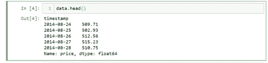
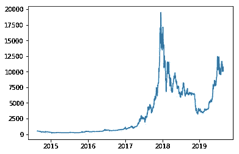
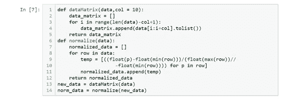
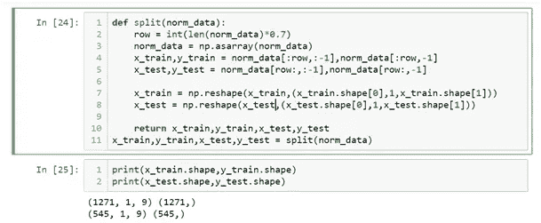
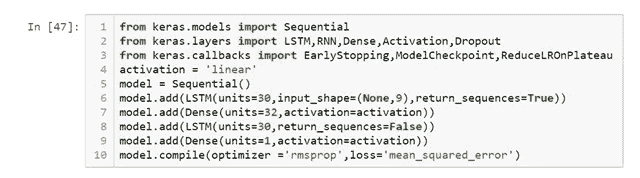
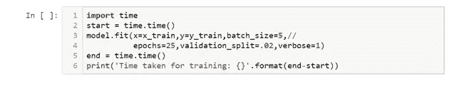
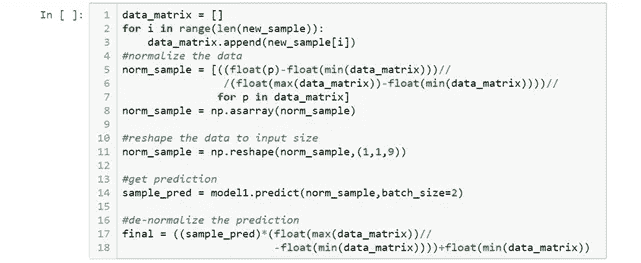

# 使用机器学习模型预测比特币价格

> 原文：<https://medium.com/analytics-vidhya/predict-bitcoin-price-using-machine-learning-model-288f111eb452?source=collection_archive---------3----------------------->

过去几年，比特币引领了投资者将资金和信任投入加密货币的趋势，毫无疑问，这是长期趋势。因此，如果我们能够预测明天的比特币价格，那不是很好吗？比特币的价值在 2018 年 12 月攀升。

虽然在这个博客中有许多加密货币，但我们将通过使用比特币的数字历史数据，使用 LSTM 来预测比特币的价格。有几个资源和 API 可以提供最新的硬币价格。

LSTM 是具有反馈连接的人工递归神经网络结构。LSTM 存储单元由输入门、输出门和遗忘门组成

这里的数据集非常简单，因为它只包含时间戳和比特币价格。

下面是数据集的可视化。

这里我们将使用过去 9 天的数据进行预测，并将其归一化。以下是执行此任务的函数。

将数据分为训练集和测试集。

# 创建模型

该模型将由两个 LSTM 层和两个致密层组成。下面是模型架构，你可以尝试不同的参数组合和不同的模型架构。通常，LSTM 模型由几层组成。因为这是一个回归问题，所以我们将使用线性作为激活函数。

现在是训练模型的时候了，你可以通过不同的参数来训练模型。

经过 25 个纪元的训练，现在我们可以用它来预测第二天的比特币价格。不要忘记保存模型，以便以后使用。

为了预测明天的价格，我们需要过去 9 天的数据。new_sample 下面是过去 9 天的数据。我们将它标准化，然后我们将预测。因为它将给出 0 到 1 之间的值，所以我们需要对其进行反规格化，以获得真实值

虽然它给出了相当好的结果，但它们与实际值相差很大。因此，模型需要改进。

**注** : *根据这种预测进行投资是不明智的，人们应该总是在合格的投资顾问的帮助下进行投资。*

感谢阅读这篇文章。

人工智能和机器学习爱好者。[查看 csvankhede 的所有帖子](https://csvankhede.wordpress.com/author/csvankhede/)

**发表**

*原载于 2019 年 8 月 24 日*[*http://csvankhede.wordpress.com*](https://csvankhede.wordpress.com/2019/08/24/bitcoin-price-prediction/)*。*