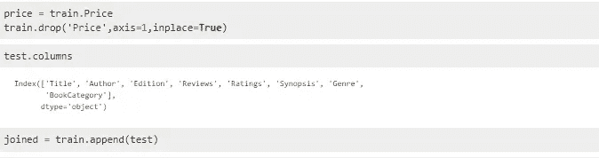

# 不使用 NLP 文本处理方法预测图书价格。

> 原文：<https://medium.com/analytics-vidhya/predict-book-price-without-using-nlp-textual-processing-approach-2de77d64b73b?source=collection_archive---------7----------------------->

让我们试着从封面来判断一本书。

在这篇文章中，我们将看到并尝试在不使用 NLP 文本处理而仅使用基本方法的情况下预测书的价格，并尝试找出我们如何做到这一点以及我们得到的结果。

所以，我们有相当多的特征可以用来预测这本书的价格。

让我们从导入我们需要的基本包和我们得到的数据开始。

我们已经得到了用于训练和测试的下降数据。

让我们首先从训练数据集中删除价格列，并加入训练和测试数据集，以便我们可以执行不同的数据清理和争论技术。

因此，我们将价格列数据存储在价目表中，这样我们就可以在开始训练机器学习模型时使用它。

因此，在我们加入数据框后，让我们从提取数字开始，并使用列中的全部数据。

Edition 列包含各种版本，这些版本具有相似的发布类型，但发布日期不同，所以首先我们只从列中提取发布类型，并将其存储在一个列表中，然后用列表替换列的值。

评论栏有一篇对这本书的评论，满分为 5 颗星，所以让我们只取评论号，从栏中去掉 5 颗星

评级栏有客户的评级，所以让我们只把数字拿出来，存储在一个列表中，并用一个栏来替换它，就像我们在上面 2 个步骤中所做的那样

现在我们已经清理了 3 个重要的柱子。

现在让我们来处理分类数据。

我们现在对我们的作者、图书类别、流派和版本列进行标签编码。

现在我们仍然保留着提要和标题列，我们不能处理这个标题列，因为它对于每本书都是不同的，对于提要列，没有 NLP 我们没有有效的方法来处理它。所以，我们放弃他们。

现在让我们看看我们的数据框是什么样子。

现在，我们有了一个可以传递给机器学习模型进行训练的数据框架，但首先，我们不要忘记我们已经加入了用于数据争论的训练和测试数据，所以让我们再次划分它们，并将价格列添加到我们存储在上面列表中的训练数据框架中。

现在我们已经准备好预测这本书的价格，但首先让我们有一些可视化，这将使我们对所有的功能有一个想法。

我们看到图书类别对整体价格有影响，漫画、政治类书籍的价格高于传记、日记

奇怪的是，我们看到 1.0 星的书和 5.0 星的书价格一样高。

我们现在看到了所有可用功能的关联热图，我们可以看到数据是不稳定的，只有评论与价格具有近乎令人满意的关联。

你可以从底部的链接中获得每个图形的代码。

现在让我们最后从建模部分开始。

让我们从 Sklearn 导入必要的库，并将数据分为 X_train、X_test、y_train 和 y_test，这将帮助我们划分数据，并将 70%的数据用于训练，另外 30%用于测试模型。

我已经使用了许多方法进行预测，但对于本文，让我们只保留 2 个基于(均方根对数误差)RMSLE 得分的最佳模型，RMSLE 得分是我们用来判断我们的模型的指标。

这看起来有点复杂，但不要担心，这只是我们用 python 编写的一行代码就能实现的均方对数误差的平方根。

让我们使用支持向量回归机建立我们的第一个好模型

我们看到我们有 SVR 回归，我们有一个很好的 RMSLE 分数 0.77

现在让我们看看最好的预测模型是 LightGBM 回归器

为什么轻 GBM 回归器？

LightGBM 是一个梯度提升框架，它使用基于树的学习算法，被设计成分布式和高效的，具有更快的训练速度和更高的效率，并且它使用 **XGBoost** 作为基线，在训练**速度**和它可以处理的数据集大小方面都优于它。此外，在某些情况下，LightGBM 在不到一分钟的时间内达到最高精度，而只读取整个数据集的一小部分。

我们看到，轻型 GBM 为我们提供了 0.9 的 RMSLE 分数，这是我在使用 RFE 组合的 SVR、Random Forest 和 XGBoost 中获得的最高分数。

它还提供了内置的 plot_importance 方法，帮助我们了解特性的重要性。

所以，这篇文章到此为止&谢谢你，如果你还在阅读，你可以得到完整的代码。

并查看文章中未提及的所有不同方法，我使用这些方法预测价格，以及使用的数据集:

[https://github . com/Chintan 99/Predict-Book-Price-without-NLP/blob/master/Book _ Price _ Prediction-Chintan _ chit roda . ipynb](https://github.com/Chintan99/Predict-Book-Price-without-NLP/blob/master/Book_Price_Prediction-Chintan_Chitroda.ipynb)