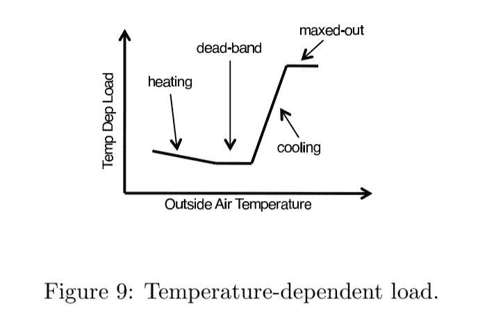
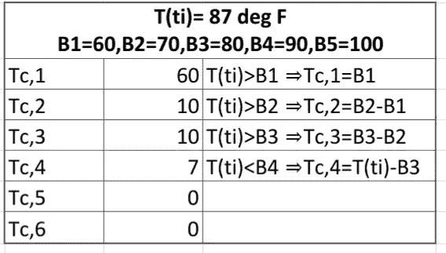
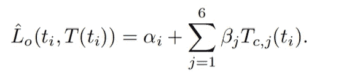
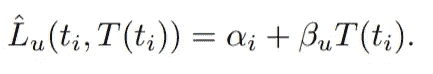
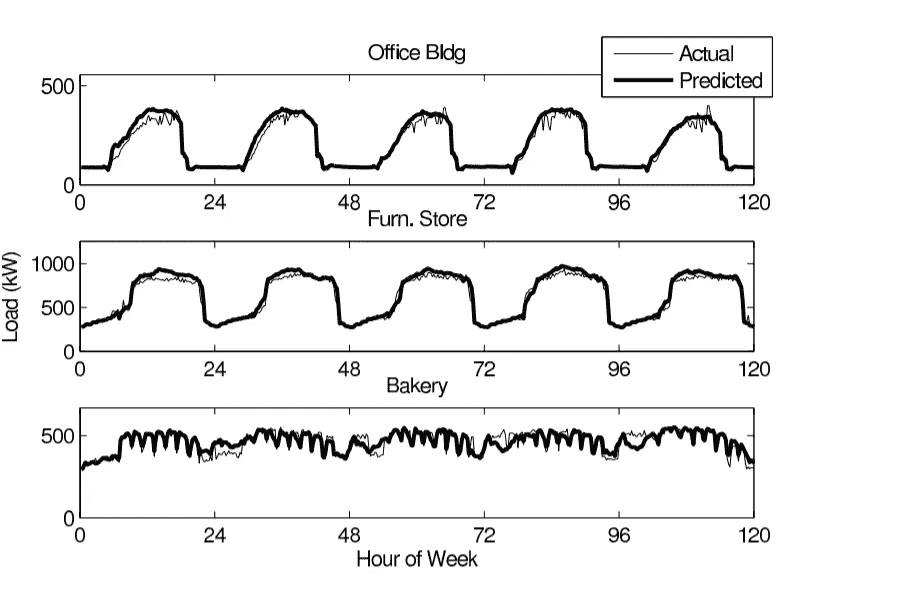

# 用回归分析法预测建筑能耗

> 原文：<https://medium.com/analytics-vidhya/predict-building-energy-consumption-using-regression-analysis-d63fbbf56e3b?source=collection_archive---------14----------------------->

Anthony Indraus 在 [Unsplash](https://unsplash.com?utm_source=medium&utm_medium=referral) 上拍摄的照片

# 目标:

提供了一种构建机器学习模型来预测建筑电能消耗的方法。该预测也可以用于执行异常检测；通过发现建筑物能源趋势使用与过去不同的时间；在相似的条件下。

能源预测的其他好处可能包括:

1.  了解设施从一个时间段到下一个时间段的电力消耗模式的变化(例如，由于季节变化)。
2.  分析并量化建筑实施的能效策略(如有)的有效性。

# 方法:

该方法基于欧内斯特·奥兰多·劳伦斯柏克莱国家实验室的研究人员撰写的白皮书。这篇文章包含了关于算法是如何产生的以及它们是如何工作的详细信息。

*白皮书链接:*

[https://drrc.lbl.gov/sites/default/files/LBNL-4944E.pdf](https://drrc.lbl.gov/sites/default/files/LBNL-4944E.pdf)

该算法查看三段数据:

(a)一天中的时间
(b)室外空气温度
(c)建筑物的占用情况。

这些是最重要的变量，往往会共同影响建筑能源的使用。

# 详细信息:

设施的电力负荷通常是温度和一周时间的函数。因此，回归模型中考虑了温度和一周中的时间。

该模型包括两个特征:

1.  一周中的时间指示变量(αᵢ)
2.  分段线性和连续室外空气温度相关性(βⱼ)

以下是如何利用这些变量创建模型的概述:

*   **一周中的时间指示符变量:**将一周(周一至周五)划分为 15 分钟间隔的箱，例如，第一间隔是从午夜到周一上午 12:15，第二间隔是从上午 12:15 到 12:30；诸如此类。一周中每个时间的不同回归系数(αᵢ)允许一周中的每个时间具有不同的预测负荷。
*   **分段线性&连续室外空气温度依赖性:**室外空气温度高时，冷负荷有随温度上升的趋势。当室外温度较低时，随着温度的降低，加热负荷往往会增加(即使不使用电力作为热源，建筑物加热时也需要电力来运行泵和风扇)。对于某些中等温度范围，负载可能对温度不敏感，因为既不需要冷却也不需要加热(该温度被称为“死区”)。有时，室外空气温度可能会很高，以至于制冷能力无法达到所需的室内温度设定点，在该点，负荷处于最大可能空调负荷(最大限度)。

说明上述情况的图表如下所示，以供参考:

这种非线性温度效应可以用分段线性和连续的温度相关负载模型来建模，如下所示:

*   对于每个设施，我们将该设施所经历的室外空气温度分成六个大小相等的温度区间。温度参数被分配给每个室外空气温度区间。
    ***例如:*** 如果设施经历的最低温度是 50 华氏度，而设施经历的最高温度是 110 华氏度；因为我们需要将这个范围分成 6 个不同的大小相等的区间；温度区间为 50–60 华氏度、60–70 华氏度、70–80 华氏度、80–90 华氏度、90–100 华氏度和 100–110 华氏度。
    每个室外空气温度区间都有一个温度参数βj，j = 1–6。
*   为了实现分段线性和连续性，时间 T(发生在一周的时间间隔 I)的外部空气温度 T (ti)被分成六个分量温度 Tc，j(ti ),其中 j = 1…6。每个 Tc，j(ti)乘以βj，然后求和以确定温度相关负载。
    设 Bk (k = 1…5)为温度区间的界限。使用以下算法计算部件温度:

1.  如果 T (ti) > B1，那么 Tc，1(ti) = B1。否则，对于 m = 2…6，Tc，1(ti) = T (ti)和 Tc，m(ti) = 0，算法结束。
2.  对于 n = 2…4，如果 T (ti) > Bn，则 Tc，n(ti)= Bn Bn 1。否则，对于 m = (n + 1)…6，Tc，n(ti)= T(ti)Bn 1 且 Tc，m(ti) = 0，算法结束。
3.  如果 T (ti) > B5，则 Tc，5(ti)= B5 B4，Tc，6(ti)= T(ti)-B5。

让我们假设:外部空气温度的最小和最大值如前一个例子中所给出的(即 50 华氏度到 110 华氏度的温度范围被分成 6 个相等的区间；每个尺寸为 10 个单位)。在这种情况下，B1=60，B2=70，B3=80，B4=90，B5=100

现在，如果瞬时外部空气温度[T(ti)]是 87 华氏度；然后，我们将根据上述算法将该值分配到各个温度分量中，如下面快照中的表 1 所示:

**表 1**

# 使用上述方法的能量预测:

建筑能耗是一周时间指标变量(αᵢ)和分段线性室外空气温度相关变量(βⱼ).)的函数

*   对于占用模式，占用负载 Lo 估计如下:

说明:让我们说αᵢ=300.此外，如果我们将瞬时外部空气温度值视为 87 华氏度，则温度分量 Tc，1 至 Tc，6 的值将与上表 1 所示的值相同。
假设，各个温度分量的相应βⱼ如下:β1 = 0.1；β2=0.2;β3=0.3;β4=0.4;β4=0.4;β5=0.5;β6=0.6.

在这种情况下，瞬时能量负荷预测如下:

lo = 300+[(0.1)(60)+(0.2)(10)+(0.3)(10)+(0.4)(7)+(0.5)(0)+(0.6)(0)]

*   为了预测建筑物处于空闲模式时的负荷，我们使用了一个温度参数βu，因为我们预计数据集中的大多数设施在夜间都在死区或死区附近运行。
    空载负荷 Lu 估计如下:

可以训练一个机器学习模型来学习上述αᵢ & βⱼ的价值观；用足够的数据训练它。

# 模型培训、测试和部署的重要标准

1.**选择训练数据集样本量**:用于训练模型的数据集的样本量应该足够大，不要导致模型过度拟合&以推广&适合未知的生产数据(白皮书建议至少 5 个月的数据用于训练模型；以避免参数值受到数据中随机/随机可变性(噪声)的过度影响)。

2.**数据准备&清理:**我们需要确保数据集对于建模来说是可靠的&已经针对离群值&缺失值进行了处理。

3.**训练模型**:一旦数据集得到处理；我们将使用这个数据集来训练我们的模型。在该步骤中，模型将针对不同范围的外部空气温度，估计一周时间指示器变量&温度参数的最佳值(使用 OLS 度量)。

4.**模型评估&调整验证数据集**:测试负荷预测方法的效果如何；我们可以有一个单独的历史能源使用数据的验证数据集&在实际负荷数据之上绘制预测。
此类评估的示例如下图所示:

5.**模型部署**:一旦在验证数据集上获得了令人满意的精确度(度量:OLS-普通最小二乘法)，我们就在测试数据集(看不见的数据)上测试模型&检查模型在生产数据上的概括程度。