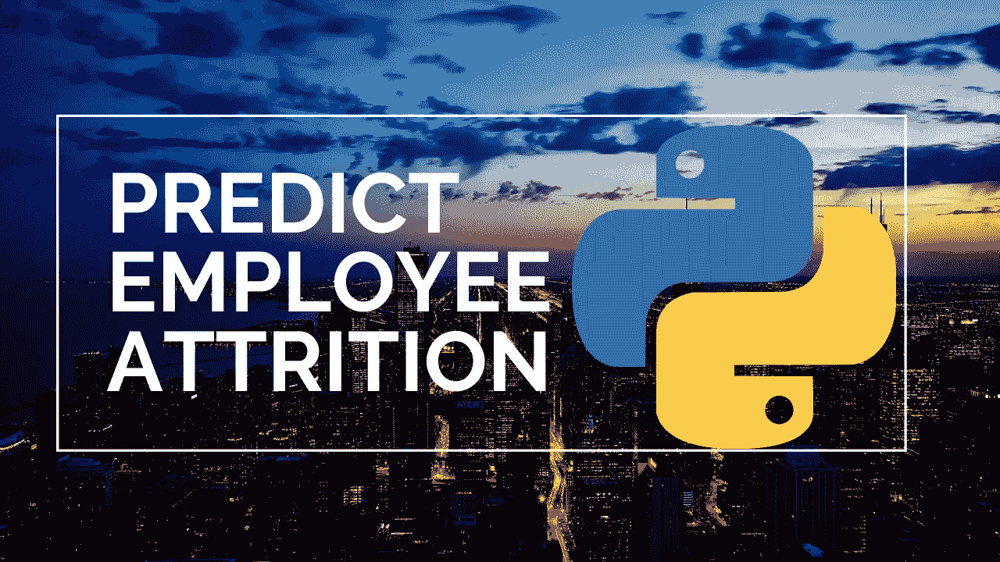

# 使用机器学习和 Python 预测员工流失

> 原文：<https://medium.com/analytics-vidhya/predict-employee-attrition-a34e2c5a972d?source=collection_archive---------0----------------------->

你的员工会离开吗？

在我们开始之前，如果你读完这篇文章或者我的其他文章后喜欢它们，或者发现它们有任何帮助，请留下一些掌声，或者如果你还不是 Medium.com 的会员，就成为它的会员。你可以通过链接[这里](https://randerson112358.medium.com/membership)轻松成为 Medium.com 的会员。现在，让我们进入文章！