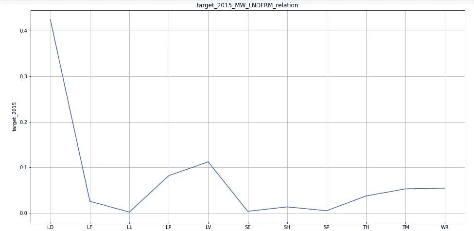

# 预测马拉维南部的洪水:机器学习方法

> 原文：<https://medium.com/analytics-vidhya/predict-floods-in-southern-malawi-a-machine-learning-approach-3ba30e7c8fc6?source=collection_archive---------15----------------------->

关于我们如何在“马拉维洪水预测”Zindi 竞赛中获得第五名的报道。

2019 年 12 月的第二天，Zindi Platform 与 UNICEF & Arm 合作，推出了一项新的竞赛，奖金池为 10，000 美元，以预测 2019 年马拉维南部的洪水。参赛者有六个月的时间，在此期间，他们必须尽最大努力，才能登上榜首。

我个人是 3 个月后才开始探索比赛的，也就是说离结束还有 3 个月。我有点不愿意报名，因为我认为已经晚了，从数据的性质来看，我可以看出这个比赛在某种程度上是一个“研究”比赛，需要大量的文档和文献回顾。但最终我还是报名了，原因有几个:

*   我们将使用地理空间数据，我以前没有使用这些数据的经验，所以这将是探索这些数据的最好机会。
*   数据集很小，所以在不过度拟合数据的情况下获得一个高性能的模型有点困难。
*   新冠肺炎隔离已经开始了，所以这将是一个人唯一能做的享受他的时间的事情

我有幸与我共事过的两个最聪明的人一起工作:Idrissa 和 Bakary。
我们最终在 478 名数据科学家中获得了**第五名。**

这篇博文将提供我们解决方案的详细概述，并提供我们提出解决方案所需的见解。以下是目录:

*   **简介
    -** 问题陈述。
    -数据和竞争指标。
    -使用过的软件&工具。
*   **预处理** -探索性数据分析。
    -去除噪声特征。
    -外部数据。
    -特色工程。
*   **建模** -随机森林模型。
    -黑仔射频参数:平均绝对误差。
    - XGBoost，LGBM，CatBoost，GBM …
    -集合预测。
*   **后处理:** 后处理最终的集合预测。

# **简介**

## 问题陈述

2019 年 3 月 14 日，热带气旋 Idai 在莫桑比克贝拉港登陆，然后穿越该地区。马拉维、莫桑比克和津巴布韦的数百万人受到了南部非洲至少二十年来最严重的自然灾害的影响。

近几十年来，非洲各国遭受洪灾的频率和严重程度都有所增加。马拉维在 2015 年和 2019 年都遭受了大洪水的袭击。事实上，在 1946 年至 2013 年期间，洪水占马拉维主要灾害的 48%。马拉维南部与莫桑比克接壤的下希尔河谷由奇卡瓦和恩桑杰两个区组成，是最容易发生洪水的地区。

这项挑战的目标是建立一个机器学习模型，帮助预测马拉维南部洪水的位置和范围。

## 数据和竞争指标

在这次比赛中，马拉维南部的地图被分成了大约 1 平方公里的矩形。每个矩形都有一个唯一的 ID。每个矩形都被分配了一个“目标”值，即该矩形在 2015 年被淹没的部分(百分比)。

训练数据是 2015 年马拉维南部的洪水范围，但是，我们被鼓励从其他邻近地区和其他历史洪水中获取其他洪水数据来训练我们的模型。(只是我们需要确保不使用 2019 年的数据，并且没有洪水地区的图像是解决方案的一部分)。

衡量我们模型准确性的测试数据是 2019 年马拉维南部的洪水范围。

训练数据由大约 16K 的观察值(即 16K 的正方形矩形)组成，并且包括以下特征作为起点:

*   **地理坐标:**每个矩形的 X，Y 坐标。
*   **高程:**矩形上空的平均高程。
*   **主要土地覆盖类型:**大部分地区以草原、稀树草原或农田为主。
*   **每周降雨量:**每个矩形的历史降雨量数据，从洪水前 2 个月开始，持续 18 周。

目标是给定矩形被淹没的百分比，值在 0 和 1 之间。

竞赛的目标是最小化均方根误差:

## 二手软件和工具

如前所述，数据具有地理空间性质，因此在这种情况下，使用地理空间工具来可视化、探索和解释数据是至关重要的。

到目前为止，除了我忠实的朋友熊猫、Numpy、Sickit-Learn、Seaborn、Plotly、XGBoost……我还认识了两个新朋友，我想每个正在读这篇文章的人都应该了解一下:

*   **DivaGIS :** 一个免费的地理信息系统软件程序，用于分析地理数据，特别是关于生物多样性的点数据。
*   **GeoPandas :** 一个开源项目，使使用 python 处理地理空间数据变得更加容易。

# 预处理

## 探索性数据分析

最重要的特征是海拔。分析结果表明，较低的海拔容易发生洪水。
海拔高度对洪水调节功能也有重大影响，因为随着海拔高度的增加，降雨量和河流流量明显增加。
所有现有研究或文献也表明，海拔是洪水预报中最重要的变量。

上面的线图代表每种土地类型的平均洪水值，我们可以看到土地类型和 2015 年目标之间的相关性模式。

在训练数据中，我们在零周(洪水日期)之前获得了 17 周的降水。在随后的步骤中，我们设法发现这些降水特征中只有一半是有用的，其余的是有噪声的，导致模型表现不佳。(根据第一种解决方案，您可以在这里找到，17 个降水变量中只有 3 个是有用的)。

我使用 DivaGIS 在地图上绘制了 2015 年的洪水点，以查看实际发生的情况以及洪水部分集中的位置，我还添加了 Chilwa 湖点和 Shire 河(Chilwa 和 Shire 来自外部栅格):

上图中你能看到的红点是 2015 年的目标，绿点是 Chilwa 湖点，细黑线是 Shire 河(马拉维南部洪水最泛滥的河流)。

对上述图的清晰和明显的解释是，大多数被淹没的区域都在 Shire 河附近，因此，到 Shire 河的距离将是预测 2019 年洪水的关键变量。
我们可以从上面的图中做出的另一种解释是，Chilwa 湖点应全部设置为零(这比正常情况下更多，因为在最终结果中我们不能将一个湖视为淹没区)。

在对马拉维的洪水条件进行研究后，我们发现另一条名为姆万扎河的河流也洪水泛滥，对我们的分析很重要:

不出所料，姆万扎河(蓝色中的黑线)是一条洪水泛滥的河流，附近地区容易发生洪水，因此我们应考虑计算到它的距离。

在查阅了不同的文献后，我发现森林地区很难被洪水淹没(自然事实)，因此包括马拉维土地覆盖数据应该是一个重要的变量。
以下是马拉维土地覆盖热图:

如果我们将之前图中的淹没点与这张图进行比较(使用这张图有点困难),我们可以清楚地看到绿色区域大部分没有被淹没。

## 外部数据

关于处理真实世界数据而不是合成数据的最有趣的事情之一是，我们可以自由地探索外部数据，并使用它来帮助我们提高我们的模型能力。

我们的大多数图层都是从这个为马拉维国家提供免费地理空间栅格的[网站](http://www.masdap.mw/)中提取的。
我们能够找到的最有价值的特性如下:

*   陆地形态:固体表面的自然形状。
*   奇尔瓦湖:马拉维南部最大的湖的坐标。
*   Shire&Mwanza 河流:马拉维南部洪水泛滥河流的坐标。
*   土壤数据:土壤信息，如腐蚀性、渗透性、土壤深度、积水可能性…

## 特征工程

特征工程是利用领域知识通过数据挖掘技术从原始数据中提取特征的过程。这些特征可以用来提高机器学习算法的性能。

根据我的文献回顾，要生成的第一个特征是斜率。
其实水流速度是由坡度决定的。因此，坡度是食物敏感性的一个重要因素。
坡度可以使用 X，Y，高程要素和一个名为[栅格](https://cran.r-project.org/web/packages/raster/index.html)的 R 包获得。

第二个特征，也是我称之为**杀手**的特征是到河流的距离。
如前所述，我们使用 DivaGIS 软件获得河流坐标，并将其保存到 CSV 文件中。
想法是计算从每个马拉维点到每个河流点的距离，然后取最小值。因此，我们得到了从每个训练点到每条河流的最小距离:

*   Shire_min_dist = min(dist(马拉维，Shire))
*   Mwanza_min_dist = min(dist(马拉维，Mwanza))

用于执行这些距离计算的库是 Vincenty。我推荐使用它，尤其是在处理大量点的时候。

还使用现有的特征生成了不同的其他特征(对它们应用不同的数学组合)。

现在我们已经删除了不必要的变量，添加了抓取的数据和新生成的特征，我们需要在进入建模部分之前缩放我们的数据。

在以下情况之一中，缩放数据非常重要:

*   我们将使用线性模型，如:线性回归，广义线性模型…
*   我们将使用基于距离的算法:K-最近邻，支持向量机，K-均值…

我们应该关注基于距离的模型的缩放的原因是，在幕后，它们使用数据点之间的距离来确定它们的相似性，因此它们会给具有较高量值的变量较高的权重。
可以考虑几种缩放技术，如最小最大缩放器、正常缩放器、鲁棒缩放器…

在我们的例子中，由于我们将使用基于树的算法，缩放并不是一个必须要做的动作，但是众所周知，魔法是存在的，一些愚蠢的动作可能会产生意想不到的结果(我相信所有阅读这篇文章的人都有这样的经历😔 ).

# 建模

## 随机森林

正如我在数据描述部分提到的，数据集的形状大约是 16K 观察值，这被认为是非常小的数据。所以很明显过度拟合的诅咒在角落里等着呢！
机器学习模型的目标是**概括训练数据中的**模式，以便我们能够正确预测从未呈现给模型的新数据。
当涉及到小数据集时，会发生的情况是，模型会捕捉所有东西，甚至是噪音，过度调整训练数据，因此在预测看不见的数据方面表现不佳。

数据简单本质背后的第一个直觉是当我用不同的模型做第一次尝试时的惊喜:
KNN 和决策树比 XGBoost 和 LGBM 表现得好得多！
所以这里的重点是尽量坚持简单的模型，不要让它变得太复杂。

我的最佳表现模型(基于我的预处理数据)是一个只有 50 个估值器的随机森林，这证实了我关于我们正在处理的数据的简单性质的假设。

我的第二个直觉是关于用于训练模型的适当度量:平均绝对误差还是均方误差？

我的随机森林的标准度量的选择与我的目标变量高度相关。
以下是我的目标变量分布:

正如我们所见，完全被淹没的区域数量(1.0 洪水比率)约占总数的 2%。
我们可以在这里声明，这些区域是数据中的异常，模型不应该把这些点看得太重，否则我们会过度拟合数据，模型会太复杂，无法对新的看不见的点进行归纳！
有人可能会说:为什么不从数据中去掉这些点，继续努力呢:/？
答案是否定的。我们应该保留这些观察结果有两个原因:
首先，这些异常现象代表了真实世界的证据(在马拉维 2015 年的灾难中有一些地区完全被淹没)。
其次，这些异常存在于测试集中。

那么这个问题的解决方案是什么呢？
简单地说，我们需要告诉模型在面对异常值时不要惩罚太多，这只能通过 RF 中使用的标准来实现。

众所周知，MAE 是实际值和预测值之间的绝对值，除以样本数，而 MSE 是实际值和预测值之差的平方。
使用 MSE 时，模型在面对异常值时将受到很大的惩罚，因为误差将被平方，因此模型将更加复杂，并从数据中学习噪声以最小化误差。

结果，我发现 MAE 是最好的标准，用 MAE 代替 MSE 给了我巨大的提升(从 0.10 跳到 0.084)。

总之，在处理符合上述标准的数据时，我的三条建议是:

1.  首先，坚持简单的模型。
2.  第二，你所有的模型参数都很重要(大多数人一般只调 3 或 4 个参数，默认情况下保留其余的)。
3.  试着理解你的数据特征。

## 组装

下一步是尝试使用不同的模型，如 XGBoost、LGBM、CatBoost……正如我们前面讨论的，这些模型的性能比 RF 低得多，因此我们决定使用它们的预测，并给它们一个小的权重:这就是我们所说的**集合**预测。

大多数情况下，表现最好的模型应该拥有最高的权重(在我的例子中是 0.7)，然后尝试按照相同的策略将剩余的 0.3 分配给所有其他模型。

另一个实现最佳组合的好方法是我出色的队友**伊德里萨**所做的:
创建一个代表每个模型预测的相关矩阵，然后最佳组合将使用那些相关性低的:
基本上，不同的预测意味着每个模型都在捕捉一些其他模型没有的信息，因此，分享观点将提高最终结果！

# 结论

我发现这场比赛最令人兴奋的是交流想法，特别是与我的队友，两位塞内加尔天才 **Idrissa** 和 **Bakary** 。与如此优秀的团队一起工作和学习是一件有趣的事情。
此外，团队之间的竞争让每个人都想在排行榜上名列前茅，并给出最佳解决方案，这让一方始终保持动力。

作为一名有竞争力的数据科学家，最重要的事情是人们可以经历的现实世界问题的多样性，以及我们可以应用的不同想法(尤其是最疯狂的想法)。

感谢你的时间，我希望你觉得这篇文章有用和有趣。