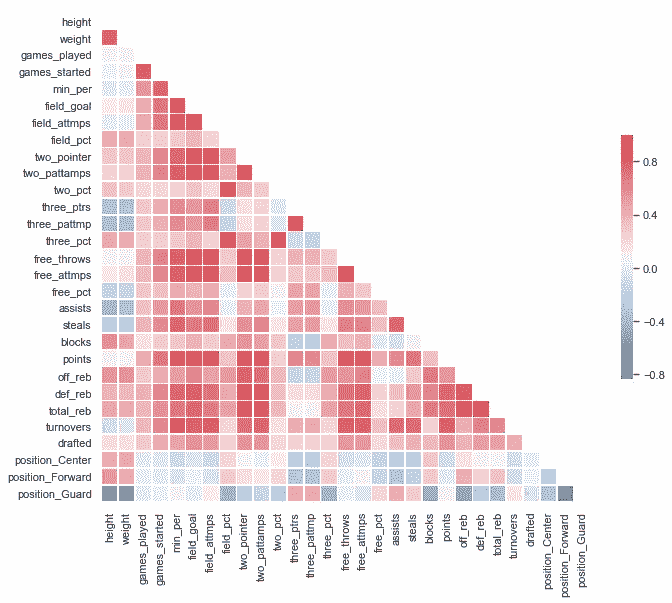
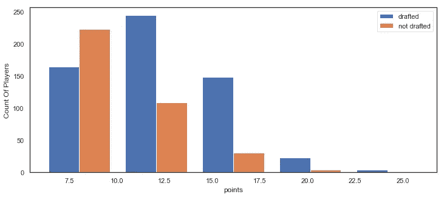
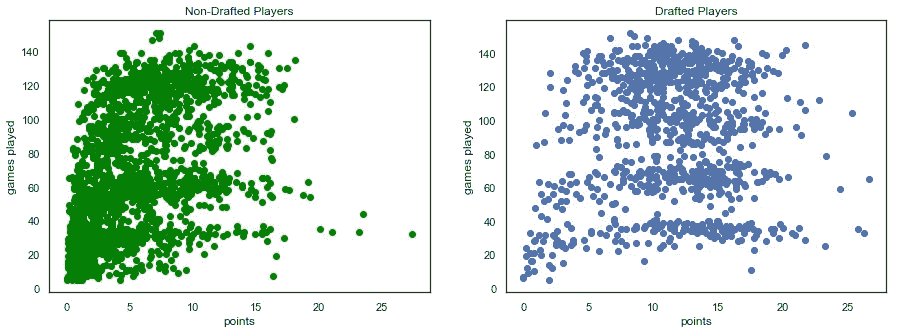
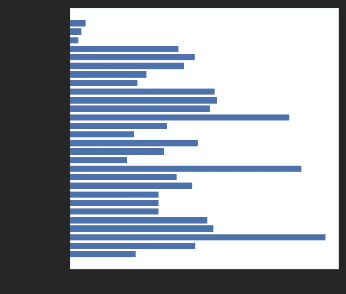
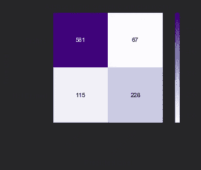

# 用机器学习预测 NBA 选秀！

> 原文：<https://medium.com/analytics-vidhya/predict-nba-draft-using-machine-learning-7023503e33e7?source=collection_archive---------14----------------------->

## 使用机器学习来预测哪个球员会进入 NBA

进入 NBA 一直是运动员成长过程中许多童年梦想之一。谁不想创造历史，成为球队中最有价值的球员呢？我们都想要荣誉，但是我们到底需要什么才能进入大联盟呢？大多数人会说，要想在 NBA 立足，我们需要的最重要的特征是身高和体重。我们的理论可能是错误的。在本文中，我们将介绍数据科学家应该如何着手建立数据集、分析数据、应用机器学习并最终预测草案的步骤！代码会在最后通过 **github** 提供。

# 目录

*   数据收集过程
*   观察和特征
*   探索性数据分析
*   分类模型

照片由[本·赫尔希](https://unsplash.com/@benhershey?utm_source=medium&utm_medium=referral)在 [Unsplash](https://unsplash.com?utm_source=medium&utm_medium=referral) 上拍摄

# 数据收集过程

这个项目的目标是获得大学生球员，并使用分类模型预测一名大学生球员是否会根据他们的特征进入 NBA。在这个分析中，我们的两个标签是非选秀大学生球员和选秀大学生球员。我的大部分数据是从 sport-reference.com 收集的。球员的数据可以追溯到 1992-93 年。收集的数据量包括 30，000 多名大学球员，4，450 名 NBA 球员以及 27 个特征。

# 观察和特征

我们随机抽样观察了约 2000 名大学生球员(2000–2018)1300 名 NBA 球员(2000–2018)。提供的年份给了我们大量的数据。以下是每个玩家的特征。

*   高度
*   重量
*   位置
*   玩过的游戏
*   游戏开始
*   每分钟
*   射门得分
*   现场尝试
*   字段百分比
*   两点
*   两点尝试
*   两个百分点
*   篮板总数
*   失误
*   三个指针
*   三分尝试
*   三个百分点
*   罚中次数
*   罚球次数
*   罚球命中率
*   助攻
*   偷
*   阻碍
*   点
*   进攻篮板
*   防守篮板

# 探索性数据分析

在我们分析数据之前，作为数据科学家，我们必须问自己一些问题。我们到底在解决什么？这其中有什么关联吗？我们总是不得不质疑某些方面，这些方面可以证明为什么我们的预测可能是这样的。

# 分析前的问题

*   身高体重和积分是否增加了你被选中的几率？
*   球员的入选是基于比赛的数量和分数还是比赛开始的时间和场地的百分比？

# 目标变量

*   这些模型能预测大学生运动员是否会被选入 NBA 吗？

既然我们已经确定了我们的问题和目标变量，让我们来分析我们已经获得的数据。同样，当你遵循我的代码时，请考虑这些步骤，这将有助于解决其他机器学习问题。

**下面是一个关联矩阵** —这有助于我们深入了解统计数据之间到底有哪些关联。请务必了解相关性和因果性之间的区别。

**根据图表，这些是正相关:**

*   场百分比+三个百分点
*   投篮得分+分数
*   助攻+失误

**根据图表，这些是负相关:**

*   高度+防护
*   三分球+前锋和中锋
*   体重+玩过的游戏

**我们来回答一下之前问的问题吧！**

# 探索性数据分析——身高+体重+点数

# 1)身高、体重、积分是否增加了你被选中的几率？

观察显示，当体重超过 187，身高超过 76 英寸时，许多被选中的球员比未被选中的球员表现得更好。

# 探索性数据分析——玩过的游戏+积分

# 2)玩家是根据游戏次数和分数被选中的吗？

观察显示，没有被选中的球员得分更少，即使他们打了同样多的比赛

# 分类模型

为了预测谁会被选中，我们将使用二进制。分类位置:根据我们从保存的数据中获得的所有特征，1 表示已起草，0 表示未起草。我们将使用 Adaboost，因为它给出了最好的预测结果。

我们必须给所有的球员贴上标签，如果他们在我们收集的数据中进入了 NBA，我们就要相互参照。这将有助于模型理解的差异，每个单独的统计，可以预测一个新的草案！！

如前所述，我们将使用 Adaboost 作为我们的分类模型。我们将不得不调整我们的数据，这样，如果有任何球员被给予更高的分数或体重和身高，可能会导致我们的数据出现异常。如果我们的数据不进行缩放，模型将无法区分新数据，因为一些特征可能会超过其他特征。

# 有哪些重要的特点？

这张图表说明了数据的重要特征

正如你从上面的图表中所看到的，比赛次数和得分是决定入选 NBA 可能性的关键因素。这将表明作为一名球员，你的团队在你的比赛中看到了你的价值。

除了 adaboost，我们还使用网格搜索来寻找最佳参数，以预测大学生球员进入 NBA 的选秀。

我们的分类报告给了我们(你也应该得到相同的使用网格搜索没有任何调整)

*   准确率:82%
*   精确度分数:77%
*   回忆分数:66%
*   F1 得分:71%

**网格搜索** **找到最佳参数:**

*   学习率:1.0
*   n 估计数:250

# 网格搜索 AdaBoost 混淆矩阵

*   真正积极的:我们确定了一个积极的草案 581 NBA 的正确
*   正确的否定:我们正确地确定了 228 对 NBA 的否定草案
*   假阳性:我们错误地确定了 115 的阳性选秀
*   假阴性:我们错误地确定了一个对 NBA 不利的 67 号草案

# 结论

这些模型能够正确地将被选入 NBA 的大学生球员分类，只有 13%的球员被错误分类。我们可以得出结论，如果一个大学篮球运动员能够根据他们的数据和身体状况进入 NBA，我们的分类准确率将达到 82%。我们能够经历理解、分析和预测数据的过程。

将对模型进行的一些调整将是超参数调整，随机状态。

自己去看看代码吧！

【https://github.com/Jwdaniel34/Drafting_college_players 