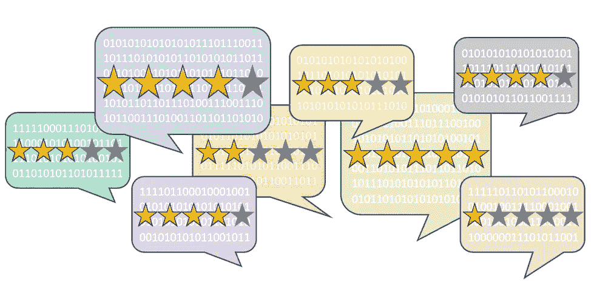

# 预测公众评论评分——实用自然语言处理(第一部分)

> 原文：<https://medium.com/analytics-vidhya/predict-public-review-ratings-a-preview-of-natural-language-processing-series-14953f5a126d?source=collection_archive---------7----------------------->

## 自然语言处理的实用学习练习

读者注意:Python 代码在 GitHub 中是共享的

对于一个企业来说，要想在竞争中取得成功，理解和管理客户对其产品的感受是很重要的。