# 用 CNN(视网膜 OCT 图像数据集)预测视网膜疾病

> 原文：<https://medium.com/analytics-vidhya/predict-retinal-disease-with-cnn-retinal-oct-images-dataset-6df09cb50206?source=collection_archive---------8----------------------->

在本文中，我们将建立一个分类器来检测不同的视网膜疾病。

> **概要:**
> 
> 视网膜光学相干断层扫描(OCT)是一种用于捕捉活着的患者的视网膜的高分辨率横截面的成像技术。可以区分视网膜内的层，并且可以测量视网膜厚度，以帮助视网膜疾病和状况的早期检测和诊断。OCT 测试已经成为评估和治疗大多数视网膜疾病的标准护理。OCT 使用光线来测量视网膜厚度。在这项测试中没有使用辐射或 X 射线，OCT 扫描不会造成伤害，也不会让人不舒服。每年大约进行 3000 万次 OCT 扫描，这些图像的分析和解释占用了大量时间(Swanson 和 Fujimoto，2017)。

## 数据集详细信息:

数据集包含每个图像类别(正常、CNV、DME、DRUSEN)的子文件夹。有 84，495 个 X 射线图像(JPEG)和 4 个类别(正常，CNV，DME，玻璃疣)。

视网膜 oct 图像分为四类。它们列在下面-

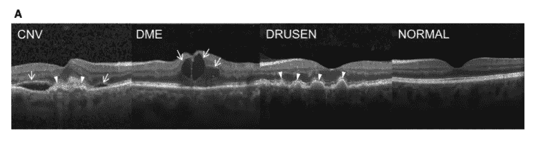

来源:https://i.imgur.com/fSTeZMd.png

**1)脉络膜新生血管(CNV) :** 脉络膜新生血管(CNV)是在[眼](https://en.wikipedia.org/wiki/Human_eye)的[脉络膜](https://en.wikipedia.org/wiki/Choroid)层产生新的血管。脉络膜新生血管化是新生血管变性黄斑病变(即“湿性”黄斑变性)的常见原因，其通常因极度近视、恶性近视变性或年龄相关的发展而加剧。

**2)糖尿病性黄斑水肿(DME) :** 糖尿病性黄斑水肿(DME)是由于血管渗漏而在黄斑(视网膜的一部分，控制我们最详细的视觉能力)中积聚的液体。为了发展 DME，您必须首先患有糖尿病视网膜病变。糖尿病视网膜病变是一种损害视网膜血管的疾病，导致视力损害。如果不治疗，这些血管开始在眼睛中积聚压力并泄漏液体，导致 DME

**3)玻璃疣(玻璃疣):**玻璃疣是[视网膜下的黄色沉积物](https://www.aao.org/eye-health/anatomy/retina-list)。玻璃疣是由脂质，一种脂肪蛋白质组成的。玻璃疣可能不会导致[老年性黄斑变性](https://www.aao.org/eye-health/diseases/age-related-macular-degeneration)。

但是患有玻璃疣会增加一个人患 AMD 的风险。有不同种类的德鲁森。“硬”德鲁斯人很小，与众不同，彼此远离。这种类型的德鲁森可能不会导致长期的视力问题，如果有的话。

“软”德鲁斯人很大，聚集在一起。他们的边缘不像坚硬的玻璃疣那样清晰。这种软性玻璃膜疣增加了患 AMD 的风险。

**4)正常眼睛视网膜(正常):**具有保留的视网膜中央凹轮廓且没有任何视网膜液体/水肿的正常视网膜。

**项目概述:**在这里，我们将建立一个分类器，它将预测四类(CNV，DME，德鲁森，正常)中的一类。首先，我们将准备数据集。这里我们将使用卷积神经网络(CNN)来预测类别。

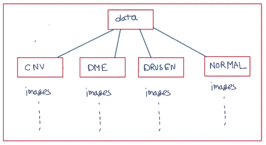

数据集文件夹结构

这是一个多类分类问题。对于这个医学问题，我们希望错误尽可能低，即高精度和高召回率。所以，我们采取了[f1-微 avg](https://datascience.stackexchange.com/questions/15989/micro-average-vs-macro-average-performance-in-a-multiclass-classification-settin) 。作为公制。

**GitHub Repo:** [**视网膜 OCT 图像**](https://github.com/subhande/Retinal-OCT-Images)

**工作流程:**

1.  数据准备
2.  数据分析
3.  数据预处理
4.  CNN 模型
5.  比较各型号的性能

# **数据准备:**

这里我们有 84，495 张图片，每张图片都属于相应的文件夹。我们将创建一个包含 filename、filepath 和 class 列的 dataframe 文件。

# **数据分析:**

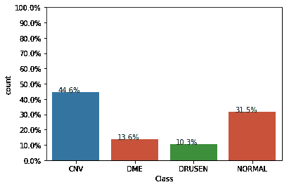

整个数据集的类别分布

在分析了数据之后，从左侧的图像中，我们可以清楚地看出这是一个不平衡的数据集问题。这里 DME 和德鲁森类的图像非常少。

# **数据预处理:**

这里，我们必须在将图像输入 CNN 模型之前对其进行预处理。

这里我们创建了一个名为 imageToArray 的函数，它将图像转换为 3D 数组。每个图像的高度和宽度都被调整为 224 像素，并对数组进行了规范化。所以最后每个图像转换成 224*224*3 的数组。在这个数据集中，我们有 84，495 个图像，我们无法将所有图像加载到主内存中，因此，我们已经加载了图像，并将其成批转换到数组 bactch。在这里，我们创建了 imageLoader 函数，用于批量加载图像。

# **CNN 型号:**

在[深度学习](https://en.wikipedia.org/wiki/Deep_learning)中，**卷积神经网络** ( **CNN** ，或 **ConvNet** )是一类深度神经网络，最常用于分析视觉意象。基于它们的共享权重架构和平移不变性特征，它们也被称为**移位不变**或**空间不变人工神经网络** ( **SIANN** )。它们在图像和视频识别、推荐系统、图像分类、医学图像分析和自然语言处理中有应用。


来源:[https://towards data science . com/a-comprehensive-guide-to-convolutionary-neural-networks-the-Eli 5-way-3bd 2b 1164 a53](https://towardsdatascience.com/a-comprehensive-guide-to-convolutional-neural-networks-the-eli5-way-3bd2b1164a53)

迁移学习是一种技术，我们将使用现有的预训练 CNN 模型。迁移学习技术可分为以下几种类型

a)获取在 ImageNet 上预先训练的 CNN 模型，移除最后一个全连接层，然后将 CNN 的其余部分视为新数据集的固定特征提取器，并为数据集构建自定义全连接层。

b)获取在 ImageNet 上预训练的 CNN 模型，移除最后一个完全连接的层，然后解冻最后几个层，并在顶部连接自定义完全连接的层，并在新数据集上微调该模型。

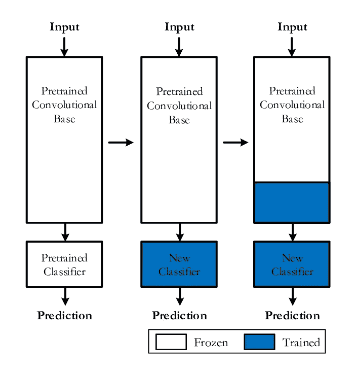

来源:[https://www . research gate . net/figure/TOP-LEVEL-DIAGRAM-OF-TRANSFER-LEARNING-FROM-A-PRE-TRAINED-CNN-MODEL _ fig 4 _ 333882146](https://www.researchgate.net/figure/TOP-LEVEL-DIAGRAM-OF-TRANSFER-LEARNING-FROM-A-PRE-TRAINED-CNN-MODEL_fig4_333882146)

这里我们将使用 5 个 CNN 模型，其中最后 3 个模型将使用迁移学习技术。

因为我们没有所需的资源和时间来训练 84k 图像。所以，我们在这里取了 60000 个图像样本，它们的类别分布与整个数据中的相同。
我们将数据分成三部分，即训练(72.5%) —验证(12.75%) —测试数据(15%)

1.  **3 层定制 CNN 型号:**

这里我们训练了一个 3 层 CNN 模型。我们在 conv 层使用了具有相同填充的 3*3 内核，还使用了 maxpool 和 avgmeanpool 层。我们用 Adam optimizer 训练了这个模型。

我们使用了早期停止来防止模型过拟合，使用了 ReduceLROnPlateau 来降低一个时期内没有改善的验证损失后的学习率，使用了模型检查点来保存模型。

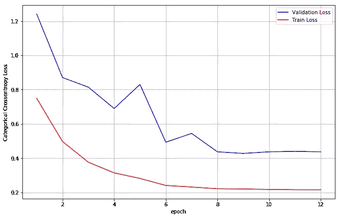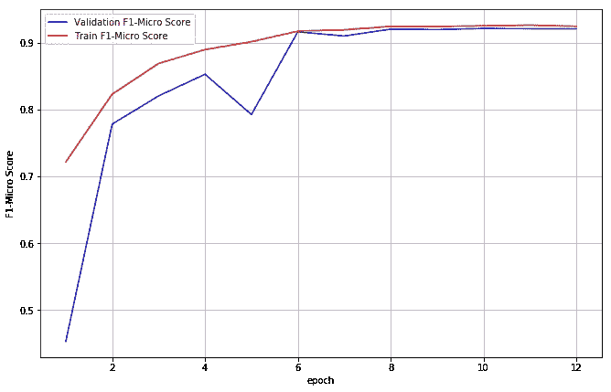

```
**Train F1-micro avg score :  0.9296
Val F1-micro avg score :  0.9199
Test F1-micro avg score :  0.9203**
```

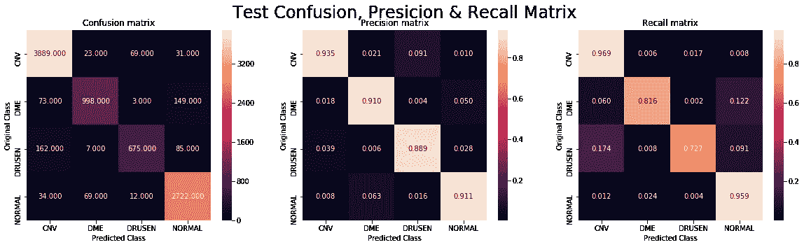

# **2。7 层 CNN 型号:**

这里我们训练了一个 7 层 CNN 模型。我们在 conv 层使用了具有相同填充的 3*3 内核，还使用了 maxpool 和 avgmeanpool 层。我们用 Adam optimizer 训练了这个模型。

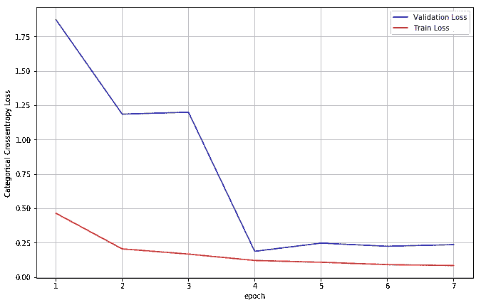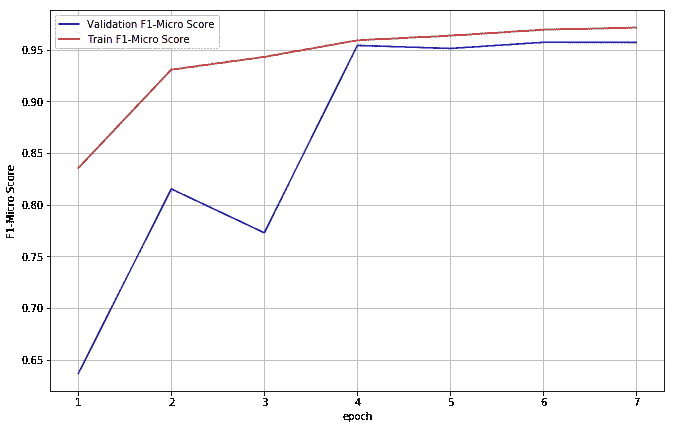

```
**Train F1-micro avg score :  0.9649
Val F1-micro avg score :  0.9542
Test F1-micro avg score :  0.9582**
```

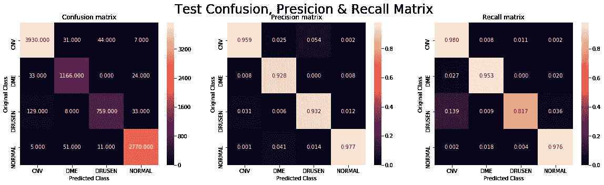

我们从 3 层 CNN 到 7 层 CNN 模型改进了很多。精确度、召回率和 f1-micro 评分都比以前的 CNN 模型有所提高。接下来，我们将尝试迁移学习，即我们将使用预训练作为基础模型。

# **3) VGG16 迁移学习:**

这里，我们使用了一个预训练模型，即没有完全连接层的 VGG16。我们为 4 类分类问题添加了自定义的全连接层。我们在训练时冻结了预训练的模型重量。

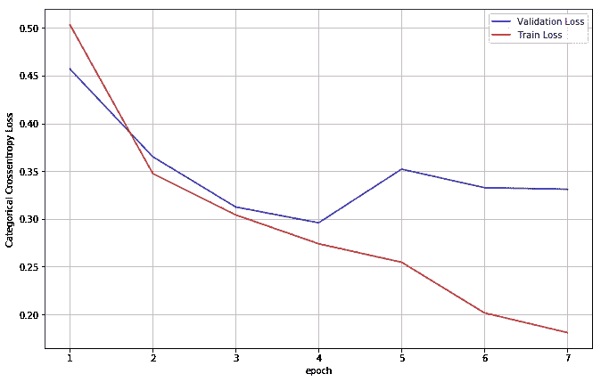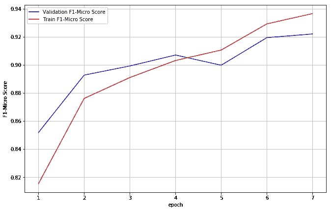

```
**Train F1-micro avg score :  0.9298
Val F1-micro avg score :  0.9071
Test F1-micro avg score :  0.9089**
```

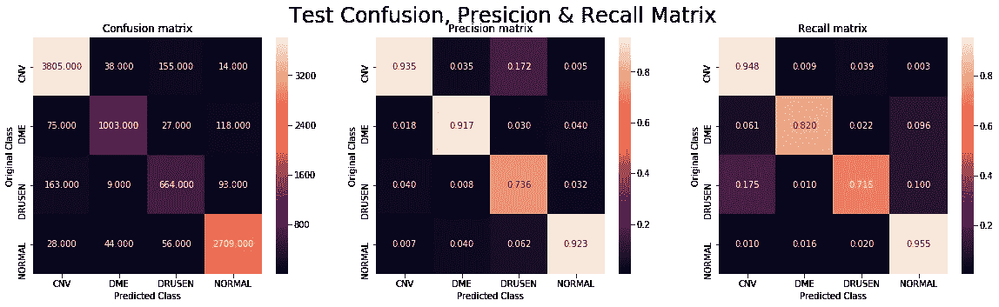

在这里我们可以清楚地看到比对于德鲁森类的精度和召回率都低。在下面的模型中，我们将尝试改进它。该模型比以前的 7 层 CNN 模型表现更差。接下来，我们将尝试 ResNet50 和 DenseNet121 作为最佳学习者，让我们看看指标是否有所改善。

# **4) ResNet50 迁移学习:**

这里，我们使用了一个预训练模型，即没有完全连接层的 ResNet50。我们为 4 类分类问题添加了自定义的全连接层。训练时，除了最后 3 层，我们冻结了预训练的模型权重。我们微调了最后 3 层和完全连接的层。

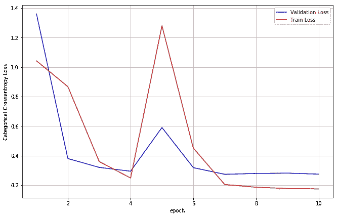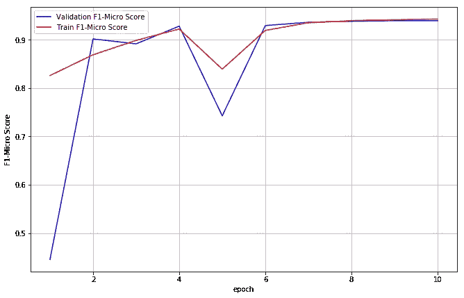

```
**Train F1-micro avg score :  0.9459
Val F1-micro avg score :  0.9366
Test F1-micro avg score :  0.9399**
```

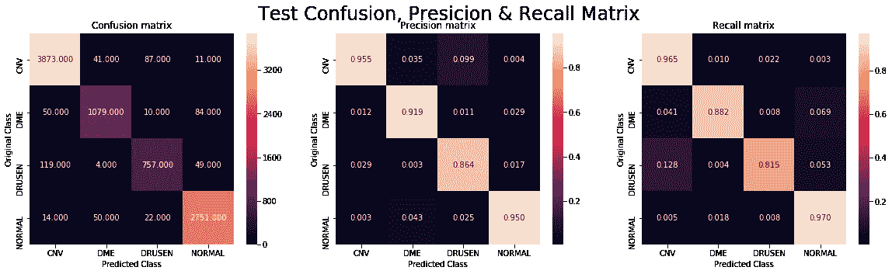

在这里我们可以清楚地看到比得森类的精度和召回率都是从 VGG16 迁移学习模型改进而来的。

# **5) DenseNet121 迁移学习:**

这里，我们使用了一个预训练模型，即没有完全连接层的 DenseNet121。我们为 4 类分类问题添加了自定义的全连接层。训练时，除了最后 3 层，我们冻结了预训练的模型权重。我们微调了最后 3 层和完全连接的层。

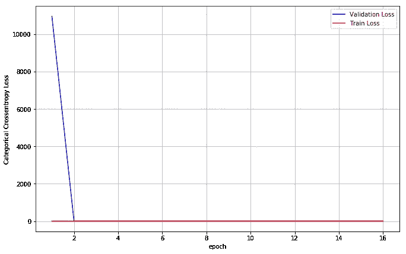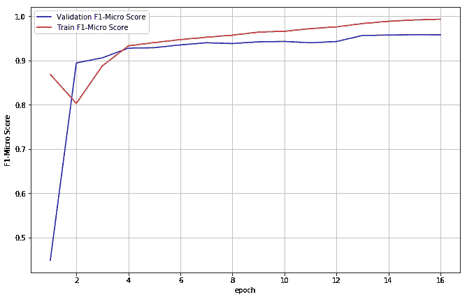

```
**Train F1-micro avg score :  0.9857
Val F1-micro avg score :  0.9561
Test F1-micro avg score :  0.9651**
```

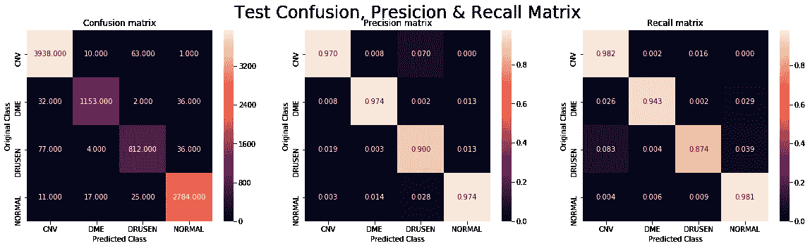

# **车型性能对比:**

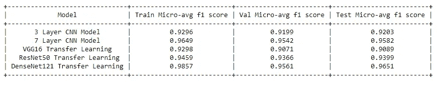

*   7 层 CNN 模型和 DenseNet121 迁移学习模型表现优于其他模型。
*   DenseNet121 是上述 5 种型号中性能最好的型号。DenseNet121 Transfer Learning 在测试数据上的 f1-micro 平均得分最高，即 0.965。
*   如果我们用完整的 84K 图像训练模型，我们还可以提高 f1-micro 得分。
*   详细代码参见 [**Github Repo**](https://github.com/subhande/Retinal-OCT-Images) 。

# **参考文献:**

1.  [http://www . cell . com/cell/full text/s 0092-8674(18)30154-5](http://www.cell.com/cell/fulltext/S0092-8674(18)30154-5)
2.  [https://www.kaggle.com/paultimothymooney/kermany2018](https://www.kaggle.com/paultimothymooney/kermany2018)
3.  [https://www.appliedaicourse.com/](https://www.appliedaicourse.com/)
4.  [https://ophthalmology . med . UBC . ca/patient-care/ophthalmic-photography/optical-coherence-tomography/](https://ophthalmology.med.ubc.ca/patient-care/ophthalmic-photography/optical-coherence-tomography/)
5.  [https://www . VSP . com/wegger-wellness/eye-health/diabetic-macular-水肿](https://www.vsp.com/eyewear-wellness/eye-health/diabetic-macular-edema)
6.  https://www.aao.org/eye-health/diseases/what-are-drusen
7.  [https://towards data science . com/a-comprehensive-guide-to-convolutionary-neural-networks-the-Eli 5-way-3bd2b 1164 a53](https://towardsdatascience.com/a-comprehensive-guide-to-convolutional-neural-networks-the-eli5-way-3bd2b1164a53)
8.  [https://en.wikipedia.org/wiki/Convolutional_neural_network](https://en.wikipedia.org/wiki/Convolutional_neural_network)