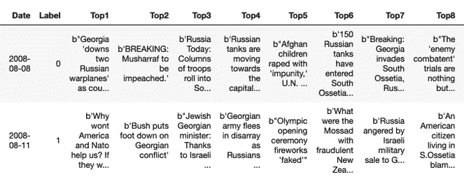
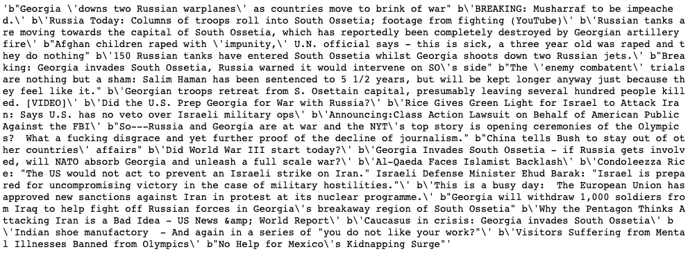
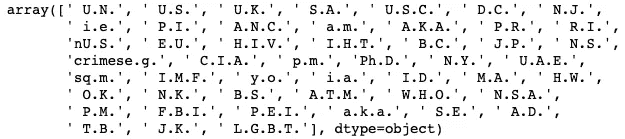
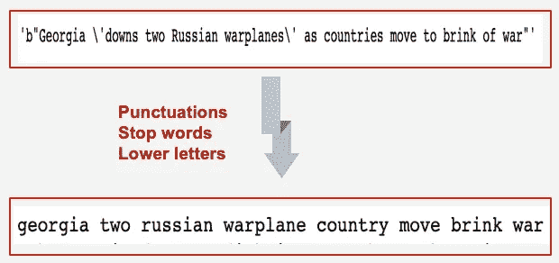
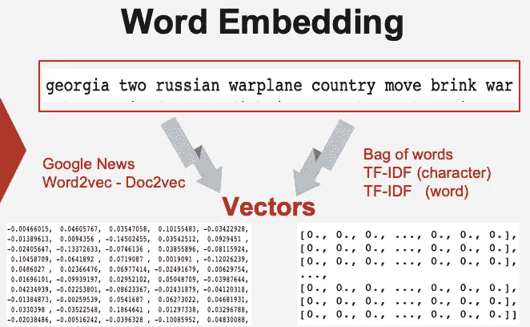
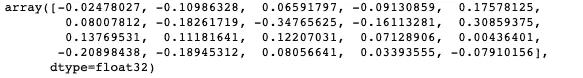
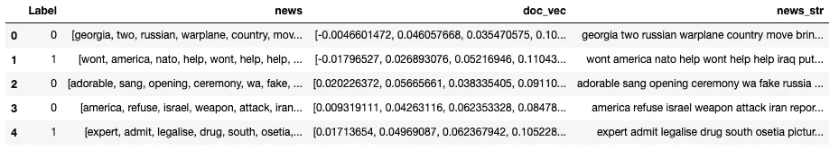

# 利用新闻标题预测股市趋势——第二部分数据准备

> 原文：<https://medium.com/analytics-vidhya/predict-stock-market-trend-using-news-headlines-part-1-data-preparation-19beba72ab80?source=collection_archive---------15----------------------->

资料来源:unsplash.com

> 本文是“利用新闻标题预测股市走势”系列的介绍。请在这里找到本系列的其他文章:[部分](/@guopei123/predict-stock-market-trend-using-news-headlines-part0-introduction-60597ce477a6) 1、[部分](/@guopei123/predict-stock-market-trend-using-news-headlines-part-1-data-preparation-19beba72ab80) 2、[部分](/@guopei123/predict-stock-market-trend-using-news-headlines-part-2-find-the-best-baseline-model-e493ba225b50) 3、[部分](/@guopei123/predict-stock-market-trend-using-news-headlines-part-3-topic-modelling-as-features-64ce30db955b) 4。如果你想重现这个项目，你可以在这里找到所有的 Jupyter 笔记本和 pickle 文件。

# 数据清理

首先让我们看看数据。我们有一个日期栏、一个标签栏和 25 个头条新闻栏。每行代表一天。

我们的目标是看这个消息是否能影响当天的股价，所以这个目的不需要数据列。我们还需要将所有 25 个标题合并到一个文档中，以便稍后建模。经过一些处理后，这是来自第一行的所有新闻的文档。

2008 年 8 月 8 日的所有新闻标题

我们需要删除标点符号和停用词，也降低字母。在做这些之前，需要将缩写转换成常规单词。我创建了这个函数来过滤掉整个数据集中的所有缩写。

结果如下:

我创建了一个函数，可以将原始文本转换成单词标记列表。这个函数首先将缩写转换为完整形式，然后将字符串标记为单词标记。执行进一步的清理以使单词词条匹配，移除停用单词和单个字母单词，以及降低字母。下面是函数。

现在我们有干净的文本数据来处理。

# 数据准备

> **机器学习模型看不懂人类的文字，却知道向量！**

我想尝试几种不同的单词嵌入方法，因为它们可能会影响模型的性能。对于单词包，TF-IDF 嵌入，我们需要将每个文档作为一个长字符串。对于 word2vec (doc2vec)嵌入，向量将是我们所需要的。

**Doc2vec:**

著名的 GoogleNews word2vec 模型在 30 亿个运行单词上进行训练，包含 300 万个 300 维的英语单词向量。我从[这里](https://github.com/mmihaltz/word2vec-GoogleNews-vectors)下载了模型。我用这个模型试了一下“南方”这个词。这是这个单词的 300 个向量中的前 20 个。

我们的预测将基于每个文档而不是单词。所以我们需要通过平均每个文档上的单词向量来制作一个文档向量。我创建了一个函数来完成这项任务。通过这个函数运行每个文档后，每个文档现在都是一个 300 维的向量。

现在，我们需要创建一个新的数据框，其中包含我们稍后建模所需的所有相关数据格式。这是评论。

“新闻”列包含单词标记列表，它用于使用 HDP 模型的主题建模。“doc_vec”列将直接用于分类模型。“new_str”列在每一行中都包含一个长字符串，它将在后面用于单词包和 TF-IDF 嵌入。

现在我们已经完成了数据准备部分。接下来，我们将探索几种分类模型，以找出最佳基线模型。