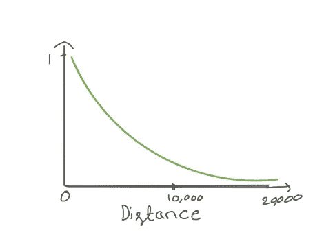
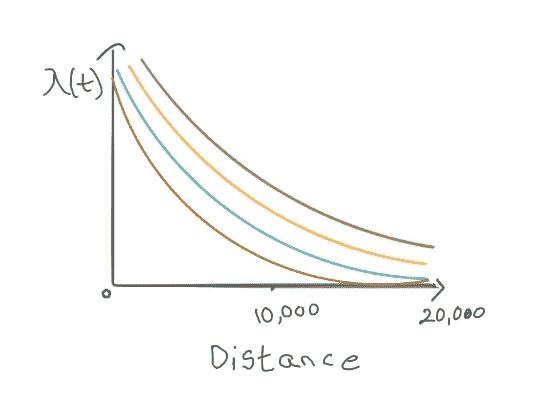
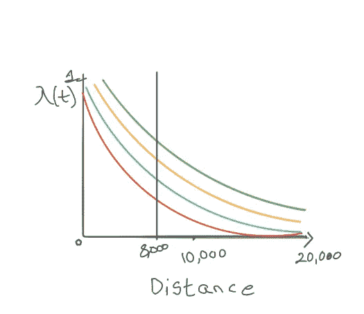
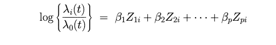
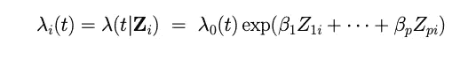
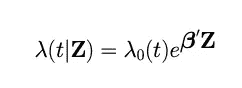

# 使用 Cox 比例风险模型预测生存模型

> 原文：<https://medium.com/analytics-vidhya/predict-survival-model-using-cox-proportional-hazard-model-7bb4ee9fec9a?source=collection_archive---------16----------------------->

Cox 比例风险模型是由 Cox 于 1972 年提出的。这是生存数据的回归模型。如果我们要检查比赛中击球手的存活率，那么协变量可以是投球手、球场、体能、边界距离、技能、投球等。这些协变量通常被称为特征。

在这里，我们可以找到轮胎在道路上的存活率以及轮胎可以行驶的距离。

**道路轮胎示例**

通常，好轮胎的寿命约为 20，000 公里，坏轮胎的寿命约为 15，000 公里。有些类型的轮胎有内胎和无内胎，轮胎是汽车的重要组成部分。行驶到 15，000 公里后，车主需要冒险，因为他不知道轮胎出现故障的概率。

一些好的道路在较好的条件下是平坦和光滑的，如高速公路，而坏的道路是崎岖不平的，如越野。相比之下，轮胎在良好的道路上行驶可能会有更少的风险得到麻烦。而在糟糕的路面上行驶的轮胎更有可能很快损坏。

质量好的轮胎在好路面上行驶的距离可能更长，在坏路面上行驶的距离可能更短，而与质量好的轮胎相比，质量差的轮胎在好路面上行驶的距离可能更短。在糟糕的道路上行驶的距离甚至更短。由于制造时使用的材料类型不同，轮胎可能有厚有薄，还有各种其他类型。

**量化生存**

让我们来看看好的轮胎在好的路面上行驶多远，风险更小。x 轴是轮胎在道路上行驶的距离，y 轴是危险函数。

我们可以在图表中看到一条类似形状的曲线。线条曲线从 y 轴顶端到 x 轴逐渐变小。在这一点上，你可以清楚地看到，在行进一段距离后，风险也在慢慢增加。

**危险功能**

危险函数(λ(t))表示该物体在该时间点的死亡率。在上面的例子中，我们可以知道轮胎在该点发生故障的概率。

绿线代表好轮胎和好道路

黄线代表好轮胎和坏路面

蓝线代表坏轮胎和好路面

红线代表坏轮胎和坏路面

现在让我们来看一下好轮胎在好路面上的对比，好轮胎在坏路面上的对比，坏轮胎在好路面上的对比，以及坏轮胎在坏路面上的对比

各种轮胎在各种道路上的对比

现在我们可以通过上面的图表得到一个粗略的想法，我们画一条平行于 y 轴的垂直线，并在 x 轴上 8000 公里处相交。

让我们假设这些点，在垂直线接触所有四条曲线的地方，我们可以得到显示风险函数的四个点。在这里，它清楚地显示了所有四个比较的生存。

**考克斯普**

它告诉我们物体在特定时间间隔的存活情况。这有点类似于回归。

特征的风险函数的对数通过基线的风险函数大于 1，则它具有良好的存活性。如果少于一个，存活的机会就比基线少一些。此处 log 用于缩放数值。β是加权的

如果特征的风险函数比基线的风险函数大，那么我们使用对数函数，将这些值转换成较小的值。

比例风险模型方程

Cox 比例风险模型是风险比对数的线性模型。

**Z** :特征向量

**λo(t) =** 基线危害函数

e =指数函数

*基线危险函数描述*单位时间内事件的风险如何随时间变化。这是一种具有所有特征的潜在危险。