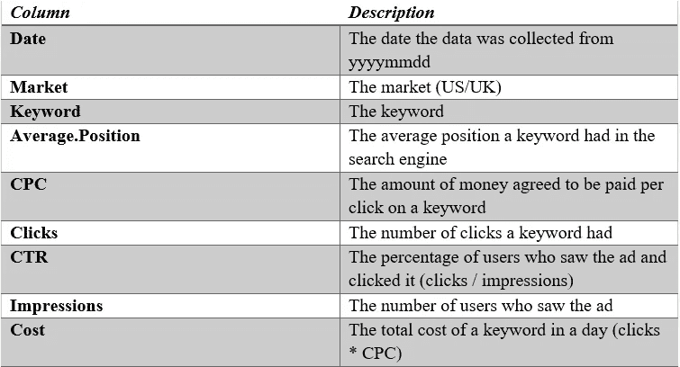
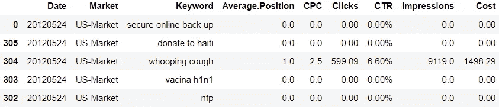
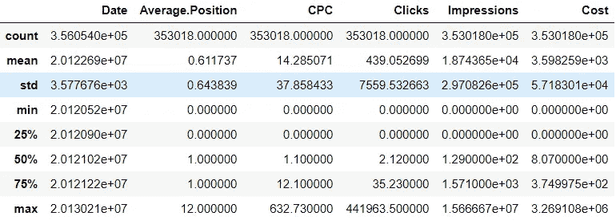
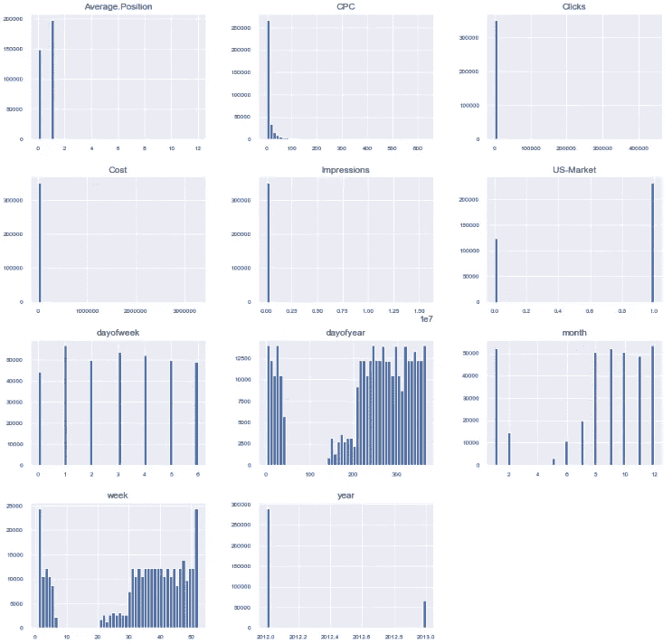
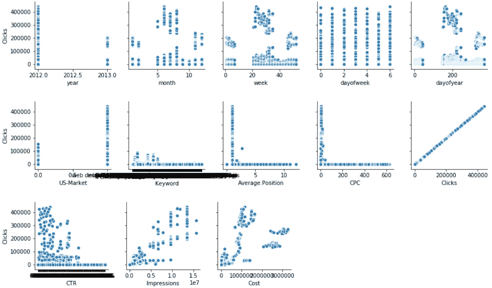
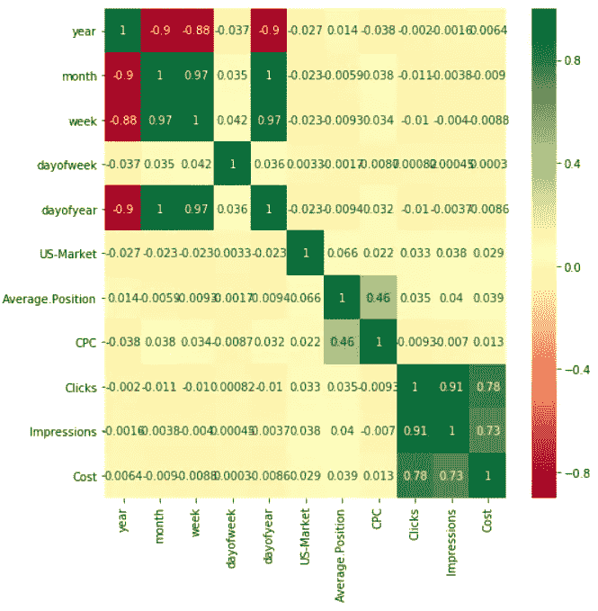

# 使用机器学习方法预测关键词的点击率

> 原文：<https://medium.com/analytics-vidhya/predict-the-click-through-rate-for-keywords-using-machine-learning-methodologies-37883ae41189?source=collection_archive---------8----------------------->


在这篇文章中，我想讨论一下我最近完成的一项数据科学任务。首先，我将解释问题描述、目标和数据集。此外，完成数据的可视化，并选择重要的特征来训练机器学习模型。

**问题描述:**

一家广告公司代表他们的客户销售在搜索引擎中购买关键词的服务。他们试图优化他们的关键字和资金分配。最佳解决方案的第一步是通过关键词和基金来预测业绩。

**目标:**

预测任何关键字(不一定是数据集文件中的关键字)、CPC 和市场(美国/英国)网站将收到的流量(即点击)。

**数据集描述:**



数据集中属性的描述

```
# importing necessary libraries
import numpy as np
import pandas as pd
import matplotlib.pyplot as plt
import seaborn as sns
%matplotlib inlinefrom sklearn.model_selection import train_test_split
from nltk.tokenize import word_tokenize
from nltk.corpus import stopwords
import re
import nltk
nltk.download('stopwords')
```

读取数据集，按“日期”属性排序。

```
df = pd.read_csv('Dataset.csv')
df.sort_values(by='Date',inplace=True)
df.head()
```



最初，我使用**描述方法**对非缺失值、平均值、标准偏差、范围、中值、0.25 和 0.75 四分位数的数量有直观的了解。

```
data.describe()
```



现在将日期属性转换为日期时间格式(YYYY-MM-DD ),以提取年、月、星期几、年中的某一天等特征。

```
data[‘Date’] = data[‘Date’].apply(lambda x: pd.to_datetime(str(x), format=’%Y%m%d’, errors=’ignore’))date_data = data['Date']date = pd.DataFrame({'year':date_data.dt.year,
                     'month':date_data.dt.month,
                    'week':date_data.dt.week,
                    'dayofweek':date_data.dt.dayofweek, 
                    'dayofyear':date_data.dt.dayofyear})
```

分类变量被转换成虚拟变量

```
Market = pd.get_dummies(data['Market'],drop_first=True)
train_data = pd.concat([date,Market,data],axis=1)
train_data.drop(['Date','Market'],axis=1,inplace=True)
```

然后我绘制了每个独立特征的**直方图**来得到每个特征的分布。据观察，与其他数字相比，点击次数= '0 '更多。此外，2012 年的点击量比 2013 年多。此外，按月份来看，大多数点击发生在 8 月至 12 月。如果我们看看一周中的某一天，最高点击率出现在星期二。大多数点击来自美国市场。

```
train_data.hist(figsize=(15, 15), bins=50, xlabelsize=8, ylabelsize=8)
```



现在，为了确定数字特征的重要性，我绘制了目标变量='clicks '和所有其他特征之间的配对图。观察到诸如成本、印象、CTR、CPC、星期、一年中的某一天之类的特征与目标变量具有某种线性关系。

```
for i in range(0, len(train_data.columns), 5):
    sns.pairplot(data=train_data,
                x_vars=train_data.columns[i:i+5],
                y_vars=['Clicks'])
```



为了进一步验证重要特征，我用热图绘制了一个相关矩阵。据观察，只有两个特征印象和成本与目标变量高度相关。我们还可以在绘制的热图中看到强烈的负相关性。

```
corrmat = train_data.corr()
top_corr_features = corrmat.index
plt.figure(figsize=(8,8))
#plot heat map
g=sns.heatmap(train_data[top_corr_features].corr(),annot=True,cmap=”RdYlGn”)
```



**对关键词进行了文本预处理/清理:**

最初，所有的数字、标点符号、符号都使用正则表达式从关键字中删除。然后关键字被小写化和标记化。对关键字进行标记后，使用 NLTK 停用词删除停用词。

**对清理后的关键词进行文字嵌入:**

清理数据后，为了训练机器学习模型，需要将关键字中的每个单词转换为单词向量，因为算法无法处理原始形式的纯文本或字符串。单词嵌入是捕获单词的语义和上下文信息的向量。在这里，我使用了一个基于 Fasttext 的单词嵌入，它为关键字中的每个单词提供了 300 维的向量。因此，为了生成完整关键字的单个向量，取关键字中每个词向量的平均值。

在给定的问题中，当给定日期、市场、关键字和 CPC 的特征时，点击数是要由训练的模型预测的目标变量。由于点击次数具有正的连续值，我将该问题建模为回归问题。数据中存在许多“Nan”值，这些值被删除，而不是对数据进行一些插补并替换 Nan 值。因为我们所有的功能都是一些特定的关键字，所以我们不确定这些关键字有多少点击，印象或成本。同样，由于数据是巨大的，即使我们丢弃这些较少的数据也不会有影响。现在，因为搜索关键字的日期可能具有重要的特征，所以我从附加到数据的日期中提取了像年、月、周、星期和年这样的特征。分类值被转换成虚拟变量。

根据问题陈述，提到了在 2013 年 2 月 14 日给定每个市场(美国/英国)的关键词和点击费用，模型必须预测点击次数。所以我用两组不同的特征来模拟这个问题:

a) X =关键词、市场和 cpc

b) X =年、月、周、周、年、关键词、市场和 cpc

目标变量被设置为 Y =点击次数。

我使用了经典的机器学习和深度学习模型，如随机森林回归**，Xgboost 回归，1D-CNN 和 GRU** 模型来训练和评估给定的数据。给定的数据通过按日期排序被分成训练和测试数据。2012 年的所有数据作为训练数据，2013 年的所有数据作为测试数据。

这些代码可以在我的 GitHub 个人资料中找到:[https://GitHub . com/vyshnavmt 94/Predict-the-Click-Through-Rate for-Keywords-Using-Machine-Learning-Methodologies](https://github.com/Vyshnavmt94/Predict-the-Click-Through-Rate-for-Keywords-Using-Machine-Learning-Methodologies)

**成绩:**

a) X =关键词、市场和 cpc

**随机森林回归:**

```
Coefficient of determination R² of the prediction: 0.914177804049537Mean squared error: 297606.09Test Variance score: 0.80mean_absolute_error: 74.95
```

**XGboost 回归:**

```
Coefficient of determination R^2 of the prediction.  0.5800091699348091Mean squared error: 393330.94Test Variance score: 0.74mean_absolute_error: 213.09
```

**1-DCNN: (70 个时期)**

```
Mean squared error: 183220.71Test Variance score: 0.88mean_absolute_error: 61.83
```

**GRU: (20 个纪元)**

```
Mean squared error: 125502.27R2 score: 0.92mean_absolute_error: 70.50
```

b) X =年、月、周、周、年、关键词、市场和 cpc

**随机森林回归:**

预测的决定系数 R。: 0.9976723650491951

```
Mean squared error: 1008241.56Test Variance score: 0.33mean_absolute_error: 175.60
```

**XGboost 回归:**

预测的决定系数 R。: 0.6653407930753578

```
Mean squared error: 519430.67Test Variance score: 0.65mean_absolute_error: 224.09
```

**1-DCNN: (30 个时期)**

```
Mean squared error: 9360270.80R2 score: -5.25mean_absolute_error: 2336.26
```

**GRU: (30 个纪元)**

```
Mean squared error: 1535167.11R2 score: -0.02mean_absolute_error: 193.50
```

我希望这篇文章有助于理解数据的可视化，以提取最佳特征并训练机器学习模型。