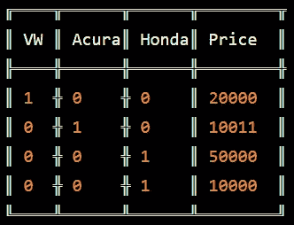
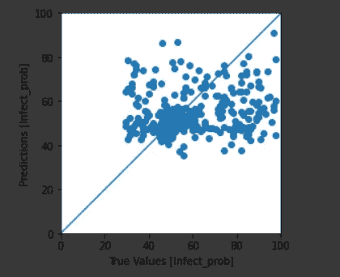

# 使用深度学习预测一个人被新冠肺炎感染的概率

> 原文：<https://medium.com/analytics-vidhya/predict-the-probability-of-a-person-getting-infected-by-covid-19-using-deep-learning-4965703053bf?source=collection_archive---------24----------------------->


冠状病毒是一个由数百种病毒组成的家族，可以引起发烧、呼吸系统问题，有时还会引起胃肠道症状。2019 年的新型冠状病毒是该家族已知感染人类的七个成员之一，也是过去三十年来第三个从动物跳到人类的病毒。

全世界都在参与反对这个疫情的斗争。数据科学界可以对抗击这种疾病产生重大影响。已经有许多优秀的努力使用数据可视化和蒙特卡罗模拟来帮助打击这种疫情的传播。这种预测模型有助于识别那些风险最大的人。通过结合医疗保健技术领域的努力，我们希望减轻这种可怕疾病的影响。

> 注意:由于实时数据不可用，本教程中使用的数据是合成数据，因此它不能用来预测现实世界的衰老。然而，如果我们获得了真实的数据，我们就可以用它来训练我们的模型。

# 探索数据

数据为 CSV 格式，包含 28 列


数据集中列的说明

*Infect_Prob* 是一个人被感染的概率，它将是我们模型的标签，其余 27 列代表特征。

我正在使用合作实验室来运行这个 IPythonNotebook。所有需要的文件包括这个笔记本都在这个链接里:[https://github . com/aryan 109/predict _ coi vid 19 _ infection _ probability](https://github.com/aryan109/predict_COIVID19_infection_probability)

## 加载数据

我们将数据加载到熊猫数据框架。

对于训练数据:

```
#set path of training data according to your directory structure
URL = ‘/content/drive/My Drive/Dataset/Train_dataset.csv’ 
dataframe = pd.read_csv(URL)
dataframe.head()
```


前 5 行训练数据

对于测试数据:

```
#set path of test data according to your directory structure
testUrl = '/content/drive/My Drive/Dataset/Test_dataset.csv' 
testDataframe = pd.read_csv(testUrl)
testDataframe.head()
```

# 数据预处理

我们需要在这些特征上做*特征选择*，只保留最重要的特征。例如，像年龄、肺部评分、心脏评分这样的特征是比人-Id、姓名和称号更重要的特征。

我们还会将职业、共病等分类特征转换成**一次性编码**。

## 一键编码

一种热编码是将分类变量转换成一种形式的过程，这种形式可以提供给 ML 算法，以便在预测中做得更好。

示例:


已知资料

一次热编码后的数据:



0 表示不存在，1 表示存在。

我们将创建一个函数来进行数据预处理

```
def cleanData(dataframe):
 df2 = dataframe
 Gender = pd.get_dummies(df2.Gender, prefix=’Gender’)
 Occupation=pd.get_dummies(df2.Occupation,prefix=’Occupation’)
 Mode_transport=pd.get_dummies(df2.Mode_transport,prefix=’Mode_transport’)
 comorbidity=pd.get_dummies(df2.comorbidity,prefix=’comorbidity’)
 df2[‘Pulmonary_score’] = df2[‘Pulmonary score’]
 df2[‘cardiological_pressure’] = df2[‘cardiological pressure’]
 df2 = df2.drop([‘Pulmonary score’,’cardiological pressure’],axis=1)
 Pulmonary_score=pd.get_dummies(df2.Pulmonary_score,prefix=’Pulmonary_score’)
 cardiological_pressure=pd.get_dummies(df2.cardiological_pressure,prefix=’cardiological_pressure’)
 df2 = pd.concat([Gender,Occupation,Mode_transport,comorbidity,Pulmonary_score,cardiological_pressure,df2] , axis=1)
 df2=df2.drop([‘Region’,’Gender’,’Occupation’,’Mode_transport’,’comorbidity’,’Pulmonary_score’,’cardiological_pressure’],axis = 1)
 df = df2
 df=df.drop([‘Designation’, ‘Name’, ‘Married’, ‘Children’, ‘Insurance’, ‘salary’,’people_ID’], axis = 1) 
 return df
```


## 处理缺失值

在本教程中，为了简单起见，我们将删除所有包含缺失值的行。

找出每列中 NA 值的数量。

```
df.isna().sum()
```


删除包含 NA 的行

```
#to keep simple initially we are dropping all na columns
df = df.dropna() 
print(‘after dropping all na’)
df.isna().sum()
```


## 将数据分为训练和测试

90%的数据将用于训练，10%的数据将用于验证

```
train_dataset = df2.sample(frac=0.9,random_state=0)
test_dataset = df2.drop(train_dataset.index)
print(len(train_dataset), ‘train examples’)
print(len(test_dataset), ‘validation examples’)
```


代码的输出

## 关于数据的一些统计

我们使用 *describe()* 函数查看关于数据的统计

```
train_stats = train_dataset.describe()
train_stats.pop(“Infect_Prob”)
train_stats = train_stats.transpose()
train_stats
```


输出

现在我们将标签(Infect_Prob)存储到单独的变量中

```
train_labels = train_dataset.pop(‘Infect_Prob’)
test_labels = test_dataset.pop(‘Infect_Prob’)
```


## 标准化数据集

**归一化**用于缩放属性的数据，使其落在一个较小的范围内，如-1.0 到 1.0 或 0.0 到 1.0。之所以使用它，是因为我们在不同的尺度上处理属性，这可能会导致一个同等重要的属性(在较低的尺度上)的稀释无效性，因为其他属性在较大的尺度上具有值。

```
def norm(x):
 return (x — train_stats[‘mean’]) / train_stats[‘std’]
normed_train_data = norm(train_dataset)
normed_test_data = norm(test_dataset)
```


# 定义模型

```
def build_model():
 model = keras.Sequential([
 layers.Dense(64, activation=’relu’, input_shape=[len(normed_train_data.keys())]),
 layers.Dense(32, activation=’relu’),
 layers.Dense(16, activation=’relu’),
 layers.Dense(1)
 ])optimizer = tf.keras.optimizers.RMSprop(0.0005)model.compile(loss=’mae’,
 optimizer=optimizer,
 metrics=[‘mae’, ‘mse’])
 return model
```


## 让我们训练模型

我们将训练 500 个纪元的模型

```
EPOCHS = 500
history = model.fit(
 train_dataset, train_labels,
 epochs=EPOCHS, validation_split = 0.2, verbose=0,
 callbacks=[tfdocs.modeling.EpochDots()])
```


# 绘制一些图表


训练用图

## 测试我们的模型

```
test_predictions = model.predict(test_dataset).flatten()
a = plt.axes(aspect=’equal’)
plt.scatter(test_labels, test_predictions)
plt.xlabel(‘True Values [Infect_prob]’)
plt.ylabel(‘Predictions [Infect_prob]’)
lims = [0, 100]
plt.xlim(lims)
plt.ylim(lims)
_ = plt.plot(lims, lims)
```



绘制误差图

```
error = test_predictions — test_labels
plt.hist(error, bins = 25)
plt.xlabel(“Prediction Error [Infect_prob]”)
_ = plt.ylabel(“Count”)
```


# 最终预测并保存结果

做预测就像调用一个函数一样简单

```
ans = model.predict(testData)
```

***ans*** 将举行结果

## 将结果存储到 CSV 文件中

首先，我们将创建一个只有列名的空数据框架

```
dfObj = pd.DataFrame(columns=[‘people_ID’, ‘infect_prob’])
```

然后我们将 peopleId 数组转换成 NumPy 数组

```
peopleIdArr = peopleId.to_numpy()
```

现在，我们将把 people_Id 和 Infect_Prob 添加到空白数据帧表单 **peopleIdArr** 和 **ans** 中

```
k = 0
while(k< len(peopleIdArr)):
 i = int(peopleIdArr[k])
 j = ans[k][0]
 dfObj = dfObj.append({‘people_ID’: i,’infect_prob’:j}, ignore_index=True)
 k+=1
dfObj.head()
```


现在我们将包含结果的数据帧转换成 CSV 文件并下载。

```
dfObj2.to_csv(r’/content/prob1.csv’, index=False)
from google.colab import files
files.download(“/content/prob1.csv”)
```

执行此代码后，prob1.csv 将自动下载。


乔恩·泰森在 [Unsplash](https://unsplash.com?utm_source=medium&utm_medium=referral) 上的照片

