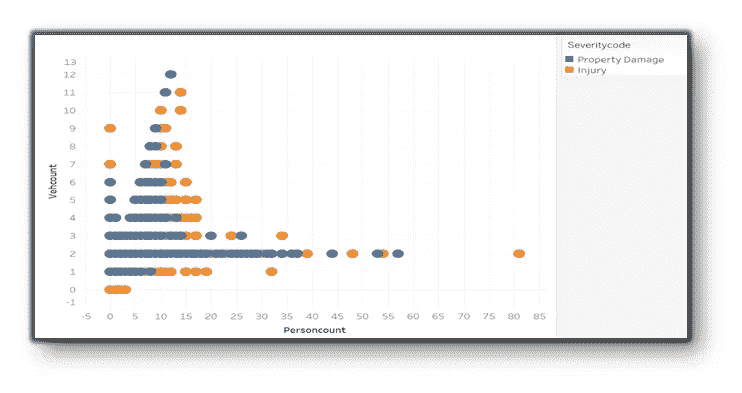

# 预测交通事故严重程度

> 原文：<https://medium.com/analytics-vidhya/predict-traffic-accident-severity-96a15620fa63?source=collection_archive---------20----------------------->

分类模型

预测交通事故严重程度

道路安全应该是政府、地方当局和私营公司投资于有助于减少事故和提高整体驾驶安全的技术的优先考虑。

这里我们将分析历史碰撞数据并准备分类模型来预测未来事件。

# **数据:**

从[https://S3 . us . cloud-object-storage . appdomain . cloud/cf-courses-Data/cognitive class/DP 0701 en/version-2/Data-collisions . CSV](https://s3.us.cloud-object-storage.appdomain.cloud/cf-courses-data/CognitiveClass/DP0701EN/version-2/Data-Collisions.csv)下载数据集

数据集形状: **194673 个样本，38 个特征**

功能列表

这里 **SEVERITYCODE** 是目标变量。

**1:财产损失，**

**2:受伤**

# **数据清理和数据分析:**

下图显示了目标变量中的类别分布不平衡。

我们需要减少大多数班级的人数以使分布均衡。

执行向下采样后目标变量中的分布。现在是平衡数据集。

识别并删除缺失值超过 30%的列。并移除缺失值少于 3%的样本。因为如果我们使用任意方法填充缺失的数据，生成坏数据的可能性会更高。

缺失值> 30%和缺失值< 3%

Check category distribution of other features with respect to target variable along with data distribution in continuous features and visualize results. It will help to find duplicate and ambiguous categories within data set.

It will also help to check patterns in data before performing down sampling and after performing down sampling. If data distribution gets changed after applying any up sampling or down sampling technique, that means either we may have generated bad data or have lost some important information from original data set. Here pattern remains intact after applying down sampling technique that means we have not lost any important information.

**关于目标变量的数据分布:下采样前**

**目标变量的数据分布:降采样后**

**观察:**

上图显示，即使在下采样后，数据模式仍保持不变。这意味着我们没有丢失任何重要数据。

具有模糊类别的功能“UNDERINFL”。我们应该把 Y 和 1 合并，把 N 和 0 合并。

具有模糊类别的特征天气。我们应该把雨夹雪/冰雹/冻雨和下雪混在一起，其他的和未知的，有严重侧风的风沙/尘土混在一起。

具有不明确类别的特征道路状况。我们应该把其他的和未知的融合在一起。

具有不明确类别的特征光导管。我们应该把其他未知的、黑暗的——路灯关掉——没有路灯。

它还表明，最大的碰撞发生在晴朗的天气干燥的道路上和日光下。

检查异常值并删除。

然后将分类变量转换为数值，因为机器学习模型不支持字符串或文本数据。

丢弃重复样本并标准化输入数据。

# **建模:**

> 在这里，您也可以使用 scikit-learn 的 **GridSearchCV** 方法尝试多个超参数，这将产生给定模型的最佳超参数。稍后，您可以使用这些参数来训练模型。

使用**准确度、F1-得分、Jaccrd 相似性得分、精确度、召回率进行评估。**

# **结果:**

使用不同算法和评估指标的预测结果

# **结论:**

SVM 在其他车型中表现最佳，同时培训时间也比其他车型高 100 倍。

如果我们追求精确，那么决策树表现良好，如果我们追求召回，那么 KNN 表现良好。

这里“精确”指的是预测的碰撞伤害百分比是真实的伤害。取而代之的是，90%的碰撞确实涉及到了被正确预测的伤害.对于这个特定的问题，召回率比精确度更重要，因为高召回率将有利于所有需要的资源都准备好来预测碰撞是否涉及伤害。