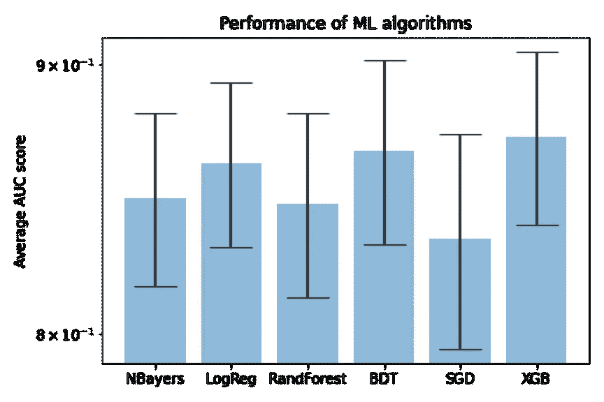

# 预测给定的票是否会被支付？

> 原文：<https://medium.com/analytics-vidhya/predict-whether-a-given-ticket-will-be-paid-2967ca93ec1c?source=collection_archive---------15----------------------->

## 用机器学习算法探索数据，处理分类问题中的不平衡数据。

随着汽车工业的发展，底特律一度成为美国人口第四多的城市。然而，汽车行业工作岗位的减少导致了底特律的衰落。底特律于 2013 年申请破产，自那以后，该市的人口大幅减少，现在几乎一半的房产都已损毁或废弃。

底特律一处破败的房产。来源:**守护者**

*这已经成为底特律面临的最紧迫的问题之一。每年，该市都会向居民开出数百万美元的罚单，而每年，这些罚款中有许多仍未支付。强制执行未支付的不良罚款是一个昂贵而繁琐的过程，因此该市想知道:我们如何才能提高不良罚单的合规性？*

回答这个问题的第一步是了解居民何时以及为什么可能不遵守不良罚单。这就是预测建模的用武之地。在本帖中，我们的任务是预测给定的不良罚单是否会按时支付。

该数据集由密歇根数据科学团队(MDST)与底特律市合作举办的[数据挑战赛](http://midas.umich.edu/mdst/)的 [Kaggle 竞赛](https://www.kaggle.com/c/detroit-blight-ticket-compliance)提供。

*我们将尝试回答这些问题:*

> 多少人付了票？
> 
> *什么可能让他们付钱或不付钱？*
> 
> *我们可以建立多好的预测模型？*

# ***数据清理***

数据集中的变量如下所示。目标变量是合规性，如果按时支付了罚单，则为*真*，如果没有支付罚单，则为*假*，如果发现违规者没有责任，则为*空*(我在分析中将此视为没有支付)。

首先，我排除了一些只存在于训练集中的属性，以防止潜在的数据泄漏。从 27 个定语开始，对于 next 来说，要么是琐碎的定语(例如: *non_us_str_code* ，全部空白)，要么是在大多数事件中缺失的定语( *> 75%* )。如果列的值是相等的(或另一个的线性和)或几乎处处为零，我进一步删除了一些属性。最后，剩下十个属性用于建模。

## 训练集中共有 250305 个事件，测试集中有 61001 个事件。你可以从左边的图中看到，只有 4.6%的人会付钱！

(左图显示了每种指示情况的数量，分别为 59.2%、36.1%和 4.6%。)

# ***评价指标***

我们的预测将以相应的不良罚单将被按时支付的概率给出。评价指标将是 ROC 曲线下的面积(AUC)。

# ***探索性数据分析***

初步的数据清理之后，我们先来看看一般开多少罚单？范围看起来很广。此外，当我在变量上将事件分成支付了*的*和未支付*的*组时，行为没有显示出一对一的因果关系。我们需要挖掘更多。

罚金数额和判决数额的分布。上面两个图显示的是训练集，下面两个图显示的是测试集。

> 要注意的是，不同值之间的训练集和测试集分布并不相似。例如:在训练中最大的一组罚款金额是 50 美元，而在测试集中超过一半的事件是 250 美元。这种差异还限制了我们在所建立的模型上可能实现的最佳预测性能，因为与测试集中最常见的类别相比，一些类别的训练中的统计数据较低。

下面的分布分别针对*已付(真)*和*未付(假)*组进行标准化，我们正在比较每个变量上*真*和*假*之间的“形状”，以查看是否存在差异。形状上的差异越大也意味着使用这个变量更容易区分*真*和*假*。

不同变量上有偿(真)和无偿(假)事件的正态分布。

## 关于数据预处理的更多信息

这里要提到的是，为了将属性实现到建模中，我将字符串类型的文本变量转换为代表不同类别的数值。比如“ *city* 这个变量，看到最多的字符串是“ *DETROIT* ”和“ *Detroit* ”，我把它们一视同仁，标为第一类。顺序中的第二个是“*南菲尔德*”，它被标记为类别-2。以此类推。占非常小的分区的类别被合并到一个更大的组中，以避免由于低统计量而导致的过度拟合。本次替换的属性包括:“*城市*”、“*机构 _ 名称*”、“*违章 _ 代码*”、“*处置*”，希望对建模有更多的见解。这些属性的原始分布可以在我的 Jupyter 笔记本上看到。

## 相关矩阵

让我们看看我将在建模中使用的最终变量的相关性度量。与“*合规性*”(利益参数)具有更高相关性的变量在预测账单是否会被支付时可以发挥更大的作用。

前 5 个相关变量是“折扣 _ 金额”(0.30)、“管理 _ 费用”(0.17)、“状态 _ 费用”(0.17)、“处置”(0.16)和“机构 _ 名称”(0.05)。

> 如果任何变量对高度相关，并且其中一个变量也与感兴趣的参数高度相关，对于这种情况，我认为应用非线性机器学习算法(例如神经网络)有可能获得更多。对于这项研究，我将保持简单。仅考虑线性算法和基于树的算法，因为已经能够实现足够好的性能。

# ***机器学习算法***

在*scikit-learn*API 的帮助下，我利用不同的机器学习算法建立了各种模型，包括:朴素拜耳分类器、逻辑回归、随机森林回归、梯度推进分类器、随机梯度下降和 XGBooster。

通常，线性方法可能不足以对复杂的数据集建模，但它可以作为理解基线性能的基础。

> 在我的测试中，在 ROC 图中没有比其他算法表现更好的大赢家，尽管基于树的方法通常在 AUC 指标上表现稍好。

# ***交叉验证***

训练模型并在相同的数据上测试它是一个方法错误，当它应用于其他数据集时，通常会导致过度拟合。当我们谈到在应用程序中比较和选择机器学习模型的版本时，通常的做法是进行“实验”。

“折叠”如何工作的演示。来源:sci kit-学习指南

训练集首先被分成 *k* 个更小的子集，称为 *k* “折叠”。使用褶皱的 *k-1* 作为训练数据来训练模型。数据的剩余部分被用作“测试”数据来计算性能度量。这个过程被称为交叉验证。交叉验证的 *k* 倍报告的性能测量可通过取计算值的平均值来实现。

所以通过交叉验证，让我们再次看看不同机器学习算法的性能。分数通过我运行的交叉验证的平均 AUC 进行比较。

图以对数标度表示。

# ***不平衡数据集的重采样策略***

我们提到，在这个特定的数据集中，只有 4.6%的人支付了门票，这带来了一个如何分析不平衡数据集的有趣话题。在像这样的数据集中，属于多数类的实例的概率非常高，因此算法更有可能将新的观察分类到多数类。

> 有许多文章讨论不平衡数据的问题。减轻这些影响的常见解决方案是对数据集进行重采样，重采样到多数类(欠采样)或少数类(过采样)。

演示“重采样”如何工作。来源:[ [1](https://www.kaggle.com/rafjaa/resampling-strategies-for-imbalanced-datasets)

> “尽管有平衡班级的优势，这些技术也有它们的弱点(没有免费的午餐)。过采样的最简单实现是从少数类中复制随机记录，这可能会导致过拟合。在欠采样中，最简单的技术是从多数类中移除随机记录，这会导致信息丢失。

在这篇文章中，我的目的是向您展示使用不平衡学习库实现的重采样数据集的比较结果。下面提到的所有技术都在库文档或这些文章[ [1](https://www.kaggle.com/rafjaa/resampling-strategies-for-imbalanced-datasets) 、 [2](https://machinelearningmastery.com/undersampling-algorithms-for-imbalanced-classification/) 、 [3](/james-blogs/handling-imbalanced-data-in-classification-problems-7de598c1059f) 中有很好的描述。

我将 XGBooster 作为默认的分类算法，总共运行了 9 组实验，每组都进行了 50 次交叉验证。“exp0”意味着默认设置原始数据集而不进行重采样。实验如下:

1.  过采样:随机过采样
2.  欠采样:随机欠采样
3.  欠采样:接近失败
4.  欠采样:编辑过的最近邻
5.  欠采样:单边选择
6.  欠采样:邻域清理规则
7.  过采样:SMOTE
8.  过采样后欠采样:STMOTE + Tomek

图以对数比例表示

以下是我们可以从中得出的一些想法:

1.  不平衡技术可以改善模型性能(8 个不平衡技术中的 4 个优于基线模型)，但与其他方法相比，它在统计上不显著。
2.  在这个数据集中，过采样技术比欠采样技术表现得更好。这可能是由于欠采样丢弃了关于多数类的潜在有用信息，这是该技术的一个众所周知的缺点。

然而，在不同的数据集和条件下，结果是不同的。还建议在不平衡率范围内测试不平衡技术。

# ***还可以做些什么来改进模型？***

这里有一些可能推动更高的 AUC！

*   多加点变数！除了我使用的 10 个变量之外，还有一些空间来进一步清理和使用提供的变量。
*   采用神经网络！这个特定数据集中的问题相对简单，因此仅使用基线模型(优化前)就已经能够在 Kaggle 竞赛中取得前三分之一的成绩。
*   扫描最佳参数设置！为 ML 模型制作 *gridSearchCV* ，尽管这在计算上代价很高。
*   我把它当作一个二元分类问题，然而，一个多类(三类)分类问题也是可能的。*假*组可进一步分为*负责*和*不响应*。

# ***结论***

在这篇文章中，我们介绍了解决现实生活中的数据问题的各个步骤。这个问题背后有更深层次的社会经济原因。我所做的是基于给定的数据建立预测模型。仍然有许多因素(例如，地理信息)影响一个人是否会支付罚款，这些因素需要从不同的数据来源获得。其中一些可以从底特律开放数据门户网站上检索到。

向您展示如何采用这些数据的示例以及这一分析的潜在扩展可以在本杂志的[文章](http://www.dssgfellowship.org/wp-content/uploads/2017/09/cell.pdf)中找到，该文章发表在[社会公益会议](https://www.dssgfellowship.org/data-science-for-social-good-conference-2017/agenda/)的数据科学上。

运行这项研究的所有代码都可以在我的 GitHub [这里](https://github.com/yduh/Detroit-BlightViolation-Ticket)找到。