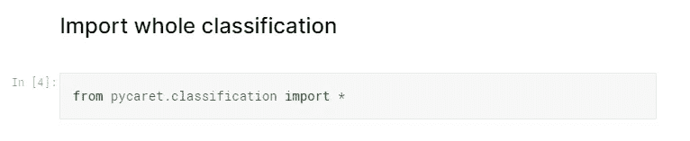
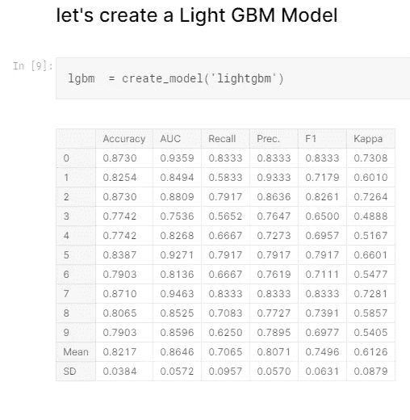

# 通过自动机器学习预测谁在泰坦尼克号灾难中幸存

> 原文：<https://medium.com/analytics-vidhya/predict-who-survived-the-titanic-disaster-with-automated-machine-learning-acec10715cd8?source=collection_archive---------21----------------------->

谷歌公司(Google Inc .)旗下的 Kaggle 是一个面向数据科学和机器学习从业者的在线社区。换句话说，这是你的数据科学之家，在这里你可以找到数据集并参加比赛。然而；我努力完成我的第一份参赛作品，因为，我会说，*资源不当。我为这个比赛浏览了[内核](https://www.kaggle.com/c/titanic/kernels)(读作'*文章'*)，但是它们都不是为初学者设计的。我的意思是作为一个初学者，我不想看到我不能执行或解释的可视化，我只需要用简单的话来理解正在发生的事情。*

如果你是因为要开始使用 Kaggle 而来到这里，这篇文章将会帮助你使用自动化库。一个特殊的人觉得写复杂的代码很难，因为有些自动化库不需要不必要的代码或可视化就能完成工作。

今天我将使用 **PYCARET** 机器学习库来解决这个问题，你会看到这个库是多么有效。对于那些不了解 PYCARET 的人，下面我提到了一个 PYCARET 的小介绍，请浏览一遍。

你可以从[https://pycaret.org](https://pycaret.org/)访问 pycaret 网站和文档

PyCaret 是 Python 中的一个开源、低代码机器学习库，允许您在几秒钟内从准备数据到在您选择的笔记本环境中部署模型。

PyCaret 是一个低代码库，让你更有生产力。随着花在编码上的时间减少，您和您的团队现在可以专注于业务问题。

PyCaret 是一个简单易用的机器学习库，可以帮助你用更少的代码进行端到端的 ML 实验。

PyCaret 是一个业务就绪的解决方案。它允许您从您选择的笔记本电脑环境中快速高效地进行原型制作。

## **步骤 1—从 Kaggle 开始**

所以我希望你们都有 kaggle 账号，并且都熟悉 kaggle，或者如果你需要任何入门指南来做 kaggle 的事情，请访问这个 [**链接**](https://www.youtube.com/watch?v=Gp_qv317Gew) 来获得教程。之后通过前往 [**这个链接**](https://www.kaggle.com/c/titanic) 加入 Kaggle 泰坦尼克号比赛。完成了吗？太好了。我们都准备好了。让我们现在做一些真正的工作。

## 步骤 2—安装 Pycaret

您可以通过使用 pip install 命令简单地安装 pycaret，如下所示

## 步骤 3-加载数据

您可以简单地通过使用 pycaret 命令或使用 pandas 来加载数据，这里我使用 pandas，如下所示。

## 步骤 4—导入模块

根据您想要执行的实验类型，必须在 python 环境中导入当前支持的六个可用模块中的一个。导入模块为特定任务准备了一个环境。例如，如果您导入了分类模块，环境将相应地设置为仅执行分类任务。

我们需要预测乘客能否幸存，所以这是一个分类问题。因此，我们将使用下面给出的命令导入分类模块。

# 正在初始化设置

现在，我们需要通过提供目标变量和一些其他信息来设置我们的数据，如下所示。

## 步骤 5 —比较模型

这是我们在*任何*监督实验的工作流程中推荐的第一步。此函数使用 k-fold 交叉验证，为您导入的模块库中的所有可用模型训练和比较通用评估指标。使用的评估指标包括:

*   **分类:**准确率、AUC、召回率、精度、F1、Kappa
*   **回归:** MAE，MSE，RMSE，R2，RMSLE，MAPE

该函数的输出是一个表格，显示了所有模型在褶皱上的平均得分。可以使用 **compare_models** 函数中的 ***fold*** 参数定义折叠的数量。默认情况下， ***折叠*** 设置为 **10** 。表格根据选择的度量标准进行排序(从最高到最低)，并可使用 ***排序*** 参数*进行定义。*默认情况下，分类实验按照**精度**排序，回归实验按照 **R2** 排序。某些模型由于运行时间较长而无法进行比较。为了绕过这种预防， ***turbo*** 参数可以设置为 **False** 。

# **输出**

现在，通过观察结果，我们可以说**光梯度增强机**模型具有最高的精度，因此我们可以使用该模型，但首先我们应该调整该模型一次以获得更好的结果，因为我们需要创建一个不同的模型，如下所示。

在这里你可以看到模型每次迭代的结果。现在我们可以使用下面给出的命令来调整模型

## 步骤 6—通过可视化结果分析模型的性能

分析经过训练的机器学习模型的性能是任何机器学习工作流程中不可或缺的一步。在 PyCaret 中分析模型性能就像编写 **plot_model** 一样简单。该函数在 **plot_model** 函数内将训练好的模型对象和绘图类型作为字符串。

## 第七步——预测

一旦使用[deploy _ model](https://www.pycaret.org/deploy-model)*在云上成功部署了模型，或者使用 [save_model](https://www.pycaret.org/save-model) ***，*** 在本地成功部署了模型，就可以使用 **predict_model** 函数对未知数据进行预测。此函数采用经过训练的模型对象和数据集进行预测。它将自动应用实验过程中创建的整个转换管道。对于分类，预测标签是基于 50%的概率创建的，但是如果您选择使用不同的阈值，您可能已经使用[优化 _ 阈值](https://www.pycaret.org/optimize-threshold)获得，您可以在**预测 _ 模型**内传递 ***概率 _ 阈值*** 参数。该函数也可用于生成对保留/测试集的预测。*

**

*现在，让我们使用优化模型来执行预测*

**

## *第 8 步—最终提交*

*提交我们的最终结果。我们的输出`.csv`文件应该只有两列——乘客 Id 和幸存者——正如竞争页面上提到的。创建并提交到竞争页面，我的提交得分为 0.7751，这是非常好的，因为我们只写了几行代码。*

**

***最后***

*我发表这篇文章的主要问题是“一个人如何在不写长代码的情况下完成复杂的分析？”领域知识、良好的数据和学习新事物的意愿是你前进所需的一切。你不必一开始就是主人。这一切都来自于坚持。如果你正在读这篇文章，你有足够的精力去实现你的目标，无论如何都不要停下来。如果您对本文有任何疑问，请通过[电子邮件](http://rahulshuklawork@gmail.com)联系我。即使你没有任何疑问，我仍然希望在我的收件箱里看到你有价值的反馈或建议，如果有的话。*

*快乐学习。*