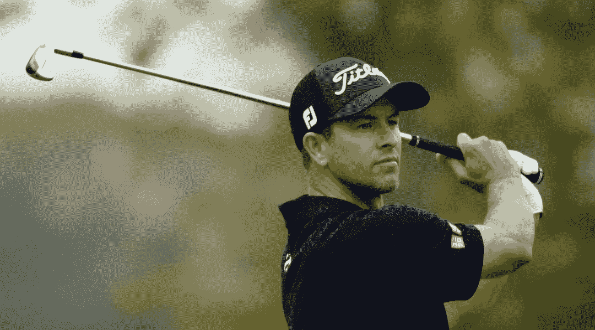
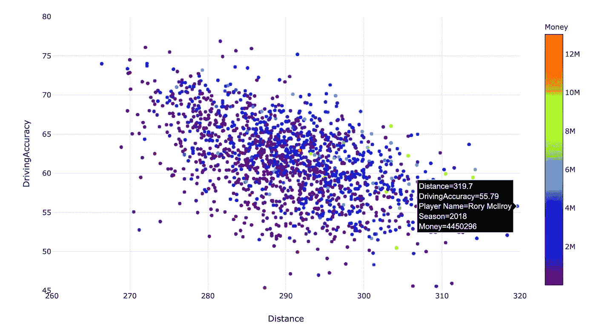

# 预测 PGA 巡回赛冠军(第 1 部分——探索和回归模型)

> 原文：<https://medium.com/analytics-vidhya/predicting-a-pga-tour-winner-part-1-exploration-and-regression-models-e19a25351c75?source=collection_archive---------15----------------------->

2013 年我上大学时，我下了第一个赌注。这是亚当·斯科特赢得大师赛的一年。他以前没有赢得过大满贯，但我认为他相当有吸引力，如果我在任何人身上下注都会输钱，他是最好的猜测。

回顾过去(后来我读了马尔科姆·格拉德威尔的《眨眼》)，我认为伴随着这项运动长大的直觉一定左右了我的投票；我赢了 140 美元，它资助了几个美好的夜晚。

# 动机

我第一次应用机器学习的时候，就像别人告诉我去做任何我完成的项目和准备好的演示一样。从你知道的事情开始。

高尔夫就是这样——所以开始吧。

我的任务是找出我是否能成功预测哪些 PGA 高尔夫球员有一个好赛季，以及这是否预测了他们未来的表现。

# 数据源

我对这个项目的第二个要求是，花最大的时间专注于机器学习技术，鉴于我有一个截止日期，这意味着我需要花尽可能少的时间专注于数据清理和准备。

最小的努力，最大的影响

幸运的是，在**上有一个很棒的数据集，详细列出了大约 10 年的 PGA 成绩，每周从 PGA 巡回赛网站下载，详细列出了每个球员和每场比赛数百个变量的统计数据。从平均击球距离到 5-10 英尺之间的球洞的百分比。世界上也有一些可爱的人讨论并分享了下载、导入和翻译这些数据到一个干净的数据集的最佳方法，准备应用一些机器学习技术。**

**你可以在这里 **找到我在 GitHub repo [**中决定的最小数据导入和清理方法。**](https://github.com/rosiekipling/data-projects)****

# **探索性分析**

**这是我差点忘了我应该应用机器学习技术的一点。我对高尔夫和统计学都很感兴趣，以至于我不知道如果不花更多的时间看高尔夫数据，我是如何走到这一步的！**

**为了能够询问特定的数据点，并获得所有有趣的细节，我在这个初步分析中使用了 Plotly。**

**我最喜欢的一些趋势是平均驾驶距离和驾驶准确性之间的负相关。你可以在下面看到，2018 年巡回赛中击球时间最长的是罗里·麦克罗伊，但这确实影响了他的驾驶准确性。**

****

**按球员和赛季划分的距离与驾驶准确度**

**将这一数据限制在收入最高的 50%，你可以看到大多数巡回赛获胜者在超过 55%的时间里击中球道，平均超过 280 码。似乎可以控制，对吗？但是还有更多！**

****

****最高收入 50%** 按球员和赛季划分的距离与驾驶准确度**

**每轮平均推杆数与规则中果岭命中率之间的强相关性表明，你需要至少一个或另一个才能在巡回赛中取得成功…最好两个都要！
虽然乔丹·斯皮思在 2015 年前后，(在其他穿着红色和黄色的高绩效球员中)似乎表明，对于一个成功的赛季来说，推杆比击打果岭更重要。**

****

# **应用机器学习技术**

**在这个探索性分析之后，我对 2010-2018 年的数据使用了一些 ML 技术。我的目的是找到过去数据的最佳拟合方程，并将其应用于 2019 年的数据，以预测获胜者。**

****多元线性回归模型****

**我第一次尝试线性回归模型时，与训练数据相比，r 值为 0.50，与测试数据相比，r 值为 0.52。这表明该模型概括得很好，没有过度拟合，但是另一方面，它与数据不是特别紧密，因此不是一个很好的预测模型。**

****

****多元多项式回归模型****

**然后我尝试了一个多项式回归模型，这个模型更成功。训练数据的 r 分数高得多，为 0.71，尽管与训练数据相比，测试数据的拟合度不如训练数据好(这毕竟是意料之中的)，但测试数据的 r 分数仍然为 0.61，高于线性回归模型。**

****

**在这个过程中，我获得了一些更有趣的见解…**

**随着时间的推移，某些球员特征变得更加重要了吗？**

**逐年计算线性回归模型，并通过变量绘图，揭示了随着时间的推移，哪些趋势对收益的影响越来越大。下面的图表显示了小鸟转换率与赛季收入的关系，梯度的逐渐增加显示了这个变量的重要性是如何随着时间的推移而增加的。**

****

**2010 年至 2018 年小鸟转换率与赛季收入的关系**

**这是一个类似的故事，随着时间的推移，10%的绿色植物变得越来越重要.**

****

**从 2010 年到 2018 年，监管中的果岭百分比与赛季收入**

**然而，平均每轮推杆的重要性并没有随着时间的推移而改变太多。**

****

**平均值。2010 年至 2018 年每轮推杆与赛季收入的对比**

**在所有这些变量中，随着时间的推移，数据似乎更加扭曲，每个季度都有一些真正积极的异常值。言下之意是，成为一名全才似乎不再合适，要想在 2019 年成为 PGA 巡回赛的冠军，你需要变得与众不同。**

# **小结论**

**第一部分——探索和回归模型到此结束。我真的很喜欢这个项目，尤其是因为我在这个过程中学到了很多东西。为了避免数据疲劳，你可以在另一篇文章中找到我项目的第二部分，重点是[**【K-Means 聚类】****决策树**](/@rosiekipling/predicting-a-pga-tour-winner-part-2-k-means-clustering-decision-trees-prediction-72b42c788c55) 和一个最终**激动人心的预测** [**这里是**](/@rosiekipling/predicting-a-pga-tour-winner-part-2-k-means-clustering-decision-trees-prediction-72b42c788c55) 。**

****剧透预警:**赚了点钱。不用多说，值得一读！**