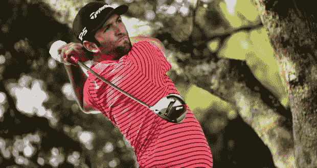
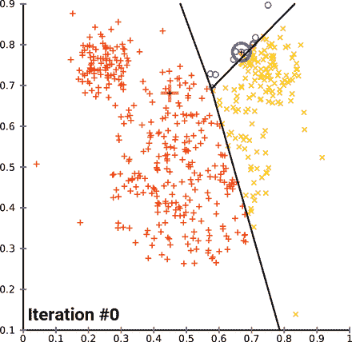
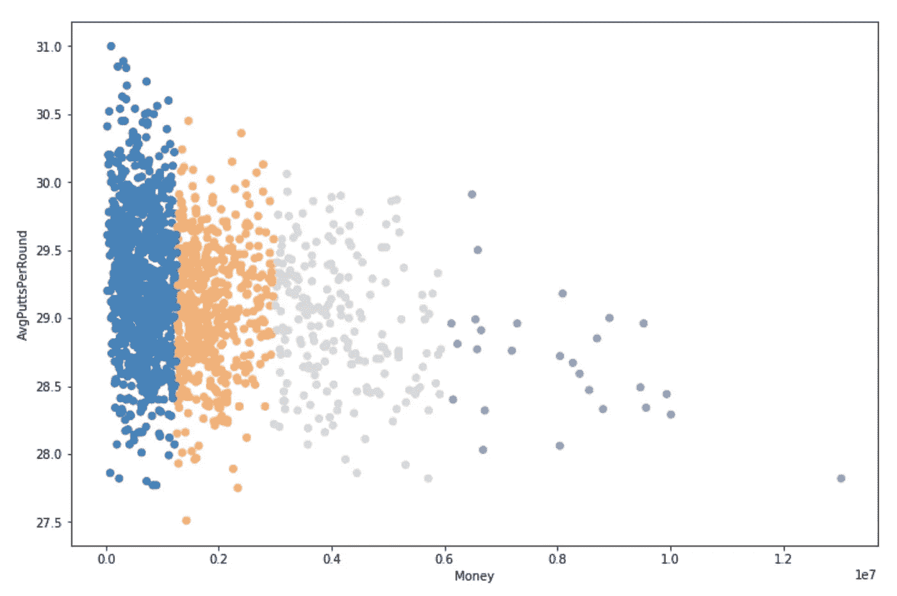
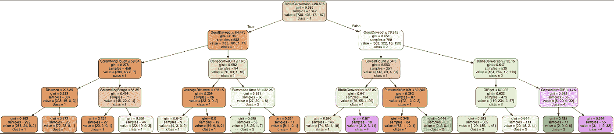
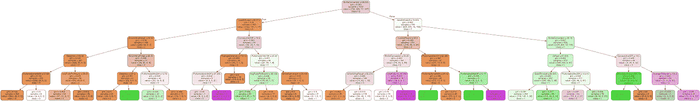
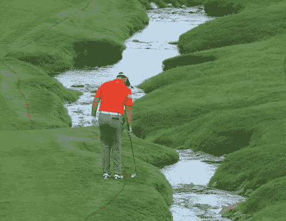

# 预测 PGA 巡回赛冠军(第 2 部分— K 均值聚类、决策树和预测)

> 原文：<https://medium.com/analytics-vidhya/predicting-a-pga-tour-winner-part-2-k-means-clustering-decision-trees-prediction-72b42c788c55?source=collection_archive---------13----------------------->

正如所承诺的，这是第 2 部分—激动人心的 DataMagic。

如果你还没有读过 [**第 1 部分——探索和回归模型**](http://Part 1 — Exploration and Regression Models) ，我建议你在开始阅读本书之前先去读一读。它应该不到 5 分钟，并给出了一个温和的数据集介绍，以及我的项目动机。

乔恩·拉姆，2019 年西班牙公开赛

但是，如果您正在寻找一行文字来提醒我们之前到达的位置，这里有一些上下文:

***现在是 2019 年 9 月下旬，我得到了一个干净的数据集，其中包含 2010-2018 赛季的 PGA 球员统计数据，以及截至 8 月底的 2019 年数据。我想用往年的数据来预测谁会赢得下一场锦标赛…***

…从我的角度来看，更重要的是，此时赌注已经提高，因为我已经承诺在我的模型最喜欢的玩家身上下注。

# k 均值聚类

K-均值聚类是一种分类方法，通过这种方法，您可以基于最佳拟合将大量数据点分成 K 个类别。不同的算法使用不同的方法来决定什么是最适合的，但是 K-Means 聚类是使用最广泛的方法之一。

该算法从对应于每个类别的 K 个质心(下图中为 3 个)开始，然后根据最接近的质心(欧几里德距离)为每个数据点分配一个类别。然后，它重新计算质心位置，将其放置在该类别中所有点的正中间。

该算法以这种方式继续，迭代通过几个可能的质心，每次减少每个数据点到其最近质心的总距离，直到聚类已经稳定在它们的最佳位置。

k-均值聚类收敛(维基百科)

上图显示了 K-Means 聚类算法在 x 和 y 两个维度上的工作，但是我正在处理的数据(经过大量缩小)有 21 个变量，从旅游收入到平均驾驶距离，再到监管中的%果岭命中率。所以试着想象同样的过程，超过 21 个维度——如果可以的话，这是令人印象深刻的，大多数人倾向于停留在 3 个以上的维度上。

从这个过程中得到的一个有希望的启示是，赚到的钱是几个其他变量的一个很好的指标，所以几乎每个与钱相关的变量都有非常清晰的类别。

**注意:**在没有金钱作为变量的情况下进行这一过程可能会很有趣，以查看是否有玩家群体拥有类似的游戏，但是为了预测赢家，这种方法很有效。想找 2 类(浅紫色，下图)的人。

K-均值聚类(K=4 ),以货币对平均值绘制。每轮推杆数

# 决策树分类器

使用上述 K 均值聚类，我随后对 2010 年至 2018 年的数据运行了一个决策树模型(这一次排除了货币作为一个变量)，以确定定义每个类别的有限规则集。仅用 4 条规则，我就能以 60%的准确率识别一个玩家是否属于每个类别。然后将这些规则应用到 2019 年的数据中，我可以找到这名球员“最有可能成功”。

这是我要坦白的地方，也是我恳求你从我的错误中吸取教训并再次检查你的工作的地方！

# 短暂的插曲(打赌)

最初，我用 4 层(如上)运行决策树，成功地将玩家分为 3 类(橙色、绿色、紫色)，其中紫色组表现最好。因此，我采用了导致最右边紫色框的规则，并将这些过滤器应用于 2019 年的数据，以给出本赛季迄今为止的一组 4 名高绩效球员。

乔恩·拉姆就是其中之一。我接触过高尔夫球世界，这是一个我熟悉并能理解的名字。所以我 ***立即*** 在他身上下了 20 英镑的赌注(每种方式，因为我是一只胆小的猫)，让他进入下一场比赛的前 5 名，接下来的周末在马德里举行的西班牙公开赛。

***紧接着*** 下注之后，我意识到我在决策树上只看到了 3 种颜色，我*应该*一直在寻找第 4 种颜色，蓝色。所以在这一点上，我仍然为下了那个赌注而自责，我给我的决策树添加了第五层，重新运行了我的计算。

# …回到最终的决策树

正如我之前所说的，仅使用 ***5 个“规则”*** 我就可以识别一个球员是否属于每个类别(这次，包括表现最好的一个)，准确率为 60%。

通向**蓝色**框(如上)的 5 条“规则”以及 2010-2018 年间成功玩家的最佳标识符如下:

1.  小鸟转换率> 28.5%
2.  好球率> 79.9%(击中球道或为下一杆打好位置)
3.  规则中的最大连续果岭数> 14.5
4.  从驱动器到孔的平均距离< 156 yds
5.  and finally… Birdie Conversion > 32.15%

小鸟转换是如此重要的一个功能，它出现了两次，所以在我 2019 年的计算中，我可以取较大的值。

# 结论

把这些参数应用到 2019 年的数据上，留给我的只有一个选手:**卡梅隆冠军。**

快速的谷歌搜索告诉了我我需要知道的一切——他昨天在… ***参加的最后一场锦标赛中获胜。*** 我 2019 年的数据不包括这场比赛，这意味着如果我提前一周进行计算(并有勇气将 20 英镑的赌注押在一个我没听说过的人身上)，我会预测一名赔率为 90-1 的球员在西夫韦公开赛上赢得 660 万美元，并赚了 1800 美元。

好消息是，发现这一点的痛苦在接下来的周末有所减轻，当时我对乔恩·拉姆的下注成功了(他实际上赢得了西班牙公开赛)，让我领先 40 分。不过，另一种选择可能会更好。

乔恩·拉姆——成为一个传奇

# 结束语

我不是赌徒。我很少下注，也不会辞职去从事体育博彩。然而，这向我证明了一件事，数据科学 ***是神奇的。***

对此有一点需要注意的是，和大多数事情一样，使用机器学习技术对你有利，重要的是要知道*为什么*会起作用。机器学习可以是驾驶舱，但(至少在机器人接管之前)永远需要一名飞行员。

> “用统计而不用逻辑是错误的，但用逻辑而不用统计不是错误的。”
> 
> ——纳西姆·塔勒布，被随机性愚弄

最后，我想提一下我的经历和先前的知识是如何影响我决定何时下注，何时不下注的。这是一个比这里所能涵盖的更大的话题，但是在我们做出的每一个决定中，直觉都扮演着重要的角色，也许比我们愿意相信的还要重要。因此，当谈到查看数据时，我认为倾听我们的直觉、接受它们、挑战它们并找出“直觉”到底来自哪里也很重要。意识到我们的偏见，并具备接受新信息和改变我们想法的能力，是做出持续良好决策的第一步。